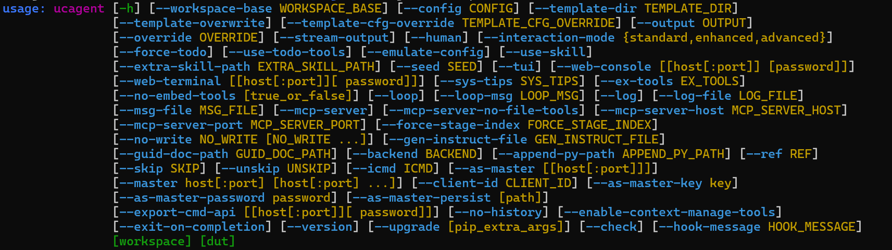

# 前置依赖安装

> 注：本文所有示例输出目录统一以 `output` 为例，用户可自行修改自定义工作目录。

## 1.1 系统要求

- 开源仓库代码 Python 版本：3.11+
- 操作系统：Linux / macOS
- API 需求：可访问 OpenAI 兼容 API
- 内存：建议 4GB+
- 依赖：
  - [picker](https://github.com/XS-MLVP/picker)（将 Verilog DUT 导出为 Python 包）
  - Code Agent：[Codex CLI](https://github.com/openai/codex)（使用 UCAgent 提供的工作流和工具）

## 1.2 安装 UCAgent 主体

**方式一（推荐）：克隆仓库并安装依赖**

```bash
git clone https://github.com/XS-MLVP/UCAgent.git
cd UCAgent
pip3 install .
```

完整克隆源码仓库，本地保留 Makefile，后续可使用 `make` 系列快捷指令。

**方式二：pip 直接安装**

```bash
pip3 install git+https://git@github.com/XS-MLVP/UCAgent@main
```

仅安装 UCAgent 程序包，本地不保留源码，无 Makefile，无法使用 `make` 指令，需直接使用 `ucagent` 原生命令行参数启动。

## 安装测试

安装完成后可通过 `ucagent --help` 查看全部命令行参数：



## 参数解释

- `workspace TEXT ... REQUIRED`：必须。位置参数，验证工作目录，picker 导出产物目录。
- `dut TEXT ... REQUIRED`：必须。位置参数，待验证 RTL 顶层模块名称。
- `-h, --help`：可选。打印此帮助信息并退出。
- `--config TEXT`：可选。指定配置文件路径。
- `--output TEXT`：可选。验证结果输出目录。
- `-s, --stream-output`：可选。控制台实时流式输出模型返回内容。
- `-hm, --human`：可选。开启人工介入模式，运行过程支持手动干预。
- `--tui`：可选。启用文本交互式可视化终端面板。
- `-im, --interaction-mode TEXT:{standard,enhanced,advanced}`：可选。设置交互策略，standard 为默认，enhanced 开启规划记忆，advanced 使用自适应策略。
- `--mcp-server`：可选。启动 MCP 服务端，对外暴露验证工具集。
- `--mcp-server-no-file-tools`：可选。MCP 服务禁用文件读写工具，做权限隔离。
- `--no-embed-tools`：可选。关闭 Agent 内置本地工具，MCP 协同架构使用。
- `--as-master [[host[:port]]]`：可选。启动 Master 总控服务，用于多 Agent 管理。
- `--master host[:port]`：可选。将当前 Agent 作为子节点连接远端 Master 服务。
- `--force-stage-index INT`：可选。强制从指定阶段序号开始运行，重置后续保存进度。
- `--skip INT`：可选。跳过指定序号验证阶段，可多次使用。
- `-eoc, --exit-on-completion`：可选。全部验证任务完成后自动退出进程。
- `--version`：可选。打印程序版本信息并退出。

## 示例完整启动命令

```bash
ucagent output/ Adder -s -hm --tui --mcp-server-no-file-tools --no-embed-tools
```

> 说明：以上所有命令行参数运行时会覆盖 `config.yaml` 配置文件中的同名字段，命令行参数优先级高于配置文件。

## 1.3 安装 Codex 命令行工具

本文以 Codex CLI 为例，UCAgent 同时支持 qwen、claude code、opencode 等多种 Code Agent，配置方式类似。

执行 npm 全局安装命令（需要本地有 [nodejs](https://nodejs.org/zh-cn/download/) 环境）：

```bash
sudo npm install -g @openai/codex
```

> 其他安装方式请参考：[Codex 安装](https://developers.openai.com/codex/cli)
