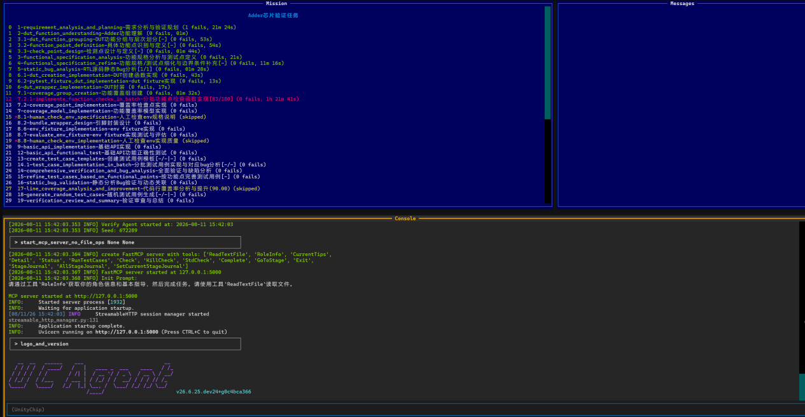
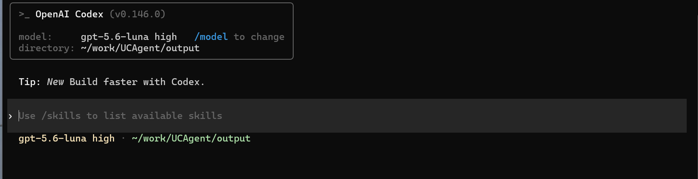

# 模式一：MCP 集成协同模式

## 4.1 准备 DUT（待测模块）

1. 在 `{工作区}` 创建模块目录（`{工作区}` 是指当前运行 `ucagent` 命令的地方，其他的目录都以 `{工作区}` 为根目录）：

```bash
mkdir -p Adder
```

2. 编写带缺陷 64 位加法器 `Adder/Adder.v`，人为截断 sum 输出位宽用于验证缺陷检测：

```verilog
// A verilog 64-bit full adder with carry in and carry out
module Adder #(
    parameter WIDTH = 64
) (
    input [WIDTH-1:0] a,
    input [WIDTH-1:0] b,
    input cin,
    output [WIDTH-2:0] sum,
    output cout
);
    assign {cout, sum} = a + b + cin;
endmodule
```

当前的目录结构如下：

```bash
{工作区}
└── Adder
    └── Adder.v
```

## 4.2 将 RTL 导出为 Python 可调用模块

> picker 可以将 RTL 设计验证模块打包成动态库，并提供 Python 的编程接口来驱动电路。参照 [基础工具-工具介绍](https://open-verify.cc/mlvp/docs/env_usage/picker_usage/) 和 [picker 文档](https://open-verify.cc/mlvp/docs/env_usage/picker_usage/)

在工作区执行 picker 编译命令，生成 DUT 动态库：

```bash
picker export Adder/Adder.v --rw 1 --sname Adder --tdir output/ -c -w output/Adder/Adder.fst
```

当前的目录结构如下：

```bash
{工作区}
├── Adder
│   └── Adder.v
└── output
    └── Adder # picker导出验证包
        └── xspcomm
```

## 4.3 编写验证需求 README

新建 `Adder/README.md`，写入模块功能、验证目标、缺陷说明，并复制至输出目录：

```bash
vim Adder/README.md
cp Adder/README.md output/Adder/README.md
```

参考文档内容：

```markdown
### Adder 64 位加法器

输入 a, b, cin 输出 sum，cout
实现 sum = a + b + cin
cin 是进位输入，cout 是进位输出

### 验证目标

仅验证加法功能逻辑，波形、接口类验证无需覆盖

### bug 分析

sum信号位宽人为截断，存在数值溢出缺陷

### 其他

所有文档与注释统一使用中文编写
```

## 4.4 配置 Codex 运行环境

修改 `~/.codex/config.yaml` 配置文件，`vim ~/.codex/config.yaml`，示例 Codex 配置文件如下：

```toml
[mcp_servers.unitytest]
transport = "http"
url = "http://localhost:5000/mcp"
```

配置文件解释：

- `[mcp_servers.unitytest]`：MCP 服务器配置分组，unitytest 为服务器标识，用于区分不同的 MCP 服务器，此处为 UCAgent 提供的 MCP 服务器。
- `transport`：通信传输方式，指定使用 http 协议完成客户端与 MCP 服务端的数据交互。
- `url`：MCP 服务器通信地址，Codex CLI 将通过该 HTTP 地址与 UCAgent MCP 服务建立连接。
- `5000` 为 MCP 服务默认端口，可在 MCP 服务启动时通过参数修改，参考 [参数说明 MCP Server](https://ucagent.open-verify.cc/content/02_usage/03_option/#mcp-server)。

> 说明：`~/.codex/config.yaml` 用于 Codex 客户端连接 UCAgent 的 MCP 服务，UCAgent 自身运行规则由 `config.yaml` 控制，二者互不干扰。客户端通过文件内配置的本地端口建立通信，实现多终端分工操作。

## 4.5 启动 MCP 服务（终端 A）

在工作区执行命令，拉起 MCP 服务并开启 TUI 日志面板：

**方式一（推荐）**

```bash
make mcp_Adder
```

> 项目根目录 Makefile 里写好了 `mcp_Adder` 脚本，执行 `make mcp_Adder` 是一键封装整套 MCP 启动流程，不用手动敲一长串 `ucagent` 原始命令。

**方式二（若通过 pip 安装且本地无源码仓库，可使用 UCAgent 原生 CLI 命令启动，无需 Makefile）**

```bash
ucagent output/ Adder -s -hm --tui --mcp-server-no-file-tools
```

启动后终端展示 TUI 分栏界面，监听 `127.0.0.1:5000` 等待 Codex 客户端连接。



## 4.6 启动 Codex 客户端（终端 B，新开独立终端）

进入 `UCAgent/output` 目录，执行 `codex` 命令启动 Codex 交互终端：

```bash
codex
```

出现 `>` 输入提示符即启动成功：



输入提示词驱动验证流程：

```
请通过工具 RoleInfo 获取你的角色信息和基本指导，然后完成任务。请使用工具 ReadTextFile 读取文件。你需要在当前工作目录进行文件操作，不要超出该目录。
```

弹窗允许 unitytest 服务全部工具权限，AI 将自动执行全流程验证；中途任务停滞时，输入 `继续` 恢复执行。
