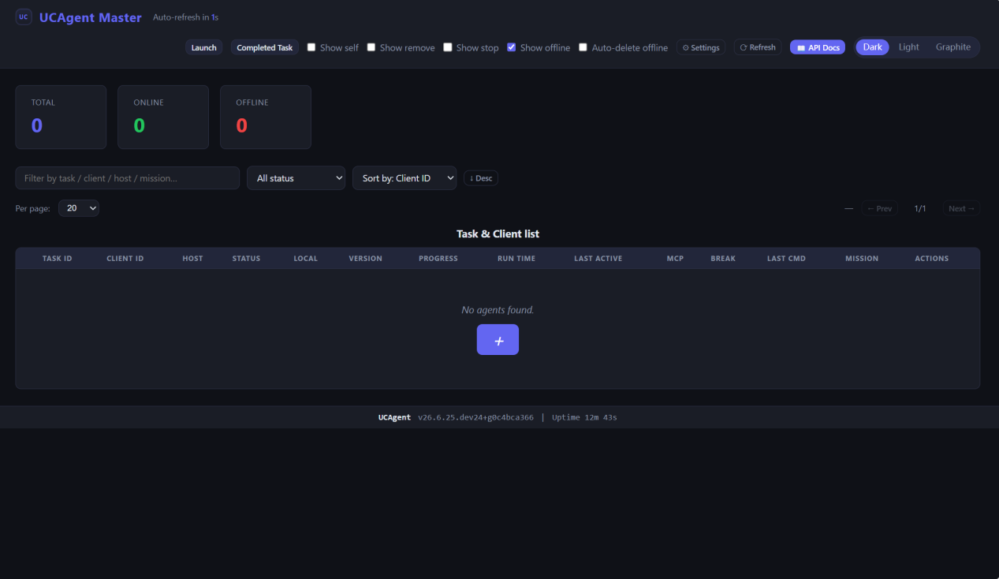
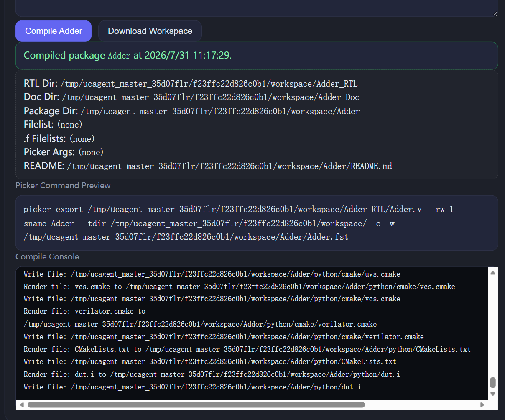
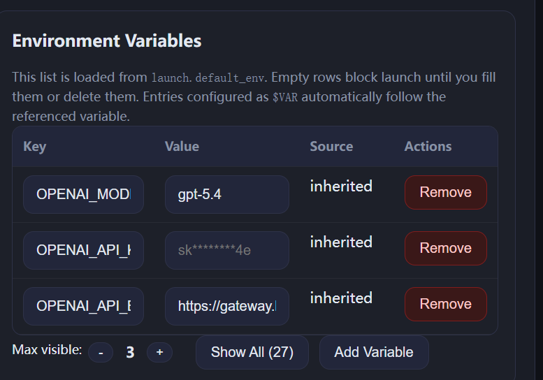
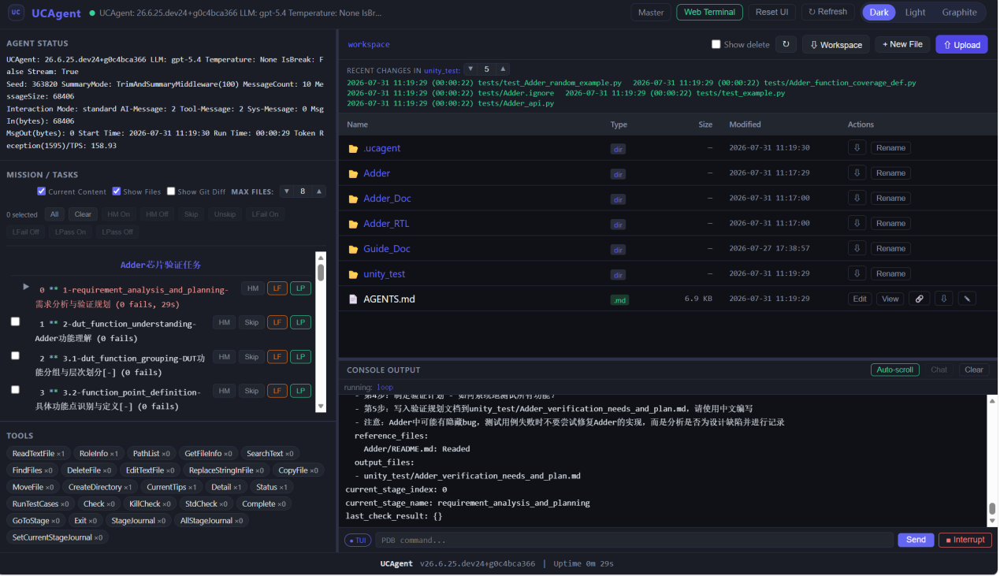

# 模式三：Master Web 可视化交互模式

Master 交互模式是 UCAgent 内置 Web 端可视化主控面板，通过浏览器即可完成 RTL 上传、编译、任务下发、运行监控与结果复盘全流程。

## 6.1 快速开始

> 注：以下输出目录以 `output` 为例，可自行修改为其他目录。

### 6.1.1 启动 Master 服务

在 UCAgent 项目根目录执行以下命令，启动 Master 服务：

**方式一（推荐）**

```bash
make as_master
```

**方式二（若通过 pip 安装且本地无源码仓库，可使用 UCAgent 原生 CLI 命令启动，无需 Makefile）**

```bash
ucagent --as-master-persist
```

启动成功后，终端输出 Web 访问地址：`http://127.0.0.1:8800`，浏览器打开该地址，即可进入 Master 主控面板。



### 6.1.2 准备 DUT（待测模块）

1. 在本地工作区创建 Adder 目录：

```bash
mkdir -p Adder
```

2. 写入带位宽缺陷的 `Adder.v`，代码同前文 MCP 章节；目录结构：

```bash
〈工作区〉
└── Adder
    └── Adder.v
```

### 6.1.3 上传文件并配置标签

打开 Master 面板，点击顶部 **Launch** 按钮，进入任务创建页面。

左侧 **Manage Launch Files** 区域操作：

1. 点击 **Upload Files** 上传 `Adder.v`；可选上传验证说明 `README.md`
2. 文件标签强制配置：
   - `Adder.v`：勾选 **Main RTL**（全局仅允许一个顶层模块）
   - `README.md`：勾选 **Verification Needs**

> 提示：缺少 Main RTL 标签时，编译按钮将保持灰色锁定，无法执行编译。

> 说明：文件标签用于程序自动识别文件用途。Main RTL 标记顶层硬件代码，仅带该标签的文件会执行编译；Verification Needs 标记验证需求文档，AI 校验时读取文档内容。缺少对应标签会锁定编译按钮，无法执行 DUT 编译操作。

### 6.1.4 编译 DUT

1. 在 **Select Main RTL Module** 下拉框选中 `Adder` 顶层模块
2. 点击 **Compile {DUT}** 按钮（案例为 Compile Adder），开始编译。下侧 **Compile Console** 会实时输出 Picker 编译日志：
   - 绿色成功提示：编译通过，生成 Python 可调用的 DUT 封装库
   - 红色错误提示：RTL 语法错误或参数配置错误，根据日志定位问题



编译完成后，当前的目录结构如下：

```bash
〈工作区〉
└── Adder
    ├── Adder.v
    └── README.md
└── output
    └── Adder # picker导出的Adder包
        ├── ...
        └── xspcomm
```

### 6.1.5 启动验证任务

编译通过后，右侧 **Launch Settings** 参数配置：

- Config Path：UT
- Backend：langchain
- Launch Mode：Process

在 **CLI Flags** 中按需勾选运行选项：

- `tui`：启用终端交互界面
- `stream_output`：流式输出日志
- `exit_on_completion`：任务完成后自动退出

实例中上述两个板块不做改动，直接使用默认配置，大家后面可以按需勾选。

> 说明：Config Path 对应程序读取的核心配置文件；页面勾选的 CLI Flags 等同于命令行启动参数，优先级高于配置文件内原有设置。

在 **Environment Variables** 中配置大模型环境变量：

```json
{
  "LLM_API_KEY": "your_api_key",
  "LLM_BASE_URL": "https://your-gateway-url.com/v1",
  "LLM_MODEL": "qwen2.5-coder-7b-instruct"
}
```



> 注意：此处环境变量设置需要与 `config.yaml` 文件中一致。

> 说明：页面填写的接口密钥、模型名称会存入环境模板文件，和 TUI 本地模式使用同一套大模型解析逻辑。

配置完成点击 **Launch Task**，任务自动分配至在线 Agent 客户端执行。

### 6.1.6 监控任务运行

返回 Master 首页，在客户端列表中可以看到刚启动的任务：

- 状态：显示当前任务运行阶段
- 进度：任务整体完成百分比
- 上一条指令：Agent 最近执行的操作

点击任务行的 **Open** 按钮，进入任务详情页：



任务详情页包含：

- **AGENT STATUS**：查看当前大模型版本、消息交互统计、运行时长
- **MISSION/TASKS**：树形展示验证全流程阶段，失败检测点标红
- **文件浏览器**：浏览工作区内 RTL、编译产物、自动生成的测试文档与用例
- **CONSOLE OUTPUT**：实时输出验证运行日志
- **Web Terminal**：内置交互式终端，支持在线下发调试指令

### 6.1.7 查看验证结果

任务执行完成后，在任务详情页中可以查看：

- 验证结论：是否发现缺陷、缺陷数量统计
- 生成的测试用例：自动生成的测试向量文件
- 波形文件：仿真产生的 `.fst` 波形文件，可使用 gtkwave 查看
- 缺陷报告：定位到的 RTL 缺陷位置与描述

对于我们注入了位宽 bug 的 Adder，验证结果会检测到 sum 信号位宽不匹配导致的溢出问题，与预期一致。

**至此，"快速开始"基本完成，以下是生成内容的"结果分析"和对"快速开始"的整体"流程总结"。如果需要验证自己的模块，可以参照流程总结中的[需要准备的文件](07_summary.md#需要准备的文件)**

