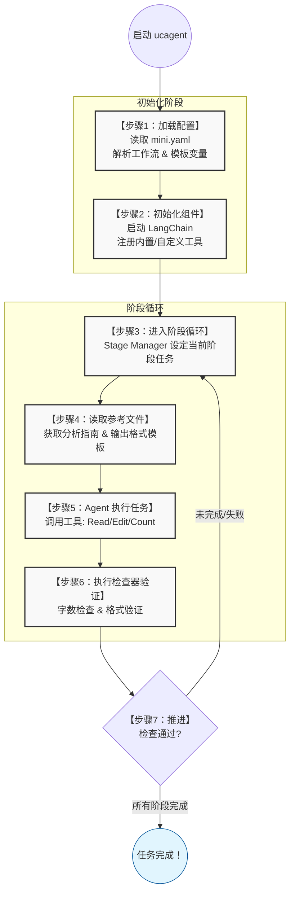

# UCAgent 架构与工作原理

在开始定制自己的工作流之前，了解 UCAgent 的整体架构和工作原理至关重要。本章将为您揭示 UCAgent 的内部运作机制，帮助您建立全局认知。

## UCAgent 是什么？

UCAgent 是一个基于大语言模型（LLM）的智能验证代理系统。它通过**工作流（Workflow）**定义验证任务，利用**工具（Tools）**执行操作，通过**检查器（Checkers）**验证质量，参考**模板（Templates）**保证规范，最终实现自动化的验证流程。

## 核心架构

UCAgent 由三大核心组件构成，它们相互协作完成验证任务：

```
┌─────────────────────────────────────────────────────────────┐
│                        UCAgent 系统                          │
├─────────────────────────────────────────────────────────────┤
│                                                              │
│                      ┌──────────────┐                       │
│                      │    Stage     │                       │
│                      │   Manager    │                       │
│                      │  (阶段管理器) │                       │
│                      └──────┬───────┘                       │
│                             │                                │
│                             │                                │
│                             ▼                                │
│                 ┌───────────────────────┐                   │
│                 │   Stage 1: 分析项目    │                   │
│                 │   - Task 列表          │                   │
│                 │   - Reference Files   │                   │
│                 │   - Tools             │                   │
│                 │   - Checkers          │                   │
│                 └───────────────────────┘                   │
│                             │                                │
│         ┌───────────────────┼───────────────────────┐       │
│         │                   │                       │       │
│         ▼                   ▼                       ▼       │
│  ┌─────────────┐    ┌─────────────┐        ┌─────────────┐ │
│  │  Templates  │    │    Tools    │        │  Checkers   │ │
│  │  (模板文件)  │    │   (工具集)   │        │  (检查器)    │ │
│  │             │    │             │        │             │ │
│  │ - 指导文档   │    │ - 文件操作   │        │ - 格式检查   │ │
│  │ - 规范定义   │    │ - 自定义工具 │        │ - 业务验证   │ │
│  └─────────────┘    └─────────────┘        └─────────────┘ │
│                                                              │
└─────────────────────────────────────────────────────────────┘
```

### 1. Stage Manager（阶段管理器）

**作用**：管理工作流的执行流程，负责阶段（Stage）的推进和状态追踪。

**核心职责**：

- 加载和解析工作流配置
- 按顺序执行各个阶段
- 管理阶段间的数据共享
- 控制阶段的跳过和重试

### 2. Tools（工具）

**作用**：为 Agent 提供执行能力，完成具体的操作任务。

> 💡 **详细说明**：关于内置工具的完整列表，请参考 [工具列表](06_tool_list.md)；关于自定义工具开发，请参考 [定制工具](05_customize.md)

**工具类型**：

- **内置工具**：文件读写、文本搜索、目录操作等通用功能
- **自定义工具**：领域专用的工具，如 RTL 解析、仿真执行等

**工具调用时机**：Agent 在执行任务时，根据需要主动调用工具。

### 3. Checkers（检查器）

**作用**：验证阶段输出的质量，确保符合预期标准。

> 💡 **详细说明**：关于检查器的完整说明，请参考 [检查器](07_checkers.md)

**检查器类型**：

- **格式检查器**：验证文件格式、文档结构等
- **业务检查器**：验证特定业务规则和逻辑正确性

**检查器执行时机**：阶段任务完成后，自动执行配置的检查器。

### 4. Templates（模板）

> 💡 **详细说明**：关于模板文件系统的完整介绍，请参考 [模板文件与生成产物](04_template.md)

**作用**：为 Agent 提供参考规范，指导生成符合要求的输出。

**模板用途**：

- 定义文档结构和格式要求
- 提供示例和最佳实践
- 说明命名规范和约定

**模板使用方式**：在阶段配置中通过 `reference_files` 字段引用。

## 配置文件体系

UCAgent 采用**三层配置体系**，支持灵活的配置管理：

```
┌──────────────────────────────────────────────────────┐
│  1. 系统默认配置 (ucagent/setting.yaml)              │
│     - 提供所有配置项的默认值                           │
│     - 定义内置工具和检查器                             │
├──────────────────────────────────────────────────────┤
│  2. 用户配置 (~/.ucagent/setting.yaml)               │
│     - 用户全局配置，对所有项目生效                     │
│     - 配置 Backend、API Key 等个人信息                │
├──────────────────────────────────────────────────────┤
│  3. 项目配置 (项目根目录的 config.yaml)                │
│     - 项目特定的配置，优先级最高                       │
│     - 定义工作流、自定义工具、模板变量等               │
└──────────────────────────────────────────────────────┘
```

**配置优先级**：项目配置 > 用户配置 > 系统默认配置

**示例**：如果三层配置都定义了 `backend.key_name`，最终使用项目配置中的值。

## 工作流程详解

现在让我们通过**计算器文档生成器**这个实际场景，详细了解 UCAgent 的完整执行流程：

### 场景描述

我们要为一个计算器项目自动生成文档，工作流包含两个阶段（Stage）：

1. **阶段1**：分析计算器项目，提取功能点
2. **阶段2**：生成完整的项目文档

### 执行流程（7个步骤）



### 关键机制说明

#### 阶段（Stage）推进机制

阶段的推进遵循以下规则：

1. **任务执行**：Agent 根据 `task` 列表执行任务
2. **主动检查**：Agent 调用 `Check` 工具检查当前阶段状态（不推进）
3. **完成推进**：Agent 调用 `Complete` 工具，执行检查器并尝试推进
4. **检查器验证**：所有配置的检查器都返回 `True` 才能推进
5. **循环执行**：推进到下一阶段，重复步骤3-7

#### 工具调用机制

- Agent 自主决定何时调用哪些工具
- 工具通过 `ex_tools` 在配置中注册
- 工具接收参数，执行操作，返回结果给 Agent

#### 检查器验证机制

- 检查器在阶段的 `checker` 列表中配置
- 检查器返回 `(bool, dict)`：
  - `True` 表示检查通过
  - `False` 表示检查失败，阻止阶段推进
- 失败时，Agent 会根据错误信息修正输出并重试

#### 模板引用机制

- 模板通过 `reference_files` 字段引用
- Agent 在执行任务前会读取模板内容
- 模板中的变量（如 `{PROJECT}`）会自动替换为实际值

## 数据流示意

```
配置文件 (mini.yaml)
    │
    ├──> Backend 配置 ──> 连接 LLM
    ├──> ex_tools ──> 注册自定义工具
    ├──> template_overwrite ──> 定义变量
    │
    └──> stage 列表
            │
            ├──> Stage 1
            │     ├─> task ──> Agent 执行任务
            │     ├─> reference_files ──> Agent 读取模板
            │     ├─> output_files ──> 预期输出
            │     └─> checker ──> 验证输出质量
            │
            └──> Stage 2
                  └─> ...（同上）
```

## 与传统脚本的区别

| 维度         | 传统脚本         | UCAgent                        |
| ------------ | ---------------- | ------------------------------ |
| **任务定义** | 写死的代码逻辑   | 自然语言描述的任务列表         |
| **执行方式** | 顺序执行固定步骤 | Agent 智能决策和工具调用       |
| **灵活性**   | 修改需要改代码   | 修改配置文件即可               |
| **容错能力** | 遇错即停         | Agent 可根据检查器反馈自动修正 |
| **适应性**   | 针对特定场景     | 通过模板适应不同项目           |

## 小结

通过本章，您应该已经理解了：

✅ UCAgent 的四大核心组件及其职责  
✅ 配置文件的三层体系和优先级  
✅ 从启动到完成的完整执行流程  
✅ 阶段推进、工具调用、检查器验证的机制

**下一步**：现工作流配置](03_workflow.md)

## 延伸阅读

- [定制工具](05_customize.md) - 了解如何开发自定义工具
- [快速开始](01_quick_start.md) - 快速创建自己的工作流
- [Mini 示例](08_mini_example.md) - 完整的可运行示例

- [工作流详细文档](../03_develop/01_workflow.md) - 深入了解工作流机制
