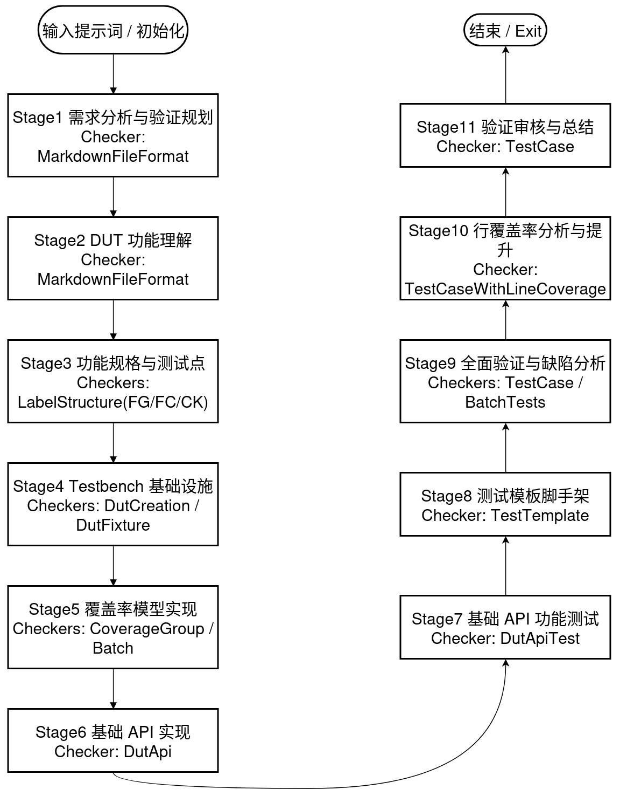

# 工作流

> 💡 **架构理解**：在学习工作流配置之前，建议先阅读 [架构与工作原理](02_architecture.md) 了解 UCAgent 的核心概念

整体采用“按阶段渐进推进”的方式，每个阶段都有明确目标、产出与通过标准；完成后用工具 Check 验证并用 Complete 进入下一阶段。若阶段包含子阶段，需按顺序 逐一完成子阶段并各自通过 Check。

- 顶层阶段总数：11（见 `ucagent/lang/zh/config/default.yaml`）
- 推进原则：未通过的阶段不可跳转；可用工具 CurrentTips 获取当前阶段详细指导；需要回补时可用 GotoStage 回到指定阶段。
- 三种跳/不跳过阶段方法：
  - 在项目根 `config.yaml` 的某个 `stage` 字段下面 `-name` 元素里的 `skip` 键配置 `true/false` 来跳过/不跳过。
  - 命令行启动时可用 `--skip/- -unskip someStage` 来控制跳过/不跳过某阶段。
  - 在 tui 启动后可用 `skip_stage/unskip_stage someStage` 来控制临时跳过/不跳过某阶段。

## 整体流程概览（11 个阶段）

目前的流程包含：

1. 需求分析与验证规划 → 2) {DUT} 功能理解 → 3) 功能规格分析与测试点定义 → 4) 测试平台基础架构设计 → 5) 功能覆盖率模型实现 → 6) 基础 API 实现 → 7) 基础 API 功能测试 → 8) 测试框架脚手架 → 9) 全面验证执行与缺陷分析 → 10) 代码行覆盖率分析与提升（默认跳过，可启用）→ 11) 验证审查与总结

**以实际的工作流为准，下图仅供参考**。

{ width=\textwidth }

说明：以下路径中的 <OUT> 默认为工作目录下的输出目录名（默认 unity_test）。例如文档输出到 `<workspace>/unity_test/`。

---

阶段 1：需求分析与验证规划

- 目标：理解任务、明确验证范围与策略。
- 怎么做：
  - 阅读 `{DUT}/README.md`，梳理“需要测哪些功能/输入输出/边界与风险”。
  - 形成可执行的验证计划与目标清单。
- 产出：`<OUT>/{DUT}_verification_needs_and_plan.md`（中文撰写）。
- 通过标准：文档存在、结构规范（自动检查 markdown_file_check）。
- 检查器：
  - UnityChipCheckerMarkdownFileFormat
    - 作用：校验 Markdown 文件存在与格式，禁止把换行写成字面量 `\n`。
    - 参数：
      - markdown_file_list (str | List[str]): 待检查的 MD 文件路径或路径列表。示例：`{OUT}/{DUT}_verification_needs_and_plan.md`
  - no_line_break (bool): 是否禁止把换行写成字面量 `\n`；true 表示禁止。

阶段 2：{DUT} 功能理解

- 目标：掌握 DUT 的接口与基本信息，明确是组合/时序电路。
- 怎么做：
  - 阅读 `{DUT}/README.md` 与 `{DUT}/__init__.py`。
  - 分析 IO 端口、时钟/复位需求与功能范围。
- 产出：`<OUT>/{DUT}_basic_info.md`。
- 通过标准：文档存在、格式规范（markdown_file_check）。
- 检查器：
  - UnityChipCheckerMarkdownFileFormat
    - 作用：校验 Markdown 文件存在与格式，禁止把换行写成字面量 `\n`。
    - 参数：
      - markdown_file_list (str | List[str]): 待检查的 MD 文件路径或路径列表。示例：`{OUT}/{DUT}_basic_info.md`
  - no_line_break (bool): 是否禁止把换行写成字面量 `\n`；true 表示禁止。

阶段 3：功能规格分析与测试点定义（含子阶段 FG/FC/CK）

- 目标：把功能分组（FG）、功能点（FC）和检测点（CK）结构化，作为后续自动化的依据。
- 怎么做：
  - 阅读 `{DUT}/*.md` 与已产出文档，建立 `{DUT}_functions_and_checks.md` 的 FG/FC/CK 结构。
  - 规范标签：`<FG-组名>`、`<FC-功能名>`、`<CK-检测名>`，每个功能点至少 1 个检测点。
- 子阶段：
  - 3.1 功能分组与层次（FG）：检查器 UnityChipCheckerLabelStructure(FG)
  - 3.2 功能点定义（FC）：检查器 UnityChipCheckerLabelStructure(FC)
  - 3.3 检测点设计（CK）：检查器 UnityChipCheckerLabelStructure(CK)
- 产出：`<OUT>/{DUT}_functions_and_checks.md`。
- 通过标准：三类标签结构均通过对应检查。
- 对应检查器（默认配置）：
  - 3.1 UnityChipCheckerLabelStructure
    - 作用：解析 `{DUT}_functions_and_checks.md` 中的标签结构并校验层级与数量（FG）。
    - 参数：
      - doc_file (str): 功能/检查点文档路径。示例：`{OUT}/{DUT}_functions_and_checks.md`
      - leaf_node ("FG" | "FC" | "CK"): 需要校验的叶子类型。示例：`"FG"`
      - min_count (int, 默认 1): 该叶子类型的最小数量阈值。
      - must_have_prefix (str, 默认 "FG-API"): FG 名称要求的前缀，用于规范化分组命名。
  - 3.2 UnityChipCheckerLabelStructure
    - 作用：解析文档并校验功能点定义（FC）。
    - 参数：
      - doc_file (str): 功能/检查点文档路径。示例：`{OUT}/{DUT}_functions_and_checks.md`
      - leaf_node ("FG" | "FC" | "CK"): 需要校验的叶子类型。示例：`"FC"`
      - min_count (int, 默认 1): 该叶子类型的最小数量阈值。
      - must_have_prefix (str, 默认 "FG-API"): 所属 FG 的前缀规范，用于一致性检查。
  - 3.3 UnityChipCheckerLabelStructure
    - 作用：解析文档并校验检测点设计（CK），并缓存 CK 列表用于后续分批实现。
    - 参数：
      - doc_file (str): 功能/检查点文档路径。示例：`{OUT}/{DUT}_functions_and_checks.md`
      - leaf_node ("FG" | "FC" | "CK"): 需要校验的叶子类型。示例：`"CK"`
      - data_key (str): 共享数据键名，用于缓存 CK 列表（供后续分批实现使用）。示例：`"COVER_GROUP_DOC_CK_LIST"`
      - min_count (int, 默认 1): 该叶子类型的最小数量阈值。
      - must_have_prefix (str, 默认 "FG-API"): 所属 FG 的前缀规范，用于一致性检查。

阶段 4：测试平台基础架构设计（fixture/API 框架）

- 目标：提供统一的 DUT 创建与测试生命周期管理能力。
- 怎么做：
  - 在 `<OUT>/tests/{DUT}_api.py` 实现 create_dut()；时序电路配置时钟（InitClock），组合电路无需时钟。
  - 实现 pytest fixture `dut`，负责初始化/清理与可选的波形/行覆盖率开关。
- 产出：`<OUT>/tests/{DUT}_api.py`（含注释与文档字符串）。
- 通过标准：DUT 创建与 fixture 检查通过（UnityChipCheckerDutCreation / UnityChipCheckerDutFixture）。
- 子阶段检查器：
  - DUT 创建：UnityChipCheckerDutCreation
    - 作用：校验 `{DUT}_api.py` 中的 create_dut(request) 是否实现规范（签名、时钟/复位、覆盖率路径等约定）。
    - 参数：
      - target_file (str): DUT API 与 fixture 所在文件路径。示例：`{OUT}/tests/{DUT}_api.py`
  - dut fixture：UnityChipCheckerDutFixture
    - 作用：校验 pytest fixture `dut` 的生命周期管理、yield/清理，以及覆盖率收集调用是否到位。
    - 参数：
      - target_file (str): 包含 `dut` fixture 的文件路径。示例：`{OUT}/tests/{DUT}_api.py`
  - env fixture：UnityChipCheckerEnvFixture
    - 作用：校验 `env*` 系列 fixture 的存在、数量与 Bundle 封装是否符合要求。
    - 参数：
      - target_file (str): 包含 `env*` 系列 fixture 的文件路径。示例：`{OUT}/tests/{DUT}_api.py`
      - min_env (int, 默认 1): 至少需要存在的 `env*` fixture 数量。示例：`1`
      - force_bundle (bool, 当前未使用): 是否强制要求 Bundle 封装。

覆盖率路径规范（重要）：

- 在 create_dut(request) 中，必须通过 `get_coverage_data_path(request, new_path=True)` 获取新的行覆盖率文件路径，并传入 `dut.SetCoverage(...)`。
- 在 `dut` fixture 的清理阶段，必须通过 `get_coverage_data_path(request, new_path=False)` 获取已有路径，并调用 `set_line_coverage(request, <path>, ignore=...)` 写入统计。
- 若缺失上述调用，检查器会直接报错，并给出修复提示（含 `tips_of_get_coverage_data_path` 示例）。

阶段 5：功能覆盖率模型实现

- 目标：将 FG/FC/CK 转为可统计的覆盖结构，支撑进度度量与回归。
- 怎么做：
  - 在 `<OUT>/tests/{DUT}_function_coverage_def.py` 实现 `get_coverage_groups(dut)`。
  - 为每个 FG 建立 CovGroup；为 FC/CK 建 watch_point 与检查函数（优先用 lambda，必要时普通函数）。
- 子阶段：
  - 5.1 覆盖组创建（FG）
  - 5.2 覆盖点与检查实现（FC/CK），支持“分批实现”提示（COMPLETED_POINTS/TOTAL_POINTS）。
- 产出：`<OUT>/tests/{DUT}_function_coverage_def.py`。
- 通过标准：CoverageGroup 检查（FG/FC/CK）与批量实现检查通过。
- 子阶段检查器：
  - 5.1 UnityChipCheckerCoverageGroup
    - 作用：比对覆盖组定义与文档 FG 一致性。
    - 参数：
      - test_dir (str): 测试目录根路径。示例：`{OUT}/tests`
      - cov_file (str): 覆盖率模型定义文件路径。示例：`{OUT}/tests/{DUT}_function_coverage_def.py`
      - doc_file (str): 功能/检查点文档路径。示例：`{OUT}/{DUT}_functions_and_checks.md`
      - check_types (str | List[str]): 检查的类型集合。示例：`"FG"`
  - 5.2 UnityChipCheckerCoverageGroup
    - 作用：比对覆盖点/检查点实现与文档 FC/CK 一致性。
    - 参数：
      - test_dir (str): 测试目录根路径。示例同上
      - cov_file (str): 覆盖率模型定义文件路径。示例同上
      - doc_file (str): 功能/检查点文档路径。示例同上
      - check_types (List[str]): 检查类型集合。示例：`["FC", "CK"]`
  - 5.2（分批）UnityChipCheckerCoverageGroupBatchImplementation
    - 作用：按 CK 分批推进实现与对齐检查，维护进度（TOTAL/COMPLETED）。
    - 参数：
      - test_dir (str): 测试目录根路径。
      - cov_file (str): 覆盖率模型定义文件路径。
      - doc_file (str): 功能/检查点文档路径。
      - batch_size (int, 默认 20): 每批实现与校验的 CK 数量上限。示例：`20`
      - data_key (str): 共享数据键名，用于读取 CK 列表。示例：`"COVER_GROUP_DOC_CK_LIST"`

阶段 6：基础 API 实现

- 目标：用 `api_{DUT}_*` 前缀提供可复用的操作封装，隐藏底层信号细节。
- 怎么做：
  - 在 `<OUT>/tests/{DUT}_api.py` 实现至少 1 个基础 API；建议区分“底层功能 API”与“任务功能 API”。
  - 补充详细 docstring：功能、参数、返回值、异常。
- 产出：`<OUT>/tests/{DUT}_api.py`。
- 通过标准：UnityChipCheckerDutApi 通过（前缀必须为 `api_{DUT}_`）。
- 检查器：
  - UnityChipCheckerDutApi
    - 作用：扫描/校验 `api_{DUT}_*` 函数的数量、命名、签名与 docstring 完整度。
    - 参数：
      - api*prefix (str): API 前缀匹配表达式。建议：`"api*{DUT}\_"`
      - target_file (str): API 定义所在文件。示例：`{OUT}/tests/{DUT}_api.py`
      - min_apis (int, 默认 1): 至少需要的 API 数量。

阶段 7：基础 API 功能正确性测试

- 目标：为每个已实现 API 编写至少 1 个基础功能用例，并标注覆盖率。
- 怎么做：
  - 在 `<OUT>/tests/test_{DUT}_api_*.py` 新建测试；导入 `from {DUT}_api import *`。
  - 每个测试函数的第一行：`dut.fc_cover['FG-API'].mark_function('FC-API-NAME', test_func, ['CK-XXX'])`。
  - 设计典型/边界/异常数据，断言预期输出。
  - 用工具 RunTestCases 执行与回归。
- 产出：`<OUT>/tests/test_{DUT}_api_*.py` 与缺陷记录（若发现 bug）。
- 通过标准：UnityChipCheckerDutApiTest 通过（覆盖、用例质量、文档记录齐备）。
- 检查器：
  - UnityChipCheckerDutApiTest
    - 作用：运行 pytest 并检查每个 API 至少 1 个基础功能用例且正确覆盖标记；核对缺陷记录与文档一致。
    - 参数：
      - api*prefix (str): API 前缀匹配表达式。建议：`"api*{DUT}\_"`
      - target_file_api (str): API 文件路径。示例：`{OUT}/tests/{DUT}_api.py`
      - target*file_tests (str): 测试文件 Glob。示例：`{OUT}/tests/test*{DUT}\_api\*.py`
      - doc_func_check (str): 功能/检查点文档。示例：`{OUT}/{DUT}_functions_and_checks.md`
      - doc_bug_analysis (str): 缺陷分析文档。示例：`{OUT}/{DUT}_bug_analysis.md`
      - min_tests (int, 默认 1): 单 API 最少测试用例数。
      - timeout (int, 默认 15): 单次测试运行超时（秒）。

阶段 8：测试框架脚手架构建

- 目标：为尚未实现的功能点批量生成“占位”测试模板，确保覆盖版图完整。
- 怎么做：
  - 依据 `{DUT}_functions_and_checks.md`，在 `<OUT>/tests/` 创建 `test_*.py`，文件与用例命名语义化。
  - 每个函数首行标注覆盖率 mark；补充 TODO 注释说明要测什么；末尾添加 `assert False, 'Not implemented'` 防误通过。
- 产出：批量测试模板；覆盖率进度指标（COVERED_CKS/TOTAL_CKS）。
- 通过标准：UnityChipCheckerTestTemplate 通过（结构/标记/说明完整）。
- 检查器：
  - UnityChipCheckerTestTemplate
    - 作用：检查模板文件/用例结构、覆盖标记、TODO 注释与防误通过断言；统计覆盖进度。
    - 参数：
      - doc_func_check (str): 功能/检查点文档路径。示例：`{OUT}/{DUT}_functions_and_checks.md`
      - test_dir (str): 测试目录根路径。示例：`{OUT}/tests`
      - ignore*ck_prefix (str): 统计覆盖时忽略的 CK 前缀（通常为基础 API 的用例）。示例：`"test_api*{DUT}\_"`
      - data_key (str): 共享数据键名，用于生成/读取模板实现进度。示例：`"TEST_TEMPLATE_IMP_REPORT"`
      - batch_size (int, 默认 20): 每批模板检查数量。
      - min_tests (int, 默认 1): 最少要求的模板测试数。
      - timeout (int, 默认 15): 测试运行超时（秒）。

阶段 9：全面验证执行与缺陷分析

- 目标：将模板填充为真实测试，系统发现并分析 DUT bug。
- 怎么做：
  - 在 `test_*.py` 填充逻辑，优先通过 API 调用，不直接操纵底层信号。
  - 设计充分数据并断言；用 RunTestCases 运行；对 Fail 进行基于源码的缺陷定位与记录。
- 子阶段：
  - 9.1 分批测试用例实现与对应缺陷分析（COMPLETED_CASES/TOTAL_CASES）。
- 产出：成体系的测试集与 `/{DUT}_bug_analysis.md`。
- 通过标准：UnityChipCheckerTestCase（质量/覆盖/缺陷分析）通过。
- 检查器：
  - 父阶段：UnityChipCheckerTestCase
    - 作用：运行整体测试并对照功能/缺陷文档检查质量、覆盖与记录一致性。
    - 参数：
      - doc_func_check (str): 功能/检查点文档路径。示例：`{OUT}/{DUT}_functions_and_checks.md`
      - doc_bug_analysis (str): 缺陷分析文档路径。示例：`{OUT}/{DUT}_bug_analysis.md`
      - test_dir (str): 测试目录根路径。示例：`{OUT}/tests`
      - min_tests (int, 默认 1): 最少要求的测试用例数量。
      - timeout (int, 默认 15): 测试运行超时（秒）。
  - 子阶段（分批实现）：UnityChipCheckerBatchTestsImplementation
    - 作用：分批将模板落地为真实用例并回归，维护实现进度与报告。
    - 参数：
      - doc_func_check (str): 功能/检查点文档路径。
      - doc_bug_analysis (str): 缺陷分析文档路径。
      - test_dir (str): 测试目录根路径。
      - ignore*ck_prefix (str): 统计覆盖时忽略的 CK 前缀。示例：`"test_api*{DUT}\_"`
      - batch_size (int, 默认 10): 每批转化并执行的用例数量。
      - data_key (str): 共享数据键名（必填），用于保存分批实现进度。示例：`"TEST_TEMPLATE_IMP_REPORT"`
      - pre_report_file (str): 历史进度报告路径。示例：`{OUT}/{DUT}/.TEST_TEMPLATE_IMP_REPORT.json`
      - timeout (int, 默认 15): 测试运行超时（秒）。

TC bug 标注规范与一致性（与文档/报告强关联）：

- 术语：统一使用 “TC bug”（不再使用 “CK bug”）。
- 标注结构：`<FG-*>/<FC-*>/<CK-*>/<BG-NAME-XX>/<TC-test_file.py::[ClassName]::test_case>`；其中 BG 的置信度 XX 为 0–100 的整数。
- 失败用例与文档关系：
  - 文档中出现的 <TC-\*> 必须能与测试报告中的失败用例一一对应（文件名/类名/用例名匹配）。
  - 失败的测试用例必须标注其关联检查点（CK），否则会被判定为“未标记”。
  - 若存在失败用例未在 bug 文档中记录，将被提示为“未文档化的失败用例”。

阶段 10：代码行覆盖率分析与提升（默认跳过，可启用）

- 目标：回顾未覆盖代码行，定向补齐。
- 怎么做：
  - 运行 Check 获取行覆盖率；若未达标，围绕未覆盖行增补测试并回归；循环直至满足阈值。
- 产出：行覆盖率报告与补充测试。
- 通过标准：UnityChipCheckerTestCaseWithLineCoverage 达标（默认阈值 0.9，可在配置中调整）。
- 说明：该阶段在配置中标记 skip=true，可用 `--unskip` 指定索引启用。
- 检查器：
  - UnityChipCheckerTestCaseWithLineCoverage
    - 作用：在 TestCase 基础上统计行覆盖率并对比阈值。
    - 参数：
      - doc_func_check (str): 功能/检查点文档路径。示例：`{OUT}/{DUT}_functions_and_checks.md`
      - doc_bug_analysis (str): 缺陷分析文档路径。示例：`{OUT}/{DUT}_bug_analysis.md`
      - test_dir (str): 测试目录根路径。示例：`{OUT}/tests`
      - cfg (dict | Config): 必填，用于推导默认路径以及环境配置。
      - min_line_coverage (float, 默认按配置，未配置则 0.8): 最低行覆盖率阈值。
      - coverage_json (str, 可选): 行覆盖率 JSON 路径。默认：`uc_test_report/line_dat/code_coverage.json`
      - coverage_analysis (str, 可选): 行覆盖率分析 MD 输出。默认：`unity_test/{DUT}_line_coverage_analysis.md`
      - coverage_ignore (str, 可选): 忽略文件清单。默认：`unity_test/tests/{DUT}.ignore`

阶段 11：验证审查与总结

- 目标：沉淀成果、复盘流程、给出改进建议。
- 怎么做：
  - 完善 `/{DUT}_bug_analysis.md` 的缺陷条目（基于源码分析）。
  - 汇总并撰写 `/{DUT}_test_summary.md`，回看规划是否达成；必要时用 GotoStage 回补。
- 产出：`<OUT>/{DUT}_test_summary.md` 与最终结论。
- 通过标准：UnityChipCheckerTestCase 复核通过。
- 检查器：
  - UnityChipCheckerTestCase
    - 作用：复核整体测试结果与文档一致性，形成最终结论。
    - 参数：doc_func_check: "{OUT}/{DUT}\_functions_and_checks.md"；doc_bug_analysis: "{OUT}/{DUT}\_bug_analysis.md"；test_dir: "{OUT}/tests"。

提示与最佳实践

- 随时用工具：Detail/Status 查看 Mission 进度与当前阶段；CurrentTips 获取步骤级指导；Check/Complete 推进阶段。
- TUI 左侧 Mission 会显示阶段序号、跳过状态与失败计数；可结合命令行 `--skip/--unskip/--force-stage-index` 控制推进。

## 阶段跳过与强制人工检查

在验证复杂 DUT（如 PTW 等）时，建议开启关键阶段的人工检查，以确保验证质量。本节说明如何控制阶段跳过与强制人工检查。

### 打开默认跳过的阶段

部分阶段在默认配置中被跳过（`skip: true`），可通过以下方式启用：

#### 方法一：环境变量（推荐）

在运行前设置对应的环境变量：

```bash
# 6.1 人工检查env规格说明 / 6.6 人工检查ENV实现质量
export SKIP_ENV_HUMAN_CHECK=false

# 6.3 Mock组件设计与实现
export SKIP_MOCK_COMPONENT=false
```

环境变量与阶段对应关系：

| 环境变量               | 控制的阶段                                           | 默认值 | 说明                               |
| ---------------------- | ---------------------------------------------------- | ------ | ---------------------------------- |
| `SKIP_ENV_HUMAN_CHECK` | 6.1 人工检查 env 规格说明、6.6 人工检查 ENV 实现质量 | `true` | 验证复杂 DUT 时建议设为 `false`    |
| `SKIP_MOCK_COMPONENT`  | 6.3 Mock 组件设计与实现                              | `true` | 需要 Mock 上下游依赖时设为 `false` |

#### 方法二：命令行参数

启动时使用 `--unskip` 参数指定阶段索引：

```bash
ucagent verify --unskip 13 --unskip 15 --unskip 18  # 取消跳过阶段 13、15、18
```

#### 方法三：TUI 命令

在 TUI 界面中使用命令：

```bash
unskip_stage 13   # 取消跳过阶段 13
```

### 设置强制人工检查

对于关键阶段，可设置强制人工检查，AI 必须等待人工确认后才能继续：

#### TUI 命令方式

```bash
# 设置特定阶段需要人工审核
hmcheck_set <阶段索引> true

# 设置所有阶段都需要人工审核
hmcheck_set all true

# 取消某阶段的人工审核要求
hmcheck_set <阶段索引> false

# 查看当前阶段的审核状态
hmcheck_cstat

# 列出所有需要人工审核的阶段
hmcheck_list
```

#### 配置文件方式

在阶段的 checker 配置中设置 `need_human_check: true`：

```yaml
checker:
  - name: check_point_check
    clss: "UnityChipCheckerLabelStructure"
    args:
      doc_file: "{OUT}/{DUT}_functions_and_checks.md"
      leaf_node: "CK"
      need_human_check: true # 设置为 true 启用人工检查
```

### 推荐开启人工检查的阶段

验证复杂 DUT 时，建议开启以下阶段的人工检查：

| 阶段索引 | 阶段名称                             | 推荐理由                                                           |
| -------- | ------------------------------------ | ------------------------------------------------------------------ |
| 5        | 3.3 检测点设计与定义                 | 确认检测点是否满足验证需求，避免遗漏关键功能                       |
| 11       | 5.2.1 分批功能点检查函数实现         | 确认覆盖率检查点实现是否正确                                       |
| 13       | 6.1 人工检查 env 规格说明            | 确认 env 设计满足验证需求（需先设置 `SKIP_ENV_HUMAN_CHECK=false`） |
| 15       | 6.3 Mock 组件设计与实现              | 确认 Mock 组件设计正确（需先设置 `SKIP_MOCK_COMPONENT=false`）     |
| 18       | 6.6 人工检查 ENV 实现质量            | 确认 env 实现质量（需先设置 `SKIP_ENV_HUMAN_CHECK=false`）         |
| 24       | 10.1 分批测试用例实现与对应 bug 分析 | AI 可能跳过实际实现，需人工确认用例质量                            |
| 26       | 12 随机测试用例生成                  | 按需开启，确认随机测试覆盖范围                                     |

操作示例（以 PTW 验证为例）：

```bash
# 1. 设置环境变量打开跳过的阶段
export SKIP_ENV_HUMAN_CHECK=false
export SKIP_MOCK_COMPONENT=false

# 2. 启动 UCAgent
ucagent verify PTW

# 3. 在 TUI 中设置强制人工检查
hmcheck_set 5 true    # 3.3 检测点设计与定义
hmcheck_set 11 true   # 5.2.1 分批功能点检查函数实现
hmcheck_set 13 true   # 6.1 人工检查env规格说明
hmcheck_set 15 true   # 6.3 Mock组件设计与实现
hmcheck_set 18 true   # 6.6 人工检查ENV实现质量
hmcheck_set 24 true   # 10.1 分批测试用例实现与对应bug分析
```

**注意**：阶段索引是展平后的序号，可通过 `hmcheck_list` 查看所有阶段及其索引。不同配置下阶段索引可能有所不同，请以实际运行时显示的索引为准。

更多人工交互命令请参考 [人机交互与辅助](../02_usage/02_assit.md)。

## 定制工作流（增删阶段/子阶段）

### 原理说明

- 工作流定义在语言配置 `ucagent/lang/zh/config/default.yaml` 的顶层 `stage:` 列表。
- 配置加载顺序：setting.yaml → ~/.ucagent/setting.yaml → 语言默认（含 stage）→ 项目根 `config.yaml` → CLI `--override`。
- 重要：列表类型（如 `stage` 列表）在合并时是“整体替换”，不是元素级合并；因此要“增删改”阶段，需要把默认的 `stage` 列表复制到你的项目 `config.yaml`，在此基础上编辑。
- 临时不执行某阶段：优先使用 CLI `--skip` 跳过该索引；持久跳过可在你的 `config.yaml` 中把该阶段条目的 `skip: true` 写上（同样需要提供完整的 stage 列表）。

### 增加阶段

- 需求：在“全面验证执行”之后新增一个“静态检查与 Lint 报告”阶段，要求生成 `<OUT>/{DUT}_lint_report.md` 并做格式检查。
- 做法：在项目根 `config.yaml` 中提供完整的 `stage:` 列表，并在合适位置插入如下条目（片段示例，仅展示新增项，实际需要放入你的完整 stage 列表里）。

```yaml
stage:
	# ...前面的既有阶段...
	- name: static_lint_and_style_check
		desc: "静态分析与代码风格检查报告"
		task:
			- "目标：完成 DUT 的静态检查/Lint，并输出报告"
			- "第1步：运行 lint 工具（按项目需要）"
			- "第2步：将结论整理为 <OUT>/{DUT}_lint_report.md（中文）"
			- "第3步：用 Check 校验报告是否存在且格式规范"
		checker:
			- name: markdown_file_check
				clss: "UnityChipCheckerMarkdownFileFormat"
				args:
					markdown_file_list: "{OUT}/{DUT}_lint_report.md" # MD 文件路径或列表
					no_line_break: true # 禁止字面量 "\n" 作为换行
		reference_files: []
    skill_list: []
		output_files:
			- "{OUT}/{DUT}_lint_report.md"
		skip: false
	# ...后续既有阶段...
```

### 减少子阶段

- 场景：在“功能规格分析与测试点定义”中，临时不执行“功能点定义（FC）”子阶段。
- 推荐做法：运行时使用 CLI `--skip` 跳过该索引；若需长期配置，复制默认 `stage:` 列表到你的 `config.yaml`，在父阶段 `functional_specification_analysis` 的 `stage:` 子列表里移除对应子阶段条目，或为该子阶段加 `skip: true`。

子阶段移除（片段示例，仅展示父阶段结构与其子阶段列表）：

```yaml
stage:
	- name: functional_specification_analysis
		desc: "功能规格分析与测试点定义"
		task:
			- "目标：将芯片功能拆解成可测试的小块，为后续测试做准备"
			# ...省略父阶段任务...
		stage:
			- name: functional_grouping # 保留 FG 子阶段
				# ...原有配置...
			# - name: function_point_definition  # 原来的 FC 子阶段（此行及其内容整体删除，或在其中加 skip: true）
			- name: check_point_design # 保留 CK 子阶段
				# ...原有配置...
		# ...其他字段...
```

小贴士

- 仅需临时跳过：用 `--skip`/`--unskip` 最快，无需改配置文件。
- 需要永久增删：复制默认 `stage:` 列表到项目 `config.yaml`，编辑后提交到仓库；注意列表是整体覆盖，别只贴新增/删减的片段。
- 新增阶段的检查器可复用现有类（如 Markdown/Fixture/API/Coverage/TestCase 等），也可以扩展自定义检查器（放在 `ucagent/checkers/` 并以可导入路径填写到 `clss`）。

## 定制校验器（checker）

原理说明

- 每个（子）阶段下的 `checker:` 是一个列表；执行 `Check` 时会依次运行该列表里的所有检查器。
- 配置字段：
  - `name`: 该检查器在阶段内的标识（便于阅读/日志）
  - `clss`: 检查器类名；短名默认从 `ucagent.checkers` 命名空间导入，也可写完整模块路径（如 `mypkg.mychk.MyChecker`）
  - `args`: 传给检查器构造函数的参数，支持模板变量（如 `{OUT}`、`{DUT}`）
  - `extra_args`: 可选，部分检查器支持自定义提示/策略（如 `fail_msg`、`batch_size`、`pre_report_file` 等）
- 解析与实例化：`ucagent/stage/vstage.py` 会读取 `checker:`，按 `clss/args` 生成实例；运行期由 `ToolStdCheck/Check` 调用其 `do_check()`。
- 合并语义：配置合并时列表是“整体替换”，要在项目 `config.yaml` 修改某个阶段的 `checker:`，建议复制该阶段条目并完整替换其 `checker:` 列表。

### 增加 checker

在“功能规格分析与测试点定义”父阶段，新增“文档格式检查”，确保 `{OUT}/{DUT}_functions_and_checks.md` 没有把换行写成字面量 `\n`。

```yaml
# 片段示例：需要放入你的完整 stage 列表对应阶段中
- name: functional_specification_analysis
	desc: "功能规格分析与测试点定义"
	# ...existing fields...
	output_files:
		- "{OUT}/{DUT}_functions_and_checks.md"
	checker:
		- name: functions_and_checks_doc_format
			clss: "UnityChipCheckerMarkdownFileFormat"
			args:
				markdown_file_list: "{OUT}/{DUT}_functions_and_checks.md" # 功能/检查点文档
				no_line_break: true # 禁止字面量 "\n"
	stage:
		# ...子阶段 FG/FC/CK 原有配置...
```

（可扩展）自定义检查器（最小实现，放在 `ucagent/checkers/unity_test.py`）

很多场景下“增加的 checker”并非复用已有检查器，而是需要自己实现一个新的检查器。最小实现步骤：

1. 新建类并继承基类 `ucagent.checkers.base.Checker`
2. 在 `__init__` 里声明你需要的参数（与 YAML args 对应）
3. 实现 `do_check(self, timeout=0, **kw) -> tuple[bool, object]`，返回 (是否通过, 结构化消息)
4. 如需读/写工作区文件，使用 `self.get_path(rel)` 获取绝对路径；如需跨阶段共享数据，使用 `self.smanager_set_value/get_value`
5. 若想用短名 `clss` 引用，请在 `ucagent/checkers/__init__.py` 导出该类（或在 `clss` 写完整模块路径）

最小代码骨架（示例）：

```python
# 文件：ucagent/checkers/unity_test.py
from typing import Tuple
import os
from ucagent.checkers.base import Checker

class UnityChipCheckerMyCustomCheck(Checker):
		def __init__(self, target_file: str, threshold: int = 1, **kw):
				self.target_file = target_file
				self.threshold = threshold

		def do_check(self, timeout=0, **kw) -> Tuple[bool, object]:
				"""检查 target_file 是否存在并做简单规则校验。"""
				real = self.get_path(self.target_file)
				if not os.path.exists(real):
						return False, {"error": f"file '{self.target_file}' not found"}
				# TODO: 这里写你的具体校验逻辑，例如统计/解析/比对等
				return True, {"message": "MyCustomCheck passed"}
```

在阶段 YAML 中引用（与“增加一个 checker”一致）：

```yaml
checker:
	- name: my_custom_check
		clss: "UnityChipCheckerMyCustomCheck" # 若未在 __init__.py 导出，写完整路径 mypkg.mychk.UnityChipCheckerMyCustomCheck
		args:
			target_file: "{OUT}/{DUT}_something.py"
			threshold: 2
		extra_args:
			fail_msg: "未满足自定义阈值，请完善实现或调低阈值。" # 可选：通过 extra_args 自定义默认失败提示
```

进阶提示（按需）：

- 长时任务/外部进程：在运行子进程时调用 `self.set_check_process(p, timeout)`，即可用工具 `KillCheck/StdCheck` 管理与查看进程输出。
- 模板渲染：实现 `get_template_data()` 可将进度/统计渲染到阶段标题与任务文案中。
- 初始化钩子：实现 `on_init()` 以在阶段开始时加载缓存/准备批任务（与 Batch 系列 checker 一致）。

### 删除 checker

如临时不要“第 2 阶段 基本信息文档格式检查”，将该阶段的 `checker:` 置空或移除该项：

```yaml
- name: dut_function_understanding
	desc: "{DUT}功能理解"
	# ...existing fields...
	checker: [] # 删除原本的 markdown_file_check
```

### 修改 checker

把“行覆盖率检查”的阈值从 0.9 调整到 0.8，并自定义失败提示：

```yaml
- name: line_coverage_analysis_and_improvement
	desc: "代码行覆盖率分析与提升{COVERAGE_COMPLETE}"
	# ...existing fields...
	checker:
		- name: line_coverage_check
			clss: "UnityChipCheckerTestCaseWithLineCoverage"
			args:
				doc_func_check: "{OUT}/{DUT}_functions_and_checks.md"
				doc_bug_analysis: "{OUT}/{DUT}_bug_analysis.md"
				test_dir: "{OUT}/tests"
				min_line_coverage: 0.8 # 调低阈值
			extra_args:
				fail_msg: "未达到 80% 的行覆盖率，请补充针对未覆盖行的测试。"
```

可选：自定义检查器类

- 在 `ucagent/checkers/` 新增类，继承 `ucagent.checkers.base.Checker` 并实现 `do_check()`；
- 在 `ucagent/checkers/__init__.py` 导出类后，可在 `clss` 用短名；或直接写完整模块路径；
- `args` 中的字符串支持模板变量渲染；`extra_args` 可用于自定义提示文案（具体视检查器实现而定）。

### 常用 checker 参数（结构化）

以下参数均来自实际代码实现（`ucagent/checkers/unity_test.py`），名称、默认值与类型与代码保持一致；示例片段可直接放入阶段 YAML 的 `checker[].args`。

#### UnityChipCheckerMarkdownFileFormat

- 参数：
  - markdown_file_list (str | List[str]): 要检查的 Markdown 文件路径或路径列表。
  - no_line_break (bool, 默认 false): 是否禁止把换行写成字面量 `\n`；true 表示禁止。
- 示例：
  ```yaml
  args:
  	markdown_file_list: "{OUT}/{DUT}_basic_info.md"
  	no_line_break: true
  ```

#### UnityChipCheckerLabelStructure

- 参数：
  - `doc_file` (str)
  - `leaf_node` ("FG"|"FC"|"CK")
  - `min_count` (int, 默认 1)
  - `must_have_prefix` (str, 默认 "FG-API")
  - `data_key` (str, 可选)
- 示例：
  ```yaml
  args:
  	doc_file: "{OUT}/{DUT}_functions_and_checks.md"
  	leaf_node: "CK"
  	data_key: "COVER_GROUP_DOC_CK_LIST"
  ```

#### UnityChipCheckerDutCreation

- 参数：
  - `target_file` (str)
- 示例：
  ```yaml
  args:
  	target_file: "{OUT}/tests/{DUT}_api.py"
  ```

#### UnityChipCheckerDutFixture

- 参数：
  - `target_file` (str)
- 示例：
  ```yaml
  args:
  	target_file: "{OUT}/tests/{DUT}_api.py"
  ```

#### UnityChipCheckerEnvFixture

- 参数：
  - `target_file` (str)
  - `min_env` (int, 默认 1)
  - `force_bundle` (bool, 当前未使用)
- 示例：
  ```yaml
  args:
  	target_file: "{OUT}/tests/{DUT}_api.py"
  	min_env: 1
  ```

#### UnityChipCheckerDutApi

- 参数：
  - `api_prefix` (str)
  - `target_file` (str)
  - `min_apis` (int, 默认 1)
- 示例：
  ```yaml
  args:
  	api_prefix: "api_{DUT}_"
  	target_file: "{OUT}/tests/{DUT}_api.py"
  	min_apis: 1
  ```

#### UnityChipCheckerCoverageGroup

- 参数：
  - `test_dir` (str)
  - `cov_file` (str)
  - `doc_file` (str)
  - `check_types` (str|List[str])
- 示例：
  ```yaml
  args:
  	test_dir: "{OUT}/tests"
  	cov_file: "{OUT}/tests/{DUT}_function_coverage_def.py"
  	doc_file: "{OUT}/{DUT}_functions_and_checks.md"
  	check_types: ["FG", "FC", "CK"]
  ```

#### UnityChipCheckerCoverageGroupBatchImplementation

- 参数：
  - `test_dir` (str)
  - `cov_file` (str)
  - `doc_file` (str)
  - `batch_size` (int)
  - `data_key` (str)
- 示例：
  ```yaml
  args:
  	test_dir: "{OUT}/tests"
  	cov_file: "{OUT}/tests/{DUT}_function_coverage_def.py"
  	doc_file: "{OUT}/{DUT}_functions_and_checks.md"
  	batch_size: 20
  	data_key: "COVER_GROUP_DOC_CK_LIST"
  ```

#### UnityChipCheckerTestTemplate

- 基类参数：`doc_func_check` (str), `test_dir` (str), `min_tests` (int, 默认 1), `timeout` (int, 默认 15)
- 扩展参数（extra_args）：`batch_size` (默认 20), `ignore_ck_prefix` (str), `data_key` (str)
- 示例：
  ```yaml
  args:
  	doc_func_check: "{OUT}/{DUT}_functions_and_checks.md"
  	test_dir: "{OUT}/tests"
  	ignore_ck_prefix: "test_api_{DUT}_"
  	data_key: "TEST_TEMPLATE_IMP_REPORT"
  	batch_size: 20
  ```

#### UnityChipCheckerDutApiTest

- 参数：
  - `api_prefix` (str)
  - `target_file_api` (str)
  - `target_file_tests` (str)
  - `doc_func_check` (str)
  - `doc_bug_analysis` (str)
  - `min_tests` (int, 默认 1)
  - `timeout` (int, 默认 15)
- 示例：
  ```yaml
  args:
  	api_prefix: "api_{DUT}_"
  	target_file_api: "{OUT}/tests/{DUT}_api.py"
  	target_file_tests: "{OUT}/tests/test_{DUT}_api*.py"
  	doc_func_check: "{OUT}/{DUT}_functions_and_checks.md"
  	doc_bug_analysis: "{OUT}/{DUT}_bug_analysis.md"
  ```

#### UnityChipCheckerBatchTestsImplementation

- 基类参数：`doc_func_check` (str), `test_dir` (str), `doc_bug_analysis` (str), `ignore_ck_prefix` (str), `timeout` (int, 默认 15)
- 进度参数：`data_key` (str, 必填)
- 扩展参数（extra_args）：`batch_size` (默认 5), `pre_report_file` (str)
- 示例：
  ```yaml
  args:
  	doc_func_check: "{OUT}/{DUT}_functions_and_checks.md"
  	doc_bug_analysis: "{OUT}/{DUT}_bug_analysis.md"
  	test_dir: "{OUT}/tests"
  	ignore_ck_prefix: "test_api_{DUT}_"
  	batch_size: 10
  	data_key: "TEST_TEMPLATE_IMP_REPORT"
  	pre_report_file: "{OUT}/{DUT}/.TEST_TEMPLATE_IMP_REPORT.json"
  ```

#### UnityChipCheckerTestCase

- 参数：
  - `doc_func_check` (str)
  - `doc_bug_analysis` (str)
  - `test_dir` (str)
  - `min_tests` (int, 默认 1)
  - `timeout` (int, 默认 15)
- 示例：
  ```yaml
  args:
  	doc_func_check: "{OUT}/{DUT}_functions_and_checks.md"
  	doc_bug_analysis: "{OUT}/{DUT}_bug_analysis.md"
  	test_dir: "{OUT}/tests"
  ```

#### UnityChipCheckerTestCaseWithLineCoverage

- 基础参数同 `UnityChipCheckerTestCase`
- 额外必需：`cfg` (dict|Config)
- 额外可选（extra_args）：
  - `min_line_coverage` (float, 默认按配置，未配置则 0.8)
  - `coverage_json` (str, 默认 `uc_test_report/line_dat/code_coverage.json`)
  - `coverage_analysis` (str, 默认 `unity_test/{DUT}_line_coverage_analysis.md`)
  - `coverage_ignore` (str, 默认 `unity_test/tests/{DUT}.ignore`)
- 示例：
  ```yaml
  args:
  	doc_func_check: "{OUT}/{DUT}_functions_and_checks.md"
  	doc_bug_analysis: "{OUT}/{DUT}_bug_analysis.md"
  	test_dir: "{OUT}/tests"
  	cfg: "<CONFIG_OBJECT_OR_DICT>"
  	min_line_coverage: 0.9
  ```

提示：上面的 `示例` 仅展示 `args` 片段；实际需置于阶段条目下的 `checker[].args`。

---

## MiniWorkflow 示例：从零创建工作流

> 本章提供一个完整的 Mini-Example，帮助您理解如何从零开始创建自定义工作流。
>
> 完整示例代码请参考：`examples/MiniWorkflow/`

### 场景说明

我们要为一个计算器项目自动生成文档，工作流包含两个阶段（Stage）：

1. **阶段1**：分析计算器项目，提取功能点
2. **阶段2**：生成完整的项目文档

### 工作流配置文件结构

工作流配置使用 YAML 格式，包含以下核心部分：

```yaml
# 1. 自定义工具注册（External Tools）
ex_tools:
  - "module.path.ToolClass"

# 2. 模板变量定义（Template Variables）
template_overwrite:
  PROJECT: "Calculator"
  OUT: "output"

# 3. 任务描述（Mission）
mission:
  name: "项目文档生成任务"
  prompt:
    system: "你是一位技术文档专家..."

# 4. 工作流定义（Stages）
stage:
  - name: stage_name
    desc: "阶段描述"
    task: [...]
    reference_files: [...]
    output_files: [...]
    skill_list: [...]
    checker: [...]
```

### 完整的 mini.yaml 实现

现在让我们逐部分编写完整的配置文件：

#### 第1部分：自定义工具注册

```yaml
# ===== 自定义工具注册（External Tools） =====
# 注册我们自己编写的工具，让 Agent 可以调用
ex_tools:
  - "examples.MiniWorkflow.my_tools.CountWords"
  - "examples.MiniWorkflow.my_tools.ExtractSections"
```

**说明**：

- `ex_tools`：列表形式，每项是一个工具类的完整模块路径
- Agent 启动时会自动加载这些工具
- 工具的具体实现请参考 [定制工具](05_customize.md)

#### 第2部分：模板变量定义

```yaml
# ===== 模板变量定义（Template Variables） =====
# 定义在整个工作流中使用的变量，可以在配置和模板中引用
template_overwrite:
  PROJECT: "Calculator" # 项目名称
  OUT: "output" # 输出目录
  DOC_GEN_LANG: "中文" # 文档生成语言
```

**说明**：

- `template_overwrite`：定义全局变量
- 在配置文件中使用：`{PROJECT}` 会被替换为 `Calculator`
- 在模板文件中使用：`{PROJECT}` 也会被自动替换
- 这样修改项目名称时，只需改一处即可

#### 第3部分：保护目录配置

```yaml
# ===== 保护目录配置 =====
# 防止 Agent 误修改重要文件
un_write_dirs:
  - "Calculator/" # 保护源项目目录
  - "Guide_Doc/" # 保护指导文档目录
```

**说明**：

- `un_write_dirs`：禁止写入的目录列表
- Agent 尝试写入这些目录时会被拒绝，确保安全

#### 第4部分：任务描述

```yaml
# ===== 任务描述（Mission） =====
# 告诉 Agent 它的角色和职责
mission:
  name: "{PROJECT} 文档生成任务"
  prompt:
    system: |
      你是一位优秀的技术文档工程师，擅长分析项目并编写高质量的文档。

      你的任务是：
      1. 仔细阅读项目的 README 文件，理解项目的核心功能和技术特性
      2. 按照提供的模板规范，生成结构清晰、内容完整的项目文档
      3. 使用 {DOC_GEN_LANG} 编写所有文档
      4. 确保文档符合 Markdown 格式规范

      请使用工具 ReadTextFile 读取文件内容，使用 EditTextFile 创建或修改文件。
      在计划通过Complete工具推进到下一个阶段前，需要通过工具SetCurrentStageJournal 进行阶段日志记录，方便后续追踪和分析。
      完成每个阶段后，务必使用 Complete 工具检查并推进到下一阶段。
```

#### 第5部分：工作流定义（核心）

```yaml
# ===== 工作流定义（Stages） =====
stage:
  # ========== 阶段1：分析计算器项目 ==========
  - name: analyze_project
    desc: "分析项目功能和特性"

    # 任务列表（Task List）
    task:
      - "第1步：使用 ReadTextFile 工具读取 {PROJECT}/README.md，了解项目的基本信息"
      - "第2步：仔细分析项目的核心功能、技术特性和使用场景"
      - "第3步：参考 Guide_Doc/project_analysis_guide.md 的指导，提取关键信息"
      - "第4步：使用 EditTextFile 工具创建分析文档 {OUT}/{PROJECT}_analysis.md"
      - "第5步：使用 CountWords 工具统计文档字数，确保内容充实"
      - "第6步：使用 Complete 工具完成当前阶段"

    # 参考文件（Reference Files）
    reference_files:
      - "Guide_Doc/project_analysis_guide.md"

    # 必用技能(Skill)
    skill_list:
      - "fail-analyze"

    # 预期输出文件（Output Files）
    output_files:
      - "{OUT}/{PROJECT}_analysis.md"

    # 检查器列表（Checkers）
    checker:
      # 检查器1：验证文档字数
      - name: word_count_check
        clss: "examples.MiniWorkflow.my_checkers.WordCountChecker"
        args:
          file_path: "{OUT}/{PROJECT}_analysis.md"
          word_min: 500
          word_max: 2000

      # 检查器2：验证 Markdown 格式
      - name: markdown_format_check
        clss: "UnityChipCheckerMarkdownFileFormat"
        args:
          markdown_file_list: "{OUT}/{PROJECT}_analysis.md"
          no_line_break: true

  # ========== 阶段2：生成项目文档 ==========
  - name: generate_documentation
    desc: "生成完整的项目文档"

    task:
      - "第1步：使用 ReadTextFile 工具读取 {OUT}/{PROJECT}_analysis.md，了解分析结果"
      - "第2步：参考 Guide_Doc/documentation_template.md 的文档结构要求"
      - "第3步：基于分析结果，编写完整的项目文档，包含：项目概述、功能说明、技术架构、使用方法"
      - "第4步：使用 EditTextFile 工具创建文档 {OUT}/{PROJECT}_documentation.md"
      - "第5步：使用 ExtractSections 工具检查文档章节结构是否完整"
      - "第6步：使用 Complete 工具完成当前阶段"

    reference_files:
      - "Guide_Doc/documentation_template.md"
      - "{OUT}/{PROJECT}_analysis.md"

    output_files:
      - "{OUT}/{PROJECT}_documentation.md"

    checker:
      - name: word_count_check
        clss: "examples.MiniWorkflow.my_checkers.WordCountChecker"
        args:
          file_path: "{OUT}/{PROJECT}_documentation.md"
          word_min: 800
          word_max: 3000

      - name: required_sections_check
        clss: "examples.MiniWorkflow.my_checkers.RequiredSectionsChecker"
        args:
          file_path: "{OUT}/{PROJECT}_documentation.md"
          required_sections:
            - "项目概述"
            - "功能说明"
            - "技术架构"
            - "使用方法"

      - name: markdown_format_check
        clss: "UnityChipCheckerMarkdownFileFormat"
        args:
          markdown_file_list: "{OUT}/{PROJECT}_documentation.md"
          no_line_break: true
```

### 配置字段详解

#### Stage 字段说明

| 字段              | 类型         | 必需 | 说明                               |
| ----------------- | ------------ | ---- | ---------------------------------- |
| `name`            | string       | 是   | 阶段的唯一标识符，用于日志和命令   |
| `desc`            | string       | 是   | 阶段的简短描述，显示在 TUI 界面    |
| `task`            | list[string] | 是   | 任务列表，用自然语言描述要做的事   |
| `reference_files` | list[string] | 否   | 参考文件列表，Agent 会读取这些文件 |
| `skill_list`      | list[string] | 否   | 必用技能列表，Agent 将在本阶段使用这些技能 |
| `output_files`    | list[string] | 否   | 预期输出文件，用于文档说明         |
| `checker`         | list[object] | 否   | 检查器列表，验证阶段输出质量       |

#### Checker 配置说明

每个检查器包含三个字段：

```yaml
- name: checker_name # 检查器名称（用于日志）
  clss: "module.Class" # 检查器类的完整路径
  args: # 传递给检查器的参数
    param1: value1
    param2: value2
```

### 配置编写技巧

#### 1. Task 编写原则

✅ **好的 Task 描述**：

- 明确具体：告诉 Agent 做什么、用什么工具
- 步骤清晰：使用"第1步"、"第2步"编号
- 包含验证：最后一步总是"使用 Complete 工具完成"

❌ **不好的 Task 描述**：

- "分析项目" ➜ 太模糊，Agent 不知道具体做什么
- "生成文档" ➜ 没有说明输出位置和格式要求

#### 2. Reference Files 使用建议

- 将通用规范放在模板文件中
- 前一阶段的输出可以作为后续阶段的参考
- 使用变量让配置更灵活

#### 3. Checker 配置建议

- 至少配置一个格式检查器（如 Markdown 格式）
- 添加业务检查器验证特定规则（如字数、章节）
- 检查器失败时，Agent 会自动重试修正

### 延伸阅读

- [架构与工作原理](02_architecture.md) - 了解 UCAgent 的核心架构
- [模板文件系统](04_template.md) - 了解如何创建模板文件
- [定制工具](05_customize.md) - 学习如何开发自定义工具
- [内置工具列表](06_tool_list.md) - 查看可用的内置工具
- [检查器](07_checkers.md) - 了解检查器的使用和开发
- [Mini 示例](08_mini_example.md) - 完整的可运行示例
