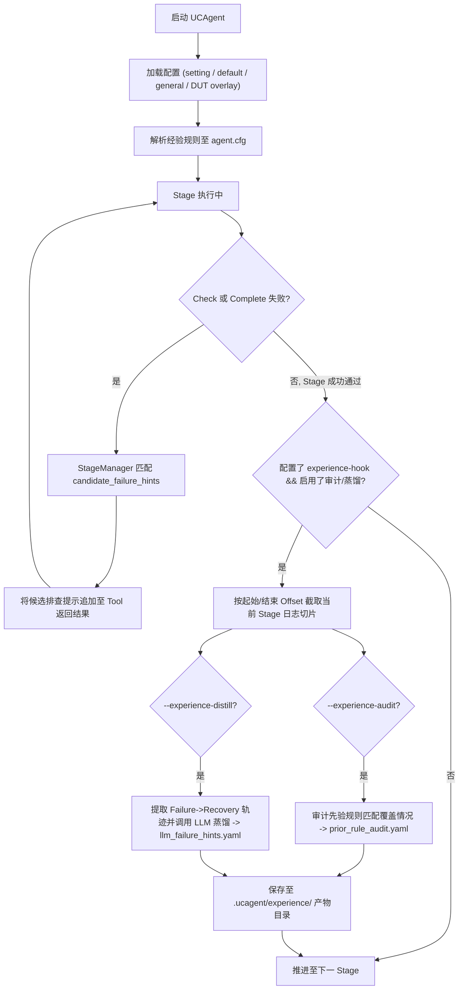

# 经验系统 (Experience System)

在硬件验证中，AI Agent 在面对检查器（Checker）失败时，虽然能获取结构化的 Checker 诊断报告，但有时仍会在一些**流程性、格式性或配置对齐**问题上反复试错（例如把分批剩余测试提示误判为 DUT 缺陷、反复修改标签导致文档层级摇摆、混淆 Python 与硬件算术取整语义等）。

UCAgent **经验系统**为验证工作流提供了一套**轻量级、可配置、可审计且严格防污染**的经验闭环机制。

---

## 1. 核心设计原则

经验系统的目标是**辅助 Agent 快速识别已知流程陷阱，加速验证收敛**，而不是替代 Agent 推导 DUT 逻辑。整体设计遵循以下铁律：

- **Checker 权威性不变**：不修改 Checker 逻辑，不放宽任何 Pass/Fail 判定，Checker 报告永远是第一事实来源。
- **候选提示为辅助（Triage Aid）**：仅在 `Check` 或 `Complete` 失败后按条件追加少量（默认最多 2 条）候选提示（`candidate_failure_hints`），提示不适用时模型必须回归 Checker 报告本身。
- **Stage 边界严格隔离**：经验收集与审计仅在标记了 `experience-hook: true` 的阶段生效，并通过日志字节切片（Byte Offset）严格限定在本阶段内，**零跨阶段污染**。
- **人工审查入库（Review-only）**：LLM 蒸馏提取的候选经验只输出到旁路产物目录，**绝不自动写回全局经验库**，必须经人工审查（Review）后方可纳入版本控制。

---

## 2. 总体架构与数据流

经验系统在 UCAgent 内部的完整工作链路如下图所示：



---

## 3. 经验规则配置

经验规则分为**通用经验库（DUT-neutral）**与 **DUT 专属经验 Overlay**。

### 3.1 通用经验库 (`general.yaml`)

通用经验库位于 `ucagent/lang/zh/experience/general.yaml`，收录不依赖特定 DUT 的通用排错规则（如标签层级解析、分批实现优先级、置信度格式等）：

```yaml
experience:
  max_candidate_failure_hints: 2  # 每次失败最多注入的提示数量

  candidate_failure_hints:
    - id: batch_progress_remaining_tests_prioritize_impl
      priority: 10
      enabled: true
      stages: ["22", "23"]       # 适用的 Runtime Stage 编号
      checkers:
        - "UnityChipCheckerBatchTestsImplementation"
      patterns:
        - "remaining to be implemented"
        - "remaining test cases"
      hint: "当 checker 报告提示 remaining test cases 时，当前任务目标是继续实现本批次未完成的测试用例。优先完成剩余测试并执行 Check，不要将进度提示误判为 DUT 缺陷或环境异常。"
```

### 3.2 规则字段规范

每条规则包含以下字段：

| 字段 | 类型 | 说明 |
| :--- | :--- | :--- |
| `id` | `string` | 规则唯一标识符（建议小写下划线命名） |
| `priority` | `int` | 优先级（数值越小越优先匹配，建议范围 10~90） |
| `enabled` | `bool` | 是否启用该规则（默认 `true`） |
| `stages` | `list[str]` | 生效的阶段索引列表（如 `["21", "22", "23"]`） |
| `checkers` | `list[str]` | 触发匹配的 Checker 类名列表 |
| `patterns` | `list[str]` | 精确字符串匹配项（命中国中任意一项即可） |
| `regex` | `list[str]` | 正则表达式匹配项（支持复杂模式匹配） |
| `match_scope` | `list[str]` | 匹配文本范围：`["focused"]`（默认，仅检查 error/details 字段）或 `["full"]`（完整返回文本） |
| `hint` | `string` | 注入给大模型的行动纠偏提示词（需清晰指明排查步骤） |

### 3.3 DUT 专属配置与追加语法 (`+`)

针对特定模块（如 `adder`、`integerdivider`、`aes` 等），可在 `ucagent/lang/zh/experience/<DUT>.yaml` 中引入通用经验并追加专属经验：

```yaml
# ucagent/lang/zh/experience/adder.yaml
include:
  - general.yaml  # 引入通用经验

# 开启特定阶段的经验收集 Hook
stage[12].experience-hook: true
stage[13].stage[0].experience-hook: true
stage[13].experience-hook: true

experience:
  candidate_failure_hints+:  # '+' 表示追加到通用规则列表后，不覆盖通用规则
    - id: adder_overflow_carry_alignment
      priority: 50
      stages: ["22", "23"]
      patterns:
        - "carry_out mismatch"
      hint: "Adder 溢出进位测试失败时，先核对 reference model 中的无符号进位推导是否包含了 cin，再确认 DUT 是否处于组合直通状态。"
```

---

## 4. 命令行使用模式 (CLI)

UCAgent 提供了灵活的 CLI 参数来控制经验系统的运行模式：

| 模式 | CLI 参数 | 说明 | 产物输出 |
| :--- | :--- | :--- | :--- |
| **标准运行** | （不加经验参数） | 完全不加载经验覆盖层，默认关闭 | 无 |
| **仅经验注入** | `--experience-profile` | 仅加载通用与 DUT 经验规则注入提示，用于 A/B 效果对比 | 无旁路产物 |
| **先验规则审计** | `--experience-audit` | 注入经验，并在 Stage 完成后审计先验规则的命中与覆盖情况 | 生成 `prior_rule_audit.yaml` |
| **LLM 经验蒸馏** | `--experience-distill` | 注入经验，并在 Stage 完成后调用模型提炼 Review-only 候选规则 | 生成 `llm_failure_hints.yaml` |
| **完整模式** | `--experience` | 同时启用 Profile 加载、先验审计与 LLM 蒸馏 | 生成完整经验分析产物 |

### 典型执行命令

```bash
# 1. 快速验证经验提示效果（仅注入，不产生额外文件）
python ucagent/cli.py --dut Adder --experience-profile

# 2. 运行并生成完整经验审计与蒸馏产物
python ucagent/cli.py --dut Adder --experience --log-file log/run.log --msg-file log/run-msg.log

# 3. 通过 Makefile 启动
make -i mcp_Adder ARGS="--loop --log --log-file log/exp.log --msg-file log/exp-msg.log --experience"
```

---

## 5. 产物目录结构

启用 `--experience` 运行后，各 Stage 的经验沉淀将输出在工作区 `.ucagent/experience/` 目录下：

```
<workspace>/
└── .ucagent/
    └── experience/
        ├── stage_12_create_test_case_templates/
        │   ├── stage_info_snapshot.json      # 阶段元数据快照
        │   ├── prior_rule_audit.yaml         # 先验规则命中审计报告
        │   └── adder_llm_failure_hints.yaml  # 模型提炼的候选经验规则 (Review-only)
        └── stage_13_test_case_implementation_in_batch/
            ├── prior_rule_audit.yaml
            └── adder_llm_failure_hints.yaml
```

---

## 6. 开发者最佳实践

1. **规则编写要清晰、具体**：提示词应明确给出**“先核对什么”、“不要做什么”、“修完后做什么”**，避免模糊的主观判断。
2. **严防敏感信息与过拟合**：通用经验库（`general.yaml`）中禁止包含具体 DUT 的寄存器名字、临时十六进制常量或特定 RTL 路径。
3. **保持 Review 机制**：将 LLM 蒸馏出的候选规则纳入代码仓库前，必须由验证工程师人工确认其通用性与正确性，确保经验库的质量。
