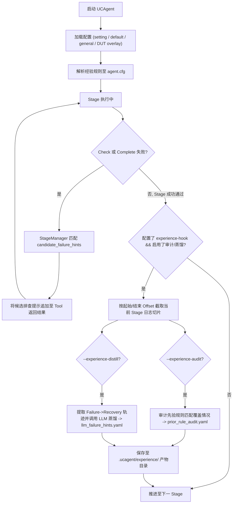

# 经验系统 (Experience System)

在硬件验证中，AI Agent 在面对检查器（Checker）失败时，虽然能获取结构化的 Checker 诊断报告，但有时仍会在一些**流程性、格式性或配置对齐**问题上反复试错（例如把分批剩余测试提示误判为 DUT 缺陷、反复修改标签导致文档层级摇摆、混淆 Python 与硬件算术取整语义等）。

UCAgent **经验系统**为验证工作流提供了一套**轻量级、可配置、可审计且严格防污染**的经验闭环机制。

---

## 1. 核心设计原则

经验系统的目标是**辅助 Agent 快速识别已知流程陷阱，加速验证收敛**，而不是替代 Agent 推导 DUT 逻辑。整体设计遵循以下铁律：

- **Checker 权威性不变**：不修改 Checker 逻辑，不放宽任何 Pass/Fail 判定，Checker 报告永远是第一事实来源。
- **候选提示为辅助（Triage Aid）**：仅在 `Check` 或 `Complete` 失败后按条件追加少量（默认最多 2 条）候选提示（`candidate_failure_hints`），提示不适用时模型必须回归 Checker 报告本身。
- **Stage 边界严格隔离**：经验收集与审计仅在标记了 `experience-hook: true` 的阶段生效，并通过日志字节切片（Byte Offset）严格限定在本阶段内，**零跨阶段污染**。
- **人工审查入库（Review-only）**：LLM 蒸馏提取的候选经验只输出到旁路产物目录，**绝不自动写回全局经验库**，必须经人工审查（Review）后方可纳入版本控制。

---

## 2. 总体架构与数据流

经验系统在 UCAgent 内部的完整工作链路如下图所示：



---

## 3. 经验规则配置

经验规则分为**通用经验库（DUT-neutral）**与 **DUT 专属经验 Overlay**。

### 3.1 通用经验库 (`general.yaml`)

通用经验库位于 `ucagent/lang/zh/experience/general.yaml`，收录不依赖特定 DUT 的通用排错规则（如标签层级解析、分批实现优先级、置信度格式等）：

```yaml
experience:
  max_candidate_failure_hints: 2  # 每次失败最多注入的提示数量

  candidate_failure_hints:
    - id: batch_progress_remaining_tests_prioritize_impl
      priority: 10
      enabled: true
      stages: ["test_case_implementation_in_batch"] # 优先使用稳定阶段名
      checkers:
        - "UnityChipCheckerBatchTestsImplementation"
      patterns:
        - "remaining to be implemented"
        - "remaining test cases"
      hint: "当 checker 报告提示 remaining test cases 时，当前任务目标是继续实现本批次未完成的测试用例。优先完成剩余测试并执行 Check，不要将进度提示误判为 DUT 缺陷或环境异常。"
```

### 3.2 规则字段规范

每条规则包含以下字段：

| 字段 | 类型 | 说明 |
| :--- | :--- | :--- |
| `id` | `string` | 规则唯一标识符（建议小写下划线命名） |
| `priority` | `int` | 优先级（数值越小越优先匹配，建议范围 10~90） |
| `enabled` | `bool` | 是否启用该规则（默认 `true`） |
| `stages` | `list[str]` | 生效的阶段名或运行时索引列表；内置规则优先使用稳定阶段名，避免工作流增删阶段后索引漂移 |
| `checkers` | `list[str]` | 触发匹配的 Checker 类名列表 |
| `patterns` | `list[str]` | 精确字符串匹配项（命中国中任意一项即可） |
| `regex` | `list[str]` | 正则表达式匹配项（支持复杂模式匹配） |
| `match_scope` | `list[str]` | 匹配文本范围：`["focused"]`（默认，仅检查 error/details 字段）或 `["full"]`（完整返回文本） |
| `hint` | `string` | 注入给大模型的行动纠偏提示词（需清晰指明排查步骤） |

### 3.3 DUT 专属配置与公平边界

针对特定模块，可在 `ucagent/lang/zh/experience/<DUT>.yaml` 中引入通用经验并补充安全的验证维度。DUT overlay 只允许描述从当前工作区资料可独立推导的检查范围、建模方法和失败分类，不得提供 oracle 答案。

禁止在已入库的 DUT overlay 中保存以下内容：

- 精确 expected、固定输入输出向量、常数或可复制的 reference model 实现；
- 历史日志、已知失败序列、稳定失败的测试名、源码根因和修复结论；
- 精确的 FG/FC/CK 路径、Bug 标签，或依赖历史问题专属名称和结论的触发条件。

允许 DUT overlay 定义 `candidate_failure_hints`，但触发条件只能使用公开模块语义和稳定失败类别，hint 只能引导 Agent 回到当前工作区规格进行独立推导和重新验证。不得在入库规则中保留 `source.evidence`；历史运行证据只能保存在审计或蒸馏旁路产物中。

推荐同时使用阶段任务和安全候选提示：

```yaml
# ucagent/lang/zh/experience/<DUT>.yaml
include:
  - general.yaml

# 仅开启特定阶段的经验收集 Hook
stage[12].experience-hook: true
stage[13].stage[0].experience-hook: true
stage[13].experience-hook: true

stage[13].stage[0].task: "+模块专属验证维度：依据当前工作区中的规格、接口和实现，独立建立 reference model，覆盖该模块声明的正常、边界、异常和时序场景。不得复制 DUT 实现、已有断言或历史运行结论。"
stage[13].task: "+分析失败时，先核对规格预期、测试环境、模型、输入输出表示、握手和采样时机；只有验证链路正确后仍稳定违反规格，才记录为 DUT Bug。"

experience:
  candidate_failure_hints+:
    - id: current_contract_transaction_alignment
      priority: 76
      stages: ["test_case_implementation_in_batch", "comprehensive_verification_and_bug_analysis"]
      match_scope: ["focused", "full"]
      regex:
        - "(?i)(?:handshake|response).*(?:failed|error|timeout)"
      hint: "这类事务失败应先依据当前工作区接口契约独立列出请求、响应和完成条件，再核对环境与采样时机；不得把超时或历史归因直接当作 DUT Bug。"
```

阶段任务中的模块名称只用于选择配置，不代表该文件可以提供该模块的正确答案。若无法从当前工作区资料独立推导预期，应暂停归因并补充权威输入，而不是从经验文件猜测。

---

## 4. 命令行使用模式 (CLI)

UCAgent 提供了灵活的 CLI 参数来控制经验系统的运行模式：

| 模式 | CLI 参数 | 说明 | 产物输出 |
| :--- | :--- | :--- | :--- |
| **标准运行** | （不加经验参数） | 完全不加载经验覆盖层，默认关闭 | 无 |
| **仅经验注入** | `--experience-profile` | 仅加载通用与 DUT 经验规则注入提示，用于 A/B 效果对比 | 无旁路产物 |
| **先验规则审计** | `--experience-audit` | 注入经验，并在 Stage 完成后审计先验规则的命中与覆盖情况 | 生成 `prior_rule_audit.yaml` |
| **LLM 经验蒸馏** | `--experience-distill` | 注入经验，并在 Stage 完成后调用模型提炼 Review-only 候选规则 | 生成 `llm_failure_hints.yaml` |
| **完整模式** | `--experience` | 同时启用 Profile 加载、先验审计与 LLM 蒸馏 | 生成完整经验分析产物 |

当 `--experience-profile`、`--experience-audit`、`--experience-distill` 或 `--experience` 遇到没有已入库 profile 的安全 DUT 名称时，UCAgent 会在当前语言的 `experience/` 目录自动创建小写文件名的冷启动 profile：

```yaml
include:
  - general.yaml
```

该文件只启用通用经验，不携带 DUT 结论，也不自动生成专属候选规则。它不包含 `experience-hook`，因此 `--experience` 在这个新 profile 上不会产生阶段审计或蒸馏产物；需要这些产物时，应在人工审查后显式添加对应阶段 hook。

### 典型执行命令

经验系统与主文档中定义的**本地直接运行模式（Direct / LangChain）**和 **MCP 协同模式（External CodeAgent）**完全兼容。运行示例如下：

#### 1. 本地直接运行模式（内置 LangChain）

基于内部模型（通过 `config.yaml` 或环境变量配置端点）直接运行：

```bash
# （1）仅加载经验规则注入提示（A/B 对照，无需日志文件）
make test_Adder ARGS="--experience-profile"

# （2）启用完整经验审计与 LLM 蒸馏（必须提供 --log-file 以供日志切片分析）
make test_Adder ARGS="--experience --log-file log/adder_exp.log --msg-file log/adder_exp_msg.log"

# （3）直接通过 Python CLI 启动
python ucagent/cli.py --dut Adder --experience-profile
python ucagent/cli.py --dut Adder --experience --log-file log/adder_exp.log --msg-file log/adder_exp_msg.log
```

#### 2. MCP 协同模式（外部 CodeAgent）

配合外部 CodeAgent 工具（如 Claude Code、Qwen）进行协同验证：

```bash
# 方式一：指定后端自动拉起 CodeAgent（推荐，以 Claude Code 为例）
# 仅注入经验：
make mcp_Adder ARGS="--loop --backend=claude --experience-profile"

# 完整审计与蒸馏（建议固定 --seed 并显式指定 --log-file）：
make mcp_Adder ARGS="--loop --backend=claude --seed 101530 --experience --log-file log/adder_exp.log --msg-file log/adder_exp_msg.log"

# 方式二：手动运行 CodeAgent
# （1）启动 MCP Server 并启用经验系统
make mcp_Adder ARGS="--experience-profile"

# （2）在生成的工作目录启动 CodeAgent
cd output/workspace_Adder
claude  # 或 qwen
```

> [!IMPORTANT]
> **关于日志参数 `--log-file` 的依赖说明**：
> 
> - 仅注入经验规则（`--experience-profile`）时，不读取日志，无需额外传参；
> - 启用先验审计（`--experience-audit`）、模型蒸馏（`--experience-distill`）或完整模式（`--experience`）时，底层依赖日志切片提取 Checker 报错与恢复轨迹。**若未提供 `--log-file` 参数，文件日志器将不会初始化落盘，导致阶段结束时无法读取日志，审计与蒸馏将直接退化为空操作（0 命中、0 提炼）**。

---

## 5. 产物目录结构

启用 `--experience` 运行后，各 Stage 的经验沉淀将输出在工作区 `.ucagent/experience/` 目录下：

```
<workspace>/
└── .ucagent/
    └── experience/
        ├── stage_23_create_test_case_templates/
        │   ├── adder_verification_experience.md # 已脱敏的阶段经验摘要
        │   ├── prior_rule_audit.yaml            # 先验规则命中审计报告
        │   ├── adder_llm_failure_hints.yaml     # 模型提炼的候选经验规则 (Review-only)
        │   └── index.json                        # 产物索引与日志范围元数据
        └── stage_24_test_case_implementation_in_batch/
            ├── adder_verification_experience.md
            ├── prior_rule_audit.yaml
            └── index.json
```

---

## 6. 开发者最佳实践

1. **规则编写要清晰、具体**：提示词应明确给出**“先核对什么”、“不要做什么”、“修完后做什么”**，避免模糊的主观判断。
2. **严防敏感信息与过拟合**：通用经验库（`general.yaml`）中禁止包含具体 DUT 的寄存器名字、临时十六进制常量或特定 RTL 路径。
3. **保持 Review 机制**：将 LLM 蒸馏出的候选规则纳入代码仓库前，必须由验证工程师人工确认其通用性与正确性，确保经验库的质量。

## 7. 未来演进与待办事项 (TODO)

为进一步提升经验系统的泛化能力、工程实用度与学术严谨性，后续重点演进方向的技术规划与具体实现方案如下：

### 7.1 DUT 类型级经验分层体系

当前经验仅区分为全局通用层（`general.yaml`）与单个 DUT 覆盖层（`<DUT>.yaml`），缺乏模块家族间的知识复用。

#### 具体实现方案

1. **三层目录组织结构**：
   在 `ucagent/lang/zh/experience/` 下新增 `category/` 目录，按硬件模块家族沉淀共性经验：
   ```text
   ucagent/lang/zh/experience/
   ├── general.yaml                  # 第 1 层：全局通用底座（文档格式、阶段推进等通用规则）
   ├── category/                     # 第 2 层：模块家族类型经验
   │   ├── arithmetic_alu.yaml       # 算术运算类（ALU、乘除法器、浮点单元）
   │   ├── bus_protocol.yaml         # 总线接口类（AXI-Stream、APB、Wishbone 握手与乱序）
   │   ├── stream_fifo.yaml          # 流控存储类（同步/异步 FIFO、环形缓冲区）
   │   └── sequential_fsm.yaml       # 时序控制类（状态机、定时器、计数器）
   └── <dut>.yaml                    # 第 3 层：特定 DUT 专属微调规则
   ```

2. **配置继承与解析算法 (`ucagent/util/config.py`)**：
   - **类型声明与推断**：在 DUT 基础配置中支持声明 `dut_category: bus_protocol`；若未显式声明，配置加载器基于端口特征与模块命名正则自动启发式推断（如匹配 `axis_*` / `axi_*` 自动归类为 `bus_protocol`）。
   - **加载链条**：按照 `general.yaml` $\longrightarrow$ `category/<dut_category>.yaml` $\longrightarrow$ `<dut>.yaml` 顺序串联加载。
   - **去重与合并策略**：
     - 对 `candidate_failure_hints` 规则按 `id` 检索；
     - 若 `id` 冲突，采用**高优先级深度覆盖**原则（`<dut>.yaml` 覆盖 `category/*.yaml`，`category/*.yaml` 覆盖 `general.yaml`）；
     - 若 `id` 无冲突，采用级联追加（Append）并在注入时按规则权重动态排序。

3. **类型共性经验提炼**：
   离线对同一 category 下多个 DUT 的运行日志切片进行聚类分析，把跨 DUT 重复出现的共性失败签名（如 AXI 握手卡死、READY/VALID 悬空）统一提炼并收录至对应的 `category/<type>.yaml` 中。

### 7.2 测试用例生成故障根因分流与自适应骨架供给

大模型在编写测试用例失败时，目前系统缺乏对其真实出错根因的精细分流，易导致大模型在基础框架语法错误上陷入无意义的自创死循环。

#### 具体实现方案

1. **两级根因判别引擎 (`Failure Triage Engine`)**：
   在阶段检查器（如 `BatchTaskChecker` / `ToffeeTestChecker`）中嵌入错误分类器，通过捕获的 Traceback 与退出状态码进行正交分流：
   - **工程框架与语法层故障 (`framework_syntax`)**：
     - **判定特征**：Python 抛出 `SyntaxError`、`ImportError`、`AttributeError`、`TypeError`、Toffee 驱动未加 `await` 异步调用、未实例化 `ClockRunner`、或 Pytest fixture 解析失败等。
     - **诊断分类**：标记为框架使用不熟练，而非逻辑推导错误。
   - **语义与时序规格层故障 (`semantic_timing`)**：
     - **判定特征**：代码通过编译且驱动正常运行，但在仿真周期内触发 `AssertionError`、DUT 输出与预期模型不符、或发生仿真时钟挂起（Simulation Timeout）。
     - **诊断分类**：标记为接口时序或芯片功能理解偏差。

2. **自适应测试骨架供给 (`Adaptive Scaffolding`)**：
   - 在 `ucagent/lang/zh/template/scaffolds/` 维护最小可工作的权威代码片段库（Minimal Golden Scaffolds，如 `toffee_bundle_driver.py`、`async_clock_reset.py`）。
   - 当判别为 `framework_syntax` 时，Checker 返回的结构化诊断字典中动态携带对应场景的 `scaffold_snippet`：
     ```json
     {
       "error_code": "TOFFEE_ASYNC_DRIVER_SYNTAX_ERROR",
       "triage": "framework_syntax",
       "next_action": "请参考标准 Toffee 驱动脚手架，使用 await bundle.send() 修复异步时序驱动",
       "scaffold_snippet": "await toffee.bundle.send(data)\nawait toffee.clock.step(1)"
     }
     ```
   - 将脚手架作为优先修复参考注入给模型，从根本上阻断语法猜测试错。

### 7.3 接入外部开源硬件验证经验库 (XiangShanLab 知识集成)

将工业级开源高性能芯片验证中沉淀的成果与实战排查指南融入 UCAgent 体系。

#### 具体实现方案

1. **知识抽取管线 (ETL Pipeline)**：
   - 提取 [OpenXiangShan/XiangShanLab](https://github.com/OpenXiangShan/XiangShanLab) 中开源的验证模式、断言规范与典型 Bug 报告（如 AXI4 突发传输跨越 4KB 边界、写响应通道乱序交织、Cache 一致性伪共享、分支预测边界冒险）。

2. **非预言式（Non-oracular）规则映射**：
   - **防预言安全准则**：严禁硬编码具体设计的内部私有信号名或特定数值，只提炼通用的**验证维度与检查项清单（Checklist）**。
   - **映射为 UCAgent 标准经验 YAML**：
     ```yaml
     - id: xiangshan_axi4_4k_boundary_check
       stage_task: [15-refine_test_cases_based_on_functional_points, 18-generate_random_test_cases]
       trigger_conditions:
         match_scope: ["focused", "full"]
         regex:
           - "(?i)axi.*(?:burst|boundary|split|error)"
       hint: "【香山验证指南】AXI4 突发传输用例必须检查地址是否跨越 4KB 边界；若跨越，驱动端需拆分为两次独立事务，且写地址与写数据通道需解耦处理。"
       priority: 85
     ```

### 7.4 经验效果的“凭据化”因果度量与统计评估

将当前仅记录静态匹配的审计机制，升级为严谨的**因果效果闭环度量与自动化评测体系**。

#### 具体实现方案

1. **提示注入凭据 (`Hint Receipt`) 规范**：
   每次向 Agent 注入 Hint 时，在 `.ucagent/experience/hint_receipts.jsonl` 中实时追加结构化凭据：
   ```json
   {
     "receipt_id": "rcpt_20260910_001_18",
     "stage_index": 18,
     "rule_id": "generic_toffee_async_driver",
     "timestamp": "2026-09-10T14:10:00.123Z",
     "failure_signature": "[ToffeeDriverError] missing await on bundle.send",
     "subsequent_tool_calls": ["ReadTextFile", "ReplaceFileContent", "RunTestCases"],
     "post_check_result": "PASSED",
     "causal_label": "true_recovery",
     "token_overhead": 820,
     "duration_seconds": 12.5
   }
   ```

2. **因果状态转移判定矩阵**：
   - **有效恢复 (`true_recovery`)**：注入 Hint 后，下一次执行相同 Checker 时错误签名彻底消除，且用例通过率提高或当前 Stage 顺利通过；
   - **无改善 (`no_improvement`)**：注入 Hint 后，下一次检查依然抛出相同错误签名，重试计数递增；
   - **负向误导 (`misdirection`)**：注入 Hint 后，原错误未解且引入了更严重的语法崩溃或阶段早退。

3. **保守置信度算法 (Wilson Score Interval)**：
   针对小样本偶发偏差，采用 Wilson 评分区间计算正向恢复率的 95% 置信下界：
   $$\text{Score}_{\text{Wilson}} = \frac{\hat{p} + \frac{z^2}{2n} - z \sqrt{\frac{\hat{p}(1-\hat{p})}{n} + \frac{z^2}{4n^2}}}{1 + \frac{z^2}{n}}$$
   其中 $n$ 为触发总次数，$k$ 为有效恢复次数，$\hat{p} = k / n$，$z = 1.96$。在小样本（如 $n=1, k=1$）时得分仅约为 $0.20$，只有在累积充足正向样本（$n \ge 10$ 且恢复率高）时得分才会显著上升，杜绝单次偶然成功带来的评估失真。

4. **自动化多重 A/B 对照试验与统计显著性检验**：
   - **严格同构对照约束 (Isomorphic Constraints)**：
     基线组（Baseline）与实验组（With-Experience）必须在完全同构的环境下成对执行：相同的 DUT 源码、相同的随机数种子（Seed）、相同的底层模型后端与推理配置、完全相同的 Prompt 工作流阶段，唯一允许变化的自变量为经验规则集合与注入开关。
   - **因果度量核心指标集**：
     - **收敛轮数与重试差值**：$\Delta \text{Rounds} = \text{Rounds}_{\text{exp}} - \text{Rounds}_{\text{base}}$（负值代表收敛加速）；
     - **资源成本差值**：$\Delta \text{Tokens} = \text{Tokens}_{\text{exp}} - \text{Tokens}_{\text{base}}$ 与阶段墙钟时间变化（$\Delta \text{Time}$）；
     - **用例通过率与覆盖率增量**：终态测试通过率增量与功能点/代码行覆盖率增量。
   - **配对显著性假设检验 (Statistical Significance Testing)**：
     在多组独立随机 Seed（如 $N \ge 5$）下进行重复成对采样，通过配对 Wilcoxon 符号秩检验（Wilcoxon Signed-Rank Test）或配对 t 检验计算显著性 P 值（要求 $p < 0.05$），在统计学层面严格证明效率提升来自经验规则的因果赋能，杜绝单次随机采样的偶发波动。

### 7.5 规则全生命周期管理与动态自适应调度

废弃目前仅由 LLM 单次静态指定的 `priority` 机制，引入自适应全生命周期管理。

#### 具体实现方案

1. **生命周期状态机与规则元数据**：
   在规则 YAML 增加 `lifecycle` 跟踪字段：
   ```yaml
   - id: toffee_clock_runner_leak
     lifecycle:
       state: shadow               # candidate -> shadow -> active -> deprecated
       observed_count: 14          # 观测触发次数 n
       recovery_count: 11          # 有效恢复次数 k
       wilson_score: 0.54          # 动态计算的置信下界
       misdirection_rate: 0.07     # 误导率
       last_updated: "2026-09-10"
   ```
   - **状态流转机制**：
     $$\text{Candidate (蒸馏初筛)} \xrightarrow{\text{人工审核}} \text{Shadow (影子模式)} \xrightarrow{\text{指标达标}} \text{Active (正式激活)} \xrightarrow{\text{退化/高误导}} \text{Deprecated (淘汰下线)}$$
     - **Shadow（影子模式）**：新规则只在后台静默匹配记录 Receipt，不注入给 Agent 上下文。当累计观测达标（$n \ge 10$）且 $\text{Score}_{\text{Wilson}} \ge 0.60$ 时，自动晋升至 Active；
     - **Active（正式激活）**：正常参与失败时的动态注入；
     - **Deprecated（淘汰下线）**：若近期误导率 $> 25\%$ 或长期未命中，自动降级或移出活跃池。

2. **运行时多维动态排序函数 (Dynamic Ranking)**：
   当单次失败匹配到多条候选规则时，采用多维评分排序并截取 Top-2 注入：
   $$\text{Score} = w_1 \cdot \text{Score}_{\text{Wilson}} + w_2 \cdot \text{CosineSim}(\text{Error}, \text{Pattern}) - w_3 \cdot \frac{\text{TokenCost}}{\text{TokenBudget}}$$
   确保高收益、低 Token 开销的高置信度黄金规则优先曝光。

