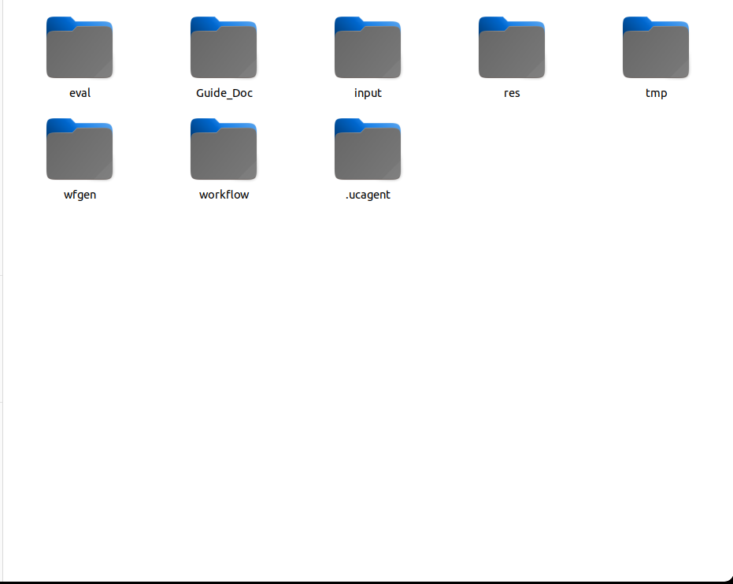

# 快速启动总述：以 DOCX 工作流为例

本组文档带领用户从空业务目录开始，生成一个“根据文字、图片和版式要求生产 DOCX 说明文档”的 UCAgent 工作流，然后执行静态评估、审批问题、运行增量修复，并通过图形化控制台观察全过程。案例重点是 Workflow Builder 的使用方式，不负责规定 DOCX 生成工具的唯一实现。

## 需要的依赖

| 依赖 | 用途 | 检查命令 |
| --- | --- | --- |
| Linux 或兼容 shell 环境 | Makefile、tmux 和 UCAgent 命令运行 | `bash --version` |
| GNU Make | 统一启动构建、评估、增量和控制台 | `make --version` |
| Python 3.11 或项目支持版本 | 运行 UCAgent、配置程序和控制台 | `python3 --version` |
| 已安装的 UCAgent 虚拟环境 | 执行实际 Agent 流程 | `test -x "$UCAGENT_VENV/bin/python"` |
| tmux | 监督策略和共享终端 | `tmux -V` |
| PyYAML 等 UCAgent 依赖 | 解析配置和结构化数据 | 使用 UCAgent 自身安装方式安装 |

DOCX 业务工作流最终可能使用 `python-docx`、Pillow、LibreOffice 或字体包，但这些属于生成工作流的业务依赖，应由生成产物的 `requirements.txt`、`setup.py` 和文档声明。Workflow Builder 启动前不要求预装所有未来业务依赖。

## 开始前应存在的文件

```text
workspace_docx/
└── input/
    ├── guide.md
    └── test_input/
        ├── content.md
        ├── document_requirements.md
        └── assets/
```

`guide.md` 描述要生成怎样的工作流；`test_input/` 是给构建流程理解输入契约和创建示例目标使用的样例，不是最终业务工作流的输出目录。样例素材应尽量小、可公开、可重复使用，不应包含真实秘密或大体积生产文件。

## 四步阅读顺序

1. [启动 run 构建工作流](01_run工作流启动.md)：准备 DOCX 需求并生成 `workspace/workflow/`。
2. [启动评估工作流](02_评估工作流启动.md)：分别审查工具、Checker、流程和环境。
3. [启动增量工作流](03_增量工作流启动.md)：只处理已批准问题和用户建议。
4. [使用构建与评估控制台](04_工作流构建与评估控制台.md)：阅读报告、批量审批、查看构建设计和版本。

## 环境配置

在 Workflow Builder 目录执行：

```bash
python setup.py
make configure-check
make configure-show
```

如果本机已经通过 `ucagent_env` 和 `proxy_on` 配置好环境，也可以继续沿用。`setup.py` 的作用是给 Makefile 提供持久化的本机默认值，不会修改 `~/.bashrc`。命令行中的 `WS=...` 优先级高于保存的默认工作区。

## 成功完成的判定

完成本组文档后，应能确认以下事实：

- `workspace_docx/workspace/workflow/` 存在，包含配置、工具、Checker、GuideDoc、用户文档和环境设施。
- 构建过程不是通过人工代写业务产物“伪造通过”，各阶段由实际 Agent 完成并被 Checker 验证。
- `eval/` 中存在按评估类型保存的结构化报告，关键问题可以在控制台审批。
- 增量流程有独立 run id、候选目录和历史版本，修复后确定性检查通过。
- 用户可以区分构建工作流的 Makefile 与生成工作流自己的 Makefile。



## 推荐安装顺序

Workflow Builder 不单独复制一套 UCAgent 依赖。先按 UCAgent 项目要求创建其 `.venv`，确认 `ucagent.py` 可以由虚拟环境 Python 导入，再配置本目录。基础系统工具可以按发行版安装，例如 Ubuntu/Debian 使用：

```bash
sudo apt-get update
sudo apt-get install -y make tmux python3 python3-venv
cd ~/FDocB/UCAgent
test -x .venv/bin/python
```

上面命令不替用户安装模型凭据，也不自动安装 DOCX 业务未来需要的 LibreOffice 或字体。生成工作流的 `requirements.txt` 会区分 Python 包和系统依赖；真正运行业务工作流前再按其文档安装。

## 本案例的两层输入

第一层是给 Workflow Builder 的构建需求，位于 `workspace_docx/input/`。第二层是生成工作流将来处理的业务目标，位于 `workspace_docx/workspace/workflow/input/<TARGET>/`。构建样例会被转换为生成工作流的 `input/example/`，但用户不应在构建前手工创建整个 `workflow/`。

| 时刻 | 用户准备 | Agent 生成 |
| --- | --- | --- |
| 构建前 | `input/guide.md`、`input/test_input/` | 无 |
| 构建中 | 审查需求和 TUI | `wfgen/`、`workflow/` |
| 业务运行前 | 复制或创建 `workflow/input/<TARGET>/` | 环境本地配置 |
| 业务运行后 | 审查结果 | `workflow/output/<TARGET>/` |

## 建议保留的运行记录

第一次跑新业务时记录构建开始时间、工作区、tmux session、UCAgent 版本、当前阶段、阶段失败次数和最终返回码。若某阶段超过十分钟，再记录最近工具调用和目标文件时间戳。这些信息能帮助区分正常长生成、Checker重试、上下文空转和模型连接异常。

## 快速启动不代表跳过验收

快速路径仍然要求生成工作流的 `python setup.py --check`、`make check` 和 `make check_example` 通过。DOCX 文件存在不等于有效：业务 Checker 至少应能重新打开文件、验证结构和报告。评估与增量也不能因为是示例而省略审批和版本历史，否则用户学到的是错误操作边界。
