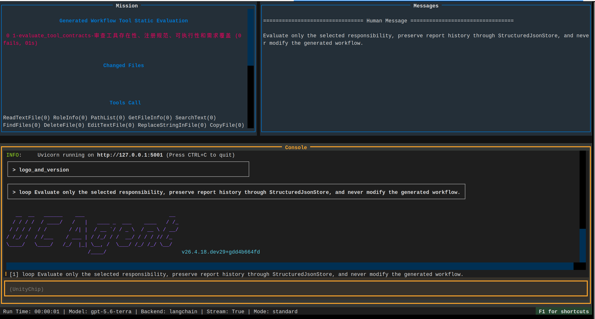

# 启动评估工作流

评估流程用于独立审查已经生成的业务工作流。静态评估不修改 `workflow/`，也不应为了证明问题而启动完整子工作流。运行评估成本较高，必须由用户显式选择。

## 评估前提

```bash
test -d ~/FDocB/UCAgent_t/workspace_docx/workspace/workflow
cd ~/FDocB/UCAgent/examples/workflow_builder
python setup.py --check
```

工作区中应存在 `eval/`、`res/` 和 `tmp/`。Make 入口会初始化结构化文件，但 `res/` 中的专业知识应由用户提供，评估 Agent 不得假装用户写入专业判断。

## 分项运行

```bash
make WS=~/FDocB/UCAgent_t/workspace_docx/workspace run_eval_tools
make WS=~/FDocB/UCAgent_t/workspace_docx/workspace run_eval_checkers
make WS=~/FDocB/UCAgent_t/workspace_docx/workspace run_eval_flow
make WS=~/FDocB/UCAgent_t/workspace_docx/workspace run_eval_env
```

四项职责分别是：

- `eval_tools`：存在性、UCAgent 注册语法、可调用性、错误结构和业务需求覆盖。
- `eval_checkers`：源码、docstring、构造参数、注册一致性、正反 fixture 和判定语义。
- `eval_flow`：config/inc 配置、阶段衔接、引用与输出文件、GuideDoc 和用户文档。
- `eval_env`：Makefile、生成工作流的 setup.py、shell、依赖、路径、端口和迁移能力。

也可以顺序运行并聚合：

```bash
make WS=~/FDocB/UCAgent_t/workspace_docx/workspace run_eval
```

## 运行评估

只有静态检查无法回答“实际流程是否卡住或产物是否可用”时，才选择：

```bash
make WS=~/FDocB/UCAgent_t/workspace_docx/workspace run_eval_runtime_default
```

增量运行模式使用 `run_eval_runtime_inc`。一次只评估一种运行模式，避免成本、日志和结论混在一起。

## 读取结果

报告位于构建工作区的 `eval/`，聚合命令为：

```bash
make WS=~/FDocB/UCAgent_t/workspace_docx/workspace aggregate_eval
make WS=~/FDocB/UCAgent_t/workspace_docx/workspace eval-list
```

一个有效 finding 应包含稳定 id、严重程度、对象、证据、影响、建议和来源 run。导致 UCAgent 无法启动、流程卡死、错误部署或破坏正式文件的问题优先级最高；需求未满足却被报告为成功同样属于高风险。



## 失败判断

评估 Agent 自己连续失败不等于被评估工作流存在问题。应先区分：报告写入工具参数错误、参考文件过多引发上下文问题、网络流中断、评估指导冲突，还是确实找到了目标缺陷。只有带源码或确定性命令证据的结论才能进入审批。

## 各分项的最小证据

| 分项 | 至少应提供的证据 |
| --- | --- |
| tools | spec、源码入口、注册记录、一次正常调用和一次失败调用 |
| checkers | spec、类/docstring、构造参数、正反 fixture、阶段注册 |
| flow | 变量定义与使用、阶段输入输出映射、具体 reference 文件、GuideDoc |
| env | Make 变量传递、setup check、依赖声明、路径和端口检查 |

评估不能因为源文件很长就只搜索类名，也不能为了“完整”一次全文读取所有组件。每次处理一个目标，先读索引和直接依赖，把证据写入报告后再进入下一个目标。

## 报告状态判断

`passed` 表示所有强制 check 有证据并且没有阻断 finding；`failed` 表示确认存在不满足契约的问题；`blocked` 表示由于缺少目标、依赖或用户知识无法完成评估。网络中断或 Agent调用错误属于评估运行失败，不应被写成被评估工作流的 high finding。

一个 finding 的 recommendation 应限定修复范围。例如指出“在 config generator 的未知 placeholder 验证中阻断并增加负向 fixture”，比“优化 config”更适合审批和增量实现。

## 聚合后的人工抽查

先按 critical/high 查看是否有启动、卡死、破坏文件或虚假成功风险；再检查不同分项是否重复同一根因；最后随机抽查 passed check 的证据。评估质量不仅看找到了什么，也看它是否错误地把没有验证的项目写成 passed。

如果报告遗漏肉眼明显的问题，应检查评估规则是否覆盖通用数据流，而不是把此次具体字符串硬编码为唯一规则。修正规则后重新运行对应分项，保留旧 run 供比较。
