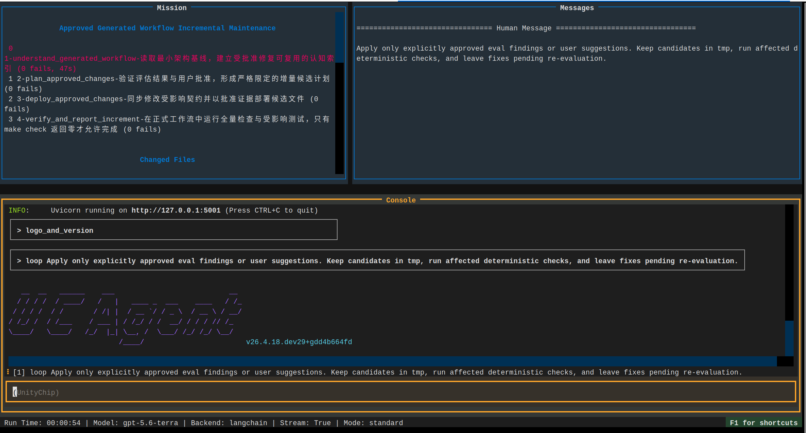

# 启动增量工作流

增量流程只处理用户明确批准的 finding 和用户主动提出的 suggestion。它不是第二次自由生成，也不应重新阅读整个仓库后凭直觉修改未批准内容。

## 1. 审批或新增建议

```bash
make WS=~/FDocB/UCAgent_t/workspace_docx/workspace eval-list
make WS=~/FDocB/UCAgent_t/workspace_docx/workspace eval-approve \
  ID=FLOW-001 REASON='修复会阻止 make check 的错误引用'
make WS=~/FDocB/UCAgent_t/workspace_docx/workspace eval-suggest \
  TITLE='补充 DOCX 字体回退说明' \
  DESCRIPTION='用户文档应解释 Linux 环境缺少指定字体时的替代策略'
```

审批理由应说明允许修改的目标和验收条件。批准不是要求用户逐个输入大段修复代码，而是授权增量流程在受控范围内制定候选方案。

## 2. 启动增量流程

```bash
make WS=~/FDocB/UCAgent_t/workspace_docx/workspace run_inc
```

入口会分配新的增量 run id，在 `tmp/inc_runs/<run-id>/` 下保存本轮清单、候选文件、证据和状态。不同运行不能共用一个没有身份的候选目录，否则旧报告、旧补丁和当前审批范围会混淆。



## 3. 修复和部署语义

增量流程先读取摘要、已批准条目、相关源码和必要文档，随后为每项批准内容建立映射。正式文件修改前应保存旧版本，修改后立即运行受影响的检查。部署发生后，不再用“等待批准”阻止修复 `make check`；此时唯一正确的闭环是继续修理直到回归通过，或者明确报告无法修复并停止。

正式验收至少包括：

```bash
cd ~/FDocB/UCAgent_t/workspace_docx/workspace/workflow
make check
make check_example
```

如果修改工具或 Checker，还要运行相应 fixture 或工具测试。只修改报告、不部署文件，或者部署后不运行检查，都不算完成。

## 4. 查看结果

- `eval/incremental_report.json`：本轮目标、执行状态、检查和未解决问题。
- `eval/applied_changes.json`：实际部署的文件、版本和验证证据。
- `tmp/inc_runs/<run-id>/`：本轮候选和过程证据。
- `tmp/change_history/`：正式文件旧版本和恢复记录。

完成增量后应重新运行受影响的评估分项，旧 finding 不会因为文件被修改而自动成为新结论。聚合报告只有读取到新一轮评估结果，才能形成真正闭环。

## 常见错误

- 没有已批准条目：增量流程应快速结束，不应自由寻找并修复其他问题。
- 第一阶段阅读很久：认知阶段应读索引和摘要，再按批准目标定向读取，不能全文扫描所有大文档。
- `make check` 失败后空转：这是状态机终止条件错误，应立即进入修复和再验证。
- 正式文件只读：受控部署器应通过同目录临时文件和原子替换处理，并保存旧版本；不能依赖普通覆盖写入。
- 修复过快：检查 applied changes、源码差异和真实命令返回码，确认不是只更新报告。

## 审批理由示例

较好的批准理由：

```text
允许修改 workflow/config.yaml 及其生成源，使第一阶段只引用执行前存在的具体文件；
必须保留现有阶段名称，并以 config 静态检查和 make check 返回 0 为验收。
```

不充分的理由是“同意修复”或“全部优化”。它没有修改边界，增量 Agent难以判断是否可以改 GuideDoc、Checker 或生成器。暂缓则应说明缺少的业务决策，例如用户尚未决定是否允许联网下载字体。

## 当前 run 的目录

```text
tmp/inc_runs/<run-id>/
├── context/
├── batches/<batch-id>/attempts/<attempt-id>/
│   ├── candidates/
│   └── evidence/
└── history/
```

不同实现可能增加索引文件，但候选、证据和历史必须绑定当前身份。启动后先在报告或 CLI 确认 run id，避免查看上一轮目录后误以为当前 Agent没有产物。

## 部署后的验收顺序

1. 对正式 `workflow/` 运行修改对象的最小测试。
2. 运行 `make check`，必要时运行 `make check_example`。
3. 比较 `applied_changes.json` 的哈希和正式文件。
4. 确认旧版本记录可读取。
5. 重新运行受影响评估分项。

如果第 1 或第 2 步失败，增量流程应继续修复或回滚，不能先宣称完成再等待评估。重新评估是对修复的独立确认，不替代部署后的确定性回归。

## 恢复演练

首次启用版本管理后，建议在测试工作区选择一个非关键修改演练恢复：查看历史记录、恢复旧版、确认哈希、运行检查，然后恢复新版本。只有真实演练过，才能确认控制台显示的备份路径不是孤立记录。
