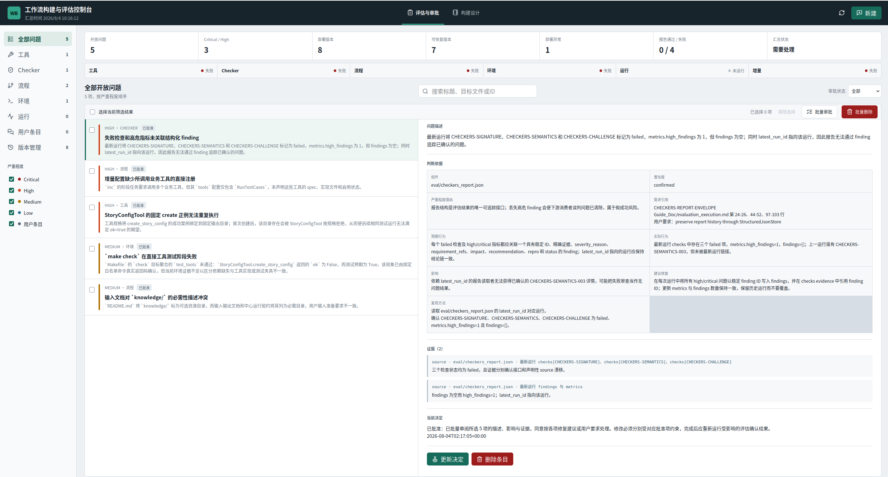
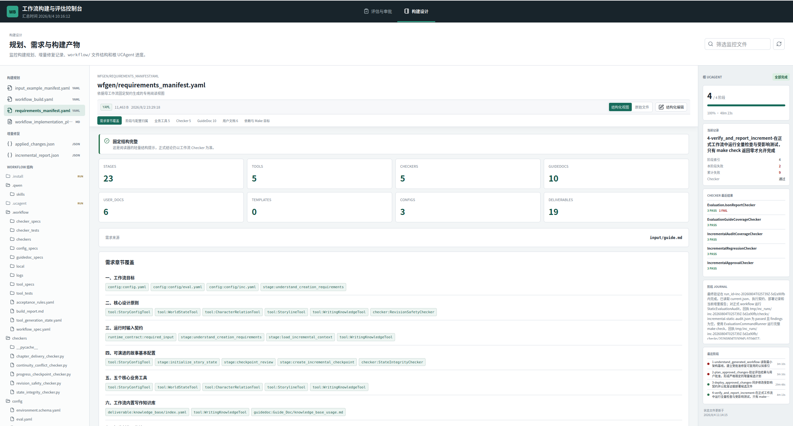
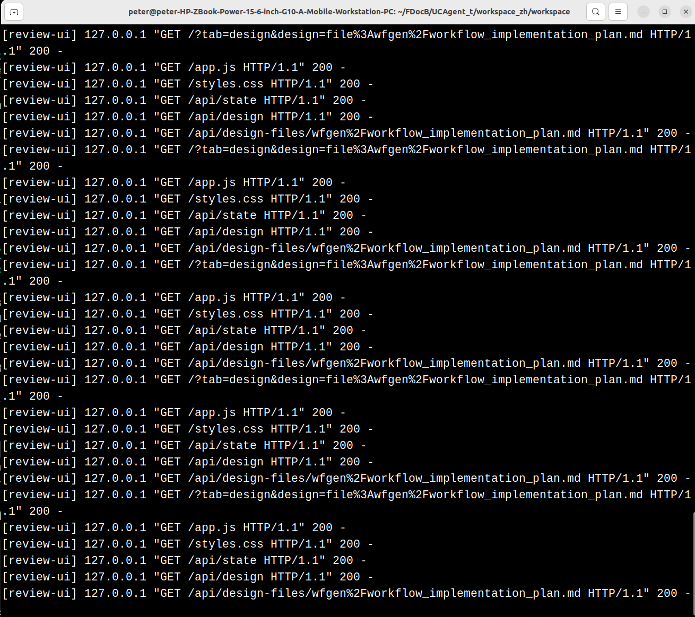

# 工作流构建与评估控制台

控制台用于在浏览器中统一阅读评估报告、审批问题、添加建议、查看构建设计文件、观察 UCAgent 进度以及管理增量部署历史。它是本机管理界面，不替代评估 Agent 或增量 Agent。

## 启动

```bash
cd ~/FDocB/UCAgent/examples/workflow_builder
make WS=~/FDocB/UCAgent_t/workspace_docx/workspace eval-ui
```

默认地址为 `http://127.0.0.1:8765`。如果端口已被其他程序占用，先确认是不是已有控制台：

```bash
ss -ltnp | grep ':8765'
```

需要并行查看另一个工作区时使用不同端口：

```bash
make WS=~/FDocB/UCAgent_t/workspace_docx/workspace EVAL_UI_PORT=8766 eval-ui
```

不要盲目重复启动同一个端口。完成审批后，在启动控制台的终端按 `Ctrl+C`，服务进程退出后端口会释放。

## 评估与审批界面

该页面展示 findings、用户 suggestions、证据和审批状态。筛选器可按未审批、已审批、批准、暂缓和拒绝查看。单项审批提供默认理由，用户可以直接采用或补充；批量审批只适合修复边界相同的条目。



删除条目是显式管理动作。删除评估条目与删除版本记录语义不同：版本记录默认用于恢复和审计，只有用户明确删除时才移除索引及对应历史文件。

## 构建设计界面

构建设计页按文件格式解析：

- `wfgen/input_example_manifest.yaml`
- `wfgen/workflow_build.yaml`
- `wfgen/requirements_manifest.yaml`
- `wfgen/workflow_implementation_plan.md`
- `eval/incremental_report.json`
- `eval/applied_changes.json`

固定格式文件使用结构视图，允许编辑的字段必须经过长度、类型、引用和计算字段校验，点击保存后才写回。没有稳定格式的文件显示完整文本，不应使用错误的字段猜测强行解析。



页面左侧显示工作流文件树，中间显示较宽的核心内容，文档基本信息固定在顶部，当前文档导航位于基本信息下方，正文区域独立滚动。右侧展示 UCAgent 当前阶段和运行状态。

## 后台和安全边界



控制台后台通过受控 API 调用结构化存储，不允许浏览器直接拼接任意文件路径。工作区必须是启动命令明确传入的目录；所有写操作校验路径、版本和格式。控制台默认只监听 `127.0.0.1`，需要远程访问时应通过可信隧道，而不是直接暴露到公网。

## 审批后的下一步

控制台审批只更新结构化审批数据，不自动启动增量 Agent。完成审批后退出或保留控制台均可，另一个终端执行 `make WS=... run_inc`。增量结束后刷新页面查看报告、部署文件和历史版本，再运行新的评估形成闭环。

## 页面与后端状态对应

| 页面动作 | 后端状态变化 | 不会自动发生的动作 |
| --- | --- | --- |
| 批准 finding | 新增/更新 approval | 不启动 inc，不修改 workflow |
| 新建建议 | 写 user suggestions | 不自动批准 |
| 保存结构化设计 | 校验后写指定 wfgen 文件 | 不重跑构建阶段 |
| 恢复历史 | 原子替换正式文件并记录 | 不自动关闭旧 finding |
| 删除历史 | 删除指定记录和无引用备份 | 不删除其他 run |

用户应在动作后刷新并核对 revision、状态和时间。浏览器显示成功但 JSON 未更新属于后端问题，不能通过前端提示掩盖。

## 结构化编辑的限制

编辑器只开放 schema 中允许字段。计算得到的 minimum counts、哈希、run id 和审计时间不能任意输入。保存时服务端比较读取时 revision；若后台 Agent已经更新文件，用户需要重新加载并合并，而不是覆盖新版本。

Markdown 实现计划主要用于阅读阶段结构和问题记录，不作为随意文本编辑器。没有固定格式的文件显示全文，但不提供保存按钮，这是为了防止 UI 变成绕过增量审批的任意文件工具。

## 版本管理操作

恢复前查看原路径、run id、备份哈希和创建时间。恢复会先备份当前正式版本，所以可以撤销恢复。删除操作不可恢复，应只删除确认不再需要且没有其他记录引用的版本；大量记录时先用 run、文件和状态筛选。

## 控制台故障证据

遇到空白页面或操作失败时，保留浏览器请求路径、HTTP 状态、后台 traceback、workspace 和 revision。端口占用、非法路径 400、revision conflict 409 和服务端异常 500 是不同问题。不要只截一张“按钮没反应”的图片，也不要在不确认 PID 的情况下杀端口进程。
