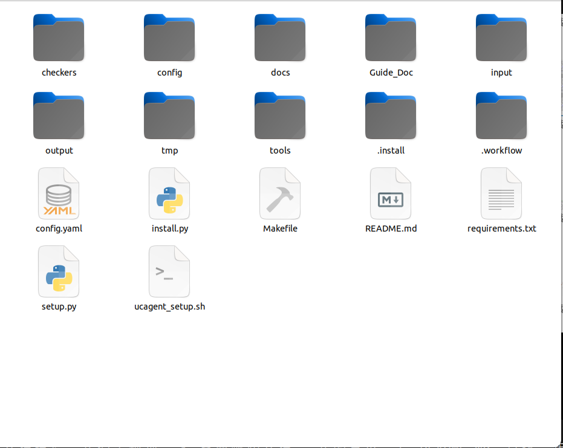

# 输出与工作区结构

业务根目录下的 `workspace/` 同时保存设计、最终工作流、评估、增量历史和 UCAgent 状态。各目录用途不同，清理和版本管理策略也不同。

## 主要目录

| 路径 | 内容 | 是否可手工修改 |
| --- | --- | --- |
| `input/` | 本次构建输入快照 | 通常不在运行中修改 |
| `wfgen/` | requirements、构建设计、示例 manifest、实现计划 | 由构建阶段写，控制台仅开放特定结构字段 |
| `Guide_Doc/` | 母工作流公共阶段指导副本 | 不作为业务产物修改 |
| `workflow/` | 最终生成的独立业务工作流 | 构建或受控增量部署修改 |
| `eval/` | 分项评估、审批、增量和部署报告 | 通过结构化工具或控制台修改 |
| `res/` | 用户专业知识和建议来源 | 用户维护 |
| `tmp/` | 临时文件、评估案例、增量候选和历史版本 | 可按规则清理 |
| `.ucagent/` | 当前 UCAgent 历史和运行状态 | 不应手工改写 |

## wfgen 关键文件

- `requirements_manifest.yaml`：规范化用户需求和交付物。
- `workflow_implementation_plan.md`：跨阶段设计、工具、Checker、文档及“问题与处理”。
- `input_example_manifest.yaml`：示例目标的文件映射和来源。
- `workflow_build.yaml`：中心 workflow spec、文件、工具、Checker、GuideDoc 和环境设计。

后续阶段必须读取并更新计划的本阶段标记区，不能覆盖前面内容。中心设计变化应同步 manifest 和最终产物，不能只改某一个文件。

## workflow 交付物

典型产物包含 `config.yaml`、`config/inc.yaml`、`tools/`、`checkers/`、`Guide_Doc/`、`docs/`、`input/example/`、`setup.py`、`requirements.txt`、`ucagent_setup.sh` 和 `Makefile`。

生成工作流中的 `output/` 是将来运行业务目标才产生的数据，不能在构建阶段用预制结果冒充实际运行。

## eval 和 tmp

`eval/` 保存需要长期阅读、审批和聚合的结构化记录。`tmp/` 保存可再生过程数据，但 `tmp/change_history/` 和当前有效的 `tmp/inc_runs/` 在版本管理完成前不能随意删除。清理命令必须保留被历史索引引用的文件。

浏览器验证产生的 profile、lock 和缓存都只能位于 `tmp/ui_validation/`。退出浏览器时 lock 可能瞬间消失，清理器应容忍这种竞态，不应把警告误判为业务失败。

## 文件权限

UCAgent 历史可能暂时改变快照权限，Makefile 负责恢复工作区可写状态。正式增量部署不依赖原文件本身可写，而使用备份和原子替换。用户仍应避免在流程运行时用其他编辑器同时修改相同文件。

## 公开与内部文件

生成工作流的公开文件面向最终用户，包括 README、docs、config、Makefile、setup、requirements、工具和业务 Checker。`.workflow/` 保存 spec、内部 Checker、测试和 acceptance；开发者可以检查，但不要求普通用户手工编辑。

`reference_files` 与 `output_files` 是阶段契约，必须列到具体文件。reference 在阶段开始前存在，output 由本阶段产生或更新。目录结构展示应放在文档或 manifest 中，不能用目录冒充文件引用。

## 关键 JSON 所有权

| 文件 | 写入者 | 用户动作 |
| --- | --- | --- |
| `eval/*_report.json` | 评估结构化工具 | 阅读、审批 finding |
| `eval/user_suggestions.json` | CLI/控制台 | 新建、撤回、删除 |
| `eval/approvals.json` | 审批 API | 批准、拒绝、暂缓 |
| `eval/incremental_report.json` | 增量工作流 | 阅读修复状态 |
| `eval/applied_changes.json` | 部署器 | 阅读和版本操作 |

手工编辑可能破坏 revision、fingerprint 和审计。普通 clean 必须保留 input、eval、res、当前 inc run 和 change history。检查产物时还要解析 YAML/JSON、import Python 和运行 Make 目标；完整文件树不等于内容有效。
