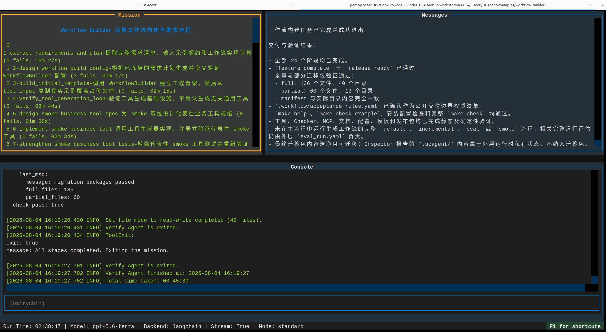
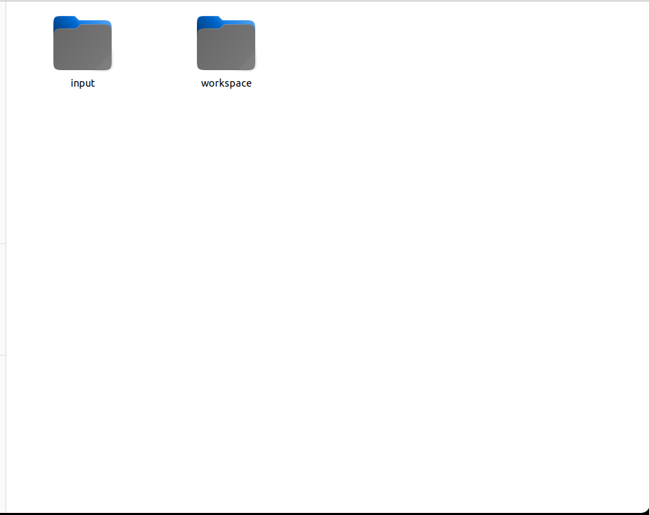

# Workflow Builder 文档中心

本目录是 Workflow Builder 的完整使用和维护文档入口。Workflow Builder 的职责不是直接完成某个业务，而是根据用户提供的需求文档和样例输入，生成一个可以独立运行、检查、评估和增量维护的 UCAgent 子工作流。阅读文档时必须区分两层对象：当前仓库中的“构建工作流”和最终生成到业务工作区中的“业务工作流”。二者都有 Makefile、配置文件和运行阶段，但工作目录、输入输出和修改边界不同。



## 文档分区

| 分区 | 面向读者 | 主要内容 |
| --- | --- | --- |
| [QuickStart](01_quickstart/00_快速启动总述.md) | 第一次运行的用户 | 用一个 DOCX 工作流案例完成生成、评估、增量修复和控制台审批 |
| [Usage](02_usage/00_完整使用总述.md) | 日常使用者和项目负责人 | 输入输出契约、完整命令、审批、版本管理和协作提示词 |
| [Develop](03_develop/00_开发者文档总述.md) | 对 Workflow Builder 母工作流进行二次开发的用户 | 24 阶段、全部 Tool/Checker/GuideDoc、评估增量、控制台、回归测试和生成产物二次开发 |
| [Q&A_Experience](04_q_and_experience/00_QA与经验总述.md) | 排障和长期维护人员 | 真实运行中出现过的问题、确认方法、修复手段和设计经验 |
| `resource/` | 文档维护者 | 工作区、TUI、评估、增量和控制台截图 |

## 推荐阅读路线

第一次使用时，先读[快速启动总述](01_quickstart/00_快速启动总述.md)，完成环境配置后依次执行 run、评估、审批和增量流程。需要长期运行新业务时，再阅读[完整使用总述](02_usage/00_完整使用总述.md)及输入输出契约。准备修改生成器、工具协议或 Checker 时，从[开发者文档总述](03_develop/00_开发者文档总述.md)进入，不应仅根据某次生成产物反推母工作流规则。

当流程连续失败、长时间没有产物变化或出现上下文反复压缩时，先在[Q&A 与经验](04_q_and_experience/00_QA与经验总述.md)中按现象定位，再决定是继续监督、接管当前阶段，还是修改 Workflow Builder。不要因为一个业务产物有错误就直接修改 UCAgent 核心源码。

## 三类工作流

1. **构建工作流**：读取 `<业务根目录>/input/guide.md` 和 `test_input/`，在 `<业务根目录>/workspace/workflow/` 生成业务工作流。入口为 `make WS=... run`。
2. **评估工作流**：分别审查工具、Checker、流程配置、环境设施，并可选择执行昂贵的运行评估。报告写入工作区的 `eval/`，不会直接修改 `workflow/`。
3. **增量工作流**：读取已审批问题和用户建议，建立本次候选目录，实施修复、运行确定性检查、部署并保存旧版本。入口为 `make WS=... run_inc`。

评估与审批、构建设计、增量报告和历史版本可以通过“工作流构建与评估控制台”查看和管理。控制台只绑定本机地址，默认端口为 `8765`。

## 目录层级术语

本文档使用以下固定术语：

- **Workflow Builder 目录**：本 README 的上级目录，即 `examples/workflow_builder/`。
- **业务根目录**：例如 `~/FDocB/UCAgent_t/workspace_docx/`，包含 `input/` 和 `workspace/`。
- **构建工作区**：业务根目录下的 `workspace/`，是运行 UCAgent 构建、评估和增量流程的位置。
- **生成工作流根目录**：构建工作区下的 `workflow/`，是最终交付给业务用户的独立工作流。
- **业务运行目标**：生成工作流中的 `input/<TARGET>/`，不能与构建工作区的 `input/` 混淆。



## 环境入口

首次使用可以运行：

```bash
cd ~/FDocB/UCAgent/examples/workflow_builder
python setup.py
make configure-check
```

配置保存在 `.workflow_builder/local.mk`，仅属于当前机器并被 Git 忽略。命令行参数仍可覆盖默认值：

```bash
make WS=~/FDocB/UCAgent_t/workspace_docx/workspace run
```

代理凭据、模型 Token 等秘密不得写入该配置文件，应通过当前 shell 或可信的秘密管理系统注入。

## 文档维护规则

- 命令必须与当前 Makefile 目标一致，不能记录已经删除的目标。
- 路径示例必须说明它相对于哪个目录，避免只写含义不明的 `workspace/`。
- 截图必须包含替代文字和上下文说明，正文不能只依赖图片传递关键步骤。
- Q&A 必须区分“已由日志确认的原因”和“尚待验证的可能原因”。
- 工具和 Checker 文档必须引用真实源码入口并解释核心业务逻辑，不能只罗列类名。
- 修改工作流契约后，应同步检查 QuickStart、Usage、Develop 和 Q&A 是否需要更新。
