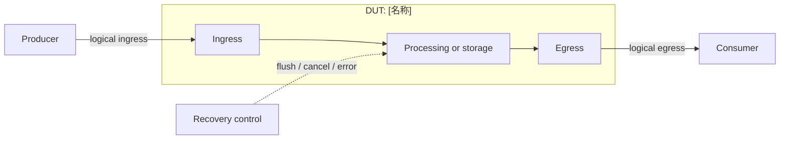

# [DUT] 设计与功能检测点文档

<!-- MAINTAINER: 这是正式输出的唯一结构契约。HTML 注释只属于模板和生成约束，生成的设计文档必须删除这些注释；工具审计 marker（metadata 和 related-source）可由工具保留。 -->
> 模板结构版本：v5.1.0
>
> 正式输出顺序固定为：文档摘要、设计概览、功能行为、验证策略与 Testplan、形式化属性契约、Sign-off 与开放项、附录 A 至附录 E。正文只使用逻辑接口名；完整端口、源码路径、参数、证据和版本变更放在附录。无法证实的内容写入 `OPEN-*`。

## 文档摘要

<!-- GENERATOR: 删除本模板注释、方括号占位符和生成过程说明。摘要只给结论，不能替代正文或附录。 -->

**模块职责**

[说明 DUT 在系统中的位置、完成的核心变换和明确边界。]

**输入与生产者**

- `[逻辑接口]`：由[生产者]提供，用于[目的]。
- `[控制接口]`：由[控制模块]提供，用于[目的]。

**输出与消费者**

- `[逻辑接口]`：由[消费者]接收，用于[目的]。
- `[状态或完成]`：由[观察者]消费，用于[目的]。

**关键概念**

- **[概念]**：[可由证据支持的一句话定义。]
- **[结构]**：[可由证据支持的一句话定义。]

**关键延迟与容量**

- 典型时延：[固定、组合或可变时延及来源。]
- 吞吐与容量：[每周期带宽、entry、最大在途事务。]

**验证范围**

[列出本次覆盖的功能、边界、恢复路径和明确未覆盖内容。]

**开放项**

[列出阻塞理解或签核的 `OPEN-*`；没有时写“无”。]

## 设计概览

### 职责与边界

[先说明 DUT 的职责、输入输出边界和不负责的工作。正文使用逻辑接口名，并引用行为或证据 ID；不要写完整 RTL 端口、Scala 路径或无法证实的设计意图。]

### 事务模型

<!-- CONDITIONAL: 五阶段必须回答产生、接受、处理、完成和取消/恢复。存在 ready/valid 时必须写接受条件、backpressure 和 payload 保持。 -->

1. **产生**：[生产者何时准备事务及其有效条件。]
2. **接受**：[DUT 何时接受；ready/valid 的同时条件；未接受时 payload 如何保持。]
3. **处理**：[数据和控制经过的功能阶段。]
4. **完成**：[消费者如何确认结果、状态或错误。]
5. **取消与恢复**：[flush、replay、cancel、error 或 reset 对存活事务和取消事务的影响及优先级。]

### 数据与控制通路

<!-- GENERATOR: 逻辑接口名在此唯一完整定义；附录 A 负责精确 I/O 映射。 -->

| 逻辑接口 | 生产者 / 消费者 | 方向 | 事务阶段 | 有效与背压约束 |
| --- | --- | --- | --- | --- |
| `[ingress]` | [生产者] / DUT | 输入 | [产生/接受] | [valid/ready、payload 保持或 N/A] |
| `[egress]` | DUT / [消费者] | 输出 | [完成] | [ready/valid、结果保持或 N/A] |
| `[recovery]` | [控制模块] / DUT | 控制 | [取消/恢复] | [优先级和存活事务规则] |

[沿着逻辑接口说明正常数据路径、控制路径、错误路径和被取消事务的去向。]

### 关键资源与冲突

<!-- GENERATOR: 记录真正影响事务容量、顺序、仲裁或恢复的资源；组合直连模块明确写不适用并给出证据。 -->

| 资源 | 类型 / 容量 | 写入 / 产生 | 读取 / 消费 | 冲突 / 优先级 | 观测点 |
| --- | --- | --- | --- | --- | --- |
| `[resource]` | `[Queue/SRAM/entry/none]` | `[condition]` | `[condition]` | `[conflict and priority]` | `[logical interface or state]` |

### 时序与状态

[描述组合路径、时序寄存器、状态转换、reset 释放后的起点和同周期事件优先级。DUT 没有显式状态机时明确写不适用，不能虚构状态。]

## 功能行为

<!-- STRUCTURE: repeat min=1 -->
<!-- GENERATOR: 每个 P-* 是一个独立行为。必须写激励条件、处理过程、输出或状态结果、时延/顺序、边界和 disabled 无副作用；删除以下注释和示例占位符。 -->

### P-[NAME]：[行为名称]

[说明行为目的和在数据通路中的位置。]

**激励条件**：[输入有效条件、资源条件、控制条件和前置状态。]

**处理过程**：[按时序或优先级描述处理步骤。]

**输出与状态结果**：[输出、状态、资源和消费者可观察结果。]

**时延与顺序**：[组合/固定/可变时延、顺序保持、backpressure 行为。]

**边界与恢复**：[满/空、同周期竞争、flush/replay/cancel/error、存活事务、取消事务和优先级。]

**配置裁剪**：[disabled 特性无副作用；只写源码或生成 RTL 能证明的内容。]

**证据**：[E-*]。完整位置见附录 C。

## 验证策略与 Testplan

### 验证策略

[按 P0/P1/P2 风险说明使用 assertion、scoreboard、reference model、simulation、formal 或 coverage 的原因。不要在这里重新定义功能行为。]

**优先级原则**

- `P0`：[数据、顺序、死锁或恢复失败风险。]
- `P1`：[边界、竞争、配置或性能风险。]
- `P2`：[可观测性和非关键覆盖风险。]

### 验证架构与采样点

<!-- GENERATOR: 描述验证组件的职责和可复核工件，不把验证环境实现细节写成 DUT 设计事实。 -->

| 组件 | 责任 | 输入 / 输出 | 采样点或工件 |
| --- | --- | --- | --- |
| `stimulus` | [产生合法和边界事务] | [逻辑接口] | [输入采样条件] |
| `monitor` | [采集接受、完成、取消事件] | [逻辑接口 / 状态] | [事件或 transaction] |
| `checker` | [比较结果、顺序和错误] | [monitor / reference] | [检查工件] |
| `formal harness` | [定义时钟、复位、约束和观察范围] | [DUT / assumptions] | [属性编译或证明工件] |

### 功能分组

`<FG-API>`

- FC-INPUT-CONTRACT：[接口和协议风险。]

`<FG-CORE>`

- FC-BEHAVIOR：[核心行为风险。]

`<FG-RECOVERY>`

- FC-RECOVERY：[取消、错误和恢复风险。]

### Testplan

<!-- GENERATOR: 每行一个 CK；激励条件、观察结果和关闭条件必须可判定，并引用正文 P-*。 -->

| 优先级 | FC | CK | Style | 关联行为 | 检查机制 | 激励 / 前置条件 | 可观察结果 | Coverage / 场景 | 关闭标准 |
| --- | --- | --- | --- | --- | --- | --- | --- | --- | --- |
| P0 | `FC-INPUT-CONTRACT` | `CK-API-INPUT` | Assume | `P-[NAME]` | Assertion | [合法协议条件] | [逻辑接口观察] | `COV-NORMAL` / `CASE-NORMAL` | [可判定条件] |
| P0 | `FC-BEHAVIOR` | `CK-EVENT-RESULT` | Seq | `P-[NAME]` | Scoreboard | [事务激励] | [结果和顺序] | `COV-NORMAL` / `CASE-NORMAL` | [可判定条件] |
| P1 | `FC-RECOVERY` | `CK-RECOVERY` | Seq | `P-[NAME]` | Assertion + scoreboard | [flush/replay/cancel/error] | [存活/取消事务结果] | `COV-RECOVERY` / `CASE-RECOVERY` | [可判定条件] |

### Coverage Summary

| Coverage ID | 目标行为 | 观察事件 | 重要取值 / 分箱 | 依赖 / 交叉 | 非法 / 忽略条件 | 有效性保护 | 关闭标准 | 状态 |
| --- | --- | --- | --- | --- | --- | --- | --- | --- |
| `COV-NORMAL` | [正常事务] | [完成且通过检查的事件] | [代表值] | [功能交叉] | [忽略条件] | [checker/scoreboard 通过] | [命中要求] | Planned |
| `COV-BOUNDARY` | [边界和背压] | [边界完成事件] | [满/空/最大并发] | [边界交叉] | [忽略条件] | [结果有效] | [命中要求] | Planned |
| `COV-RECOVERY` | [恢复和错误] | [恢复完成事件] | [flush/replay/error] | [恢复类型 x 起始状态] | [非法激励] | [恢复检查通过] | [命中要求] | Planned |

## 形式化属性契约

<!-- GENERATOR: 公式可写为伪代码，但必须绑定逻辑接口和 P-/CK-ID；未编译、未证明或未覆盖不得声称通过。 -->

### 契约边界与执行条件

| 项目 | 约束或定义 | 依据 / 状态 |
| --- | --- | --- |
| 时钟与复位 | [时钟、复位极性、释放条件] | [E-* / OPEN-*] |
| X 态与未知值 | [采样、屏蔽或禁止规则] | [E-* / OPEN-*] |
| 公平性与等待界限 | [仲裁、公平性或最大等待周期] | [参数 / OPEN-*] |
| Harness 边界 | [绑定层级、假设输入、观察输出] | [路径 / OPEN-*] |

### 属性实现状态

| CK | 类型 | 契约 | 当前实现 | 属性状态 | 签核状态 |
| --- | --- | --- | --- | --- | --- |
| `CK-API-INPUT` | Assume | [协议和输入稳定] | [待实现/位置] | Planned | OPEN |
| `CK-EVENT-RESULT` | Assert | [结果和顺序] | [待实现/位置] | Planned | OPEN |
| `CK-RECOVERY` | Assert | [取消与恢复隔离] | [待实现/位置] | Planned | OPEN |
| `CK-COVER-BOUNDARY` | Cover | [边界路径可达] | [待实现/位置] | Planned | OPEN |

### Assume

[写时钟、复位、历史有效条件和输入假设；不约束 DUT 输出正确性。]

### Assert

[写每个 Assert 的触发、结果、存活事务、取消事务、顺序和同周期优先级。]

### Cover

[写每个 Cover 的有效采样事件、分箱、交叉和关闭工件。]

## Sign-off 与开放项

### 开放项

| ID | 缺口或问题 | 影响 | 关闭动作与所需证据 | 状态 |
| --- | --- | --- | --- | --- |
| `OPEN-[TYPE]-[N]` | [缺失证据、冲突或疑似缺陷] | [I/O、行为或验证] | [具体动作和工件] | Open |

### 签核状态

| 项目 | 状态 | 依据 |
| --- | --- | --- |
| I/O mapping | [Pass / Blocked] | [Appendix A / E-* / OPEN-*] |
| Testplan | [Pass / Review] | [FC / CK 追溯] |
| Formal / assertion | [Pass / Unrun / Blocked] | [编译、证明或 OPEN-*] |
| Regression / coverage | [Pass / Unrun / Blocked] | [测试或覆盖工件] |
| 当前文档状态 | [Draft / Review / Frozen] | [质量报告或 OPEN-*] |

## 附录 A：I/O 定义与接口约束

<!-- GENERATOR: 这是完整扁平 RTL 端口和协议的唯一位置。Generated 必须存在于 ports.csv；Elided 必须有源码和配置依据。 -->

| IO-ID | 正文逻辑接口 | Bundle / Chisel 字段 | 定义位置 | 方向 / 位宽 | 配置状态 | 精确 Verilog I/O | 协议 / 对端 | 证据 |
| --- | --- | --- | --- | --- | --- | --- | --- | --- |
| `IO-INPUT-01` | `[ingress]` | `[Bundle.field]` | `[path:line]` | `[I/O,width]` | Generated / Elided | `[exact port or Elided]` | `[ready/valid or N/A]` | `[E-*]` |
| `IO-OUTPUT-01` | `[egress]` | `[Bundle.field]` | `[path:line]` | `[I/O,width]` | Generated / Elided | `[exact port or Elided]` | `[ready/valid or N/A]` | `[E-*]` |

[补充完整扁平端口清单、索引范围、ready/valid 接受条件、backpressure 和 payload 保持约束。]

## 附录 B：参数、编码、状态与复位

### 参数与配置

| 参数 ID | 参数 / 派生常量 | 配置值 | 约束或裁剪 | 证据 |
| --- | --- | --- | --- | --- |
| `PARAM-01` | `[name]` | `[value]` | `[range / disabled 无副作用]` | `[E-*]` |

### 编码、状态与复位

| 状态/编码 ID | 名称或编码 | 进入条件 | 退出条件 | reset 值 / 复位行为 | 证据 |
| --- | --- | --- | --- | --- | --- |
| `STATE-01` | `[state or encoding]` | `[condition]` | `[condition]` | `[reset behavior]` | `[E-*]` |

[没有显式状态或编码时写不适用，并给出证据；不能把功能抽象图当作 RTL 状态编码。]

## 附录 C：范围、文档控制、证据与版本变更

### 范围与文档控制

| 项目 | 内容 |
| --- | --- |
| 使用模板版本 | v5.1.0 |
| DUT / Chisel 顶层 | `[name]` |
| Elaborated Verilog 顶层 | `[module]` |
| 文档状态 | Draft / Review / Frozen |
| XiangShan RTL 基线 | `[full commit]` |
| 适用配置 | `[config]` |
| RTL 生成状态 | `[success / partial / failed]` |
| RTL 证据 | `[manifest path, hash, port count]` |
| Mermaid 图形源码 | `[Markdown code fence count]` |
| 生成日期 | `[YYYY-MM-DD]` |

| 范围或条件 | 裁定 | 理由 / 证据 |
| --- | --- | --- |
| DUT 边界 | `[included / excluded]` | `[reason]` |
| 相关模块源码（支撑正文的） | `[document-cited modules or none]` | `[E-REL-* / none]` |
| 未覆盖验证 | `[items]` | `[OPEN-*]` |
| 特性门控 | `[applied / not applicable]` | `[reason]` |

### 证据与版本变更

<!-- GENERATOR: 每个 E-ID 唯一且可定位。相关模块只能列出实际读取并通过 related_sources 记录的源码。 -->

| Evidence ID | 类型 | 来源位置 | Commit / 配置 | 支持内容 |
| --- | --- | --- | --- | --- |
| `E-RTL-01` | RTL/ports | `[evidence path:line]` | `[commit/config]` | `[fact]` |
| `E-REL-MODULE` | Related Scala | `[source path:line]` | `[commit/config]` | `[fact]` |

| 版本变更 ID | 变更类型 | 本次变更 | 影响范围 | 依据 |
| --- | --- | --- | --- | --- |
| `CHANGE-01` | Initial / Patch / Review | `[document change]` | `[sections]` | `[E-* / OPEN-*]` |

## 附录 D：CK 追溯矩阵

### 功能组与 FC

| FC | 所属 FG | 验证目标 | 关联行为 | Testplan 行 |
| --- | --- | --- | --- | --- |
| `FC-INPUT-CONTRACT` | `FG-API` | [目标] | `P-[NAME]` | [row] |
| `FC-BEHAVIOR` | `FG-CORE` | [目标] | `P-[NAME]` | [row] |
| `FC-RECOVERY` | `FG-RECOVERY` | [目标] | `P-[NAME]` | [row] |

### CK 追溯

| CK | FC | 检查目标 | Style | 属性状态 | Test Case | Coverage | 签核状态 |
| --- | --- | --- | --- | --- | --- | --- | --- |
| `CK-API-INPUT` | `FC-INPUT-CONTRACT` | [目标] | Assume | Planned | `CASE-NORMAL` | `COV-NORMAL` | OPEN |
| `CK-EVENT-RESULT` | `FC-BEHAVIOR` | [目标] | Assert/Seq | Planned | `CASE-NORMAL` | `COV-NORMAL` | OPEN |
| `CK-RECOVERY` | `FC-RECOVERY` | [目标] | Assert/Seq | Planned | `CASE-RECOVERY` | `COV-RECOVERY` | OPEN |
| `CK-COVER-BOUNDARY` | `FC-RECOVERY` | [目标] | Cover | Planned | `CASE-BOUNDARY` | `COV-BOUNDARY` | OPEN |

## 附录 E：场景视角 Test Case

<!-- GENERATOR: 场景只描述参与者动作、前置条件、阶段结果和验收标准；功能算法只引用正文 P-*，不在这里重新定义。CASE-NORMAL、CASE-BOUNDARY 和 CASE-RECOVERY 按 DUT 实际能力和本次覆盖范围选择，不适用时删除对应段并在范围或开放项中说明。 -->

<!-- STRUCTURE: repeat min=0 -->

### CASE-NORMAL：[正常场景]

| 参与者 | 前置条件 | 输入 | 预期输出 | 关联 FC / CK |
| --- | --- | --- | --- | --- |
| [生产者、DUT、消费者] | [初始状态、配置和资源] | [逻辑接口 / transaction] | [输出或状态] | [`FC-*`, `CK-*`] |

**参与者与前置条件**：[生产者、DUT、消费者和初始状态。]

1. [产生合法输入。]
2. [完成接受和处理。]
3. [观察输出或状态结果。]

**验收标准**：[引用 `P-*`、`CK-*` 和 `COV-*` 的可判定结果。]

<!-- STRUCTURE: repeat min=0 -->

### CASE-BOUNDARY：[资源边界场景]

| 参与者 | 前置条件 | 输入 | 预期输出 | 关联 FC / CK |
| --- | --- | --- | --- | --- |
| [生产者、DUT、消费者] | [满/空、背压、最大并发或竞争] | [边界 transaction] | [保持、优先级和结果] | [`FC-*`, `CK-*`] |

**参与者与前置条件**：[满/空、backpressure、最大并发或同周期竞争。]

1. [施加边界条件。]
2. [观察保持、优先级和结果。]

**验收标准**：[引用 `P-*`、`CK-*` 和 `COV-BOUNDARY`。]

<!-- STRUCTURE: repeat min=0 -->

### CASE-RECOVERY：[异常或恢复场景]

| 参与者 | 前置条件 | 输入 | 预期输出 | 关联 FC / CK |
| --- | --- | --- | --- | --- |
| [生产者、DUT、消费者] | [flush、replay、cancel、error 或不适用] | [恢复 transaction] | [存活/取消事务和恢复结果] | [`FC-*`, `CK-*`] |

**参与者与前置条件**：[flush、replay、cancel、error 或说明不适用。]

1. [施加恢复事件。]
2. [区分存活事务和取消事务。]
3. [观察恢复后的新事务。]

**验收标准**：[引用 `P-*`、`CK-*` 和 `COV-RECOVERY`。]

<!-- STRUCTURE: repeat min=0 -->

### CASE-[NAME]：[其他场景]

| 参与者 | 前置条件 | 输入 | 预期输出 | 关联 FC / CK |
| --- | --- | --- | --- | --- |
| [生产者、DUT、消费者] | [场景前置条件] | [逻辑接口 / transaction] | [可观察结果] | [`FC-*`, `CK-*`] |

[补充场景的前置条件、动作、结果和验收标准。]
