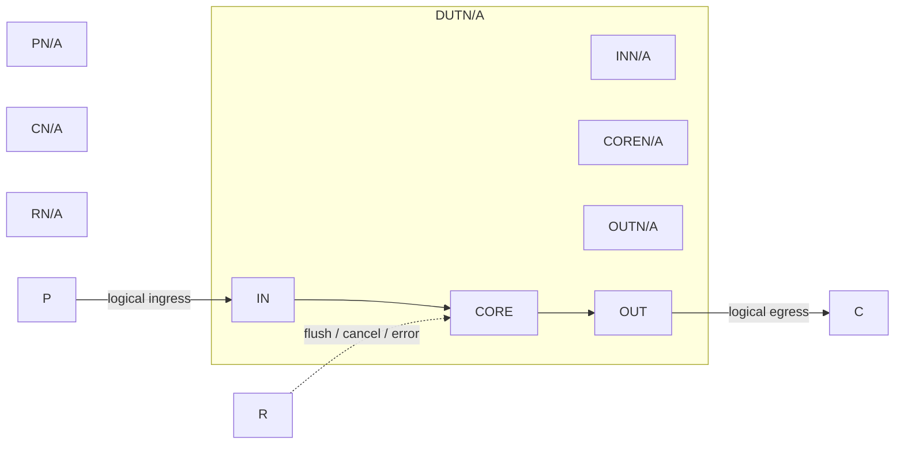

# Sbuffer 设计与功能检测点文档

> 模板结构版本：v5.1.0
>
> 正式输出顺序固定为：文档摘要、设计概览、功能行为、验证策略与 Testplan、形式化属性契约、Sign-off 与开放项、附录 A 至附录 E。正文只使用逻辑接口名；完整端口、源码路径、参数、证据和版本变更放在附录。无法证实的内容写入 `OPEN-*`。

## 文档摘要

**模块职责**

Sbuffer 将输入数据组合转发到结果端口，不包含状态、握手或恢复事务。

**输入与生产者**

- `input.data`：由测试激励提供，用于传递数据。
- `control.reset`：由测试控制提供，用于传递数据。

**输出与消费者**

- `input.data`：由检查器接收，用于传递数据。
- `output.done`：由N/A消费，用于传递数据。

**关键概念**

- **组合转发**：输入值直接连接到输出值。
- **直连路径**：输入值直接连接到输出值。

**关键延迟与容量**

- 典型时延：组合路径，零拍。
- 吞吐与容量：每周期一项，无在途事务。

**验证范围**

覆盖组合转发、全零/全一边界；未执行形式化和覆盖率工具。

**开放项**

OPEN-FORMAL-01：未运行形式化工具。

## 设计概览

### 职责与边界

DUT 只负责组合转发；输入和输出均为逻辑数据接口，边界外的复位、时钟和验证环境不参与该路径。P-FORWARD、E-RTL-01。

### 事务模型

1. **产生**：测试激励稳定 input.data。
2. **接受**：模块无 ready/valid，输入值改变即进入组合路径。
3. **处理**：input.data 直接经过组合连接。
4. **完成**：检查器采样 output.data。
5. **取消与恢复**：无 flush、replay、cancel、error 或状态资源，故无存活或取消事务。

### 数据与控制通路

| 逻辑接口 | 生产者 / 消费者 | 方向 | 事务阶段 | 有效与背压约束 |
| --- | --- | --- | --- | --- |
| `input.data` | 测试激励 / DUT | 输入 | 连续观察 | 无握手；组合值稳定 |
| `output.data` | DUT / 检查器 | 输出 | 组合输出 | 无握手；组合值稳定 |
| `control.reset` | 测试控制 / DUT | 控制 | 不适用 | 无状态 |

input.data 通过组合路径到达 output.data；没有控制、错误或取消路径。P-FORWARD。

### 关键资源与冲突

| 资源 | 类型 / 容量 | 写入 / 产生 | 读取 / 消费 | 冲突 / 优先级 | 观测点 |
| --- | --- | --- | --- | --- | --- |
| 无 | `none` | 不适用 | 不适用 | 不适用 | `input.data` / `output.data` |

### 时序与状态

组合路径无寄存器和显式状态机；复位与时钟未参与数据路径，状态机不适用。E-RTL-01。

## 功能行为

### P-FORWARD：组合转发

N/A

**激励条件**：N/A

**处理过程**：N/A

**输出与状态结果**：N/A

**时延与顺序**：N/A

**边界与恢复**：N/A

**配置裁剪**：N/A

**证据**：E-RTL-01。完整位置见附录 C。

## 验证策略与 Testplan

### 验证策略

N/A

**优先级原则**

- `P0`：N/A
- `P1`：N/A
- `P2`：N/A

### 验证架构与采样点

| 组件 | 责任 | 输入 / 输出 | 采样点或工件 |
| --- | --- | --- | --- |
| `stimulus` | 产生合法和边界值 | `input.data` | 输入值 |
| `monitor` | 采集组合输出 | `output.data` | 输出值 |
| `checker` | 比较输入和输出 | 输入 / 输出 | 等值检查 |
| `formal harness` | 不适用 | N/A | 未执行 |

### 功能分组

`<FG-API>`

- FC-INPUT-CONTRACT：N/A

`<FG-CORE>`

- FC-BEHAVIOR：N/A

`<FG-RECOVERY>`

- FC-RECOVERY：N/A

### Testplan

| 优先级 | FC | CK | Style | 关联行为 | 检查机制 | 激励 / 前置条件 | 可观察结果 | Coverage / 场景 | 关闭标准 |
| --- | --- | --- | --- | --- | --- | --- | --- | --- | --- |
| P0 | `FC-INPUT-CONTRACT` | `CK-API-INPUT` | Assume | `P-FORWARD` | Assertion | 输入为已知 8 位值 | output.data | `COV-NORMAL` / `CASE-NORMAL` | 测试通过 |
| P0 | `FC-BEHAVIOR` | `CK-EVENT-RESULT` | Seq | `P-FORWARD` | Scoreboard | 输入变化 | 输出等于输入 | `COV-NORMAL` / `CASE-NORMAL` | 测试通过 |
| P1 | `FC-RECOVERY` | `CK-RECOVERY` | Seq | `P-FORWARD` | Assertion + scoreboard | 无恢复事件 | 无取消事务 | `COV-RECOVERY` / `CASE-RECOVERY` | 测试通过 |

### Coverage Summary

| Coverage ID | 目标行为 | 观察事件 | 重要取值 / 分箱 | 依赖 / 交叉 | 非法 / 忽略条件 | 有效性保护 | 关闭标准 | 状态 |
| --- | --- | --- | --- | --- | --- | --- | --- | --- |
| `COV-NORMAL` | 正常组合路径 | N/A | 0x00、0xff | 输入取值 | 无效输入不采样 | 等值检查通过 | 覆盖两个边界值 | Planned |
| `COV-BOUNDARY` | 全零/全一边界 | N/A | 0x00、0xff | 输入 x 输出 | 无效输入不采样 | 等值检查通过 | 覆盖两个边界值 | Planned |
| `COV-RECOVERY` | 恢复不适用 | 不适用 | 不适用 | 不适用 | 恢复激励忽略 | 不适用 | 覆盖两个边界值 | Planned |

## 形式化属性契约

### 契约边界与执行条件

| 项目 | 约束或定义 | 依据 / 状态 |
| --- | --- | --- |
| 时钟与复位 | 无时钟；复位不参与数据路径 | `E-RTL-01` |
| X 态与未知值 | 仅采样已知输入 | `OPEN-FORMAL-01` |
| 公平性与等待界限 | 不适用，无仲裁 | `E-RTL-01` |
| Harness 边界 | 组合输入到输出 | `E-RTL-01` |

### 属性实现状态

| CK | 类型 | 契约 | 当前实现 | 属性状态 | 签核状态 |
| --- | --- | --- | --- | --- | --- |
| `CK-API-INPUT` | Assume | 输入为已知值 | 未实现 | Planned | OPEN |
| `CK-EVENT-RESULT` | Assert | 输出等于输入 | 未实现 | Planned | OPEN |
| `CK-RECOVERY` | Assert | 无取消事务 | 未实现 | Planned | OPEN |
| `CK-COVER-BOUNDARY` | Cover | 边界值可达 | 未实现 | Planned | OPEN |

### Assume

N/A

### Assert

N/A

### Cover

N/A

## Sign-off 与开放项

### 开放项

| ID | 缺口或问题 | 影响 | 关闭动作与所需证据 | 状态 |
| --- | --- | --- | --- | --- |
| `OPEN-FORMAL-01` | 未运行形式化工具 | Formal / assertion | 编译并运行属性，保存工件 | Open |

### 签核状态

| 项目 | 状态 | 依据 |
| --- | --- | --- |
| I/O mapping | Pass | `E-RTL-01` |
| Testplan | Review | `FC-BEHAVIOR` |
| Formal / assertion | Unrun | `OPEN-FORMAL-01` |
| Regression / coverage | Unrun | `OPEN-FORMAL-01` |
| 当前文档状态 | Draft | `OPEN-FORMAL-01` |

## 附录 A：I/O 定义与接口约束

| IO-ID | 正文逻辑接口 | Bundle / Chisel 字段 | 定义位置 | 方向 / 位宽 | 配置状态 | 精确 Verilog I/O | 协议 / 对端 | 证据 |
| --- | --- | --- | --- | --- | --- | --- | --- | --- |
| `IO-INPUT-01` | `input.data` | `N/A` | `evidence/Sbuffer/Sbuffer.sv:1` | `I/8` | Generated | `io_data` | `N/A` | `E-RTL-01` |
| `IO-OUTPUT-01` | `output.data` | `N/A` | `evidence/Sbuffer/Sbuffer.sv:1` | `O/8` | Generated | `io_result` | `N/A` | `E-RTL-01` |

N/A

## 附录 B：参数、编码、状态与复位

### 参数与配置

| 参数 ID | 参数 / 派生常量 | 配置值 | 约束或裁剪 | 证据 |
| --- | --- | --- | --- | --- |
| `PARAM-01` | `Sbuffer` | `8` | `无参数` | `E-RTL-01` |

### 编码、状态与复位

| 状态/编码 ID | 名称或编码 | 进入条件 | 退出条件 | reset 值 / 复位行为 | 证据 |
| --- | --- | --- | --- | --- | --- |
| `STATE-01` | `无状态` | `输入有效` | `输入有效` | `未使用` | `E-RTL-01` |

N/A

## 附录 C：范围、文档控制、证据与版本变更

### 范围与文档控制

| 项目 | 内容 |
| --- | --- |
| 使用模板版本 | v5.1.0 |
| DUT / Chisel 顶层 | `Sbuffer` |
| Elaborated Verilog 顶层 | `Sbuffer` |
| 文档状态 | Draft / Review / Frozen |
| XiangShan RTL 基线 | `fixture-commit` |
| 适用配置 | `DefaultConfig` |
| RTL 生成状态 | `success` |
| RTL 证据 | `evidence/Sbuffer/manifest.json；4 ports` |
| Mermaid 图形源码 | `1` |
| 生成日期 | `2026-09-23` |

| 范围或条件 | 裁定 | 理由 / 证据 |
| --- | --- | --- |
| DUT 边界 | `Sbuffer 组合路径` | `无内部状态` |
| 相关模块源码 | `无` | `无相关源码` |
| 未覆盖验证 | `形式化和覆盖率` | `N/A` |
| 特性门控 | `not applicable` | `无内部状态` |

### 证据与版本变更

| Evidence ID | 类型 | 来源位置 | Commit / 配置 | 支持内容 |
| --- | --- | --- | --- | --- |
| `E-RTL-01` | RTL/ports | `evidence/Sbuffer/Sbuffer.sv:1` | `fixture/DefaultConfig` | `组合转发` |

| 版本变更 ID | 变更类型 | 本次变更 | 影响范围 | 依据 |
| --- | --- | --- | --- | --- |
| `CHANGE-01` | Initial / Patch / Review | `初始文档` | `全部章节` | `E-RTL-01 / OPEN-FORMAL-01` |

## 附录 D：CK 追溯矩阵

### 功能组与 FC

| FC | 所属 FG | 验证目标 | 关联行为 | Testplan 行 |
| --- | --- | --- | --- | --- |
| `FC-INPUT-CONTRACT` | `FG-API` | 数据一致 | `P-FORWARD` | 1 |
| `FC-BEHAVIOR` | `FG-CORE` | 数据一致 | `P-FORWARD` | 1 |
| `FC-RECOVERY` | `FG-RECOVERY` | 数据一致 | `P-FORWARD` | 1 |

### CK 追溯

| CK | FC | 检查目标 | Style | 属性状态 | Test Case | Coverage | 签核状态 |
| --- | --- | --- | --- | --- | --- | --- | --- |
| `CK-API-INPUT` | `FC-INPUT-CONTRACT` | 数据一致 | Assume | Planned | `CASE-NORMAL` | `COV-NORMAL` | OPEN |
| `CK-EVENT-RESULT` | `FC-BEHAVIOR` | 数据一致 | Assert/Seq | Planned | `CASE-NORMAL` | `COV-NORMAL` | OPEN |
| `CK-RECOVERY` | `FC-RECOVERY` | 数据一致 | Assert/Seq | Planned | `CASE-RECOVERY` | `COV-RECOVERY` | OPEN |
| `CK-COVER-BOUNDARY` | `FC-RECOVERY` | 数据一致 | Cover | Planned | `CASE-BOUNDARY` | `COV-BOUNDARY` | OPEN |

## 附录 E：场景视角 Test Case

### CASE-NORMAL：转发数据

| 参与者 | 前置条件 | 输入 | 预期输出 | 关联 FC / CK |
| --- | --- | --- | --- | --- |
| 生产者、DUT、检查器 | 组合路径稳定 | `input.data` | `output.data` 等于输入 | `FC-BEHAVIOR`, `CK-EVENT-RESULT` |

**参与者与前置条件**：N/A

1. 产生合法 input.data。
2. 组合路径稳定。
3. 观察 output.data。

**验收标准**：output.data 等于 input.data；引用 P-FORWARD、CK-EVENT-RESULT、COV-NORMAL。

### CASE-BOUNDARY：取值边界

| 参与者 | 前置条件 | 输入 | 预期输出 | 关联 FC / CK |
| --- | --- | --- | --- | --- |
| 生产者、DUT、检查器 | 输入可取全零和全一 | `0x00`, `0xff` | 输出保持等值 | `FC-BEHAVIOR`, `CK-COVER-BOUNDARY` |

**参与者与前置条件**：输入取全零和全一。

1. 施加边界值。
2. 观察输出一致。

**验收标准**：输出与输入一致；引用 P-FORWARD、CK-COVER-BOUNDARY、COV-BOUNDARY。

### CASE-RECOVERY：恢复适用性

| 参与者 | 前置条件 | 输入 | 预期输出 | 关联 FC / CK |
| --- | --- | --- | --- | --- |
| 生产者、DUT、检查器 | 无恢复资源 | 无恢复 transaction | 无存活或取消事务 | `FC-RECOVERY`, `CK-RECOVERY` |

**参与者与前置条件**：该组合模块没有恢复资源，恢复场景不适用。

1. 不施加恢复事件。
2. 不存在存活或取消事务。
3. 不适用。

**验收标准**：不适用；引用 E-RTL-01。

### CASE-EXTRA：其他场景

| 参与者 | 前置条件 | 输入 | 预期输出 | 关联 FC / CK |
| --- | --- | --- | --- | --- |
| N/A | 无额外场景 | N/A | N/A | N/A |

无额外场景。
