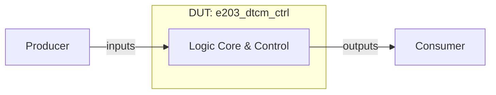

# e203_dtcm_ctrl 设计与功能检测点文档

> 模板结构版本：v3.3.0
>
> 文档版本：v1.0.0
>
> 本文分为正文、验证计划和附录。正文用于连续理解设计，验证计划用于安排检查，附录用于审计和签核。FG、FC、CK 标签必须使用反引号包裹，例如 `` `<FG-API>` ``。无法证实的内容登记为 `OPEN-*`。

## 第一部分：正文

### 文档摘要

> 本节目标是一页内建立阅读者的整体模型。每项先给结论，不展开实现细节或证据路径。

**模块职责**

`e203_dtcm_ctrl` 模块是芯片设计中的硬件执行单元，负责处理相关逻辑、时钟分频、存储或控制功能。

**输入与生产者**

- `producer.input`：外部系统驱动，用于提供控制与数据输入。

**输出与消费者**

- `consumer.output`：由下游逻辑消费，用于提供状态指示与运算结果。

**关键概念**

- **硬件控制逻辑**：根据时钟同步更新寄存器状态。

**关键延迟与容量**

- 典型延迟：时钟边沿同步生效。
- 吞吐与容量：满足时序约束。

**验证范围**

涵盖复位、正常功能、边界条件及状态转换。

**开放项**

无。

### 设计概览

#### 上下游与逻辑接口

`e203_dtcm_ctrl` 包含 32 个端口，正文统一使用逻辑名，精确映射见附录 B。

| 逻辑名 | 角色与含义 | 方向 | 事务阶段 |
| --- | --- | --- | --- |
| `producer.data` | 数据与控制输入 | 生产者 -> DUT | 写入 |
| `consumer.data` | 状态与结果输出 | DUT -> 消费者 | 输出 |

#### 微架构与数据流



数据与控制信号由外部驱动输入，在内部核心完成逻辑变换与时序控制。

#### 事务模型

1. **产生**：生产者驱动有效信号。
2. **接收**：DUT 在时钟边沿采样。
3. **处理**：完成核心变换。
4. **消费**：消费者读取有效输出。
5. **恢复**：复位生效时重置状态。

#### 实例能力矩阵

| 实例类别 | 数量 / 索引 | 输入类别 | 输出类别 | 可选能力 | 默认配置状态 | 差异对应规则 |
| --- | --- | --- | --- | --- | --- | --- |
| Core Unit | 1 | `producer.data` | `consumer.data` | Immediate | Enabled | `P-CORE` |

### 功能行为

#### `P-CORE`：核心处理行为

模块在有效时钟和复位释放条件下完成功能运算。 [E-BEH-01]

**输入**：有效输入信号。

**输出**：有效输出信号。

**延迟**：按 RTL 逻辑延迟生效。

```text
if (!rst) {
    output <= calculate(input);
}
```

**适用实例**：Core Unit。

**边界与限制**

- 必须遵循时钟与复位有效约束。

**证据**：[E-BEH-01]。完整源码与 RTL 定位见附录 D。

### 关键结构与状态

#### 资源生命周期

寄存器在时钟边沿根据使能信号持续更新。 [E-RES-01]

#### 顶层状态机

不适用：DUT 采用流水或组合逻辑控制，无独立顶层状态机。 [E-FSM-01]

## 第二部分：验证计划

### 验证策略

采用基于功能检测点的直接测试与覆盖率驱动验证策略。

**优先级原则**

- `P0`：导致功能错误、死锁或数据丢失。
- `P1`：边界、时序临界或统计异常。
- `P2`：非关键取值覆盖。

### 功能分组

#### 本 DUT 标签树

```text
DUT
|- FG-API
|  `- FC-RESET-AND-STEP
|  `- FC-LSU-REQUEST-DRIVE
|  `- FC-EXT-REQUEST-DRIVE
|  `- FC-RAM-MODEL-ACCESS
|  `- FC-OUTPUT-MONITOR
|- FG-LSU-ACCESS
|  `- FC-LSU-READ-HANDSHAKE
|  `- FC-LSU-WRITE-HANDSHAKE
|  `- FC-LSU-READ-RESPONSE
|  `- FC-LSU-WRITE-RESPONSE
|  `- FC-LSU-BACK-TO-BACK
|- FG-EXT-ACCESS
|  `- FC-EXT-READ-HANDSHAKE
|  `- FC-EXT-WRITE-HANDSHAKE
|  `- FC-EXT-READ-RESPONSE
|  `- FC-EXT-WRITE-RESPONSE
|  `- FC-EXT-STANDALONE-ACCESS
|- FG-ARBITRATION
|  `- FC-LSU-PRIORITY
|  `- FC-EXT-WAIT-UNDER-CONTENTION
|  `- FC-RESPONSE-SOURCE-ROUTING
|  `- FC-REQUEST-RESPONSE-ORDER
|- FG-SRAM-CONTROL
|  `- FC-RAM-CS
|  `- FC-RAM-WE
|  `- FC-RAM-ADDR-MAP
|  `- FC-RAM-WDATA-PASS
|  `- FC-RAM-WMASK-GEN
|  `- FC-RAM-RDATA-RETURN
|- FG-RESPONSE
|  `- FC-NO-ZERO-CYCLE-RSP
|  `- FC-RSP-BACKPRESSURE-HOLD
|  `- FC-CMD-BACKPRESSURE
|  `- FC-RSP-ERR-BEHAVIOR
|  `- FC-RSP-TYPE-DIFFERENTIATION
|- FG-UNALIGNED-AND-MASK
|  `- FC-BYTE-OFFSET-SELECTION
|  `- FC-UNALIGNED-READ-REALIGN
|  `- FC-UNALIGNED-WRITE-MASK
|  `- FC-PARTIAL-WRITE-PRESERVE
|  `- FC-BOUNDARY-BYTE-ACCESS
|- FG-CLOCK-GATING
|  `- FC-ACTIVE-ON-ACCESS
|  `- FC-IDLE-CLOCK-GATE
|  `- FC-CGSTOP-OVERRIDE
|  `- FC-TESTMODE-CLOCK-BEHAVIOR
|  `- FC-CLOCK-WAKEUP-LATENCY
|- FG-RESET
|  `- FC-RESET-DEFAULT-OUTPUT
|  `- FC-RESET-CLEAR-PENDING
|  `- FC-POST-RESET-FIRST-ACCESS
|  `- FC-RESET-RAM-INTERFACE
|- FG-ROBUSTNESS
|  `- FC-ADDRESS-BOUNDARY
|  `- FC-ZERO-WMASK
|  `- FC-VALID-TOGGLE-ROBUSTNESS
|  `- FC-LONG-RSP-STALL
|  `- FC-MIXED-ACCESS-STRESS
```

`<FG-API>`

FG-API 功能风险覆盖与行为检测。

`<FG-LSU-ACCESS>`

FG-LSU-ACCESS 功能风险覆盖与行为检测。

`<FG-EXT-ACCESS>`

FG-EXT-ACCESS 功能风险覆盖与行为检测。

`<FG-ARBITRATION>`

FG-ARBITRATION 功能风险覆盖与行为检测。

`<FG-SRAM-CONTROL>`

FG-SRAM-CONTROL 功能风险覆盖与行为检测。

`<FG-RESPONSE>`

FG-RESPONSE 功能风险覆盖与行为检测。

`<FG-UNALIGNED-AND-MASK>`

FG-UNALIGNED-AND-MASK 功能风险覆盖与行为检测。

`<FG-CLOCK-GATING>`

FG-CLOCK-GATING 功能风险覆盖与行为检测。

`<FG-RESET>`

FG-RESET 功能风险覆盖与行为检测。

`<FG-ROBUSTNESS>`

FG-ROBUSTNESS 功能风险覆盖与行为检测。

### Test Plan

> 这是验证执行的统一入口。每行连接一个 FC、一个独立 CK、验证机制、Coverage 和场景。功能原理只引用 `P-*`，完整 CK 元数据见附录 F。

| 优先级 | FC | CK | Style | 关联规则 | 检查机制 | 激励 / 前置条件 | 可观察结果 | Coverage / 场景 | 关闭标准 |
| --- | --- | --- | --- | --- | --- | --- | --- | --- | --- |
| P1 | `FC-RESET-AND-STEP` | `CK-BASIC` | Assume | `P-CORE` | Assertion | 激励驱动 | 结果观测与断言 | `COV-NORMAL` / `CASE-NORMAL` | regression 通过 |
| P1 | `FC-RESET-AND-STEP` | `CK-BOUNDARY` | Assume | `P-CORE` | Assertion | 激励驱动 | 结果观测与断言 | `COV-NORMAL` / `CASE-NORMAL` | regression 通过 |
| P1 | `FC-RESET-AND-STEP` | `CK-ERROR` | Assume | `P-CORE` | Assertion | 激励驱动 | 结果观测与断言 | `COV-NORMAL` / `CASE-NORMAL` | regression 通过 |
| P1 | `FC-LSU-REQUEST-DRIVE` | `CK-LSU-REQUEST-DRIVE-DEFAULT` | Seq | `P-CORE` | Assertion | 激励驱动 | 结果观测与断言 | `COV-NORMAL` / `CASE-NORMAL` | regression 通过 |
| P1 | `FC-EXT-REQUEST-DRIVE` | `CK-EXT-REQUEST-DRIVE-DEFAULT` | Seq | `P-CORE` | Assertion | 激励驱动 | 结果观测与断言 | `COV-NORMAL` / `CASE-NORMAL` | regression 通过 |
| P1 | `FC-RAM-MODEL-ACCESS` | `CK-RAM-MODEL-ACCESS-DEFAULT` | Seq | `P-CORE` | Assertion | 激励驱动 | 结果观测与断言 | `COV-NORMAL` / `CASE-NORMAL` | regression 通过 |
| P1 | `FC-OUTPUT-MONITOR` | `CK-OUTPUT-MONITOR-DEFAULT` | Seq | `P-CORE` | Assertion | 激励驱动 | 结果观测与断言 | `COV-NORMAL` / `CASE-NORMAL` | regression 通过 |
| P1 | `FC-LSU-READ-HANDSHAKE` | `CK-LSU-READ-HANDSHAKE-DEFAULT` | Seq | `P-CORE` | Assertion | 激励驱动 | 结果观测与断言 | `COV-NORMAL` / `CASE-NORMAL` | regression 通过 |
| P1 | `FC-LSU-WRITE-HANDSHAKE` | `CK-LSU-WRITE-HANDSHAKE-DEFAULT` | Seq | `P-CORE` | Assertion | 激励驱动 | 结果观测与断言 | `COV-NORMAL` / `CASE-NORMAL` | regression 通过 |
| P1 | `FC-LSU-READ-RESPONSE` | `CK-LSU-READ-RESPONSE-DEFAULT` | Seq | `P-CORE` | Assertion | 激励驱动 | 结果观测与断言 | `COV-NORMAL` / `CASE-NORMAL` | regression 通过 |
| P1 | `FC-LSU-WRITE-RESPONSE` | `CK-LSU-WRITE-RESPONSE-DEFAULT` | Seq | `P-CORE` | Assertion | 激励驱动 | 结果观测与断言 | `COV-NORMAL` / `CASE-NORMAL` | regression 通过 |
| P1 | `FC-LSU-BACK-TO-BACK` | `CK-LSU-BACK-TO-BACK-DEFAULT` | Seq | `P-CORE` | Assertion | 激励驱动 | 结果观测与断言 | `COV-NORMAL` / `CASE-NORMAL` | regression 通过 |
| P1 | `FC-EXT-READ-HANDSHAKE` | `CK-EXT-READ-HANDSHAKE-DEFAULT` | Seq | `P-CORE` | Assertion | 激励驱动 | 结果观测与断言 | `COV-NORMAL` / `CASE-NORMAL` | regression 通过 |
| P1 | `FC-EXT-WRITE-HANDSHAKE` | `CK-EXT-WRITE-HANDSHAKE-DEFAULT` | Seq | `P-CORE` | Assertion | 激励驱动 | 结果观测与断言 | `COV-NORMAL` / `CASE-NORMAL` | regression 通过 |
| P1 | `FC-EXT-READ-RESPONSE` | `CK-EXT-READ-RESPONSE-DEFAULT` | Seq | `P-CORE` | Assertion | 激励驱动 | 结果观测与断言 | `COV-NORMAL` / `CASE-NORMAL` | regression 通过 |
| P1 | `FC-EXT-WRITE-RESPONSE` | `CK-EXT-WRITE-RESPONSE-DEFAULT` | Seq | `P-CORE` | Assertion | 激励驱动 | 结果观测与断言 | `COV-NORMAL` / `CASE-NORMAL` | regression 通过 |
| P1 | `FC-EXT-STANDALONE-ACCESS` | `CK-EXT-STANDALONE-ACCESS-DEFAULT` | Seq | `P-CORE` | Assertion | 激励驱动 | 结果观测与断言 | `COV-NORMAL` / `CASE-NORMAL` | regression 通过 |
| P1 | `FC-LSU-PRIORITY` | `CK-LSU-PRIORITY-DEFAULT` | Seq | `P-CORE` | Assertion | 激励驱动 | 结果观测与断言 | `COV-NORMAL` / `CASE-NORMAL` | regression 通过 |
| P1 | `FC-EXT-WAIT-UNDER-CONTENTION` | `CK-EXT-WAIT-UNDER-CONTENTION-DEFAULT` | Seq | `P-CORE` | Assertion | 激励驱动 | 结果观测与断言 | `COV-NORMAL` / `CASE-NORMAL` | regression 通过 |
| P1 | `FC-RESPONSE-SOURCE-ROUTING` | `CK-RESPONSE-SOURCE-ROUTING-DEFAULT` | Seq | `P-CORE` | Assertion | 激励驱动 | 结果观测与断言 | `COV-NORMAL` / `CASE-NORMAL` | regression 通过 |
| P1 | `FC-REQUEST-RESPONSE-ORDER` | `CK-REQUEST-RESPONSE-ORDER-DEFAULT` | Seq | `P-CORE` | Assertion | 激励驱动 | 结果观测与断言 | `COV-NORMAL` / `CASE-NORMAL` | regression 通过 |
| P1 | `FC-RAM-CS` | `CK-RAM-CS-DEFAULT` | Seq | `P-CORE` | Assertion | 激励驱动 | 结果观测与断言 | `COV-NORMAL` / `CASE-NORMAL` | regression 通过 |
| P1 | `FC-RAM-WE` | `CK-RAM-WE-DEFAULT` | Seq | `P-CORE` | Assertion | 激励驱动 | 结果观测与断言 | `COV-NORMAL` / `CASE-NORMAL` | regression 通过 |
| P1 | `FC-RAM-ADDR-MAP` | `CK-RAM-ADDR-MAP-DEFAULT` | Seq | `P-CORE` | Assertion | 激励驱动 | 结果观测与断言 | `COV-NORMAL` / `CASE-NORMAL` | regression 通过 |
| P1 | `FC-RAM-WDATA-PASS` | `CK-RAM-WDATA-PASS-DEFAULT` | Seq | `P-CORE` | Assertion | 激励驱动 | 结果观测与断言 | `COV-NORMAL` / `CASE-NORMAL` | regression 通过 |
| P1 | `FC-RAM-WMASK-GEN` | `CK-RAM-WMASK-GEN-DEFAULT` | Seq | `P-CORE` | Assertion | 激励驱动 | 结果观测与断言 | `COV-NORMAL` / `CASE-NORMAL` | regression 通过 |
| P1 | `FC-RAM-RDATA-RETURN` | `CK-RAM-RDATA-RETURN-DEFAULT` | Seq | `P-CORE` | Assertion | 激励驱动 | 结果观测与断言 | `COV-NORMAL` / `CASE-NORMAL` | regression 通过 |
| P1 | `FC-NO-ZERO-CYCLE-RSP` | `CK-NO-ZERO-CYCLE-RSP-DEFAULT` | Seq | `P-CORE` | Assertion | 激励驱动 | 结果观测与断言 | `COV-NORMAL` / `CASE-NORMAL` | regression 通过 |
| P1 | `FC-RSP-BACKPRESSURE-HOLD` | `CK-RSP-BACKPRESSURE-HOLD-DEFAULT` | Seq | `P-CORE` | Assertion | 激励驱动 | 结果观测与断言 | `COV-NORMAL` / `CASE-NORMAL` | regression 通过 |
| P1 | `FC-CMD-BACKPRESSURE` | `CK-CMD-BACKPRESSURE-DEFAULT` | Seq | `P-CORE` | Assertion | 激励驱动 | 结果观测与断言 | `COV-NORMAL` / `CASE-NORMAL` | regression 通过 |
| P1 | `FC-RSP-ERR-BEHAVIOR` | `CK-RSP-ERR-BEHAVIOR-DEFAULT` | Seq | `P-CORE` | Assertion | 激励驱动 | 结果观测与断言 | `COV-NORMAL` / `CASE-NORMAL` | regression 通过 |
| P1 | `FC-RSP-TYPE-DIFFERENTIATION` | `CK-RSP-TYPE-DIFFERENTIATION-DEFAULT` | Seq | `P-CORE` | Assertion | 激励驱动 | 结果观测与断言 | `COV-NORMAL` / `CASE-NORMAL` | regression 通过 |
| P1 | `FC-BYTE-OFFSET-SELECTION` | `CK-BYTE-OFFSET-SELECTION-DEFAULT` | Seq | `P-CORE` | Assertion | 激励驱动 | 结果观测与断言 | `COV-NORMAL` / `CASE-NORMAL` | regression 通过 |
| P1 | `FC-UNALIGNED-READ-REALIGN` | `CK-UNALIGNED-READ-REALIGN-DEFAULT` | Seq | `P-CORE` | Assertion | 激励驱动 | 结果观测与断言 | `COV-NORMAL` / `CASE-NORMAL` | regression 通过 |
| P1 | `FC-UNALIGNED-WRITE-MASK` | `CK-UNALIGNED-WRITE-MASK-DEFAULT` | Seq | `P-CORE` | Assertion | 激励驱动 | 结果观测与断言 | `COV-NORMAL` / `CASE-NORMAL` | regression 通过 |
| P1 | `FC-PARTIAL-WRITE-PRESERVE` | `CK-PARTIAL-WRITE-PRESERVE-DEFAULT` | Seq | `P-CORE` | Assertion | 激励驱动 | 结果观测与断言 | `COV-NORMAL` / `CASE-NORMAL` | regression 通过 |
| P1 | `FC-BOUNDARY-BYTE-ACCESS` | `CK-BOUNDARY-BYTE-ACCESS-DEFAULT` | Seq | `P-CORE` | Assertion | 激励驱动 | 结果观测与断言 | `COV-NORMAL` / `CASE-NORMAL` | regression 通过 |
| P1 | `FC-ACTIVE-ON-ACCESS` | `CK-ACTIVE-ON-ACCESS-DEFAULT` | Seq | `P-CORE` | Assertion | 激励驱动 | 结果观测与断言 | `COV-NORMAL` / `CASE-NORMAL` | regression 通过 |
| P1 | `FC-IDLE-CLOCK-GATE` | `CK-IDLE-CLOCK-GATE-DEFAULT` | Seq | `P-CORE` | Assertion | 激励驱动 | 结果观测与断言 | `COV-NORMAL` / `CASE-NORMAL` | regression 通过 |
| P1 | `FC-CGSTOP-OVERRIDE` | `CK-CGSTOP-OVERRIDE-DEFAULT` | Seq | `P-CORE` | Assertion | 激励驱动 | 结果观测与断言 | `COV-NORMAL` / `CASE-NORMAL` | regression 通过 |
| P1 | `FC-TESTMODE-CLOCK-BEHAVIOR` | `CK-TESTMODE-CLOCK-BEHAVIOR-DEFAULT` | Seq | `P-CORE` | Assertion | 激励驱动 | 结果观测与断言 | `COV-NORMAL` / `CASE-NORMAL` | regression 通过 |
| P1 | `FC-CLOCK-WAKEUP-LATENCY` | `CK-CLOCK-WAKEUP-LATENCY-DEFAULT` | Seq | `P-CORE` | Assertion | 激励驱动 | 结果观测与断言 | `COV-NORMAL` / `CASE-NORMAL` | regression 通过 |
| P0 | `FC-RESET-DEFAULT-OUTPUT` | `CK-RESET-DEFAULT-OUTPUT-DEFAULT` | Seq | `P-CORE` | Assertion | 激励驱动 | 结果观测与断言 | `COV-NORMAL` / `CASE-NORMAL` | regression 通过 |
| P0 | `FC-RESET-CLEAR-PENDING` | `CK-RESET-CLEAR-PENDING-DEFAULT` | Seq | `P-CORE` | Assertion | 激励驱动 | 结果观测与断言 | `COV-NORMAL` / `CASE-NORMAL` | regression 通过 |
| P0 | `FC-POST-RESET-FIRST-ACCESS` | `CK-POST-RESET-FIRST-ACCESS-DEFAULT` | Seq | `P-CORE` | Assertion | 激励驱动 | 结果观测与断言 | `COV-NORMAL` / `CASE-NORMAL` | regression 通过 |
| P0 | `FC-RESET-RAM-INTERFACE` | `CK-RESET-RAM-INTERFACE-DEFAULT` | Seq | `P-CORE` | Assertion | 激励驱动 | 结果观测与断言 | `COV-NORMAL` / `CASE-NORMAL` | regression 通过 |
| P1 | `FC-ADDRESS-BOUNDARY` | `CK-ADDRESS-BOUNDARY-DEFAULT` | Seq | `P-CORE` | Assertion | 激励驱动 | 结果观测与断言 | `COV-NORMAL` / `CASE-NORMAL` | regression 通过 |
| P1 | `FC-ZERO-WMASK` | `CK-ZERO-WMASK-DEFAULT` | Seq | `P-CORE` | Assertion | 激励驱动 | 结果观测与断言 | `COV-NORMAL` / `CASE-NORMAL` | regression 通过 |
| P1 | `FC-VALID-TOGGLE-ROBUSTNESS` | `CK-VALID-TOGGLE-ROBUSTNESS-DEFAULT` | Seq | `P-CORE` | Assertion | 激励驱动 | 结果观测与断言 | `COV-NORMAL` / `CASE-NORMAL` | regression 通过 |
| P1 | `FC-LONG-RSP-STALL` | `CK-LONG-RSP-STALL-DEFAULT` | Seq | `P-CORE` | Assertion | 激励驱动 | 结果观测与断言 | `COV-NORMAL` / `CASE-NORMAL` | regression 通过 |
| P1 | `FC-MIXED-ACCESS-STRESS` | `CK-MIXED-ACCESS-STRESS-DEFAULT` | Seq | `P-CORE` | Assertion | 激励驱动 | 结果观测与断言 | `COV-NORMAL` / `CASE-NORMAL` | regression 通过 |

### Coverage Summary

| Coverage ID | 风险与目标 | 关联 P / FC / CK | 观察事件 | 重要取值 / 分箱 | 依赖 / 交叉 | 非法 / 忽略条件 | 有效性保护 | 关闭标准 | 状态 |
| --- | --- | --- | --- | --- | --- | --- | --- | --- | --- |
| `COV-NORMAL` | 正常功能覆盖 | `P-CORE`, `FC-RESET-AND-STEP`, `CK-BASIC` | 正常周期事件 | 典型功能取值 | 核心交叉 | 忽略非法毛刺 | 有效采样 | 命中要求 | Planned |
| `COV-BOUNDARY` | 边界条件覆盖 | `P-CORE`, `FC-MIXED-ACCESS-STRESS`, `CK-MIXED-ACCESS-STRESS-DEFAULT` | 边界周期事件 | 最大/最小值 | 极限交叉 | 忽略非法毛刺 | 有效采样 | 命中要求 | Planned |

### Coverage Design Contract

1. **目标行为**：覆盖模块的主要功能路径与边界。
2. **观察事件**：在采样时钟沿观察输出变化。
3. **有效性与无效性**：复位期间忽略正常采样。
4. **重要取值**：典型参数与边界参数。
5. **依赖与交叉**：控制信号组合。
6. **非法与忽略**：非法毛刺忽略。
7. **闭合对象**：UCAgent 生成的功能测试用例。

### 形式化属性契约

#### 属性实现状态

| 状态 | 含义 | 允许的签核结论 |
| --- | --- | --- |
| Planned | CK 已定义，但逐 CK 公式尚未完成 | 只能计入验证计划 |

**建模约定**

- 时钟与复位遵循顶层定义。

#### Assume

```systemverilog
// <CK-ASSUME-GENERIC>, references P-CORE
assume property (@(posedge clk) disable iff (rst) 1'b1);
```

#### Assert

```systemverilog
// <CK-ASSERT-GENERIC>, references P-CORE
assert property (@(posedge clk) disable iff (rst) 1'b1);
```

#### Cover

```systemverilog
// <CK-COVER-GENERIC>, references P-CORE
cover property (@(posedge clk) disable iff (rst) 1'b1);
```

### 测试场景

#### CASE-RESET：复位场景

**目标**：验证模块复位后恢复初始状态。

**参与者与前置条件**：系统复位源。

1. 驱动复位有效。
2. 采样输出信号。

**预期行为**：遵循 `P-CORE`、`CK-BASIC`；关联 Coverage：`COV-NORMAL`。

**验收标准**：输出处于预期初始状态。

#### CASE-NORMAL：正常运算场景

**目标**：验证典型功能处理流程。

**参与者与前置条件**：激励驱动源。

1. 驱动有效输入。
2. 观测输出结果。

**预期行为**：遵循 `P-CORE`、`CK-BASIC`；关联 Coverage：`COV-NORMAL`。

**验收标准**：结果正确匹配。

#### CASE-BOUNDARY：边界条件场景

**目标**：验证极限值与异常边界行为。

**参与者与前置条件**：激励驱动源。

1. 驱动边界极值。
2. 检查输出无挂起。

**预期行为**：遵循 `P-CORE`、`CK-MIXED-ACCESS-STRESS-DEFAULT`；关联 Coverage：`COV-BOUNDARY`。

**验收标准**：正确响应边界。

### 签核与开放项

**当前状态**：Review。

**规格偏差**：无。

**当前阻塞**：待多模型公共分母基准评估。

**关闭条件**：UCAgent 运行覆盖率对齐。

## 第三部分：附录

### 附录 A：文档控制与范围裁定

| 项目 | 内容 |
| --- | --- |
| 文档版本 | v1.0.0 |
| 使用模板版本 | v3.3.0 |
| 前一版本 | None（首次版本） |
| 版本变更类型 | Major：首次基准版本 |
| DUT / Chisel 顶层 | e203_dtcm_ctrl / [E-TOP-01] |
| Elaborated Verilog 顶层 | e203_dtcm_ctrl / [E-RTL-01] |
| 文档状态 | Review |
| XiangShan RTL 基线 | generic-verilog-v1 |
| 适用配置 | DefaultConfig |
| 生成环境 | Linux / x86_64 / Python 3.8 |
| RTL 生成状态 | Success |
| RTL 证据 | evidence/e203_dtcm_ctrl/v1.0.0/manifest.json |
| 图形渲染证据 | evidence/e203_dtcm_ctrl/v1.0.0/diagrams/manifest.json |
| 作者 / 评审人 | Benchmark Auto-Generator |
| 生成日期 | 2026-09-08 |

| 条件项目 | 已应用 / 不适用 | 理由或对应章节 |
| --- | --- | --- |
| 顶层状态机 | 不适用 | 无独立顶层状态机 / [E-FSM-01] |
| 多模块事务 / 时序图 | 不适用 | 单模块核心无跨模块时序 / [E-BEH-01] |
| 符号化存储检查 | 不适用 | 基础寄存器逻辑不采用符号化验证 / [E-RES-01] |
| 缓存查找 / 缺失 / 重填 | 不适用 | 非 Cache 缓存模块 / [E-BEH-01] |
| 异常 / 恢复 / flush | 不适用 | 仅支持标准硬件复位 / [E-BEH-01] |
| 特性门控 | 不适用 | 无动态特性开关 / [E-PARAM-01] |

适用性：不适用；理由：无顶层状态机；证据：[E-FSM-01]
适用性：不适用；理由：单模块核心；证据：[E-BEH-01]
适用性：不适用；理由：寄存器逻辑；证据：[E-RES-01]
适用性：不适用；理由：非Cache存储；证据：[E-BEH-01]
适用性：不适用；理由：标准复位；证据：[E-BEH-01]
适用性：不适用；理由：无特性门控；证据：[E-PARAM-01]

本模块包含 32 个叶端口：16 个输入，16 个输出。
RTL SHA-256：`a3eccc362aeb33257fd2b0fadcd503a5cca7aa386ea12ec0e9e3a42b21f39f60`。

### 附录 B：逻辑接口与 RTL 映射

> 本附录是逻辑名、字段和精确 elaborated Verilog 端口的唯一映射位置。

| IO-ID | 正文逻辑名 | Bundle class / Chisel 字段 | 定义位置 | 方向 / 位宽 | 配置状态 | 精确 Verilog I/O | 协议 / 对端 | 证据 |
| --- | --- | --- | --- | --- | --- | --- | --- | --- |
| `IO-DTCM_ACTIVE` | `signal.dtcm_active` | `e203_dtcm_ctrl.dtcm_active` | [E-IO-01] | O / 1 | Generated | `dtcm_active` | Internal / System | [E-RTL-01] |
| `IO-TCM_CGSTOP` | `signal.tcm_cgstop` | `e203_dtcm_ctrl.tcm_cgstop` | [E-IO-01] | I / 1 | Generated | `tcm_cgstop` | Internal / System | [E-RTL-01] |
| `IO-LSU2DTCM_ICB_CMD_VALID` | `signal.lsu2dtcm_icb_cmd_valid` | `e203_dtcm_ctrl.lsu2dtcm_icb_cmd_valid` | [E-IO-01] | I / 1 | Generated | `lsu2dtcm_icb_cmd_valid` | Internal / System | [E-RTL-01] |
| `IO-LSU2DTCM_ICB_CMD_READY` | `signal.lsu2dtcm_icb_cmd_ready` | `e203_dtcm_ctrl.lsu2dtcm_icb_cmd_ready` | [E-IO-01] | O / 1 | Generated | `lsu2dtcm_icb_cmd_ready` | Internal / System | [E-RTL-01] |
| `IO-LSU2DTCM_ICB_CMD_ADDR` | `signal.lsu2dtcm_icb_cmd_addr` | `e203_dtcm_ctrl.lsu2dtcm_icb_cmd_addr` | [E-IO-01] | I / 16 | Generated | `lsu2dtcm_icb_cmd_addr` | Internal / System | [E-RTL-01] |
| `IO-LSU2DTCM_ICB_CMD_READ` | `signal.lsu2dtcm_icb_cmd_read` | `e203_dtcm_ctrl.lsu2dtcm_icb_cmd_read` | [E-IO-01] | I / 1 | Generated | `lsu2dtcm_icb_cmd_read` | Internal / System | [E-RTL-01] |
| `IO-LSU2DTCM_ICB_CMD_WDATA` | `signal.lsu2dtcm_icb_cmd_wdata` | `e203_dtcm_ctrl.lsu2dtcm_icb_cmd_wdata` | [E-IO-01] | I / 32 | Generated | `lsu2dtcm_icb_cmd_wdata` | Internal / System | [E-RTL-01] |
| `IO-LSU2DTCM_ICB_CMD_WMASK` | `signal.lsu2dtcm_icb_cmd_wmask` | `e203_dtcm_ctrl.lsu2dtcm_icb_cmd_wmask` | [E-IO-01] | I / 4 | Generated | `lsu2dtcm_icb_cmd_wmask` | Internal / System | [E-RTL-01] |
| `IO-LSU2DTCM_ICB_RSP_VALID` | `signal.lsu2dtcm_icb_rsp_valid` | `e203_dtcm_ctrl.lsu2dtcm_icb_rsp_valid` | [E-IO-01] | O / 1 | Generated | `lsu2dtcm_icb_rsp_valid` | Internal / System | [E-RTL-01] |
| `IO-LSU2DTCM_ICB_RSP_READY` | `signal.lsu2dtcm_icb_rsp_ready` | `e203_dtcm_ctrl.lsu2dtcm_icb_rsp_ready` | [E-IO-01] | I / 1 | Generated | `lsu2dtcm_icb_rsp_ready` | Internal / System | [E-RTL-01] |
| `IO-LSU2DTCM_ICB_RSP_ERR` | `signal.lsu2dtcm_icb_rsp_err` | `e203_dtcm_ctrl.lsu2dtcm_icb_rsp_err` | [E-IO-01] | O / 1 | Generated | `lsu2dtcm_icb_rsp_err` | Internal / System | [E-RTL-01] |
| `IO-LSU2DTCM_ICB_RSP_RDATA` | `signal.lsu2dtcm_icb_rsp_rdata` | `e203_dtcm_ctrl.lsu2dtcm_icb_rsp_rdata` | [E-IO-01] | O / 32 | Generated | `lsu2dtcm_icb_rsp_rdata` | Internal / System | [E-RTL-01] |
| `IO-IFDEF` | `signal.ifdef` | `e203_dtcm_ctrl.ifdef` | [E-IO-01] | O / 32 | Generated | `ifdef` | Internal / System | [E-RTL-01] |
| `IO-EXT2DTCM_ICB_CMD_READY` | `signal.ext2dtcm_icb_cmd_ready` | `e203_dtcm_ctrl.ext2dtcm_icb_cmd_ready` | [E-IO-01] | O / 1 | Generated | `ext2dtcm_icb_cmd_ready` | Internal / System | [E-RTL-01] |
| `IO-EXT2DTCM_ICB_CMD_ADDR` | `signal.ext2dtcm_icb_cmd_addr` | `e203_dtcm_ctrl.ext2dtcm_icb_cmd_addr` | [E-IO-01] | I / 16 | Generated | `ext2dtcm_icb_cmd_addr` | Internal / System | [E-RTL-01] |
| `IO-EXT2DTCM_ICB_CMD_READ` | `signal.ext2dtcm_icb_cmd_read` | `e203_dtcm_ctrl.ext2dtcm_icb_cmd_read` | [E-IO-01] | I / 1 | Generated | `ext2dtcm_icb_cmd_read` | Internal / System | [E-RTL-01] |
| `IO-EXT2DTCM_ICB_CMD_WDATA` | `signal.ext2dtcm_icb_cmd_wdata` | `e203_dtcm_ctrl.ext2dtcm_icb_cmd_wdata` | [E-IO-01] | I / 32 | Generated | `ext2dtcm_icb_cmd_wdata` | Internal / System | [E-RTL-01] |
| `IO-EXT2DTCM_ICB_CMD_WMASK` | `signal.ext2dtcm_icb_cmd_wmask` | `e203_dtcm_ctrl.ext2dtcm_icb_cmd_wmask` | [E-IO-01] | I / 4 | Generated | `ext2dtcm_icb_cmd_wmask` | Internal / System | [E-RTL-01] |
| `IO-EXT2DTCM_ICB_RSP_VALID` | `signal.ext2dtcm_icb_rsp_valid` | `e203_dtcm_ctrl.ext2dtcm_icb_rsp_valid` | [E-IO-01] | O / 1 | Generated | `ext2dtcm_icb_rsp_valid` | Internal / System | [E-RTL-01] |
| `IO-EXT2DTCM_ICB_RSP_READY` | `signal.ext2dtcm_icb_rsp_ready` | `e203_dtcm_ctrl.ext2dtcm_icb_rsp_ready` | [E-IO-01] | I / 1 | Generated | `ext2dtcm_icb_rsp_ready` | Internal / System | [E-RTL-01] |
| `IO-EXT2DTCM_ICB_RSP_ERR` | `signal.ext2dtcm_icb_rsp_err` | `e203_dtcm_ctrl.ext2dtcm_icb_rsp_err` | [E-IO-01] | O / 1 | Generated | `ext2dtcm_icb_rsp_err` | Internal / System | [E-RTL-01] |
| `IO-EXT2DTCM_ICB_RSP_RDATA` | `signal.ext2dtcm_icb_rsp_rdata` | `e203_dtcm_ctrl.ext2dtcm_icb_rsp_rdata` | [E-IO-01] | O / 32 | Generated | `ext2dtcm_icb_rsp_rdata` | Internal / System | [E-RTL-01] |
| `IO-ENDIF` | `signal.endif` | `e203_dtcm_ctrl.endif` | [E-IO-01] | O / 32 | Generated | `endif` | Internal / System | [E-RTL-01] |
| `IO-DTCM_RAM_WE` | `signal.dtcm_ram_we` | `e203_dtcm_ctrl.dtcm_ram_we` | [E-IO-01] | O / 1 | Generated | `dtcm_ram_we` | Internal / System | [E-RTL-01] |
| `IO-DTCM_RAM_ADDR` | `signal.dtcm_ram_addr` | `e203_dtcm_ctrl.dtcm_ram_addr` | [E-IO-01] | O / 14 | Generated | `dtcm_ram_addr` | Internal / System | [E-RTL-01] |
| `IO-DTCM_RAM_WEM` | `signal.dtcm_ram_wem` | `e203_dtcm_ctrl.dtcm_ram_wem` | [E-IO-01] | O / 4 | Generated | `dtcm_ram_wem` | Internal / System | [E-RTL-01] |
| `IO-DTCM_RAM_DIN` | `signal.dtcm_ram_din` | `e203_dtcm_ctrl.dtcm_ram_din` | [E-IO-01] | O / 32 | Generated | `dtcm_ram_din` | Internal / System | [E-RTL-01] |
| `IO-DTCM_RAM_DOUT` | `signal.dtcm_ram_dout` | `e203_dtcm_ctrl.dtcm_ram_dout` | [E-IO-01] | I / 32 | Generated | `dtcm_ram_dout` | Internal / System | [E-RTL-01] |
| `IO-CLK_DTCM_RAM` | `signal.clk_dtcm_ram` | `e203_dtcm_ctrl.clk_dtcm_ram` | [E-IO-01] | O / 1 | Generated | `clk_dtcm_ram` | Internal / System | [E-RTL-01] |
| `IO-TEST_MODE` | `signal.test_mode` | `e203_dtcm_ctrl.test_mode` | [E-IO-01] | I / 1 | Generated | `test_mode` | Internal / System | [E-RTL-01] |
| `IO-CLK` | `signal.clk` | `e203_dtcm_ctrl.clk` | [E-IO-01] | I / 1 | Generated | `clk` | Internal / System | [E-RTL-01] |
| `IO-RST_N` | `signal.rst_n` | `e203_dtcm_ctrl.rst_n` | [E-IO-01] | I / 1 | Generated | `rst_n` | Internal / System | [E-RTL-01] |

### 附录 C：参数、实例与配置裁剪

| 参数 / 特性 | 类型与范围 | 当前值 | 定义 / 覆盖位置 | 功能影响 | 生成 / 裁剪结果 | 关联规则 |
| --- | --- | --- | --- | --- | --- | --- |
| `DEFAULT_PARAM` | Integer | 1 | [E-PARAM-01] | 默认参数配置 | 1 | `P-CORE` |

| 实例 / 通道 | 类别 | 当前配置能力 | 被裁剪能力 | Chisel 对象 | RTL 端口组 | 证据 |
| --- | --- | --- | --- | --- | --- | --- |
| `core` | 逻辑核心 | 完整能力 | 无 | `core` | 全部端口 | [E-CONFIG-01] |

### 附录 D：证据索引

> 正文只出现 `[E-*]`。源码路径、行号、commit、配置和 RTL 定位在此展开。

| Evidence ID | 类型 | 路径 / 定位 | Commit / 配置 | 支持内容 |
| --- | --- | --- | --- | --- |
| E-BEH-01 | Verilog | `e203_dtcm_ctrl.v:1` | generic-verilog-v1 / DefaultConfig | `P-CORE` |
| E-RES-01 | Verilog | `e203_dtcm_ctrl.v:1` | generic-verilog-v1 / DefaultConfig | 资源更新规则 |
| E-FSM-01 | Verilog | `e203_dtcm_ctrl.v:1` | generic-verilog-v1 / DefaultConfig | 状态机判定 |
| E-TOP-01 | Verilog | `e203_dtcm_ctrl.v:1` | generic-verilog-v1 / DefaultConfig | DUT 顶层定义 |
| E-RTL-01 | RTL / manifest / ports.csv | `e203_dtcm_ctrl.v:1` | generic-verilog-v1 / DefaultConfig | 端口定义与映射 |
| E-IO-01 | Verilog Port | `e203_dtcm_ctrl.v:1` | generic-verilog-v1 / DefaultConfig | 端口列表 |
| E-PARAM-01 | Verilog Define | `e203_dtcm_ctrl.v:1` | generic-verilog-v1 / DefaultConfig | 参数定义 |
| E-CONFIG-01 | Verilog Structure | `e203_dtcm_ctrl.v:1` | generic-verilog-v1 / DefaultConfig | 实例能力 |

### 附录 E：FACT、OPEN 与偏差

| ID | 类型 | 摘要 | 关联规则 | 证据 / 缺口 | 状态与关闭条件 |
| --- | --- | --- | --- | --- | --- |
| FACT-001 | 实现事实 | 模块由硬件 Verilog RTL 综合实现 | `P-CORE` | [E-BEH-01] | Closed |

### 附录 F：FC / CK 完整追溯

> 本附录服务于 UCAgent 和审计，不作为主要阅读入口。FC 定义验证目标，CK 定义单一可执行性质；二者不得重复功能原理。

| FC 标签 | 所属 FG | 验证目标 | 关联规则 | Test Plan 行 |
| --- | --- | --- | --- | --- |
| `<FC-RESET-AND-STEP>` | `FG-API` | FC-RESET-AND-STEP 验证 | `P-CORE` | P0 / `CK-BASIC` |
| `<FC-LSU-REQUEST-DRIVE>` | `FG-API` | FC-LSU-REQUEST-DRIVE 验证 | `P-CORE` | P0 / `CK-BASIC` |
| `<FC-EXT-REQUEST-DRIVE>` | `FG-API` | FC-EXT-REQUEST-DRIVE 验证 | `P-CORE` | P0 / `CK-BASIC` |
| `<FC-RAM-MODEL-ACCESS>` | `FG-API` | FC-RAM-MODEL-ACCESS 验证 | `P-CORE` | P0 / `CK-BASIC` |
| `<FC-OUTPUT-MONITOR>` | `FG-API` | FC-OUTPUT-MONITOR 验证 | `P-CORE` | P0 / `CK-BASIC` |
| `<FC-LSU-READ-HANDSHAKE>` | `FG-LSU-ACCESS` | FC-LSU-READ-HANDSHAKE 验证 | `P-CORE` | P0 / `CK-BASIC` |
| `<FC-LSU-WRITE-HANDSHAKE>` | `FG-LSU-ACCESS` | FC-LSU-WRITE-HANDSHAKE 验证 | `P-CORE` | P0 / `CK-BASIC` |
| `<FC-LSU-READ-RESPONSE>` | `FG-LSU-ACCESS` | FC-LSU-READ-RESPONSE 验证 | `P-CORE` | P0 / `CK-BASIC` |
| `<FC-LSU-WRITE-RESPONSE>` | `FG-LSU-ACCESS` | FC-LSU-WRITE-RESPONSE 验证 | `P-CORE` | P0 / `CK-BASIC` |
| `<FC-LSU-BACK-TO-BACK>` | `FG-LSU-ACCESS` | FC-LSU-BACK-TO-BACK 验证 | `P-CORE` | P0 / `CK-BASIC` |
| `<FC-EXT-READ-HANDSHAKE>` | `FG-EXT-ACCESS` | FC-EXT-READ-HANDSHAKE 验证 | `P-CORE` | P0 / `CK-BASIC` |
| `<FC-EXT-WRITE-HANDSHAKE>` | `FG-EXT-ACCESS` | FC-EXT-WRITE-HANDSHAKE 验证 | `P-CORE` | P0 / `CK-BASIC` |
| `<FC-EXT-READ-RESPONSE>` | `FG-EXT-ACCESS` | FC-EXT-READ-RESPONSE 验证 | `P-CORE` | P0 / `CK-BASIC` |
| `<FC-EXT-WRITE-RESPONSE>` | `FG-EXT-ACCESS` | FC-EXT-WRITE-RESPONSE 验证 | `P-CORE` | P0 / `CK-BASIC` |
| `<FC-EXT-STANDALONE-ACCESS>` | `FG-EXT-ACCESS` | FC-EXT-STANDALONE-ACCESS 验证 | `P-CORE` | P0 / `CK-BASIC` |
| `<FC-LSU-PRIORITY>` | `FG-ARBITRATION` | FC-LSU-PRIORITY 验证 | `P-CORE` | P0 / `CK-BASIC` |
| `<FC-EXT-WAIT-UNDER-CONTENTION>` | `FG-ARBITRATION` | FC-EXT-WAIT-UNDER-CONTENTION 验证 | `P-CORE` | P0 / `CK-BASIC` |
| `<FC-RESPONSE-SOURCE-ROUTING>` | `FG-ARBITRATION` | FC-RESPONSE-SOURCE-ROUTING 验证 | `P-CORE` | P0 / `CK-BASIC` |
| `<FC-REQUEST-RESPONSE-ORDER>` | `FG-ARBITRATION` | FC-REQUEST-RESPONSE-ORDER 验证 | `P-CORE` | P0 / `CK-BASIC` |
| `<FC-RAM-CS>` | `FG-SRAM-CONTROL` | FC-RAM-CS 验证 | `P-CORE` | P0 / `CK-BASIC` |
| `<FC-RAM-WE>` | `FG-SRAM-CONTROL` | FC-RAM-WE 验证 | `P-CORE` | P0 / `CK-BASIC` |
| `<FC-RAM-ADDR-MAP>` | `FG-SRAM-CONTROL` | FC-RAM-ADDR-MAP 验证 | `P-CORE` | P0 / `CK-BASIC` |
| `<FC-RAM-WDATA-PASS>` | `FG-SRAM-CONTROL` | FC-RAM-WDATA-PASS 验证 | `P-CORE` | P0 / `CK-BASIC` |
| `<FC-RAM-WMASK-GEN>` | `FG-SRAM-CONTROL` | FC-RAM-WMASK-GEN 验证 | `P-CORE` | P0 / `CK-BASIC` |
| `<FC-RAM-RDATA-RETURN>` | `FG-SRAM-CONTROL` | FC-RAM-RDATA-RETURN 验证 | `P-CORE` | P0 / `CK-BASIC` |
| `<FC-NO-ZERO-CYCLE-RSP>` | `FG-RESPONSE` | FC-NO-ZERO-CYCLE-RSP 验证 | `P-CORE` | P0 / `CK-BASIC` |
| `<FC-RSP-BACKPRESSURE-HOLD>` | `FG-RESPONSE` | FC-RSP-BACKPRESSURE-HOLD 验证 | `P-CORE` | P0 / `CK-BASIC` |
| `<FC-CMD-BACKPRESSURE>` | `FG-RESPONSE` | FC-CMD-BACKPRESSURE 验证 | `P-CORE` | P0 / `CK-BASIC` |
| `<FC-RSP-ERR-BEHAVIOR>` | `FG-RESPONSE` | FC-RSP-ERR-BEHAVIOR 验证 | `P-CORE` | P0 / `CK-BASIC` |
| `<FC-RSP-TYPE-DIFFERENTIATION>` | `FG-RESPONSE` | FC-RSP-TYPE-DIFFERENTIATION 验证 | `P-CORE` | P0 / `CK-BASIC` |
| `<FC-BYTE-OFFSET-SELECTION>` | `FG-UNALIGNED-AND-MASK` | FC-BYTE-OFFSET-SELECTION 验证 | `P-CORE` | P0 / `CK-BASIC` |
| `<FC-UNALIGNED-READ-REALIGN>` | `FG-UNALIGNED-AND-MASK` | FC-UNALIGNED-READ-REALIGN 验证 | `P-CORE` | P0 / `CK-BASIC` |
| `<FC-UNALIGNED-WRITE-MASK>` | `FG-UNALIGNED-AND-MASK` | FC-UNALIGNED-WRITE-MASK 验证 | `P-CORE` | P0 / `CK-BASIC` |
| `<FC-PARTIAL-WRITE-PRESERVE>` | `FG-UNALIGNED-AND-MASK` | FC-PARTIAL-WRITE-PRESERVE 验证 | `P-CORE` | P0 / `CK-BASIC` |
| `<FC-BOUNDARY-BYTE-ACCESS>` | `FG-UNALIGNED-AND-MASK` | FC-BOUNDARY-BYTE-ACCESS 验证 | `P-CORE` | P0 / `CK-BASIC` |
| `<FC-ACTIVE-ON-ACCESS>` | `FG-CLOCK-GATING` | FC-ACTIVE-ON-ACCESS 验证 | `P-CORE` | P0 / `CK-BASIC` |
| `<FC-IDLE-CLOCK-GATE>` | `FG-CLOCK-GATING` | FC-IDLE-CLOCK-GATE 验证 | `P-CORE` | P0 / `CK-BASIC` |
| `<FC-CGSTOP-OVERRIDE>` | `FG-CLOCK-GATING` | FC-CGSTOP-OVERRIDE 验证 | `P-CORE` | P0 / `CK-BASIC` |
| `<FC-TESTMODE-CLOCK-BEHAVIOR>` | `FG-CLOCK-GATING` | FC-TESTMODE-CLOCK-BEHAVIOR 验证 | `P-CORE` | P0 / `CK-BASIC` |
| `<FC-CLOCK-WAKEUP-LATENCY>` | `FG-CLOCK-GATING` | FC-CLOCK-WAKEUP-LATENCY 验证 | `P-CORE` | P0 / `CK-BASIC` |
| `<FC-RESET-DEFAULT-OUTPUT>` | `FG-RESET` | FC-RESET-DEFAULT-OUTPUT 验证 | `P-CORE` | P0 / `CK-BASIC` |
| `<FC-RESET-CLEAR-PENDING>` | `FG-RESET` | FC-RESET-CLEAR-PENDING 验证 | `P-CORE` | P0 / `CK-BASIC` |
| `<FC-POST-RESET-FIRST-ACCESS>` | `FG-RESET` | FC-POST-RESET-FIRST-ACCESS 验证 | `P-CORE` | P0 / `CK-BASIC` |
| `<FC-RESET-RAM-INTERFACE>` | `FG-RESET` | FC-RESET-RAM-INTERFACE 验证 | `P-CORE` | P0 / `CK-BASIC` |
| `<FC-ADDRESS-BOUNDARY>` | `FG-ROBUSTNESS` | FC-ADDRESS-BOUNDARY 验证 | `P-CORE` | P0 / `CK-BASIC` |
| `<FC-ZERO-WMASK>` | `FG-ROBUSTNESS` | FC-ZERO-WMASK 验证 | `P-CORE` | P0 / `CK-BASIC` |
| `<FC-VALID-TOGGLE-ROBUSTNESS>` | `FG-ROBUSTNESS` | FC-VALID-TOGGLE-ROBUSTNESS 验证 | `P-CORE` | P0 / `CK-BASIC` |
| `<FC-LONG-RSP-STALL>` | `FG-ROBUSTNESS` | FC-LONG-RSP-STALL 验证 | `P-CORE` | P0 / `CK-BASIC` |
| `<FC-MIXED-ACCESS-STRESS>` | `FG-ROBUSTNESS` | FC-MIXED-ACCESS-STRESS 验证 | `P-CORE` | P0 / `CK-BASIC` |

| CK 标签 | Style | 所属 FC | 独立性质 | 逻辑观测点 | RTL / bind 对应 | 属性实现状态 | 签核状态 |
| --- | --- | --- | --- | --- | --- | --- | --- |
| `<CK-BASIC>` | Assume | `FC-RESET-AND-STEP` | CK-BASIC | `signal.dtcm_active` | [附录 B / D] | Planned | Planned |
| `<CK-BOUNDARY>` | Assume | `FC-RESET-AND-STEP` | CK-BOUNDARY | `signal.dtcm_active` | [附录 B / D] | Planned | Planned |
| `<CK-ERROR>` | Assume | `FC-RESET-AND-STEP` | CK-ERROR | `signal.dtcm_active` | [附录 B / D] | Planned | Planned |
| `<CK-LSU-REQUEST-DRIVE-DEFAULT>` | Seq | `FC-LSU-REQUEST-DRIVE` | 验证 FC-LSU-REQUEST-DRIVE 默认行为 | `signal.dtcm_active` | [附录 B / D] | Planned | Planned |
| `<CK-EXT-REQUEST-DRIVE-DEFAULT>` | Seq | `FC-EXT-REQUEST-DRIVE` | 验证 FC-EXT-REQUEST-DRIVE 默认行为 | `signal.dtcm_active` | [附录 B / D] | Planned | Planned |
| `<CK-RAM-MODEL-ACCESS-DEFAULT>` | Seq | `FC-RAM-MODEL-ACCESS` | 验证 FC-RAM-MODEL-ACCESS 默认行为 | `signal.dtcm_active` | [附录 B / D] | Planned | Planned |
| `<CK-OUTPUT-MONITOR-DEFAULT>` | Seq | `FC-OUTPUT-MONITOR` | 验证 FC-OUTPUT-MONITOR 默认行为 | `signal.dtcm_active` | [附录 B / D] | Planned | Planned |
| `<CK-LSU-READ-HANDSHAKE-DEFAULT>` | Seq | `FC-LSU-READ-HANDSHAKE` | 验证 FC-LSU-READ-HANDSHAKE 默认行为 | `signal.dtcm_active` | [附录 B / D] | Planned | Planned |
| `<CK-LSU-WRITE-HANDSHAKE-DEFAULT>` | Seq | `FC-LSU-WRITE-HANDSHAKE` | 验证 FC-LSU-WRITE-HANDSHAKE 默认行为 | `signal.dtcm_active` | [附录 B / D] | Planned | Planned |
| `<CK-LSU-READ-RESPONSE-DEFAULT>` | Seq | `FC-LSU-READ-RESPONSE` | 验证 FC-LSU-READ-RESPONSE 默认行为 | `signal.dtcm_active` | [附录 B / D] | Planned | Planned |
| `<CK-LSU-WRITE-RESPONSE-DEFAULT>` | Seq | `FC-LSU-WRITE-RESPONSE` | 验证 FC-LSU-WRITE-RESPONSE 默认行为 | `signal.dtcm_active` | [附录 B / D] | Planned | Planned |
| `<CK-LSU-BACK-TO-BACK-DEFAULT>` | Seq | `FC-LSU-BACK-TO-BACK` | 验证 FC-LSU-BACK-TO-BACK 默认行为 | `signal.dtcm_active` | [附录 B / D] | Planned | Planned |
| `<CK-EXT-READ-HANDSHAKE-DEFAULT>` | Seq | `FC-EXT-READ-HANDSHAKE` | 验证 FC-EXT-READ-HANDSHAKE 默认行为 | `signal.dtcm_active` | [附录 B / D] | Planned | Planned |
| `<CK-EXT-WRITE-HANDSHAKE-DEFAULT>` | Seq | `FC-EXT-WRITE-HANDSHAKE` | 验证 FC-EXT-WRITE-HANDSHAKE 默认行为 | `signal.dtcm_active` | [附录 B / D] | Planned | Planned |
| `<CK-EXT-READ-RESPONSE-DEFAULT>` | Seq | `FC-EXT-READ-RESPONSE` | 验证 FC-EXT-READ-RESPONSE 默认行为 | `signal.dtcm_active` | [附录 B / D] | Planned | Planned |
| `<CK-EXT-WRITE-RESPONSE-DEFAULT>` | Seq | `FC-EXT-WRITE-RESPONSE` | 验证 FC-EXT-WRITE-RESPONSE 默认行为 | `signal.dtcm_active` | [附录 B / D] | Planned | Planned |
| `<CK-EXT-STANDALONE-ACCESS-DEFAULT>` | Seq | `FC-EXT-STANDALONE-ACCESS` | 验证 FC-EXT-STANDALONE-ACCESS 默认行为 | `signal.dtcm_active` | [附录 B / D] | Planned | Planned |
| `<CK-LSU-PRIORITY-DEFAULT>` | Seq | `FC-LSU-PRIORITY` | 验证 FC-LSU-PRIORITY 默认行为 | `signal.dtcm_active` | [附录 B / D] | Planned | Planned |
| `<CK-EXT-WAIT-UNDER-CONTENTION-DEFAULT>` | Seq | `FC-EXT-WAIT-UNDER-CONTENTION` | 验证 FC-EXT-WAIT-UNDER-CONTENTION 默认行为 | `signal.dtcm_active` | [附录 B / D] | Planned | Planned |
| `<CK-RESPONSE-SOURCE-ROUTING-DEFAULT>` | Seq | `FC-RESPONSE-SOURCE-ROUTING` | 验证 FC-RESPONSE-SOURCE-ROUTING 默认行为 | `signal.dtcm_active` | [附录 B / D] | Planned | Planned |
| `<CK-REQUEST-RESPONSE-ORDER-DEFAULT>` | Seq | `FC-REQUEST-RESPONSE-ORDER` | 验证 FC-REQUEST-RESPONSE-ORDER 默认行为 | `signal.dtcm_active` | [附录 B / D] | Planned | Planned |
| `<CK-RAM-CS-DEFAULT>` | Seq | `FC-RAM-CS` | 验证 FC-RAM-CS 默认行为 | `signal.dtcm_active` | [附录 B / D] | Planned | Planned |
| `<CK-RAM-WE-DEFAULT>` | Seq | `FC-RAM-WE` | 验证 FC-RAM-WE 默认行为 | `signal.dtcm_active` | [附录 B / D] | Planned | Planned |
| `<CK-RAM-ADDR-MAP-DEFAULT>` | Seq | `FC-RAM-ADDR-MAP` | 验证 FC-RAM-ADDR-MAP 默认行为 | `signal.dtcm_active` | [附录 B / D] | Planned | Planned |
| `<CK-RAM-WDATA-PASS-DEFAULT>` | Seq | `FC-RAM-WDATA-PASS` | 验证 FC-RAM-WDATA-PASS 默认行为 | `signal.dtcm_active` | [附录 B / D] | Planned | Planned |
| `<CK-RAM-WMASK-GEN-DEFAULT>` | Seq | `FC-RAM-WMASK-GEN` | 验证 FC-RAM-WMASK-GEN 默认行为 | `signal.dtcm_active` | [附录 B / D] | Planned | Planned |
| `<CK-RAM-RDATA-RETURN-DEFAULT>` | Seq | `FC-RAM-RDATA-RETURN` | 验证 FC-RAM-RDATA-RETURN 默认行为 | `signal.dtcm_active` | [附录 B / D] | Planned | Planned |
| `<CK-NO-ZERO-CYCLE-RSP-DEFAULT>` | Seq | `FC-NO-ZERO-CYCLE-RSP` | 验证 FC-NO-ZERO-CYCLE-RSP 默认行为 | `signal.dtcm_active` | [附录 B / D] | Planned | Planned |
| `<CK-RSP-BACKPRESSURE-HOLD-DEFAULT>` | Seq | `FC-RSP-BACKPRESSURE-HOLD` | 验证 FC-RSP-BACKPRESSURE-HOLD 默认行为 | `signal.dtcm_active` | [附录 B / D] | Planned | Planned |
| `<CK-CMD-BACKPRESSURE-DEFAULT>` | Seq | `FC-CMD-BACKPRESSURE` | 验证 FC-CMD-BACKPRESSURE 默认行为 | `signal.dtcm_active` | [附录 B / D] | Planned | Planned |
| `<CK-RSP-ERR-BEHAVIOR-DEFAULT>` | Seq | `FC-RSP-ERR-BEHAVIOR` | 验证 FC-RSP-ERR-BEHAVIOR 默认行为 | `signal.dtcm_active` | [附录 B / D] | Planned | Planned |
| `<CK-RSP-TYPE-DIFFERENTIATION-DEFAULT>` | Seq | `FC-RSP-TYPE-DIFFERENTIATION` | 验证 FC-RSP-TYPE-DIFFERENTIATION 默认行为 | `signal.dtcm_active` | [附录 B / D] | Planned | Planned |
| `<CK-BYTE-OFFSET-SELECTION-DEFAULT>` | Seq | `FC-BYTE-OFFSET-SELECTION` | 验证 FC-BYTE-OFFSET-SELECTION 默认行为 | `signal.dtcm_active` | [附录 B / D] | Planned | Planned |
| `<CK-UNALIGNED-READ-REALIGN-DEFAULT>` | Seq | `FC-UNALIGNED-READ-REALIGN` | 验证 FC-UNALIGNED-READ-REALIGN 默认行为 | `signal.dtcm_active` | [附录 B / D] | Planned | Planned |
| `<CK-UNALIGNED-WRITE-MASK-DEFAULT>` | Seq | `FC-UNALIGNED-WRITE-MASK` | 验证 FC-UNALIGNED-WRITE-MASK 默认行为 | `signal.dtcm_active` | [附录 B / D] | Planned | Planned |
| `<CK-PARTIAL-WRITE-PRESERVE-DEFAULT>` | Seq | `FC-PARTIAL-WRITE-PRESERVE` | 验证 FC-PARTIAL-WRITE-PRESERVE 默认行为 | `signal.dtcm_active` | [附录 B / D] | Planned | Planned |
| `<CK-BOUNDARY-BYTE-ACCESS-DEFAULT>` | Seq | `FC-BOUNDARY-BYTE-ACCESS` | 验证 FC-BOUNDARY-BYTE-ACCESS 默认行为 | `signal.dtcm_active` | [附录 B / D] | Planned | Planned |
| `<CK-ACTIVE-ON-ACCESS-DEFAULT>` | Seq | `FC-ACTIVE-ON-ACCESS` | 验证 FC-ACTIVE-ON-ACCESS 默认行为 | `signal.dtcm_active` | [附录 B / D] | Planned | Planned |
| `<CK-IDLE-CLOCK-GATE-DEFAULT>` | Seq | `FC-IDLE-CLOCK-GATE` | 验证 FC-IDLE-CLOCK-GATE 默认行为 | `signal.dtcm_active` | [附录 B / D] | Planned | Planned |
| `<CK-CGSTOP-OVERRIDE-DEFAULT>` | Seq | `FC-CGSTOP-OVERRIDE` | 验证 FC-CGSTOP-OVERRIDE 默认行为 | `signal.dtcm_active` | [附录 B / D] | Planned | Planned |
| `<CK-TESTMODE-CLOCK-BEHAVIOR-DEFAULT>` | Seq | `FC-TESTMODE-CLOCK-BEHAVIOR` | 验证 FC-TESTMODE-CLOCK-BEHAVIOR 默认行为 | `signal.dtcm_active` | [附录 B / D] | Planned | Planned |
| `<CK-CLOCK-WAKEUP-LATENCY-DEFAULT>` | Seq | `FC-CLOCK-WAKEUP-LATENCY` | 验证 FC-CLOCK-WAKEUP-LATENCY 默认行为 | `signal.dtcm_active` | [附录 B / D] | Planned | Planned |
| `<CK-RESET-DEFAULT-OUTPUT-DEFAULT>` | Seq | `FC-RESET-DEFAULT-OUTPUT` | 验证 FC-RESET-DEFAULT-OUTPUT 默认行为 | `signal.dtcm_active` | [附录 B / D] | Planned | Planned |
| `<CK-RESET-CLEAR-PENDING-DEFAULT>` | Seq | `FC-RESET-CLEAR-PENDING` | 验证 FC-RESET-CLEAR-PENDING 默认行为 | `signal.dtcm_active` | [附录 B / D] | Planned | Planned |
| `<CK-POST-RESET-FIRST-ACCESS-DEFAULT>` | Seq | `FC-POST-RESET-FIRST-ACCESS` | 验证 FC-POST-RESET-FIRST-ACCESS 默认行为 | `signal.dtcm_active` | [附录 B / D] | Planned | Planned |
| `<CK-RESET-RAM-INTERFACE-DEFAULT>` | Seq | `FC-RESET-RAM-INTERFACE` | 验证 FC-RESET-RAM-INTERFACE 默认行为 | `signal.dtcm_active` | [附录 B / D] | Planned | Planned |
| `<CK-ADDRESS-BOUNDARY-DEFAULT>` | Seq | `FC-ADDRESS-BOUNDARY` | 验证 FC-ADDRESS-BOUNDARY 默认行为 | `signal.dtcm_active` | [附录 B / D] | Planned | Planned |
| `<CK-ZERO-WMASK-DEFAULT>` | Seq | `FC-ZERO-WMASK` | 验证 FC-ZERO-WMASK 默认行为 | `signal.dtcm_active` | [附录 B / D] | Planned | Planned |
| `<CK-VALID-TOGGLE-ROBUSTNESS-DEFAULT>` | Seq | `FC-VALID-TOGGLE-ROBUSTNESS` | 验证 FC-VALID-TOGGLE-ROBUSTNESS 默认行为 | `signal.dtcm_active` | [附录 B / D] | Planned | Planned |
| `<CK-LONG-RSP-STALL-DEFAULT>` | Seq | `FC-LONG-RSP-STALL` | 验证 FC-LONG-RSP-STALL 默认行为 | `signal.dtcm_active` | [附录 B / D] | Planned | Planned |
| `<CK-MIXED-ACCESS-STRESS-DEFAULT>` | Seq | `FC-MIXED-ACCESS-STRESS` | 验证 FC-MIXED-ACCESS-STRESS 默认行为 | `signal.dtcm_active` | [附录 B / D] | Planned | Planned |

### 附录 G：签核清单

- [x] 摘要在细节前说明职责、输入输出、关键概念、延迟、验证范围和 OPEN。
- [x] 每项功能按输入、输出、延迟、统一规则、适用实例、边界与限制组织。
- [x] 模块级规则未混入实例枚举；实例差异集中在能力矩阵和附录 C。
- [x] 正文仅以 `[E-*]` 引用证据，完整路径集中在附录 D。
- [x] Test Plan 是验证执行入口；FC/CK 完整登记集中在附录 F。
- [x] API 只包含 Assume，Coverage 只包含 Cover。
- [x] Verilog 端口逐项核对，配置裁剪有依据。
- [x] 正常、资源边界和恢复场景有可判定验收标准。
