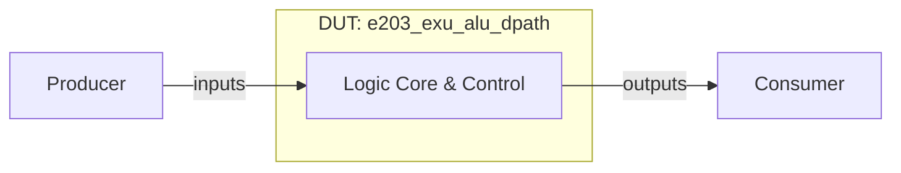

# e203_exu_alu_dpath 设计与功能检测点文档

> 模板结构版本：v3.3.0
>
> 文档版本：v1.0.0
>
> 本文分为正文、验证计划和附录。正文用于连续理解设计，验证计划用于安排检查，附录用于审计和签核。FG、FC、CK 标签必须使用反引号包裹，例如 `` `<FG-API>` ``。无法证实的内容登记为 `OPEN-*`。

## 第一部分：正文

### 文档摘要

> 本节目标是一页内建立阅读者的整体模型。每项先给结论，不展开实现细节或证据路径。

**模块职责**

`e203_exu_alu_dpath` 模块是芯片设计中的硬件执行单元，负责处理相关逻辑、时钟分频、存储或控制功能。

**输入与生产者**

- `producer.input`：外部系统驱动，用于提供控制与数据输入。

**输出与消费者**

- `consumer.output`：由下游逻辑消费，用于提供状态指示与运算结果。

**关键概念**

- **硬件控制逻辑**：根据时钟同步更新寄存器状态。

**关键延迟与容量**

- 典型延迟：时钟边沿同步生效。
- 吞吐与容量：满足时序约束。

**验证范围**

涵盖复位、正常功能、边界条件及状态转换。

**开放项**

无。

### 设计概览

#### 上下游与逻辑接口

`e203_exu_alu_dpath` 包含 60 个端口，正文统一使用逻辑名，精确映射见附录 B。

| 逻辑名 | 角色与含义 | 方向 | 事务阶段 |
| --- | --- | --- | --- |
| `producer.data` | 数据与控制输入 | 生产者 -> DUT | 写入 |
| `consumer.data` | 状态与结果输出 | DUT -> 消费者 | 输出 |

#### 微架构与数据流



数据与控制信号由外部驱动输入，在内部核心完成逻辑变换与时序控制。

#### 事务模型

1. **产生**：生产者驱动有效信号。
2. **接收**：DUT 在时钟边沿采样。
3. **处理**：完成核心变换。
4. **消费**：消费者读取有效输出。
5. **恢复**：复位生效时重置状态。

#### 实例能力矩阵

| 实例类别 | 数量 / 索引 | 输入类别 | 输出类别 | 可选能力 | 默认配置状态 | 差异对应规则 |
| --- | --- | --- | --- | --- | --- | --- |
| Core Unit | 1 | `producer.data` | `consumer.data` | Immediate | Enabled | `P-CORE` |

### 功能行为

#### `P-CORE`：核心处理行为

模块在有效时钟和复位释放条件下完成功能运算。 [E-BEH-01]

**输入**：有效输入信号。

**输出**：有效输出信号。

**延迟**：按 RTL 逻辑延迟生效。

```text
if (!rst) {
    output <= calculate(input);
}
```

**适用实例**：Core Unit。

**边界与限制**

- 必须遵循时钟与复位有效约束。

**证据**：[E-BEH-01]。完整源码与 RTL 定位见附录 D。

### 关键结构与状态

#### 资源生命周期

寄存器在时钟边沿根据使能信号持续更新。 [E-RES-01]

#### 顶层状态机

不适用：DUT 采用流水或组合逻辑控制，无独立顶层状态机。 [E-FSM-01]

## 第二部分：验证计划

### 验证策略

采用基于功能检测点的直接测试与覆盖率驱动验证策略。

**优先级原则**

- `P0`：导致功能错误、死锁或数据丢失。
- `P1`：边界、时序临界或统计异常。
- `P2`：非关键取值覆盖。

### 功能分组

#### 本 DUT 标签树

```text
DUT
|- FG-API
|  `- FC-OPERATION-API
|- FG-ALU-CORE
|  `- FC-ADD
|  `- FC-SUB
|  `- FC-XOR
|  `- FC-OR
|  `- FC-AND
|  `- FC-SLL
|  `- FC-SRL
|  `- FC-SRA
|  `- FC-SLT
|  `- FC-SLTU
|  `- FC-LUI
|- FG-BJP
|  `- FC-BJP-ADD
|  `- FC-BJP-CMP-EQ
|  `- FC-BJP-CMP-NE
|  `- FC-BJP-CMP-LT
|  `- FC-BJP-CMP-GT
|  `- FC-BJP-CMP-LTU
|  `- FC-BJP-CMP-GTU
|- FG-AGU
|  `- FC-AGU-ADD
|  `- FC-AGU-AND
|  `- FC-AGU-OR
|  `- FC-AGU-XOR
|  `- FC-AGU-SWAP
|  `- FC-AGU-MAX
|  `- FC-AGU-MIN
|  `- FC-AGU-MAXU
|  `- FC-AGU-MINU
|- FG-MULDIV
|  `- FC-MULDIV-ADD
|  `- FC-MULDIV-SUB
|- FG-SHARED-BUFFER
|  `- FC-SBF0-AGU-WRITE
|  `- FC-SBF1-AGU-WRITE
|  `- FC-SBF0-MULDIV-WRITE
|  `- FC-SBF1-MULDIV-WRITE
|  `- FC-SBF-HOLD
|- FG-ARBITRATION
|  `- FC-OUTPUT-ISOLATION
|  `- FC-CONCURRENT-REQUESTS
|- FG-TIMING-AND-RESET
|  `- FC-COMB-NO-STEP-DEPENDENCE
|  `- FC-RESET-IGNORED
```

`<FG-API>`

FG-API 功能风险覆盖与行为检测。

`<FG-ALU-CORE>`

FG-ALU-CORE 功能风险覆盖与行为检测。

`<FG-BJP>`

FG-BJP 功能风险覆盖与行为检测。

`<FG-AGU>`

FG-AGU 功能风险覆盖与行为检测。

`<FG-MULDIV>`

FG-MULDIV 功能风险覆盖与行为检测。

`<FG-SHARED-BUFFER>`

FG-SHARED-BUFFER 功能风险覆盖与行为检测。

`<FG-ARBITRATION>`

FG-ARBITRATION 功能风险覆盖与行为检测。

`<FG-TIMING-AND-RESET>`

FG-TIMING-AND-RESET 功能风险覆盖与行为检测。

### Test Plan

> 这是验证执行的统一入口。每行连接一个 FC、一个独立 CK、验证机制、Coverage 和场景。功能原理只引用 `P-*`，完整 CK 元数据见附录 F。

| 优先级 | FC | CK | Style | 关联规则 | 检查机制 | 激励 / 前置条件 | 可观察结果 | Coverage / 场景 | 关闭标准 |
| --- | --- | --- | --- | --- | --- | --- | --- | --- | --- |
| P1 | `FC-OPERATION-API` | `CK-STEP-DRIVE` | Assume | `P-CORE` | Assertion | 激励驱动 | 结果观测与断言 | `COV-NORMAL` / `CASE-NORMAL` | regression 通过 |
| P1 | `FC-OPERATION-API` | `CK-IDLE-DEFAULT` | Assume | `P-CORE` | Assertion | 激励驱动 | 结果观测与断言 | `COV-NORMAL` / `CASE-NORMAL` | regression 通过 |
| P1 | `FC-OPERATION-API` | `CK-COMB-SAMPLE` | Assume | `P-CORE` | Assertion | 激励驱动 | 结果观测与断言 | `COV-NORMAL` / `CASE-NORMAL` | regression 通过 |
| P1 | `FC-OPERATION-API` | `CK-SEQ-SAMPLE` | Assume | `P-CORE` | Assertion | 激励驱动 | 结果观测与断言 | `COV-NORMAL` / `CASE-NORMAL` | regression 通过 |
| P1 | `FC-ADD` | `CK-BASIC` | Seq | `P-CORE` | Assertion | 激励驱动 | 结果观测与断言 | `COV-NORMAL` / `CASE-NORMAL` | regression 通过 |
| P1 | `FC-ADD` | `CK-ZERO` | Seq | `P-CORE` | Assertion | 激励驱动 | 结果观测与断言 | `COV-NORMAL` / `CASE-NORMAL` | regression 通过 |
| P1 | `FC-ADD` | `CK-OVERFLOW-WRAP` | Seq | `P-CORE` | Assertion | 激励驱动 | 结果观测与断言 | `COV-NORMAL` / `CASE-NORMAL` | regression 通过 |
| P1 | `FC-ADD` | `CK-NEGATIVE-PATTERN` | Seq | `P-CORE` | Assertion | 激励驱动 | 结果观测与断言 | `COV-NORMAL` / `CASE-NORMAL` | regression 通过 |
| P1 | `FC-SUB` | `CK-ZERO-RESULT` | Seq | `P-CORE` | Assertion | 激励驱动 | 结果观测与断言 | `COV-NORMAL` / `CASE-NORMAL` | regression 通过 |
| P1 | `FC-SUB` | `CK-UNDERFLOW-WRAP` | Seq | `P-CORE` | Assertion | 激励驱动 | 结果观测与断言 | `COV-NORMAL` / `CASE-NORMAL` | regression 通过 |
| P1 | `FC-XOR` | `CK-SELF-XOR` | Seq | `P-CORE` | Assertion | 激励驱动 | 结果观测与断言 | `COV-NORMAL` / `CASE-NORMAL` | regression 通过 |
| P1 | `FC-XOR` | `CK-ALL-ZERO-ALL-ONE` | Seq | `P-CORE` | Assertion | 激励驱动 | 结果观测与断言 | `COV-NORMAL` / `CASE-NORMAL` | regression 通过 |
| P1 | `FC-OR` | `CK-MASK-MERGE` | Seq | `P-CORE` | Assertion | 激励驱动 | 结果观测与断言 | `COV-NORMAL` / `CASE-NORMAL` | regression 通过 |
| P1 | `FC-AND` | `CK-MASK-FILTER` | Seq | `P-CORE` | Assertion | 激励驱动 | 结果观测与断言 | `COV-NORMAL` / `CASE-NORMAL` | regression 通过 |
| P1 | `FC-SLL` | `CK-SHAMT-MASK` | Seq | `P-CORE` | Assertion | 激励驱动 | 结果观测与断言 | `COV-NORMAL` / `CASE-NORMAL` | regression 通过 |
| P1 | `FC-SLL` | `CK-ZERO-SHIFT` | Seq | `P-CORE` | Assertion | 激励驱动 | 结果观测与断言 | `COV-NORMAL` / `CASE-NORMAL` | regression 通过 |
| P1 | `FC-SLL` | `CK-HIGH-BIT-OUT` | Seq | `P-CORE` | Assertion | 激励驱动 | 结果观测与断言 | `COV-NORMAL` / `CASE-NORMAL` | regression 通过 |
| P1 | `FC-SRL` | `CK-ZERO-FILL` | Seq | `P-CORE` | Assertion | 激励驱动 | 结果观测与断言 | `COV-NORMAL` / `CASE-NORMAL` | regression 通过 |
| P1 | `FC-SRA` | `CK-SIGN-EXTEND` | Seq | `P-CORE` | Assertion | 激励驱动 | 结果观测与断言 | `COV-NORMAL` / `CASE-NORMAL` | regression 通过 |
| P1 | `FC-SLT` | `CK-EQUAL` | Seq | `P-CORE` | Assertion | 激励驱动 | 结果观测与断言 | `COV-NORMAL` / `CASE-NORMAL` | regression 通过 |
| P1 | `FC-SLT` | `CK-SIGN-CROSS` | Seq | `P-CORE` | Assertion | 激励驱动 | 结果观测与断言 | `COV-NORMAL` / `CASE-NORMAL` | regression 通过 |
| P1 | `FC-SLT` | `CK-BOUNDARY` | Seq | `P-CORE` | Assertion | 激励驱动 | 结果观测与断言 | `COV-NORMAL` / `CASE-NORMAL` | regression 通过 |
| P1 | `FC-SLTU` | `CK-HIGH-BIT-UNSIGNED` | Seq | `P-CORE` | Assertion | 激励驱动 | 结果观测与断言 | `COV-NORMAL` / `CASE-NORMAL` | regression 通过 |
| P1 | `FC-LUI` | `CK-HIGH-BITS` | Seq | `P-CORE` | Assertion | 激励驱动 | 结果观测与断言 | `COV-NORMAL` / `CASE-NORMAL` | regression 通过 |
| P1 | `FC-LUI` | `CK-ISOLATION` | Seq | `P-CORE` | Assertion | 激励驱动 | 结果观测与断言 | `COV-NORMAL` / `CASE-NORMAL` | regression 通过 |
| P1 | `FC-BJP-ADD` | `CK-INDEPENDENT-CMP` | Seq | `P-CORE` | Assertion | 激励驱动 | 结果观测与断言 | `COV-NORMAL` / `CASE-NORMAL` | regression 通过 |
| P1 | `FC-BJP-CMP-EQ` | `CK-NOT-EQUAL` | Seq | `P-CORE` | Assertion | 激励驱动 | 结果观测与断言 | `COV-NORMAL` / `CASE-NORMAL` | regression 通过 |
| P1 | `FC-BJP-CMP-EQ` | `CK-ZERO-PATTERN` | Seq | `P-CORE` | Assertion | 激励驱动 | 结果观测与断言 | `COV-NORMAL` / `CASE-NORMAL` | regression 通过 |
| P1 | `FC-BJP-CMP-NE` | `CK-BIT-DIFF` | Seq | `P-CORE` | Assertion | 激励驱动 | 结果观测与断言 | `COV-NORMAL` / `CASE-NORMAL` | regression 通过 |
| P1 | `FC-AGU-ADD` | `CK-AMO-ISOLATION` | Seq | `P-CORE` | Assertion | 激励驱动 | 结果观测与断言 | `COV-NORMAL` / `CASE-NORMAL` | regression 通过 |
| P1 | `FC-AGU-SWAP` | `CK-IGNORE-OP1` | Seq | `P-CORE` | Assertion | 激励驱动 | 结果观测与断言 | `COV-NORMAL` / `CASE-NORMAL` | regression 通过 |
| P1 | `FC-AGU-SWAP` | `CK-ZERO-AND-ONES` | Seq | `P-CORE` | Assertion | 激励驱动 | 结果观测与断言 | `COV-NORMAL` / `CASE-NORMAL` | regression 通过 |
| P1 | `FC-MULDIV-ADD` | `CK-WIDE-BOUNDARY` | Seq | `P-CORE` | Assertion | 激励驱动 | 结果观测与断言 | `COV-NORMAL` / `CASE-NORMAL` | regression 通过 |
| P1 | `FC-SBF0-AGU-WRITE` | `CK-WRITE-ON-STEP` | Seq | `P-CORE` | Assertion | 激励驱动 | 结果观测与断言 | `COV-NORMAL` / `CASE-NORMAL` | regression 通过 |
| P1 | `FC-SBF0-AGU-WRITE` | `CK-VALUE-PROPAGATE` | Seq | `P-CORE` | Assertion | 激励驱动 | 结果观测与断言 | `COV-NORMAL` / `CASE-NORMAL` | regression 通过 |
| P1 | `FC-SBF0-AGU-WRITE` | `CK-WIDTH-MAPPING` | Seq | `P-CORE` | Assertion | 激励驱动 | 结果观测与断言 | `COV-NORMAL` / `CASE-NORMAL` | regression 通过 |
| P1 | `FC-SBF0-MULDIV-WRITE` | `CK-33BIT-DATA` | Seq | `P-CORE` | Assertion | 激励驱动 | 结果观测与断言 | `COV-NORMAL` / `CASE-NORMAL` | regression 通过 |
| P1 | `FC-SBF-HOLD` | `CK-NO-ENABLE-HOLD` | Seq | `P-CORE` | Assertion | 激励驱动 | 结果观测与断言 | `COV-NORMAL` / `CASE-NORMAL` | regression 通过 |
| P1 | `FC-SBF-HOLD` | `CK-MULTI-CYCLE-HOLD` | Seq | `P-CORE` | Assertion | 激励驱动 | 结果观测与断言 | `COV-NORMAL` / `CASE-NORMAL` | regression 通过 |
| P1 | `FC-SBF-HOLD` | `CK-INDEPENDENT-BUFFERS` | Seq | `P-CORE` | Assertion | 激励驱动 | 结果观测与断言 | `COV-NORMAL` / `CASE-NORMAL` | regression 通过 |
| P1 | `FC-OUTPUT-ISOLATION` | `CK-ALU-INDEPENDENT` | Seq | `P-CORE` | Assertion | 激励驱动 | 结果观测与断言 | `COV-NORMAL` / `CASE-NORMAL` | regression 通过 |
| P1 | `FC-OUTPUT-ISOLATION` | `CK-BJP-INDEPENDENT` | Seq | `P-CORE` | Assertion | 激励驱动 | 结果观测与断言 | `COV-NORMAL` / `CASE-NORMAL` | regression 通过 |
| P1 | `FC-OUTPUT-ISOLATION` | `CK-AGU-INDEPENDENT` | Seq | `P-CORE` | Assertion | 激励驱动 | 结果观测与断言 | `COV-NORMAL` / `CASE-NORMAL` | regression 通过 |
| P1 | `FC-OUTPUT-ISOLATION` | `CK-MULDIV-INDEPENDENT` | Seq | `P-CORE` | Assertion | 激励驱动 | 结果观测与断言 | `COV-NORMAL` / `CASE-NORMAL` | regression 通过 |
| P1 | `FC-CONCURRENT-REQUESTS` | `CK-ALU-BJP-CONCURRENT` | Seq | `P-CORE` | Assertion | 激励驱动 | 结果观测与断言 | `COV-NORMAL` / `CASE-NORMAL` | regression 通过 |
| P1 | `FC-CONCURRENT-REQUESTS` | `CK-ALU-AGU-CONCURRENT` | Seq | `P-CORE` | Assertion | 激励驱动 | 结果观测与断言 | `COV-NORMAL` / `CASE-NORMAL` | regression 通过 |
| P1 | `FC-CONCURRENT-REQUESTS` | `CK-AGU-MULDIV-CONCURRENT` | Seq | `P-CORE` | Assertion | 激励驱动 | 结果观测与断言 | `COV-NORMAL` / `CASE-NORMAL` | regression 通过 |
| P1 | `FC-CONCURRENT-REQUESTS` | `CK-MULTI-SOURCE-STRESS` | Seq | `P-CORE` | Assertion | 激励驱动 | 结果观测与断言 | `COV-NORMAL` / `CASE-NORMAL` | regression 通过 |
| P1 | `FC-COMB-NO-STEP-DEPENDENCE` | `CK-IMMEDIATE-VISIBLE` | Seq | `P-CORE` | Assertion | 激励驱动 | 结果观测与断言 | `COV-NORMAL` / `CASE-NORMAL` | regression 通过 |
| P1 | `FC-COMB-NO-STEP-DEPENDENCE` | `CK-STEP-STABLE` | Seq | `P-CORE` | Assertion | 激励驱动 | 结果观测与断言 | `COV-NORMAL` / `CASE-NORMAL` | regression 通过 |
| P0 | `FC-RESET-IGNORED` | `CK-SBF-NOT-RESET` | Seq | `P-CORE` | Assertion | 激励驱动 | 结果观测与断言 | `COV-NORMAL` / `CASE-NORMAL` | regression 通过 |
| P0 | `FC-RESET-IGNORED` | `CK-COMB-NOT-RESET` | Seq | `P-CORE` | Assertion | 激励驱动 | 结果观测与断言 | `COV-NORMAL` / `CASE-NORMAL` | regression 通过 |
| P1 | `FC-RESET-IGNORED` | `CK-SPEC-CONSISTENCY` | Seq | `P-CORE` | Assertion | 激励驱动 | 结果观测与断言 | `COV-NORMAL` / `CASE-NORMAL` | regression 通过 |
| P1 | `FC-BJP-CMP-LT` | `CK-BJP-CMP-LT-DEFAULT` | Seq | `P-CORE` | Assertion | 激励驱动 | 结果观测与断言 | `COV-NORMAL` / `CASE-NORMAL` | regression 通过 |
| P1 | `FC-BJP-CMP-GT` | `CK-BJP-CMP-GT-DEFAULT` | Seq | `P-CORE` | Assertion | 激励驱动 | 结果观测与断言 | `COV-NORMAL` / `CASE-NORMAL` | regression 通过 |
| P1 | `FC-BJP-CMP-LTU` | `CK-BJP-CMP-LTU-DEFAULT` | Seq | `P-CORE` | Assertion | 激励驱动 | 结果观测与断言 | `COV-NORMAL` / `CASE-NORMAL` | regression 通过 |
| P1 | `FC-BJP-CMP-GTU` | `CK-BJP-CMP-GTU-DEFAULT` | Seq | `P-CORE` | Assertion | 激励驱动 | 结果观测与断言 | `COV-NORMAL` / `CASE-NORMAL` | regression 通过 |
| P1 | `FC-AGU-AND` | `CK-AGU-AND-DEFAULT` | Seq | `P-CORE` | Assertion | 激励驱动 | 结果观测与断言 | `COV-NORMAL` / `CASE-NORMAL` | regression 通过 |
| P1 | `FC-AGU-OR` | `CK-AGU-OR-DEFAULT` | Seq | `P-CORE` | Assertion | 激励驱动 | 结果观测与断言 | `COV-NORMAL` / `CASE-NORMAL` | regression 通过 |
| P1 | `FC-AGU-XOR` | `CK-AGU-XOR-DEFAULT` | Seq | `P-CORE` | Assertion | 激励驱动 | 结果观测与断言 | `COV-NORMAL` / `CASE-NORMAL` | regression 通过 |
| P1 | `FC-AGU-MAX` | `CK-AGU-MAX-DEFAULT` | Seq | `P-CORE` | Assertion | 激励驱动 | 结果观测与断言 | `COV-NORMAL` / `CASE-NORMAL` | regression 通过 |
| P1 | `FC-AGU-MIN` | `CK-AGU-MIN-DEFAULT` | Seq | `P-CORE` | Assertion | 激励驱动 | 结果观测与断言 | `COV-NORMAL` / `CASE-NORMAL` | regression 通过 |
| P1 | `FC-AGU-MAXU` | `CK-AGU-MAXU-DEFAULT` | Seq | `P-CORE` | Assertion | 激励驱动 | 结果观测与断言 | `COV-NORMAL` / `CASE-NORMAL` | regression 通过 |
| P1 | `FC-AGU-MINU` | `CK-AGU-MINU-DEFAULT` | Seq | `P-CORE` | Assertion | 激励驱动 | 结果观测与断言 | `COV-NORMAL` / `CASE-NORMAL` | regression 通过 |
| P1 | `FC-MULDIV-SUB` | `CK-MULDIV-SUB-DEFAULT` | Seq | `P-CORE` | Assertion | 激励驱动 | 结果观测与断言 | `COV-NORMAL` / `CASE-NORMAL` | regression 通过 |
| P1 | `FC-SBF1-AGU-WRITE` | `CK-SBF1-AGU-WRITE-DEFAULT` | Seq | `P-CORE` | Assertion | 激励驱动 | 结果观测与断言 | `COV-NORMAL` / `CASE-NORMAL` | regression 通过 |
| P1 | `FC-SBF1-MULDIV-WRITE` | `CK-SBF1-MULDIV-WRITE-DEFAULT` | Seq | `P-CORE` | Assertion | 激励驱动 | 结果观测与断言 | `COV-NORMAL` / `CASE-NORMAL` | regression 通过 |

### Coverage Summary

| Coverage ID | 风险与目标 | 关联 P / FC / CK | 观察事件 | 重要取值 / 分箱 | 依赖 / 交叉 | 非法 / 忽略条件 | 有效性保护 | 关闭标准 | 状态 |
| --- | --- | --- | --- | --- | --- | --- | --- | --- | --- |
| `COV-NORMAL` | 正常功能覆盖 | `P-CORE`, `FC-OPERATION-API`, `CK-STEP-DRIVE` | 正常周期事件 | 典型功能取值 | 核心交叉 | 忽略非法毛刺 | 有效采样 | 命中要求 | Planned |
| `COV-BOUNDARY` | 边界条件覆盖 | `P-CORE`, `FC-RESET-IGNORED`, `CK-SBF1-MULDIV-WRITE-DEFAULT` | 边界周期事件 | 最大/最小值 | 极限交叉 | 忽略非法毛刺 | 有效采样 | 命中要求 | Planned |

### Coverage Design Contract

1. **目标行为**：覆盖模块的主要功能路径与边界。
2. **观察事件**：在采样时钟沿观察输出变化。
3. **有效性与无效性**：复位期间忽略正常采样。
4. **重要取值**：典型参数与边界参数。
5. **依赖与交叉**：控制信号组合。
6. **非法与忽略**：非法毛刺忽略。
7. **闭合对象**：UCAgent 生成的功能测试用例。

### 形式化属性契约

#### 属性实现状态

| 状态 | 含义 | 允许的签核结论 |
| --- | --- | --- |
| Planned | CK 已定义，但逐 CK 公式尚未完成 | 只能计入验证计划 |

**建模约定**

- 时钟与复位遵循顶层定义。

#### Assume

```systemverilog
// <CK-ASSUME-GENERIC>, references P-CORE
assume property (@(posedge clk) disable iff (rst) 1'b1);
```

#### Assert

```systemverilog
// <CK-ASSERT-GENERIC>, references P-CORE
assert property (@(posedge clk) disable iff (rst) 1'b1);
```

#### Cover

```systemverilog
// <CK-COVER-GENERIC>, references P-CORE
cover property (@(posedge clk) disable iff (rst) 1'b1);
```

### 测试场景

#### CASE-RESET：复位场景

**目标**：验证模块复位后恢复初始状态。

**参与者与前置条件**：系统复位源。

1. 驱动复位有效。
2. 采样输出信号。

**预期行为**：遵循 `P-CORE`、`CK-STEP-DRIVE`；关联 Coverage：`COV-NORMAL`。

**验收标准**：输出处于预期初始状态。

#### CASE-NORMAL：正常运算场景

**目标**：验证典型功能处理流程。

**参与者与前置条件**：激励驱动源。

1. 驱动有效输入。
2. 观测输出结果。

**预期行为**：遵循 `P-CORE`、`CK-STEP-DRIVE`；关联 Coverage：`COV-NORMAL`。

**验收标准**：结果正确匹配。

#### CASE-BOUNDARY：边界条件场景

**目标**：验证极限值与异常边界行为。

**参与者与前置条件**：激励驱动源。

1. 驱动边界极值。
2. 检查输出无挂起。

**预期行为**：遵循 `P-CORE`、`CK-SBF1-MULDIV-WRITE-DEFAULT`；关联 Coverage：`COV-BOUNDARY`。

**验收标准**：正确响应边界。

### 签核与开放项

**当前状态**：Review。

**规格偏差**：无。

**当前阻塞**：待多模型公共分母基准评估。

**关闭条件**：UCAgent 运行覆盖率对齐。

## 第三部分：附录

### 附录 A：文档控制与范围裁定

| 项目 | 内容 |
| --- | --- |
| 文档版本 | v1.0.0 |
| 使用模板版本 | v3.3.0 |
| 前一版本 | None（首次版本） |
| 版本变更类型 | Major：首次基准版本 |
| DUT / Chisel 顶层 | e203_exu_alu_dpath / [E-TOP-01] |
| Elaborated Verilog 顶层 | e203_exu_alu_dpath / [E-RTL-01] |
| 文档状态 | Review |
| XiangShan RTL 基线 | generic-verilog-v1 |
| 适用配置 | DefaultConfig |
| 生成环境 | Linux / x86_64 / Python 3.8 |
| RTL 生成状态 | Success |
| RTL 证据 | evidence/e203_exu_alu_dpath/v1.0.0/manifest.json |
| 图形渲染证据 | evidence/e203_exu_alu_dpath/v1.0.0/diagrams/manifest.json |
| 作者 / 评审人 | Benchmark Auto-Generator |
| 生成日期 | 2026-09-08 |

| 条件项目 | 已应用 / 不适用 | 理由或对应章节 |
| --- | --- | --- |
| 顶层状态机 | 不适用 | 无独立顶层状态机 / [E-FSM-01] |
| 多模块事务 / 时序图 | 不适用 | 单模块核心无跨模块时序 / [E-BEH-01] |
| 符号化存储检查 | 不适用 | 基础寄存器逻辑不采用符号化验证 / [E-RES-01] |
| 缓存查找 / 缺失 / 重填 | 不适用 | 非 Cache 缓存模块 / [E-BEH-01] |
| 异常 / 恢复 / flush | 不适用 | 仅支持标准硬件复位 / [E-BEH-01] |
| 特性门控 | 不适用 | 无动态特性开关 / [E-PARAM-01] |

适用性：不适用；理由：无顶层状态机；证据：[E-FSM-01]
适用性：不适用；理由：单模块核心；证据：[E-BEH-01]
适用性：不适用；理由：寄存器逻辑；证据：[E-RES-01]
适用性：不适用；理由：非Cache存储；证据：[E-BEH-01]
适用性：不适用；理由：标准复位；证据：[E-BEH-01]
适用性：不适用；理由：无特性门控；证据：[E-PARAM-01]

本模块包含 60 个叶端口：49 个输入，11 个输出。
RTL SHA-256：`e3ce5132f49e0c8fe21d9366f909424c41739f44fef675ba09c9388be9d9b304`。

### 附录 B：逻辑接口与 RTL 映射

> 本附录是逻辑名、字段和精确 elaborated Verilog 端口的唯一映射位置。

| IO-ID | 正文逻辑名 | Bundle class / Chisel 字段 | 定义位置 | 方向 / 位宽 | 配置状态 | 精确 Verilog I/O | 协议 / 对端 | 证据 |
| --- | --- | --- | --- | --- | --- | --- | --- | --- |
| `IO-ALU_REQ_ALU` | `signal.alu_req_alu` | `e203_exu_alu_dpath.alu_req_alu` | [E-IO-01] | I / 1 | Generated | `alu_req_alu` | Internal / System | [E-RTL-01] |
| `IO-ALU_REQ_ALU_ADD` | `signal.alu_req_alu_add` | `e203_exu_alu_dpath.alu_req_alu_add` | [E-IO-01] | I / 1 | Generated | `alu_req_alu_add` | Internal / System | [E-RTL-01] |
| `IO-ALU_REQ_ALU_SUB` | `signal.alu_req_alu_sub` | `e203_exu_alu_dpath.alu_req_alu_sub` | [E-IO-01] | I / 1 | Generated | `alu_req_alu_sub` | Internal / System | [E-RTL-01] |
| `IO-ALU_REQ_ALU_XOR` | `signal.alu_req_alu_xor` | `e203_exu_alu_dpath.alu_req_alu_xor` | [E-IO-01] | I / 1 | Generated | `alu_req_alu_xor` | Internal / System | [E-RTL-01] |
| `IO-ALU_REQ_ALU_SLL` | `signal.alu_req_alu_sll` | `e203_exu_alu_dpath.alu_req_alu_sll` | [E-IO-01] | I / 1 | Generated | `alu_req_alu_sll` | Internal / System | [E-RTL-01] |
| `IO-ALU_REQ_ALU_SRL` | `signal.alu_req_alu_srl` | `e203_exu_alu_dpath.alu_req_alu_srl` | [E-IO-01] | I / 1 | Generated | `alu_req_alu_srl` | Internal / System | [E-RTL-01] |
| `IO-ALU_REQ_ALU_SRA` | `signal.alu_req_alu_sra` | `e203_exu_alu_dpath.alu_req_alu_sra` | [E-IO-01] | I / 1 | Generated | `alu_req_alu_sra` | Internal / System | [E-RTL-01] |
| `IO-ALU_REQ_ALU_OR` | `signal.alu_req_alu_or` | `e203_exu_alu_dpath.alu_req_alu_or` | [E-IO-01] | I / 1 | Generated | `alu_req_alu_or` | Internal / System | [E-RTL-01] |
| `IO-ALU_REQ_ALU_AND` | `signal.alu_req_alu_and` | `e203_exu_alu_dpath.alu_req_alu_and` | [E-IO-01] | I / 1 | Generated | `alu_req_alu_and` | Internal / System | [E-RTL-01] |
| `IO-ALU_REQ_ALU_SLT` | `signal.alu_req_alu_slt` | `e203_exu_alu_dpath.alu_req_alu_slt` | [E-IO-01] | I / 1 | Generated | `alu_req_alu_slt` | Internal / System | [E-RTL-01] |
| `IO-ALU_REQ_ALU_SLTU` | `signal.alu_req_alu_sltu` | `e203_exu_alu_dpath.alu_req_alu_sltu` | [E-IO-01] | I / 1 | Generated | `alu_req_alu_sltu` | Internal / System | [E-RTL-01] |
| `IO-ALU_REQ_ALU_LUI` | `signal.alu_req_alu_lui` | `e203_exu_alu_dpath.alu_req_alu_lui` | [E-IO-01] | I / 1 | Generated | `alu_req_alu_lui` | Internal / System | [E-RTL-01] |
| `IO-ALU_REQ_ALU_OP1` | `signal.alu_req_alu_op1` | `e203_exu_alu_dpath.alu_req_alu_op1` | [E-IO-01] | I / 32 | Generated | `alu_req_alu_op1` | Internal / System | [E-RTL-01] |
| `IO-ALU_REQ_ALU_OP2` | `signal.alu_req_alu_op2` | `e203_exu_alu_dpath.alu_req_alu_op2` | [E-IO-01] | I / 32 | Generated | `alu_req_alu_op2` | Internal / System | [E-RTL-01] |
| `IO-ALU_REQ_ALU_RES` | `signal.alu_req_alu_res` | `e203_exu_alu_dpath.alu_req_alu_res` | [E-IO-01] | O / 32 | Generated | `alu_req_alu_res` | Internal / System | [E-RTL-01] |
| `IO-BJP_REQ_ALU` | `signal.bjp_req_alu` | `e203_exu_alu_dpath.bjp_req_alu` | [E-IO-01] | I / 1 | Generated | `bjp_req_alu` | Internal / System | [E-RTL-01] |
| `IO-BJP_REQ_ALU_OP1` | `signal.bjp_req_alu_op1` | `e203_exu_alu_dpath.bjp_req_alu_op1` | [E-IO-01] | I / 32 | Generated | `bjp_req_alu_op1` | Internal / System | [E-RTL-01] |
| `IO-BJP_REQ_ALU_OP2` | `signal.bjp_req_alu_op2` | `e203_exu_alu_dpath.bjp_req_alu_op2` | [E-IO-01] | I / 32 | Generated | `bjp_req_alu_op2` | Internal / System | [E-RTL-01] |
| `IO-BJP_REQ_ALU_CMP_EQ` | `signal.bjp_req_alu_cmp_eq` | `e203_exu_alu_dpath.bjp_req_alu_cmp_eq` | [E-IO-01] | I / 1 | Generated | `bjp_req_alu_cmp_eq` | Internal / System | [E-RTL-01] |
| `IO-BJP_REQ_ALU_CMP_NE` | `signal.bjp_req_alu_cmp_ne` | `e203_exu_alu_dpath.bjp_req_alu_cmp_ne` | [E-IO-01] | I / 1 | Generated | `bjp_req_alu_cmp_ne` | Internal / System | [E-RTL-01] |
| `IO-BJP_REQ_ALU_CMP_LT` | `signal.bjp_req_alu_cmp_lt` | `e203_exu_alu_dpath.bjp_req_alu_cmp_lt` | [E-IO-01] | I / 1 | Generated | `bjp_req_alu_cmp_lt` | Internal / System | [E-RTL-01] |
| `IO-BJP_REQ_ALU_CMP_GT` | `signal.bjp_req_alu_cmp_gt` | `e203_exu_alu_dpath.bjp_req_alu_cmp_gt` | [E-IO-01] | I / 1 | Generated | `bjp_req_alu_cmp_gt` | Internal / System | [E-RTL-01] |
| `IO-BJP_REQ_ALU_CMP_LTU` | `signal.bjp_req_alu_cmp_ltu` | `e203_exu_alu_dpath.bjp_req_alu_cmp_ltu` | [E-IO-01] | I / 1 | Generated | `bjp_req_alu_cmp_ltu` | Internal / System | [E-RTL-01] |
| `IO-BJP_REQ_ALU_CMP_GTU` | `signal.bjp_req_alu_cmp_gtu` | `e203_exu_alu_dpath.bjp_req_alu_cmp_gtu` | [E-IO-01] | I / 1 | Generated | `bjp_req_alu_cmp_gtu` | Internal / System | [E-RTL-01] |
| `IO-BJP_REQ_ALU_ADD` | `signal.bjp_req_alu_add` | `e203_exu_alu_dpath.bjp_req_alu_add` | [E-IO-01] | I / 1 | Generated | `bjp_req_alu_add` | Internal / System | [E-RTL-01] |
| `IO-BJP_REQ_ALU_CMP_RES` | `signal.bjp_req_alu_cmp_res` | `e203_exu_alu_dpath.bjp_req_alu_cmp_res` | [E-IO-01] | O / 1 | Generated | `bjp_req_alu_cmp_res` | Internal / System | [E-RTL-01] |
| `IO-BJP_REQ_ALU_ADD_RES` | `signal.bjp_req_alu_add_res` | `e203_exu_alu_dpath.bjp_req_alu_add_res` | [E-IO-01] | O / 32 | Generated | `bjp_req_alu_add_res` | Internal / System | [E-RTL-01] |
| `IO-AGU_REQ_ALU` | `signal.agu_req_alu` | `e203_exu_alu_dpath.agu_req_alu` | [E-IO-01] | I / 1 | Generated | `agu_req_alu` | Internal / System | [E-RTL-01] |
| `IO-AGU_REQ_ALU_OP1` | `signal.agu_req_alu_op1` | `e203_exu_alu_dpath.agu_req_alu_op1` | [E-IO-01] | I / 32 | Generated | `agu_req_alu_op1` | Internal / System | [E-RTL-01] |
| `IO-AGU_REQ_ALU_OP2` | `signal.agu_req_alu_op2` | `e203_exu_alu_dpath.agu_req_alu_op2` | [E-IO-01] | I / 32 | Generated | `agu_req_alu_op2` | Internal / System | [E-RTL-01] |
| `IO-AGU_REQ_ALU_SWAP` | `signal.agu_req_alu_swap` | `e203_exu_alu_dpath.agu_req_alu_swap` | [E-IO-01] | I / 1 | Generated | `agu_req_alu_swap` | Internal / System | [E-RTL-01] |
| `IO-AGU_REQ_ALU_ADD` | `signal.agu_req_alu_add` | `e203_exu_alu_dpath.agu_req_alu_add` | [E-IO-01] | I / 1 | Generated | `agu_req_alu_add` | Internal / System | [E-RTL-01] |
| `IO-AGU_REQ_ALU_AND` | `signal.agu_req_alu_and` | `e203_exu_alu_dpath.agu_req_alu_and` | [E-IO-01] | I / 1 | Generated | `agu_req_alu_and` | Internal / System | [E-RTL-01] |
| `IO-AGU_REQ_ALU_OR` | `signal.agu_req_alu_or` | `e203_exu_alu_dpath.agu_req_alu_or` | [E-IO-01] | I / 1 | Generated | `agu_req_alu_or` | Internal / System | [E-RTL-01] |
| `IO-AGU_REQ_ALU_XOR` | `signal.agu_req_alu_xor` | `e203_exu_alu_dpath.agu_req_alu_xor` | [E-IO-01] | I / 1 | Generated | `agu_req_alu_xor` | Internal / System | [E-RTL-01] |
| `IO-AGU_REQ_ALU_MAX` | `signal.agu_req_alu_max` | `e203_exu_alu_dpath.agu_req_alu_max` | [E-IO-01] | I / 1 | Generated | `agu_req_alu_max` | Internal / System | [E-RTL-01] |
| `IO-AGU_REQ_ALU_MIN` | `signal.agu_req_alu_min` | `e203_exu_alu_dpath.agu_req_alu_min` | [E-IO-01] | I / 1 | Generated | `agu_req_alu_min` | Internal / System | [E-RTL-01] |
| `IO-AGU_REQ_ALU_MAXU` | `signal.agu_req_alu_maxu` | `e203_exu_alu_dpath.agu_req_alu_maxu` | [E-IO-01] | I / 1 | Generated | `agu_req_alu_maxu` | Internal / System | [E-RTL-01] |
| `IO-AGU_REQ_ALU_MINU` | `signal.agu_req_alu_minu` | `e203_exu_alu_dpath.agu_req_alu_minu` | [E-IO-01] | I / 1 | Generated | `agu_req_alu_minu` | Internal / System | [E-RTL-01] |
| `IO-AGU_REQ_ALU_RES` | `signal.agu_req_alu_res` | `e203_exu_alu_dpath.agu_req_alu_res` | [E-IO-01] | O / 32 | Generated | `agu_req_alu_res` | Internal / System | [E-RTL-01] |
| `IO-AGU_SBF_0_ENA` | `signal.agu_sbf_0_ena` | `e203_exu_alu_dpath.agu_sbf_0_ena` | [E-IO-01] | I / 1 | Generated | `agu_sbf_0_ena` | Internal / System | [E-RTL-01] |
| `IO-AGU_SBF_0_NXT` | `signal.agu_sbf_0_nxt` | `e203_exu_alu_dpath.agu_sbf_0_nxt` | [E-IO-01] | I / 32 | Generated | `agu_sbf_0_nxt` | Internal / System | [E-RTL-01] |
| `IO-AGU_SBF_0_R` | `signal.agu_sbf_0_r` | `e203_exu_alu_dpath.agu_sbf_0_r` | [E-IO-01] | O / 32 | Generated | `agu_sbf_0_r` | Internal / System | [E-RTL-01] |
| `IO-AGU_SBF_1_ENA` | `signal.agu_sbf_1_ena` | `e203_exu_alu_dpath.agu_sbf_1_ena` | [E-IO-01] | I / 1 | Generated | `agu_sbf_1_ena` | Internal / System | [E-RTL-01] |
| `IO-AGU_SBF_1_NXT` | `signal.agu_sbf_1_nxt` | `e203_exu_alu_dpath.agu_sbf_1_nxt` | [E-IO-01] | I / 32 | Generated | `agu_sbf_1_nxt` | Internal / System | [E-RTL-01] |
| `IO-AGU_SBF_1_R` | `signal.agu_sbf_1_r` | `e203_exu_alu_dpath.agu_sbf_1_r` | [E-IO-01] | O / 32 | Generated | `agu_sbf_1_r` | Internal / System | [E-RTL-01] |
| `IO-IFDEF` | `signal.ifdef` | `e203_exu_alu_dpath.ifdef` | [E-IO-01] | O / 32 | Generated | `ifdef` | Internal / System | [E-RTL-01] |
| `IO-MULDIV_REQ_ALU_OP1` | `signal.muldiv_req_alu_op1` | `e203_exu_alu_dpath.muldiv_req_alu_op1` | [E-IO-01] | I / 35 | Generated | `muldiv_req_alu_op1` | Internal / System | [E-RTL-01] |
| `IO-MULDIV_REQ_ALU_OP2` | `signal.muldiv_req_alu_op2` | `e203_exu_alu_dpath.muldiv_req_alu_op2` | [E-IO-01] | I / 35 | Generated | `muldiv_req_alu_op2` | Internal / System | [E-RTL-01] |
| `IO-MULDIV_REQ_ALU_ADD` | `signal.muldiv_req_alu_add` | `e203_exu_alu_dpath.muldiv_req_alu_add` | [E-IO-01] | I / 1 | Generated | `muldiv_req_alu_add` | Internal / System | [E-RTL-01] |
| `IO-MULDIV_REQ_ALU_SUB` | `signal.muldiv_req_alu_sub` | `e203_exu_alu_dpath.muldiv_req_alu_sub` | [E-IO-01] | I / 1 | Generated | `muldiv_req_alu_sub` | Internal / System | [E-RTL-01] |
| `IO-MULDIV_REQ_ALU_RES` | `signal.muldiv_req_alu_res` | `e203_exu_alu_dpath.muldiv_req_alu_res` | [E-IO-01] | O / 35 | Generated | `muldiv_req_alu_res` | Internal / System | [E-RTL-01] |
| `IO-MULDIV_SBF_0_ENA` | `signal.muldiv_sbf_0_ena` | `e203_exu_alu_dpath.muldiv_sbf_0_ena` | [E-IO-01] | I / 1 | Generated | `muldiv_sbf_0_ena` | Internal / System | [E-RTL-01] |
| `IO-MULDIV_SBF_0_NXT` | `signal.muldiv_sbf_0_nxt` | `e203_exu_alu_dpath.muldiv_sbf_0_nxt` | [E-IO-01] | I / 33 | Generated | `muldiv_sbf_0_nxt` | Internal / System | [E-RTL-01] |
| `IO-MULDIV_SBF_0_R` | `signal.muldiv_sbf_0_r` | `e203_exu_alu_dpath.muldiv_sbf_0_r` | [E-IO-01] | O / 33 | Generated | `muldiv_sbf_0_r` | Internal / System | [E-RTL-01] |
| `IO-MULDIV_SBF_1_ENA` | `signal.muldiv_sbf_1_ena` | `e203_exu_alu_dpath.muldiv_sbf_1_ena` | [E-IO-01] | I / 1 | Generated | `muldiv_sbf_1_ena` | Internal / System | [E-RTL-01] |
| `IO-MULDIV_SBF_1_NXT` | `signal.muldiv_sbf_1_nxt` | `e203_exu_alu_dpath.muldiv_sbf_1_nxt` | [E-IO-01] | I / 33 | Generated | `muldiv_sbf_1_nxt` | Internal / System | [E-RTL-01] |
| `IO-MULDIV_SBF_1_R` | `signal.muldiv_sbf_1_r` | `e203_exu_alu_dpath.muldiv_sbf_1_r` | [E-IO-01] | O / 33 | Generated | `muldiv_sbf_1_r` | Internal / System | [E-RTL-01] |
| `IO-ENDIF` | `signal.endif` | `e203_exu_alu_dpath.endif` | [E-IO-01] | O / 33 | Generated | `endif` | Internal / System | [E-RTL-01] |
| `IO-RST_N` | `signal.rst_n` | `e203_exu_alu_dpath.rst_n` | [E-IO-01] | I / 1 | Generated | `rst_n` | Internal / System | [E-RTL-01] |

### 附录 C：参数、实例与配置裁剪

| 参数 / 特性 | 类型与范围 | 当前值 | 定义 / 覆盖位置 | 功能影响 | 生成 / 裁剪结果 | 关联规则 |
| --- | --- | --- | --- | --- | --- | --- |
| `DEFAULT_PARAM` | Integer | 1 | [E-PARAM-01] | 默认参数配置 | 1 | `P-CORE` |

| 实例 / 通道 | 类别 | 当前配置能力 | 被裁剪能力 | Chisel 对象 | RTL 端口组 | 证据 |
| --- | --- | --- | --- | --- | --- | --- |
| `core` | 逻辑核心 | 完整能力 | 无 | `core` | 全部端口 | [E-CONFIG-01] |

### 附录 D：证据索引

> 正文只出现 `[E-*]`。源码路径、行号、commit、配置和 RTL 定位在此展开。

| Evidence ID | 类型 | 路径 / 定位 | Commit / 配置 | 支持内容 |
| --- | --- | --- | --- | --- |
| E-BEH-01 | Verilog | `e203_exu_alu_dpath.v:1` | generic-verilog-v1 / DefaultConfig | `P-CORE` |
| E-RES-01 | Verilog | `e203_exu_alu_dpath.v:1` | generic-verilog-v1 / DefaultConfig | 资源更新规则 |
| E-FSM-01 | Verilog | `e203_exu_alu_dpath.v:1` | generic-verilog-v1 / DefaultConfig | 状态机判定 |
| E-TOP-01 | Verilog | `e203_exu_alu_dpath.v:1` | generic-verilog-v1 / DefaultConfig | DUT 顶层定义 |
| E-RTL-01 | RTL / manifest / ports.csv | `e203_exu_alu_dpath.v:1` | generic-verilog-v1 / DefaultConfig | 端口定义与映射 |
| E-IO-01 | Verilog Port | `e203_exu_alu_dpath.v:1` | generic-verilog-v1 / DefaultConfig | 端口列表 |
| E-PARAM-01 | Verilog Define | `e203_exu_alu_dpath.v:1` | generic-verilog-v1 / DefaultConfig | 参数定义 |
| E-CONFIG-01 | Verilog Structure | `e203_exu_alu_dpath.v:1` | generic-verilog-v1 / DefaultConfig | 实例能力 |

### 附录 E：FACT、OPEN 与偏差

| ID | 类型 | 摘要 | 关联规则 | 证据 / 缺口 | 状态与关闭条件 |
| --- | --- | --- | --- | --- | --- |
| FACT-001 | 实现事实 | 模块由硬件 Verilog RTL 综合实现 | `P-CORE` | [E-BEH-01] | Closed |

### 附录 F：FC / CK 完整追溯

> 本附录服务于 UCAgent 和审计，不作为主要阅读入口。FC 定义验证目标，CK 定义单一可执行性质；二者不得重复功能原理。

| FC 标签 | 所属 FG | 验证目标 | 关联规则 | Test Plan 行 |
| --- | --- | --- | --- | --- |
| `<FC-OPERATION-API>` | `FG-API` | FC-OPERATION-API 验证 | `P-CORE` | P0 / `CK-STEP-DRIVE` |
| `<FC-ADD>` | `FG-ALU-CORE` | FC-ADD 验证 | `P-CORE` | P0 / `CK-STEP-DRIVE` |
| `<FC-SUB>` | `FG-ALU-CORE` | FC-SUB 验证 | `P-CORE` | P0 / `CK-STEP-DRIVE` |
| `<FC-XOR>` | `FG-ALU-CORE` | FC-XOR 验证 | `P-CORE` | P0 / `CK-STEP-DRIVE` |
| `<FC-OR>` | `FG-ALU-CORE` | FC-OR 验证 | `P-CORE` | P0 / `CK-STEP-DRIVE` |
| `<FC-AND>` | `FG-ALU-CORE` | FC-AND 验证 | `P-CORE` | P0 / `CK-STEP-DRIVE` |
| `<FC-SLL>` | `FG-ALU-CORE` | FC-SLL 验证 | `P-CORE` | P0 / `CK-STEP-DRIVE` |
| `<FC-SRL>` | `FG-ALU-CORE` | FC-SRL 验证 | `P-CORE` | P0 / `CK-STEP-DRIVE` |
| `<FC-SRA>` | `FG-ALU-CORE` | FC-SRA 验证 | `P-CORE` | P0 / `CK-STEP-DRIVE` |
| `<FC-SLT>` | `FG-ALU-CORE` | FC-SLT 验证 | `P-CORE` | P0 / `CK-STEP-DRIVE` |
| `<FC-SLTU>` | `FG-ALU-CORE` | FC-SLTU 验证 | `P-CORE` | P0 / `CK-STEP-DRIVE` |
| `<FC-LUI>` | `FG-ALU-CORE` | FC-LUI 验证 | `P-CORE` | P0 / `CK-STEP-DRIVE` |
| `<FC-BJP-ADD>` | `FG-BJP` | FC-BJP-ADD 验证 | `P-CORE` | P0 / `CK-STEP-DRIVE` |
| `<FC-BJP-CMP-EQ>` | `FG-BJP` | FC-BJP-CMP-EQ 验证 | `P-CORE` | P0 / `CK-STEP-DRIVE` |
| `<FC-BJP-CMP-NE>` | `FG-BJP` | FC-BJP-CMP-NE 验证 | `P-CORE` | P0 / `CK-STEP-DRIVE` |
| `<FC-BJP-CMP-LT>` | `FG-BJP` | FC-BJP-CMP-LT 验证 | `P-CORE` | P0 / `CK-STEP-DRIVE` |
| `<FC-BJP-CMP-GT>` | `FG-BJP` | FC-BJP-CMP-GT 验证 | `P-CORE` | P0 / `CK-STEP-DRIVE` |
| `<FC-BJP-CMP-LTU>` | `FG-BJP` | FC-BJP-CMP-LTU 验证 | `P-CORE` | P0 / `CK-STEP-DRIVE` |
| `<FC-BJP-CMP-GTU>` | `FG-BJP` | FC-BJP-CMP-GTU 验证 | `P-CORE` | P0 / `CK-STEP-DRIVE` |
| `<FC-AGU-ADD>` | `FG-AGU` | FC-AGU-ADD 验证 | `P-CORE` | P0 / `CK-STEP-DRIVE` |
| `<FC-AGU-AND>` | `FG-AGU` | FC-AGU-AND 验证 | `P-CORE` | P0 / `CK-STEP-DRIVE` |
| `<FC-AGU-OR>` | `FG-AGU` | FC-AGU-OR 验证 | `P-CORE` | P0 / `CK-STEP-DRIVE` |
| `<FC-AGU-XOR>` | `FG-AGU` | FC-AGU-XOR 验证 | `P-CORE` | P0 / `CK-STEP-DRIVE` |
| `<FC-AGU-SWAP>` | `FG-AGU` | FC-AGU-SWAP 验证 | `P-CORE` | P0 / `CK-STEP-DRIVE` |
| `<FC-AGU-MAX>` | `FG-AGU` | FC-AGU-MAX 验证 | `P-CORE` | P0 / `CK-STEP-DRIVE` |
| `<FC-AGU-MIN>` | `FG-AGU` | FC-AGU-MIN 验证 | `P-CORE` | P0 / `CK-STEP-DRIVE` |
| `<FC-AGU-MAXU>` | `FG-AGU` | FC-AGU-MAXU 验证 | `P-CORE` | P0 / `CK-STEP-DRIVE` |
| `<FC-AGU-MINU>` | `FG-AGU` | FC-AGU-MINU 验证 | `P-CORE` | P0 / `CK-STEP-DRIVE` |
| `<FC-MULDIV-ADD>` | `FG-MULDIV` | FC-MULDIV-ADD 验证 | `P-CORE` | P0 / `CK-STEP-DRIVE` |
| `<FC-MULDIV-SUB>` | `FG-MULDIV` | FC-MULDIV-SUB 验证 | `P-CORE` | P0 / `CK-STEP-DRIVE` |
| `<FC-SBF0-AGU-WRITE>` | `FG-SHARED-BUFFER` | FC-SBF0-AGU-WRITE 验证 | `P-CORE` | P0 / `CK-STEP-DRIVE` |
| `<FC-SBF1-AGU-WRITE>` | `FG-SHARED-BUFFER` | FC-SBF1-AGU-WRITE 验证 | `P-CORE` | P0 / `CK-STEP-DRIVE` |
| `<FC-SBF0-MULDIV-WRITE>` | `FG-SHARED-BUFFER` | FC-SBF0-MULDIV-WRITE 验证 | `P-CORE` | P0 / `CK-STEP-DRIVE` |
| `<FC-SBF1-MULDIV-WRITE>` | `FG-SHARED-BUFFER` | FC-SBF1-MULDIV-WRITE 验证 | `P-CORE` | P0 / `CK-STEP-DRIVE` |
| `<FC-SBF-HOLD>` | `FG-SHARED-BUFFER` | FC-SBF-HOLD 验证 | `P-CORE` | P0 / `CK-STEP-DRIVE` |
| `<FC-OUTPUT-ISOLATION>` | `FG-ARBITRATION` | FC-OUTPUT-ISOLATION 验证 | `P-CORE` | P0 / `CK-STEP-DRIVE` |
| `<FC-CONCURRENT-REQUESTS>` | `FG-ARBITRATION` | FC-CONCURRENT-REQUESTS 验证 | `P-CORE` | P0 / `CK-STEP-DRIVE` |
| `<FC-COMB-NO-STEP-DEPENDENCE>` | `FG-TIMING-AND-RESET` | FC-COMB-NO-STEP-DEPENDENCE 验证 | `P-CORE` | P0 / `CK-STEP-DRIVE` |
| `<FC-RESET-IGNORED>` | `FG-TIMING-AND-RESET` | FC-RESET-IGNORED 验证 | `P-CORE` | P0 / `CK-STEP-DRIVE` |

| CK 标签 | Style | 所属 FC | 独立性质 | 逻辑观测点 | RTL / bind 对应 | 属性实现状态 | 签核状态 |
| --- | --- | --- | --- | --- | --- | --- | --- |
| `<CK-STEP-DRIVE>` | Assume | `FC-OPERATION-API` | CK-STEP-DRIVE | `signal.alu_req_alu` | [附录 B / D] | Planned | Planned |
| `<CK-IDLE-DEFAULT>` | Assume | `FC-OPERATION-API` | CK-IDLE-DEFAULT | `signal.alu_req_alu` | [附录 B / D] | Planned | Planned |
| `<CK-COMB-SAMPLE>` | Assume | `FC-OPERATION-API` | CK-COMB-SAMPLE | `signal.alu_req_alu` | [附录 B / D] | Planned | Planned |
| `<CK-SEQ-SAMPLE>` | Assume | `FC-OPERATION-API` | CK-SEQ-SAMPLE | `signal.alu_req_alu` | [附录 B / D] | Planned | Planned |
| `<CK-BASIC>` | Seq | `FC-ADD` | CK-BASIC | `signal.alu_req_alu` | [附录 B / D] | Planned | Planned |
| `<CK-ZERO>` | Seq | `FC-ADD` | CK-ZERO | `signal.alu_req_alu` | [附录 B / D] | Planned | Planned |
| `<CK-OVERFLOW-WRAP>` | Seq | `FC-ADD` | CK-OVERFLOW-WRAP | `signal.alu_req_alu` | [附录 B / D] | Planned | Planned |
| `<CK-NEGATIVE-PATTERN>` | Seq | `FC-ADD` | CK-NEGATIVE-PATTERN | `signal.alu_req_alu` | [附录 B / D] | Planned | Planned |
| `<CK-ZERO-RESULT>` | Seq | `FC-SUB` | CK-ZERO-RESULT | `signal.alu_req_alu` | [附录 B / D] | Planned | Planned |
| `<CK-UNDERFLOW-WRAP>` | Seq | `FC-SUB` | CK-UNDERFLOW-WRAP | `signal.alu_req_alu` | [附录 B / D] | Planned | Planned |
| `<CK-SELF-XOR>` | Seq | `FC-XOR` | CK-SELF-XOR | `signal.alu_req_alu` | [附录 B / D] | Planned | Planned |
| `<CK-ALL-ZERO-ALL-ONE>` | Seq | `FC-XOR` | CK-ALL-ZERO-ALL-ONE | `signal.alu_req_alu` | [附录 B / D] | Planned | Planned |
| `<CK-MASK-MERGE>` | Seq | `FC-OR` | CK-MASK-MERGE | `signal.alu_req_alu` | [附录 B / D] | Planned | Planned |
| `<CK-MASK-FILTER>` | Seq | `FC-AND` | CK-MASK-FILTER | `signal.alu_req_alu` | [附录 B / D] | Planned | Planned |
| `<CK-SHAMT-MASK>` | Seq | `FC-SLL` | CK-SHAMT-MASK | `signal.alu_req_alu` | [附录 B / D] | Planned | Planned |
| `<CK-ZERO-SHIFT>` | Seq | `FC-SLL` | CK-ZERO-SHIFT | `signal.alu_req_alu` | [附录 B / D] | Planned | Planned |
| `<CK-HIGH-BIT-OUT>` | Seq | `FC-SLL` | CK-HIGH-BIT-OUT | `signal.alu_req_alu` | [附录 B / D] | Planned | Planned |
| `<CK-ZERO-FILL>` | Seq | `FC-SRL` | CK-ZERO-FILL | `signal.alu_req_alu` | [附录 B / D] | Planned | Planned |
| `<CK-SIGN-EXTEND>` | Seq | `FC-SRA` | CK-SIGN-EXTEND | `signal.alu_req_alu` | [附录 B / D] | Planned | Planned |
| `<CK-EQUAL>` | Seq | `FC-SLT` | CK-EQUAL | `signal.alu_req_alu` | [附录 B / D] | Planned | Planned |
| `<CK-SIGN-CROSS>` | Seq | `FC-SLT` | CK-SIGN-CROSS | `signal.alu_req_alu` | [附录 B / D] | Planned | Planned |
| `<CK-BOUNDARY>` | Seq | `FC-SLT` | CK-BOUNDARY | `signal.alu_req_alu` | [附录 B / D] | Planned | Planned |
| `<CK-HIGH-BIT-UNSIGNED>` | Seq | `FC-SLTU` | CK-HIGH-BIT-UNSIGNED | `signal.alu_req_alu` | [附录 B / D] | Planned | Planned |
| `<CK-HIGH-BITS>` | Seq | `FC-LUI` | CK-HIGH-BITS | `signal.alu_req_alu` | [附录 B / D] | Planned | Planned |
| `<CK-ISOLATION>` | Seq | `FC-LUI` | CK-ISOLATION | `signal.alu_req_alu` | [附录 B / D] | Planned | Planned |
| `<CK-INDEPENDENT-CMP>` | Seq | `FC-BJP-ADD` | CK-INDEPENDENT-CMP | `signal.alu_req_alu` | [附录 B / D] | Planned | Planned |
| `<CK-NOT-EQUAL>` | Seq | `FC-BJP-CMP-EQ` | CK-NOT-EQUAL | `signal.alu_req_alu` | [附录 B / D] | Planned | Planned |
| `<CK-ZERO-PATTERN>` | Seq | `FC-BJP-CMP-EQ` | CK-ZERO-PATTERN | `signal.alu_req_alu` | [附录 B / D] | Planned | Planned |
| `<CK-BIT-DIFF>` | Seq | `FC-BJP-CMP-NE` | CK-BIT-DIFF | `signal.alu_req_alu` | [附录 B / D] | Planned | Planned |
| `<CK-AMO-ISOLATION>` | Seq | `FC-AGU-ADD` | CK-AMO-ISOLATION | `signal.alu_req_alu` | [附录 B / D] | Planned | Planned |
| `<CK-IGNORE-OP1>` | Seq | `FC-AGU-SWAP` | CK-IGNORE-OP1 | `signal.alu_req_alu` | [附录 B / D] | Planned | Planned |
| `<CK-ZERO-AND-ONES>` | Seq | `FC-AGU-SWAP` | CK-ZERO-AND-ONES | `signal.alu_req_alu` | [附录 B / D] | Planned | Planned |
| `<CK-WIDE-BOUNDARY>` | Seq | `FC-MULDIV-ADD` | CK-WIDE-BOUNDARY | `signal.alu_req_alu` | [附录 B / D] | Planned | Planned |
| `<CK-WRITE-ON-STEP>` | Seq | `FC-SBF0-AGU-WRITE` | CK-WRITE-ON-STEP | `signal.alu_req_alu` | [附录 B / D] | Planned | Planned |
| `<CK-VALUE-PROPAGATE>` | Seq | `FC-SBF0-AGU-WRITE` | CK-VALUE-PROPAGATE | `signal.alu_req_alu` | [附录 B / D] | Planned | Planned |
| `<CK-WIDTH-MAPPING>` | Seq | `FC-SBF0-AGU-WRITE` | CK-WIDTH-MAPPING | `signal.alu_req_alu` | [附录 B / D] | Planned | Planned |
| `<CK-33BIT-DATA>` | Seq | `FC-SBF0-MULDIV-WRITE` | CK-33BIT-DATA | `signal.alu_req_alu` | [附录 B / D] | Planned | Planned |
| `<CK-NO-ENABLE-HOLD>` | Seq | `FC-SBF-HOLD` | CK-NO-ENABLE-HOLD | `signal.alu_req_alu` | [附录 B / D] | Planned | Planned |
| `<CK-MULTI-CYCLE-HOLD>` | Seq | `FC-SBF-HOLD` | CK-MULTI-CYCLE-HOLD | `signal.alu_req_alu` | [附录 B / D] | Planned | Planned |
| `<CK-INDEPENDENT-BUFFERS>` | Seq | `FC-SBF-HOLD` | CK-INDEPENDENT-BUFFERS | `signal.alu_req_alu` | [附录 B / D] | Planned | Planned |
| `<CK-ALU-INDEPENDENT>` | Seq | `FC-OUTPUT-ISOLATION` | CK-ALU-INDEPENDENT | `signal.alu_req_alu` | [附录 B / D] | Planned | Planned |
| `<CK-BJP-INDEPENDENT>` | Seq | `FC-OUTPUT-ISOLATION` | CK-BJP-INDEPENDENT | `signal.alu_req_alu` | [附录 B / D] | Planned | Planned |
| `<CK-AGU-INDEPENDENT>` | Seq | `FC-OUTPUT-ISOLATION` | CK-AGU-INDEPENDENT | `signal.alu_req_alu` | [附录 B / D] | Planned | Planned |
| `<CK-MULDIV-INDEPENDENT>` | Seq | `FC-OUTPUT-ISOLATION` | CK-MULDIV-INDEPENDENT | `signal.alu_req_alu` | [附录 B / D] | Planned | Planned |
| `<CK-ALU-BJP-CONCURRENT>` | Seq | `FC-CONCURRENT-REQUESTS` | CK-ALU-BJP-CONCURRENT | `signal.alu_req_alu` | [附录 B / D] | Planned | Planned |
| `<CK-ALU-AGU-CONCURRENT>` | Seq | `FC-CONCURRENT-REQUESTS` | CK-ALU-AGU-CONCURRENT | `signal.alu_req_alu` | [附录 B / D] | Planned | Planned |
| `<CK-AGU-MULDIV-CONCURRENT>` | Seq | `FC-CONCURRENT-REQUESTS` | CK-AGU-MULDIV-CONCURRENT | `signal.alu_req_alu` | [附录 B / D] | Planned | Planned |
| `<CK-MULTI-SOURCE-STRESS>` | Seq | `FC-CONCURRENT-REQUESTS` | CK-MULTI-SOURCE-STRESS | `signal.alu_req_alu` | [附录 B / D] | Planned | Planned |
| `<CK-IMMEDIATE-VISIBLE>` | Seq | `FC-COMB-NO-STEP-DEPENDENCE` | CK-IMMEDIATE-VISIBLE | `signal.alu_req_alu` | [附录 B / D] | Planned | Planned |
| `<CK-STEP-STABLE>` | Seq | `FC-COMB-NO-STEP-DEPENDENCE` | CK-STEP-STABLE | `signal.alu_req_alu` | [附录 B / D] | Planned | Planned |
| `<CK-SBF-NOT-RESET>` | Seq | `FC-RESET-IGNORED` | CK-SBF-NOT-RESET | `signal.alu_req_alu` | [附录 B / D] | Planned | Planned |
| `<CK-COMB-NOT-RESET>` | Seq | `FC-RESET-IGNORED` | CK-COMB-NOT-RESET | `signal.alu_req_alu` | [附录 B / D] | Planned | Planned |
| `<CK-SPEC-CONSISTENCY>` | Seq | `FC-RESET-IGNORED` | CK-SPEC-CONSISTENCY | `signal.alu_req_alu` | [附录 B / D] | Planned | Planned |
| `<CK-BJP-CMP-LT-DEFAULT>` | Seq | `FC-BJP-CMP-LT` | 验证 FC-BJP-CMP-LT 默认行为 | `signal.alu_req_alu` | [附录 B / D] | Planned | Planned |
| `<CK-BJP-CMP-GT-DEFAULT>` | Seq | `FC-BJP-CMP-GT` | 验证 FC-BJP-CMP-GT 默认行为 | `signal.alu_req_alu` | [附录 B / D] | Planned | Planned |
| `<CK-BJP-CMP-LTU-DEFAULT>` | Seq | `FC-BJP-CMP-LTU` | 验证 FC-BJP-CMP-LTU 默认行为 | `signal.alu_req_alu` | [附录 B / D] | Planned | Planned |
| `<CK-BJP-CMP-GTU-DEFAULT>` | Seq | `FC-BJP-CMP-GTU` | 验证 FC-BJP-CMP-GTU 默认行为 | `signal.alu_req_alu` | [附录 B / D] | Planned | Planned |
| `<CK-AGU-AND-DEFAULT>` | Seq | `FC-AGU-AND` | 验证 FC-AGU-AND 默认行为 | `signal.alu_req_alu` | [附录 B / D] | Planned | Planned |
| `<CK-AGU-OR-DEFAULT>` | Seq | `FC-AGU-OR` | 验证 FC-AGU-OR 默认行为 | `signal.alu_req_alu` | [附录 B / D] | Planned | Planned |
| `<CK-AGU-XOR-DEFAULT>` | Seq | `FC-AGU-XOR` | 验证 FC-AGU-XOR 默认行为 | `signal.alu_req_alu` | [附录 B / D] | Planned | Planned |
| `<CK-AGU-MAX-DEFAULT>` | Seq | `FC-AGU-MAX` | 验证 FC-AGU-MAX 默认行为 | `signal.alu_req_alu` | [附录 B / D] | Planned | Planned |
| `<CK-AGU-MIN-DEFAULT>` | Seq | `FC-AGU-MIN` | 验证 FC-AGU-MIN 默认行为 | `signal.alu_req_alu` | [附录 B / D] | Planned | Planned |
| `<CK-AGU-MAXU-DEFAULT>` | Seq | `FC-AGU-MAXU` | 验证 FC-AGU-MAXU 默认行为 | `signal.alu_req_alu` | [附录 B / D] | Planned | Planned |
| `<CK-AGU-MINU-DEFAULT>` | Seq | `FC-AGU-MINU` | 验证 FC-AGU-MINU 默认行为 | `signal.alu_req_alu` | [附录 B / D] | Planned | Planned |
| `<CK-MULDIV-SUB-DEFAULT>` | Seq | `FC-MULDIV-SUB` | 验证 FC-MULDIV-SUB 默认行为 | `signal.alu_req_alu` | [附录 B / D] | Planned | Planned |
| `<CK-SBF1-AGU-WRITE-DEFAULT>` | Seq | `FC-SBF1-AGU-WRITE` | 验证 FC-SBF1-AGU-WRITE 默认行为 | `signal.alu_req_alu` | [附录 B / D] | Planned | Planned |
| `<CK-SBF1-MULDIV-WRITE-DEFAULT>` | Seq | `FC-SBF1-MULDIV-WRITE` | 验证 FC-SBF1-MULDIV-WRITE 默认行为 | `signal.alu_req_alu` | [附录 B / D] | Planned | Planned |

### 附录 G：签核清单

- [x] 摘要在细节前说明职责、输入输出、关键概念、延迟、验证范围和 OPEN。
- [x] 每项功能按输入、输出、延迟、统一规则、适用实例、边界与限制组织。
- [x] 模块级规则未混入实例枚举；实例差异集中在能力矩阵和附录 C。
- [x] 正文仅以 `[E-*]` 引用证据，完整路径集中在附录 D。
- [x] Test Plan 是验证执行入口；FC/CK 完整登记集中在附录 F。
- [x] API 只包含 Assume，Coverage 只包含 Cover。
- [x] Verilog 端口逐项核对，配置裁剪有依据。
- [x] 正常、资源边界和恢复场景有可判定验收标准。
