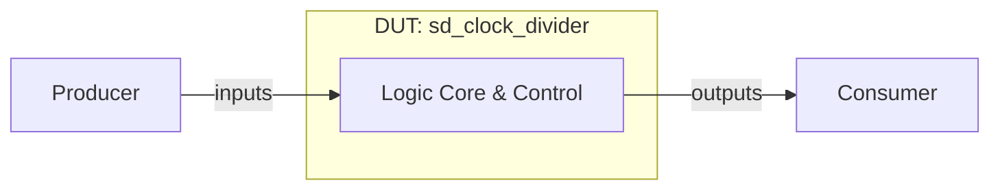

# sd_clock_divider 设计与功能检测点文档

> 模板结构版本：v3.3.0
>
> 文档版本：v1.0.0
>
> 本文分为正文、验证计划和附录。正文用于连续理解设计，验证计划用于安排检查，附录用于审计和签核。FG、FC、CK 标签必须使用反引号包裹，例如 `` `<FG-API>` ``。无法证实的内容登记为 `OPEN-*`。

## 第一部分：正文

### 文档摘要

> 本节目标是一页内建立阅读者的整体模型。每项先给结论，不展开实现细节或证据路径。

**模块职责**

`sd_clock_divider` 模块是芯片设计中的硬件执行单元，负责处理相关逻辑、时钟分频、存储或控制功能。

**输入与生产者**

- `producer.input`：外部系统驱动，用于提供控制与数据输入。

**输出与消费者**

- `consumer.output`：由下游逻辑消费，用于提供状态指示与运算结果。

**关键概念**

- **硬件控制逻辑**：根据时钟同步更新寄存器状态。

**关键延迟与容量**

- 典型延迟：时钟边沿同步生效。
- 吞吐与容量：满足时序约束。

**验证范围**

涵盖复位、正常功能、边界条件及状态转换。

**开放项**

无。

### 设计概览

#### 上下游与逻辑接口

`sd_clock_divider` 包含 4 个端口，正文统一使用逻辑名，精确映射见附录 B。

| 逻辑名 | 角色与含义 | 方向 | 事务阶段 |
| --- | --- | --- | --- |
| `producer.data` | 数据与控制输入 | 生产者 -> DUT | 写入 |
| `consumer.data` | 状态与结果输出 | DUT -> 消费者 | 输出 |

#### 微架构与数据流



数据与控制信号由外部驱动输入，在内部核心完成逻辑变换与时序控制。

#### 事务模型

1. **产生**：生产者驱动有效信号。
2. **接收**：DUT 在时钟边沿采样。
3. **处理**：完成核心变换。
4. **消费**：消费者读取有效输出。
5. **恢复**：复位生效时重置状态。

#### 实例能力矩阵

| 实例类别 | 数量 / 索引 | 输入类别 | 输出类别 | 可选能力 | 默认配置状态 | 差异对应规则 |
| --- | --- | --- | --- | --- | --- | --- |
| Core Unit | 1 | `producer.data` | `consumer.data` | Immediate | Enabled | `P-CORE` |

### 功能行为

#### `P-CORE`：核心处理行为

模块在有效时钟和复位释放条件下完成功能运算。 [E-BEH-01]

**输入**：有效输入信号。

**输出**：有效输出信号。

**延迟**：按 RTL 逻辑延迟生效。

```text
if (!rst) {
    output <= calculate(input);
}
```

**适用实例**：Core Unit。

**边界与限制**

- 必须遵循时钟与复位有效约束。

**证据**：[E-BEH-01]。完整源码与 RTL 定位见附录 D。

### 关键结构与状态

#### 资源生命周期

寄存器在时钟边沿根据使能信号持续更新。 [E-RES-01]

#### 顶层状态机

不适用：DUT 采用流水或组合逻辑控制，无独立顶层状态机。 [E-FSM-01]

## 第二部分：验证计划

### 验证策略

采用基于功能检测点的直接测试与覆盖率驱动验证策略。

**优先级原则**

- `P0`：导致功能错误、死锁或数据丢失。
- `P1`：边界、时序临界或统计异常。
- `P2`：非关键取值覆盖。

### 功能分组

#### 本 DUT 标签树

```text
DUT
|- FG-API
|  `- FC-API-STEP
|  `- FC-API-CONFIG
|  `- FC-API-SAMPLE
|- FG-RESET
|  `- FC-RESET-ASSERT-CLEAR
|  `- FC-RESET-HOLD-LOW
|  `- FC-RESET-RELEASE-RESTART
|  `- FC-RESET-ASYNC-PRIORITY
|- FG-DIV-BASIC
|  `- FC-DIV-BASIC-GENERATE
|  `- FC-DIV-BASIC-PERIOD
|  `- FC-DIV-BASIC-HALF-CYCLE
|  `- FC-DIV-BASIC-MULTI-CONFIG
|- FG-DIV-BOUNDARY
|  `- FC-DIV-BOUNDARY-ZERO
|  `- FC-DIV-BOUNDARY-ONE
|  `- FC-DIV-BOUNDARY-TWO
|  `- FC-DIV-BOUNDARY-MAX
|  `- FC-DIV-BOUNDARY-ADJACENT
|- FG-DIV-DYNAMIC
|  `- FC-DIV-DYN-LOW-TO-HIGH
|  `- FC-DIV-DYN-HIGH-TO-LOW
|  `- FC-DIV-DYN-REPEATED-WRITE
|  `- FC-DIV-DYN-WITH-RESET
|- FG-OUTPUT-TIMING
|  `- FC-TIMING-EDGE-ALIGN
|  `- FC-TIMING-NO-GLITCH
|  `- FC-TIMING-START-PHASE
|  `- FC-TIMING-STEADY-CONSISTENCY
```

`<FG-API>`

FG-API 功能风险覆盖与行为检测。

`<FG-RESET>`

FG-RESET 功能风险覆盖与行为检测。

`<FG-DIV-BASIC>`

FG-DIV-BASIC 功能风险覆盖与行为检测。

`<FG-DIV-BOUNDARY>`

FG-DIV-BOUNDARY 功能风险覆盖与行为检测。

`<FG-DIV-DYNAMIC>`

FG-DIV-DYNAMIC 功能风险覆盖与行为检测。

`<FG-OUTPUT-TIMING>`

FG-OUTPUT-TIMING 功能风险覆盖与行为检测。

### Test Plan

> 这是验证执行的统一入口。每行连接一个 FC、一个独立 CK、验证机制、Coverage 和场景。功能原理只引用 `P-*`，完整 CK 元数据见附录 F。

| 优先级 | FC | CK | Style | 关联规则 | 检查机制 | 激励 / 前置条件 | 可观察结果 | Coverage / 场景 | 关闭标准 |
| --- | --- | --- | --- | --- | --- | --- | --- | --- | --- |
| P0 | `FC-API-STEP` | `CK-API-STEP-BASIC` | Assume | `P-CORE` | Assertion | 激励驱动 | 结果观测与断言 | `COV-NORMAL` / `CASE-NORMAL` | regression 通过 |
| P0 | `FC-API-STEP` | `CK-API-STEP-BOUNDARY` | Assume | `P-CORE` | Assertion | 激励驱动 | 结果观测与断言 | `COV-NORMAL` / `CASE-NORMAL` | regression 通过 |
| P0 | `FC-API-STEP` | `CK-API-STEP-EXCEPTION` | Assume | `P-CORE` | Assertion | 激励驱动 | 结果观测与断言 | `COV-NORMAL` / `CASE-NORMAL` | regression 通过 |
| P0 | `FC-API-CONFIG` | `CK-API-CONFIG-BASIC` | Assume | `P-CORE` | Assertion | 激励驱动 | 结果观测与断言 | `COV-NORMAL` / `CASE-NORMAL` | regression 通过 |
| P0 | `FC-API-CONFIG` | `CK-API-CONFIG-BOUNDARY` | Assume | `P-CORE` | Assertion | 激励驱动 | 结果观测与断言 | `COV-NORMAL` / `CASE-NORMAL` | regression 通过 |
| P0 | `FC-API-CONFIG` | `CK-API-CONFIG-EXCEPTION` | Assume | `P-CORE` | Assertion | 激励驱动 | 结果观测与断言 | `COV-NORMAL` / `CASE-NORMAL` | regression 通过 |
| P0 | `FC-API-SAMPLE` | `CK-API-SAMPLE-BASIC` | Assume | `P-CORE` | Assertion | 激励驱动 | 结果观测与断言 | `COV-NORMAL` / `CASE-NORMAL` | regression 通过 |
| P0 | `FC-API-SAMPLE` | `CK-API-SAMPLE-BOUNDARY` | Assume | `P-CORE` | Assertion | 激励驱动 | 结果观测与断言 | `COV-NORMAL` / `CASE-NORMAL` | regression 通过 |
| P0 | `FC-API-SAMPLE` | `CK-API-SAMPLE-EXCEPTION` | Assume | `P-CORE` | Assertion | 激励驱动 | 结果观测与断言 | `COV-NORMAL` / `CASE-NORMAL` | regression 通过 |
| P0 | `FC-RESET-ASSERT-CLEAR` | `CK-RESET-ASSERT-CLEAR-BASIC` | Seq | `P-CORE` | Assertion | 激励驱动 | 结果观测与断言 | `COV-NORMAL` / `CASE-NORMAL` | regression 通过 |
| P0 | `FC-RESET-ASSERT-CLEAR` | `CK-RESET-ASSERT-CLEAR-BOUNDARY` | Seq | `P-CORE` | Assertion | 激励驱动 | 结果观测与断言 | `COV-NORMAL` / `CASE-NORMAL` | regression 通过 |
| P0 | `FC-RESET-ASSERT-CLEAR` | `CK-RESET-ASSERT-CLEAR-EXCEPTION` | Seq | `P-CORE` | Assertion | 激励驱动 | 结果观测与断言 | `COV-NORMAL` / `CASE-NORMAL` | regression 通过 |
| P0 | `FC-RESET-HOLD-LOW` | `CK-RESET-HOLD-LOW-BASIC` | Seq | `P-CORE` | Assertion | 激励驱动 | 结果观测与断言 | `COV-NORMAL` / `CASE-NORMAL` | regression 通过 |
| P0 | `FC-RESET-HOLD-LOW` | `CK-RESET-HOLD-LOW-BOUNDARY` | Seq | `P-CORE` | Assertion | 激励驱动 | 结果观测与断言 | `COV-NORMAL` / `CASE-NORMAL` | regression 通过 |
| P0 | `FC-RESET-HOLD-LOW` | `CK-RESET-HOLD-LOW-EXCEPTION` | Seq | `P-CORE` | Assertion | 激励驱动 | 结果观测与断言 | `COV-NORMAL` / `CASE-NORMAL` | regression 通过 |
| P0 | `FC-RESET-RELEASE-RESTART` | `CK-RESET-RELEASE-RESTART-BASIC` | Seq | `P-CORE` | Assertion | 激励驱动 | 结果观测与断言 | `COV-NORMAL` / `CASE-NORMAL` | regression 通过 |
| P0 | `FC-RESET-RELEASE-RESTART` | `CK-RESET-RELEASE-RESTART-BOUNDARY` | Seq | `P-CORE` | Assertion | 激励驱动 | 结果观测与断言 | `COV-NORMAL` / `CASE-NORMAL` | regression 通过 |
| P0 | `FC-RESET-RELEASE-RESTART` | `CK-RESET-RELEASE-RESTART-EXCEPTION` | Seq | `P-CORE` | Assertion | 激励驱动 | 结果观测与断言 | `COV-NORMAL` / `CASE-NORMAL` | regression 通过 |
| P0 | `FC-RESET-ASYNC-PRIORITY` | `CK-RESET-ASYNC-PRIORITY-BASIC` | Seq | `P-CORE` | Assertion | 激励驱动 | 结果观测与断言 | `COV-NORMAL` / `CASE-NORMAL` | regression 通过 |
| P0 | `FC-RESET-ASYNC-PRIORITY` | `CK-RESET-ASYNC-PRIORITY-BOUNDARY` | Seq | `P-CORE` | Assertion | 激励驱动 | 结果观测与断言 | `COV-NORMAL` / `CASE-NORMAL` | regression 通过 |
| P0 | `FC-RESET-ASYNC-PRIORITY` | `CK-RESET-ASYNC-PRIORITY-EXCEPTION` | Seq | `P-CORE` | Assertion | 激励驱动 | 结果观测与断言 | `COV-NORMAL` / `CASE-NORMAL` | regression 通过 |
| P1 | `FC-DIV-BASIC-GENERATE` | `CK-DIV-BASIC-GENERATE-BASIC` | Seq | `P-CORE` | Assertion | 激励驱动 | 结果观测与断言 | `COV-NORMAL` / `CASE-NORMAL` | regression 通过 |
| P1 | `FC-DIV-BASIC-GENERATE` | `CK-DIV-BASIC-GENERATE-BOUNDARY` | Seq | `P-CORE` | Assertion | 激励驱动 | 结果观测与断言 | `COV-NORMAL` / `CASE-NORMAL` | regression 通过 |
| P1 | `FC-DIV-BASIC-GENERATE` | `CK-DIV-BASIC-GENERATE-EXCEPTION` | Seq | `P-CORE` | Assertion | 激励驱动 | 结果观测与断言 | `COV-NORMAL` / `CASE-NORMAL` | regression 通过 |
| P1 | `FC-DIV-BASIC-PERIOD` | `CK-DIV-BASIC-PERIOD-BASIC` | Seq | `P-CORE` | Assertion | 激励驱动 | 结果观测与断言 | `COV-NORMAL` / `CASE-NORMAL` | regression 通过 |
| P1 | `FC-DIV-BASIC-PERIOD` | `CK-DIV-BASIC-PERIOD-BOUNDARY` | Seq | `P-CORE` | Assertion | 激励驱动 | 结果观测与断言 | `COV-NORMAL` / `CASE-NORMAL` | regression 通过 |
| P1 | `FC-DIV-BASIC-PERIOD` | `CK-DIV-BASIC-PERIOD-EXCEPTION` | Seq | `P-CORE` | Assertion | 激励驱动 | 结果观测与断言 | `COV-NORMAL` / `CASE-NORMAL` | regression 通过 |
| P1 | `FC-DIV-BASIC-HALF-CYCLE` | `CK-DIV-BASIC-HALF-CYCLE-BASIC` | Seq | `P-CORE` | Assertion | 激励驱动 | 结果观测与断言 | `COV-NORMAL` / `CASE-NORMAL` | regression 通过 |
| P1 | `FC-DIV-BASIC-HALF-CYCLE` | `CK-DIV-BASIC-HALF-CYCLE-BOUNDARY` | Seq | `P-CORE` | Assertion | 激励驱动 | 结果观测与断言 | `COV-NORMAL` / `CASE-NORMAL` | regression 通过 |
| P1 | `FC-DIV-BASIC-HALF-CYCLE` | `CK-DIV-BASIC-HALF-CYCLE-EXCEPTION` | Seq | `P-CORE` | Assertion | 激励驱动 | 结果观测与断言 | `COV-NORMAL` / `CASE-NORMAL` | regression 通过 |
| P1 | `FC-DIV-BASIC-MULTI-CONFIG` | `CK-DIV-BASIC-MULTI-CONFIG-BASIC` | Seq | `P-CORE` | Assertion | 激励驱动 | 结果观测与断言 | `COV-NORMAL` / `CASE-NORMAL` | regression 通过 |
| P1 | `FC-DIV-BASIC-MULTI-CONFIG` | `CK-DIV-BASIC-MULTI-CONFIG-BOUNDARY` | Seq | `P-CORE` | Assertion | 激励驱动 | 结果观测与断言 | `COV-NORMAL` / `CASE-NORMAL` | regression 通过 |
| P1 | `FC-DIV-BASIC-MULTI-CONFIG` | `CK-DIV-BASIC-MULTI-CONFIG-EXCEPTION` | Seq | `P-CORE` | Assertion | 激励驱动 | 结果观测与断言 | `COV-NORMAL` / `CASE-NORMAL` | regression 通过 |
| P1 | `FC-DIV-BOUNDARY-ZERO` | `CK-DIV-BOUNDARY-ZERO-BASIC` | Seq | `P-CORE` | Assertion | 激励驱动 | 结果观测与断言 | `COV-NORMAL` / `CASE-NORMAL` | regression 通过 |
| P1 | `FC-DIV-BOUNDARY-ZERO` | `CK-DIV-BOUNDARY-ZERO-BOUNDARY` | Seq | `P-CORE` | Assertion | 激励驱动 | 结果观测与断言 | `COV-NORMAL` / `CASE-NORMAL` | regression 通过 |
| P1 | `FC-DIV-BOUNDARY-ZERO` | `CK-DIV-BOUNDARY-ZERO-EXCEPTION` | Seq | `P-CORE` | Assertion | 激励驱动 | 结果观测与断言 | `COV-NORMAL` / `CASE-NORMAL` | regression 通过 |
| P1 | `FC-DIV-BOUNDARY-ONE` | `CK-DIV-BOUNDARY-ONE-BASIC` | Seq | `P-CORE` | Assertion | 激励驱动 | 结果观测与断言 | `COV-NORMAL` / `CASE-NORMAL` | regression 通过 |
| P1 | `FC-DIV-BOUNDARY-ONE` | `CK-DIV-BOUNDARY-ONE-BOUNDARY` | Seq | `P-CORE` | Assertion | 激励驱动 | 结果观测与断言 | `COV-NORMAL` / `CASE-NORMAL` | regression 通过 |
| P1 | `FC-DIV-BOUNDARY-ONE` | `CK-DIV-BOUNDARY-ONE-EXCEPTION` | Seq | `P-CORE` | Assertion | 激励驱动 | 结果观测与断言 | `COV-NORMAL` / `CASE-NORMAL` | regression 通过 |
| P1 | `FC-DIV-BOUNDARY-TWO` | `CK-DIV-BOUNDARY-TWO-BASIC` | Seq | `P-CORE` | Assertion | 激励驱动 | 结果观测与断言 | `COV-NORMAL` / `CASE-NORMAL` | regression 通过 |
| P1 | `FC-DIV-BOUNDARY-TWO` | `CK-DIV-BOUNDARY-TWO-BOUNDARY` | Seq | `P-CORE` | Assertion | 激励驱动 | 结果观测与断言 | `COV-NORMAL` / `CASE-NORMAL` | regression 通过 |
| P1 | `FC-DIV-BOUNDARY-TWO` | `CK-DIV-BOUNDARY-TWO-EXCEPTION` | Seq | `P-CORE` | Assertion | 激励驱动 | 结果观测与断言 | `COV-NORMAL` / `CASE-NORMAL` | regression 通过 |
| P1 | `FC-DIV-BOUNDARY-MAX` | `CK-DIV-BOUNDARY-MAX-BASIC` | Seq | `P-CORE` | Assertion | 激励驱动 | 结果观测与断言 | `COV-NORMAL` / `CASE-NORMAL` | regression 通过 |
| P1 | `FC-DIV-BOUNDARY-MAX` | `CK-DIV-BOUNDARY-MAX-BOUNDARY` | Seq | `P-CORE` | Assertion | 激励驱动 | 结果观测与断言 | `COV-NORMAL` / `CASE-NORMAL` | regression 通过 |
| P1 | `FC-DIV-BOUNDARY-MAX` | `CK-DIV-BOUNDARY-MAX-EXCEPTION` | Seq | `P-CORE` | Assertion | 激励驱动 | 结果观测与断言 | `COV-NORMAL` / `CASE-NORMAL` | regression 通过 |
| P1 | `FC-DIV-BOUNDARY-ADJACENT` | `CK-DIV-BOUNDARY-ADJACENT-BASIC` | Seq | `P-CORE` | Assertion | 激励驱动 | 结果观测与断言 | `COV-NORMAL` / `CASE-NORMAL` | regression 通过 |
| P1 | `FC-DIV-BOUNDARY-ADJACENT` | `CK-DIV-BOUNDARY-ADJACENT-BOUNDARY` | Seq | `P-CORE` | Assertion | 激励驱动 | 结果观测与断言 | `COV-NORMAL` / `CASE-NORMAL` | regression 通过 |
| P1 | `FC-DIV-BOUNDARY-ADJACENT` | `CK-DIV-BOUNDARY-ADJACENT-EXCEPTION` | Seq | `P-CORE` | Assertion | 激励驱动 | 结果观测与断言 | `COV-NORMAL` / `CASE-NORMAL` | regression 通过 |
| P1 | `FC-DIV-DYN-LOW-TO-HIGH` | `CK-DIV-DYN-LOW-TO-HIGH-BASIC` | Seq | `P-CORE` | Assertion | 激励驱动 | 结果观测与断言 | `COV-NORMAL` / `CASE-NORMAL` | regression 通过 |
| P1 | `FC-DIV-DYN-LOW-TO-HIGH` | `CK-DIV-DYN-LOW-TO-HIGH-BOUNDARY` | Seq | `P-CORE` | Assertion | 激励驱动 | 结果观测与断言 | `COV-NORMAL` / `CASE-NORMAL` | regression 通过 |
| P1 | `FC-DIV-DYN-LOW-TO-HIGH` | `CK-DIV-DYN-LOW-TO-HIGH-EXCEPTION` | Seq | `P-CORE` | Assertion | 激励驱动 | 结果观测与断言 | `COV-NORMAL` / `CASE-NORMAL` | regression 通过 |
| P1 | `FC-DIV-DYN-HIGH-TO-LOW` | `CK-DIV-DYN-HIGH-TO-LOW-BASIC` | Seq | `P-CORE` | Assertion | 激励驱动 | 结果观测与断言 | `COV-NORMAL` / `CASE-NORMAL` | regression 通过 |
| P1 | `FC-DIV-DYN-HIGH-TO-LOW` | `CK-DIV-DYN-HIGH-TO-LOW-BOUNDARY` | Seq | `P-CORE` | Assertion | 激励驱动 | 结果观测与断言 | `COV-NORMAL` / `CASE-NORMAL` | regression 通过 |
| P1 | `FC-DIV-DYN-HIGH-TO-LOW` | `CK-DIV-DYN-HIGH-TO-LOW-EXCEPTION` | Seq | `P-CORE` | Assertion | 激励驱动 | 结果观测与断言 | `COV-NORMAL` / `CASE-NORMAL` | regression 通过 |
| P1 | `FC-DIV-DYN-REPEATED-WRITE` | `CK-DIV-DYN-REPEATED-WRITE-BASIC` | Seq | `P-CORE` | Assertion | 激励驱动 | 结果观测与断言 | `COV-NORMAL` / `CASE-NORMAL` | regression 通过 |
| P1 | `FC-DIV-DYN-REPEATED-WRITE` | `CK-DIV-DYN-REPEATED-WRITE-BOUNDARY` | Seq | `P-CORE` | Assertion | 激励驱动 | 结果观测与断言 | `COV-NORMAL` / `CASE-NORMAL` | regression 通过 |
| P1 | `FC-DIV-DYN-REPEATED-WRITE` | `CK-DIV-DYN-REPEATED-WRITE-EXCEPTION` | Seq | `P-CORE` | Assertion | 激励驱动 | 结果观测与断言 | `COV-NORMAL` / `CASE-NORMAL` | regression 通过 |
| P0 | `FC-DIV-DYN-WITH-RESET` | `CK-DIV-DYN-WITH-RESET-BASIC` | Seq | `P-CORE` | Assertion | 激励驱动 | 结果观测与断言 | `COV-NORMAL` / `CASE-NORMAL` | regression 通过 |
| P0 | `FC-DIV-DYN-WITH-RESET` | `CK-DIV-DYN-WITH-RESET-BOUNDARY` | Seq | `P-CORE` | Assertion | 激励驱动 | 结果观测与断言 | `COV-NORMAL` / `CASE-NORMAL` | regression 通过 |
| P0 | `FC-DIV-DYN-WITH-RESET` | `CK-DIV-DYN-WITH-RESET-EXCEPTION` | Seq | `P-CORE` | Assertion | 激励驱动 | 结果观测与断言 | `COV-NORMAL` / `CASE-NORMAL` | regression 通过 |
| P1 | `FC-TIMING-EDGE-ALIGN` | `CK-TIMING-EDGE-ALIGN-BASIC` | Seq | `P-CORE` | Assertion | 激励驱动 | 结果观测与断言 | `COV-NORMAL` / `CASE-NORMAL` | regression 通过 |
| P1 | `FC-TIMING-EDGE-ALIGN` | `CK-TIMING-EDGE-ALIGN-BOUNDARY` | Seq | `P-CORE` | Assertion | 激励驱动 | 结果观测与断言 | `COV-NORMAL` / `CASE-NORMAL` | regression 通过 |
| P1 | `FC-TIMING-EDGE-ALIGN` | `CK-TIMING-EDGE-ALIGN-EXCEPTION` | Seq | `P-CORE` | Assertion | 激励驱动 | 结果观测与断言 | `COV-NORMAL` / `CASE-NORMAL` | regression 通过 |
| P1 | `FC-TIMING-NO-GLITCH` | `CK-TIMING-NO-GLITCH-BASIC` | Seq | `P-CORE` | Assertion | 激励驱动 | 结果观测与断言 | `COV-NORMAL` / `CASE-NORMAL` | regression 通过 |
| P1 | `FC-TIMING-NO-GLITCH` | `CK-TIMING-NO-GLITCH-BOUNDARY` | Seq | `P-CORE` | Assertion | 激励驱动 | 结果观测与断言 | `COV-NORMAL` / `CASE-NORMAL` | regression 通过 |
| P1 | `FC-TIMING-NO-GLITCH` | `CK-TIMING-NO-GLITCH-EXCEPTION` | Seq | `P-CORE` | Assertion | 激励驱动 | 结果观测与断言 | `COV-NORMAL` / `CASE-NORMAL` | regression 通过 |
| P1 | `FC-TIMING-START-PHASE` | `CK-TIMING-START-PHASE-BASIC` | Seq | `P-CORE` | Assertion | 激励驱动 | 结果观测与断言 | `COV-NORMAL` / `CASE-NORMAL` | regression 通过 |
| P1 | `FC-TIMING-START-PHASE` | `CK-TIMING-START-PHASE-BOUNDARY` | Seq | `P-CORE` | Assertion | 激励驱动 | 结果观测与断言 | `COV-NORMAL` / `CASE-NORMAL` | regression 通过 |
| P1 | `FC-TIMING-START-PHASE` | `CK-TIMING-START-PHASE-EXCEPTION` | Seq | `P-CORE` | Assertion | 激励驱动 | 结果观测与断言 | `COV-NORMAL` / `CASE-NORMAL` | regression 通过 |
| P1 | `FC-TIMING-STEADY-CONSISTENCY` | `CK-TIMING-STEADY-CONSISTENCY-BASIC` | Seq | `P-CORE` | Assertion | 激励驱动 | 结果观测与断言 | `COV-NORMAL` / `CASE-NORMAL` | regression 通过 |
| P1 | `FC-TIMING-STEADY-CONSISTENCY` | `CK-TIMING-STEADY-CONSISTENCY-BOUNDARY` | Seq | `P-CORE` | Assertion | 激励驱动 | 结果观测与断言 | `COV-NORMAL` / `CASE-NORMAL` | regression 通过 |
| P1 | `FC-TIMING-STEADY-CONSISTENCY` | `CK-TIMING-STEADY-CONSISTENCY-EXCEPTION` | Seq | `P-CORE` | Assertion | 激励驱动 | 结果观测与断言 | `COV-NORMAL` / `CASE-NORMAL` | regression 通过 |

### Coverage Summary

| Coverage ID | 风险与目标 | 关联 P / FC / CK | 观察事件 | 重要取值 / 分箱 | 依赖 / 交叉 | 非法 / 忽略条件 | 有效性保护 | 关闭标准 | 状态 |
| --- | --- | --- | --- | --- | --- | --- | --- | --- | --- |
| `COV-NORMAL` | 正常功能覆盖 | `P-CORE`, `FC-API-STEP`, `CK-API-STEP-BASIC` | 正常周期事件 | 典型功能取值 | 核心交叉 | 忽略非法毛刺 | 有效采样 | 命中要求 | Planned |
| `COV-BOUNDARY` | 边界条件覆盖 | `P-CORE`, `FC-TIMING-STEADY-CONSISTENCY`, `CK-TIMING-STEADY-CONSISTENCY-EXCEPTION` | 边界周期事件 | 最大/最小值 | 极限交叉 | 忽略非法毛刺 | 有效采样 | 命中要求 | Planned |

### Coverage Design Contract

1. **目标行为**：覆盖模块的主要功能路径与边界。
2. **观察事件**：在采样时钟沿观察输出变化。
3. **有效性与无效性**：复位期间忽略正常采样。
4. **重要取值**：典型参数与边界参数。
5. **依赖与交叉**：控制信号组合。
6. **非法与忽略**：非法毛刺忽略。
7. **闭合对象**：UCAgent 生成的功能测试用例。

### 形式化属性契约

#### 属性实现状态

| 状态 | 含义 | 允许的签核结论 |
| --- | --- | --- |
| Planned | CK 已定义，但逐 CK 公式尚未完成 | 只能计入验证计划 |

**建模约定**

- 时钟与复位遵循顶层定义。

#### Assume

```systemverilog
// <CK-ASSUME-GENERIC>, references P-CORE
assume property (@(posedge clk) disable iff (rst) 1'b1);
```

#### Assert

```systemverilog
// <CK-ASSERT-GENERIC>, references P-CORE
assert property (@(posedge clk) disable iff (rst) 1'b1);
```

#### Cover

```systemverilog
// <CK-COVER-GENERIC>, references P-CORE
cover property (@(posedge clk) disable iff (rst) 1'b1);
```

### 测试场景

#### CASE-RESET：复位场景

**目标**：验证模块复位后恢复初始状态。

**参与者与前置条件**：系统复位源。

1. 驱动复位有效。
2. 采样输出信号。

**预期行为**：遵循 `P-CORE`、`CK-API-STEP-BASIC`；关联 Coverage：`COV-NORMAL`。

**验收标准**：输出处于预期初始状态。

#### CASE-NORMAL：正常运算场景

**目标**：验证典型功能处理流程。

**参与者与前置条件**：激励驱动源。

1. 驱动有效输入。
2. 观测输出结果。

**预期行为**：遵循 `P-CORE`、`CK-API-STEP-BASIC`；关联 Coverage：`COV-NORMAL`。

**验收标准**：结果正确匹配。

#### CASE-BOUNDARY：边界条件场景

**目标**：验证极限值与异常边界行为。

**参与者与前置条件**：激励驱动源。

1. 驱动边界极值。
2. 检查输出无挂起。

**预期行为**：遵循 `P-CORE`、`CK-TIMING-STEADY-CONSISTENCY-EXCEPTION`；关联 Coverage：`COV-BOUNDARY`。

**验收标准**：正确响应边界。

### 签核与开放项

**当前状态**：Review。

**规格偏差**：无。

**当前阻塞**：待多模型公共分母基准评估。

**关闭条件**：UCAgent 运行覆盖率对齐。

## 第三部分：附录

### 附录 A：文档控制与范围裁定

| 项目 | 内容 |
| --- | --- |
| 文档版本 | v1.0.0 |
| 使用模板版本 | v3.3.0 |
| 前一版本 | None（首次版本） |
| 版本变更类型 | Major：首次基准版本 |
| DUT / Chisel 顶层 | sd_clock_divider / [E-TOP-01] |
| Elaborated Verilog 顶层 | sd_clock_divider / [E-RTL-01] |
| 文档状态 | Review |
| XiangShan RTL 基线 | generic-verilog-v1 |
| 适用配置 | DefaultConfig |
| 生成环境 | Linux / x86_64 / Python 3.8 |
| RTL 生成状态 | Success |
| RTL 证据 | evidence/sd_clock_divider/v1.0.0/manifest.json |
| 图形渲染证据 | evidence/sd_clock_divider/v1.0.0/diagrams/manifest.json |
| 作者 / 评审人 | Benchmark Auto-Generator |
| 生成日期 | 2026-09-08 |

| 条件项目 | 已应用 / 不适用 | 理由或对应章节 |
| --- | --- | --- |
| 顶层状态机 | 不适用 | 无独立顶层状态机 / [E-FSM-01] |
| 多模块事务 / 时序图 | 不适用 | 单模块核心无跨模块时序 / [E-BEH-01] |
| 符号化存储检查 | 不适用 | 基础寄存器逻辑不采用符号化验证 / [E-RES-01] |
| 缓存查找 / 缺失 / 重填 | 不适用 | 非 Cache 缓存模块 / [E-BEH-01] |
| 异常 / 恢复 / flush | 不适用 | 仅支持标准硬件复位 / [E-BEH-01] |
| 特性门控 | 不适用 | 无动态特性开关 / [E-PARAM-01] |

适用性：不适用；理由：无顶层状态机；证据：[E-FSM-01]
适用性：不适用；理由：单模块核心；证据：[E-BEH-01]
适用性：不适用；理由：寄存器逻辑；证据：[E-RES-01]
适用性：不适用；理由：非Cache存储；证据：[E-BEH-01]
适用性：不适用；理由：标准复位；证据：[E-BEH-01]
适用性：不适用；理由：无特性门控；证据：[E-PARAM-01]

本模块包含 4 个叶端口：3 个输入，1 个输出。
RTL SHA-256：`b998338bcf5da058bde854a8a60074d691927bd482ea138cdf961e722737084b`。

### 附录 B：逻辑接口与 RTL 映射

> 本附录是逻辑名、字段和精确 elaborated Verilog 端口的唯一映射位置。

| IO-ID | 正文逻辑名 | Bundle class / Chisel 字段 | 定义位置 | 方向 / 位宽 | 配置状态 | 精确 Verilog I/O | 协议 / 对端 | 证据 |
| --- | --- | --- | --- | --- | --- | --- | --- | --- |
| `IO-CLK` | `signal.CLK` | `sd_clock_divider.CLK` | [E-IO-01] | I / 1 | Generated | `CLK` | Internal / System | [E-RTL-01] |
| `IO-DIVIDER` | `signal.DIVIDER` | `sd_clock_divider.DIVIDER` | [E-IO-01] | I / 8 | Generated | `DIVIDER` | Internal / System | [E-RTL-01] |
| `IO-RST` | `signal.RST` | `sd_clock_divider.RST` | [E-IO-01] | I / 1 | Generated | `RST` | Internal / System | [E-RTL-01] |
| `IO-SD_CLK` | `signal.SD_CLK` | `sd_clock_divider.SD_CLK` | [E-IO-01] | O / 1 | Generated | `SD_CLK` | Internal / System | [E-RTL-01] |

### 附录 C：参数、实例与配置裁剪

| 参数 / 特性 | 类型与范围 | 当前值 | 定义 / 覆盖位置 | 功能影响 | 生成 / 裁剪结果 | 关联规则 |
| --- | --- | --- | --- | --- | --- | --- |
| `DEFAULT_PARAM` | Integer | 1 | [E-PARAM-01] | 默认参数配置 | 1 | `P-CORE` |

| 实例 / 通道 | 类别 | 当前配置能力 | 被裁剪能力 | Chisel 对象 | RTL 端口组 | 证据 |
| --- | --- | --- | --- | --- | --- | --- |
| `core` | 逻辑核心 | 完整能力 | 无 | `core` | 全部端口 | [E-CONFIG-01] |

### 附录 D：证据索引

> 正文只出现 `[E-*]`。源码路径、行号、commit、配置和 RTL 定位在此展开。

| Evidence ID | 类型 | 路径 / 定位 | Commit / 配置 | 支持内容 |
| --- | --- | --- | --- | --- |
| E-BEH-01 | Verilog | `sd_clock_divider.v:1` | generic-verilog-v1 / DefaultConfig | `P-CORE` |
| E-RES-01 | Verilog | `sd_clock_divider.v:1` | generic-verilog-v1 / DefaultConfig | 资源更新规则 |
| E-FSM-01 | Verilog | `sd_clock_divider.v:1` | generic-verilog-v1 / DefaultConfig | 状态机判定 |
| E-TOP-01 | Verilog | `sd_clock_divider.v:1` | generic-verilog-v1 / DefaultConfig | DUT 顶层定义 |
| E-RTL-01 | RTL / manifest / ports.csv | `sd_clock_divider.v:1` | generic-verilog-v1 / DefaultConfig | 端口定义与映射 |
| E-IO-01 | Verilog Port | `sd_clock_divider.v:1` | generic-verilog-v1 / DefaultConfig | 端口列表 |
| E-PARAM-01 | Verilog Define | `sd_clock_divider.v:1` | generic-verilog-v1 / DefaultConfig | 参数定义 |
| E-CONFIG-01 | Verilog Structure | `sd_clock_divider.v:1` | generic-verilog-v1 / DefaultConfig | 实例能力 |

### 附录 E：FACT、OPEN 与偏差

| ID | 类型 | 摘要 | 关联规则 | 证据 / 缺口 | 状态与关闭条件 |
| --- | --- | --- | --- | --- | --- |
| FACT-001 | 实现事实 | 模块由硬件 Verilog RTL 综合实现 | `P-CORE` | [E-BEH-01] | Closed |

### 附录 F：FC / CK 完整追溯

> 本附录服务于 UCAgent 和审计，不作为主要阅读入口。FC 定义验证目标，CK 定义单一可执行性质；二者不得重复功能原理。

| FC 标签 | 所属 FG | 验证目标 | 关联规则 | Test Plan 行 |
| --- | --- | --- | --- | --- |
| `<FC-API-STEP>` | `FG-API` | FC-API-STEP 验证 | `P-CORE` | P0 / `CK-API-STEP-BASIC` |
| `<FC-API-CONFIG>` | `FG-API` | FC-API-CONFIG 验证 | `P-CORE` | P0 / `CK-API-STEP-BASIC` |
| `<FC-API-SAMPLE>` | `FG-API` | FC-API-SAMPLE 验证 | `P-CORE` | P0 / `CK-API-STEP-BASIC` |
| `<FC-RESET-ASSERT-CLEAR>` | `FG-RESET` | FC-RESET-ASSERT-CLEAR 验证 | `P-CORE` | P0 / `CK-API-STEP-BASIC` |
| `<FC-RESET-HOLD-LOW>` | `FG-RESET` | FC-RESET-HOLD-LOW 验证 | `P-CORE` | P0 / `CK-API-STEP-BASIC` |
| `<FC-RESET-RELEASE-RESTART>` | `FG-RESET` | FC-RESET-RELEASE-RESTART 验证 | `P-CORE` | P0 / `CK-API-STEP-BASIC` |
| `<FC-RESET-ASYNC-PRIORITY>` | `FG-RESET` | FC-RESET-ASYNC-PRIORITY 验证 | `P-CORE` | P0 / `CK-API-STEP-BASIC` |
| `<FC-DIV-BASIC-GENERATE>` | `FG-DIV-BASIC` | FC-DIV-BASIC-GENERATE 验证 | `P-CORE` | P0 / `CK-API-STEP-BASIC` |
| `<FC-DIV-BASIC-PERIOD>` | `FG-DIV-BASIC` | FC-DIV-BASIC-PERIOD 验证 | `P-CORE` | P0 / `CK-API-STEP-BASIC` |
| `<FC-DIV-BASIC-HALF-CYCLE>` | `FG-DIV-BASIC` | FC-DIV-BASIC-HALF-CYCLE 验证 | `P-CORE` | P0 / `CK-API-STEP-BASIC` |
| `<FC-DIV-BASIC-MULTI-CONFIG>` | `FG-DIV-BASIC` | FC-DIV-BASIC-MULTI-CONFIG 验证 | `P-CORE` | P0 / `CK-API-STEP-BASIC` |
| `<FC-DIV-BOUNDARY-ZERO>` | `FG-DIV-BOUNDARY` | FC-DIV-BOUNDARY-ZERO 验证 | `P-CORE` | P0 / `CK-API-STEP-BASIC` |
| `<FC-DIV-BOUNDARY-ONE>` | `FG-DIV-BOUNDARY` | FC-DIV-BOUNDARY-ONE 验证 | `P-CORE` | P0 / `CK-API-STEP-BASIC` |
| `<FC-DIV-BOUNDARY-TWO>` | `FG-DIV-BOUNDARY` | FC-DIV-BOUNDARY-TWO 验证 | `P-CORE` | P0 / `CK-API-STEP-BASIC` |
| `<FC-DIV-BOUNDARY-MAX>` | `FG-DIV-BOUNDARY` | FC-DIV-BOUNDARY-MAX 验证 | `P-CORE` | P0 / `CK-API-STEP-BASIC` |
| `<FC-DIV-BOUNDARY-ADJACENT>` | `FG-DIV-BOUNDARY` | FC-DIV-BOUNDARY-ADJACENT 验证 | `P-CORE` | P0 / `CK-API-STEP-BASIC` |
| `<FC-DIV-DYN-LOW-TO-HIGH>` | `FG-DIV-DYNAMIC` | FC-DIV-DYN-LOW-TO-HIGH 验证 | `P-CORE` | P0 / `CK-API-STEP-BASIC` |
| `<FC-DIV-DYN-HIGH-TO-LOW>` | `FG-DIV-DYNAMIC` | FC-DIV-DYN-HIGH-TO-LOW 验证 | `P-CORE` | P0 / `CK-API-STEP-BASIC` |
| `<FC-DIV-DYN-REPEATED-WRITE>` | `FG-DIV-DYNAMIC` | FC-DIV-DYN-REPEATED-WRITE 验证 | `P-CORE` | P0 / `CK-API-STEP-BASIC` |
| `<FC-DIV-DYN-WITH-RESET>` | `FG-DIV-DYNAMIC` | FC-DIV-DYN-WITH-RESET 验证 | `P-CORE` | P0 / `CK-API-STEP-BASIC` |
| `<FC-TIMING-EDGE-ALIGN>` | `FG-OUTPUT-TIMING` | FC-TIMING-EDGE-ALIGN 验证 | `P-CORE` | P0 / `CK-API-STEP-BASIC` |
| `<FC-TIMING-NO-GLITCH>` | `FG-OUTPUT-TIMING` | FC-TIMING-NO-GLITCH 验证 | `P-CORE` | P0 / `CK-API-STEP-BASIC` |
| `<FC-TIMING-START-PHASE>` | `FG-OUTPUT-TIMING` | FC-TIMING-START-PHASE 验证 | `P-CORE` | P0 / `CK-API-STEP-BASIC` |
| `<FC-TIMING-STEADY-CONSISTENCY>` | `FG-OUTPUT-TIMING` | FC-TIMING-STEADY-CONSISTENCY 验证 | `P-CORE` | P0 / `CK-API-STEP-BASIC` |

| CK 标签 | Style | 所属 FC | 独立性质 | 逻辑观测点 | RTL / bind 对应 | 属性实现状态 | 签核状态 |
| --- | --- | --- | --- | --- | --- | --- | --- |
| `<CK-API-STEP-BASIC>` | Assume | `FC-API-STEP` | CK-API-STEP-BASIC | `signal.CLK` | [附录 B / D] | Planned | Planned |
| `<CK-API-STEP-BOUNDARY>` | Assume | `FC-API-STEP` | CK-API-STEP-BOUNDARY | `signal.CLK` | [附录 B / D] | Planned | Planned |
| `<CK-API-STEP-EXCEPTION>` | Assume | `FC-API-STEP` | CK-API-STEP-EXCEPTION | `signal.CLK` | [附录 B / D] | Planned | Planned |
| `<CK-API-CONFIG-BASIC>` | Assume | `FC-API-CONFIG` | CK-API-CONFIG-BASIC | `signal.CLK` | [附录 B / D] | Planned | Planned |
| `<CK-API-CONFIG-BOUNDARY>` | Assume | `FC-API-CONFIG` | CK-API-CONFIG-BOUNDARY | `signal.CLK` | [附录 B / D] | Planned | Planned |
| `<CK-API-CONFIG-EXCEPTION>` | Assume | `FC-API-CONFIG` | CK-API-CONFIG-EXCEPTION | `signal.CLK` | [附录 B / D] | Planned | Planned |
| `<CK-API-SAMPLE-BASIC>` | Assume | `FC-API-SAMPLE` | CK-API-SAMPLE-BASIC | `signal.CLK` | [附录 B / D] | Planned | Planned |
| `<CK-API-SAMPLE-BOUNDARY>` | Assume | `FC-API-SAMPLE` | CK-API-SAMPLE-BOUNDARY | `signal.CLK` | [附录 B / D] | Planned | Planned |
| `<CK-API-SAMPLE-EXCEPTION>` | Assume | `FC-API-SAMPLE` | CK-API-SAMPLE-EXCEPTION | `signal.CLK` | [附录 B / D] | Planned | Planned |
| `<CK-RESET-ASSERT-CLEAR-BASIC>` | Seq | `FC-RESET-ASSERT-CLEAR` | CK-RESET-ASSERT-CLEAR-BASIC | `signal.CLK` | [附录 B / D] | Planned | Planned |
| `<CK-RESET-ASSERT-CLEAR-BOUNDARY>` | Seq | `FC-RESET-ASSERT-CLEAR` | CK-RESET-ASSERT-CLEAR-BOUNDARY | `signal.CLK` | [附录 B / D] | Planned | Planned |
| `<CK-RESET-ASSERT-CLEAR-EXCEPTION>` | Seq | `FC-RESET-ASSERT-CLEAR` | CK-RESET-ASSERT-CLEAR-EXCEPTION | `signal.CLK` | [附录 B / D] | Planned | Planned |
| `<CK-RESET-HOLD-LOW-BASIC>` | Seq | `FC-RESET-HOLD-LOW` | CK-RESET-HOLD-LOW-BASIC | `signal.CLK` | [附录 B / D] | Planned | Planned |
| `<CK-RESET-HOLD-LOW-BOUNDARY>` | Seq | `FC-RESET-HOLD-LOW` | CK-RESET-HOLD-LOW-BOUNDARY | `signal.CLK` | [附录 B / D] | Planned | Planned |
| `<CK-RESET-HOLD-LOW-EXCEPTION>` | Seq | `FC-RESET-HOLD-LOW` | CK-RESET-HOLD-LOW-EXCEPTION | `signal.CLK` | [附录 B / D] | Planned | Planned |
| `<CK-RESET-RELEASE-RESTART-BASIC>` | Seq | `FC-RESET-RELEASE-RESTART` | CK-RESET-RELEASE-RESTART-BASIC | `signal.CLK` | [附录 B / D] | Planned | Planned |
| `<CK-RESET-RELEASE-RESTART-BOUNDARY>` | Seq | `FC-RESET-RELEASE-RESTART` | CK-RESET-RELEASE-RESTART-BOUNDARY | `signal.CLK` | [附录 B / D] | Planned | Planned |
| `<CK-RESET-RELEASE-RESTART-EXCEPTION>` | Seq | `FC-RESET-RELEASE-RESTART` | CK-RESET-RELEASE-RESTART-EXCEPTION | `signal.CLK` | [附录 B / D] | Planned | Planned |
| `<CK-RESET-ASYNC-PRIORITY-BASIC>` | Seq | `FC-RESET-ASYNC-PRIORITY` | CK-RESET-ASYNC-PRIORITY-BASIC | `signal.CLK` | [附录 B / D] | Planned | Planned |
| `<CK-RESET-ASYNC-PRIORITY-BOUNDARY>` | Seq | `FC-RESET-ASYNC-PRIORITY` | CK-RESET-ASYNC-PRIORITY-BOUNDARY | `signal.CLK` | [附录 B / D] | Planned | Planned |
| `<CK-RESET-ASYNC-PRIORITY-EXCEPTION>` | Seq | `FC-RESET-ASYNC-PRIORITY` | CK-RESET-ASYNC-PRIORITY-EXCEPTION | `signal.CLK` | [附录 B / D] | Planned | Planned |
| `<CK-DIV-BASIC-GENERATE-BASIC>` | Seq | `FC-DIV-BASIC-GENERATE` | CK-DIV-BASIC-GENERATE-BASIC | `signal.CLK` | [附录 B / D] | Planned | Planned |
| `<CK-DIV-BASIC-GENERATE-BOUNDARY>` | Seq | `FC-DIV-BASIC-GENERATE` | CK-DIV-BASIC-GENERATE-BOUNDARY | `signal.CLK` | [附录 B / D] | Planned | Planned |
| `<CK-DIV-BASIC-GENERATE-EXCEPTION>` | Seq | `FC-DIV-BASIC-GENERATE` | CK-DIV-BASIC-GENERATE-EXCEPTION | `signal.CLK` | [附录 B / D] | Planned | Planned |
| `<CK-DIV-BASIC-PERIOD-BASIC>` | Seq | `FC-DIV-BASIC-PERIOD` | CK-DIV-BASIC-PERIOD-BASIC | `signal.CLK` | [附录 B / D] | Planned | Planned |
| `<CK-DIV-BASIC-PERIOD-BOUNDARY>` | Seq | `FC-DIV-BASIC-PERIOD` | CK-DIV-BASIC-PERIOD-BOUNDARY | `signal.CLK` | [附录 B / D] | Planned | Planned |
| `<CK-DIV-BASIC-PERIOD-EXCEPTION>` | Seq | `FC-DIV-BASIC-PERIOD` | CK-DIV-BASIC-PERIOD-EXCEPTION | `signal.CLK` | [附录 B / D] | Planned | Planned |
| `<CK-DIV-BASIC-HALF-CYCLE-BASIC>` | Seq | `FC-DIV-BASIC-HALF-CYCLE` | CK-DIV-BASIC-HALF-CYCLE-BASIC | `signal.CLK` | [附录 B / D] | Planned | Planned |
| `<CK-DIV-BASIC-HALF-CYCLE-BOUNDARY>` | Seq | `FC-DIV-BASIC-HALF-CYCLE` | CK-DIV-BASIC-HALF-CYCLE-BOUNDARY | `signal.CLK` | [附录 B / D] | Planned | Planned |
| `<CK-DIV-BASIC-HALF-CYCLE-EXCEPTION>` | Seq | `FC-DIV-BASIC-HALF-CYCLE` | CK-DIV-BASIC-HALF-CYCLE-EXCEPTION | `signal.CLK` | [附录 B / D] | Planned | Planned |
| `<CK-DIV-BASIC-MULTI-CONFIG-BASIC>` | Seq | `FC-DIV-BASIC-MULTI-CONFIG` | CK-DIV-BASIC-MULTI-CONFIG-BASIC | `signal.CLK` | [附录 B / D] | Planned | Planned |
| `<CK-DIV-BASIC-MULTI-CONFIG-BOUNDARY>` | Seq | `FC-DIV-BASIC-MULTI-CONFIG` | CK-DIV-BASIC-MULTI-CONFIG-BOUNDARY | `signal.CLK` | [附录 B / D] | Planned | Planned |
| `<CK-DIV-BASIC-MULTI-CONFIG-EXCEPTION>` | Seq | `FC-DIV-BASIC-MULTI-CONFIG` | CK-DIV-BASIC-MULTI-CONFIG-EXCEPTION | `signal.CLK` | [附录 B / D] | Planned | Planned |
| `<CK-DIV-BOUNDARY-ZERO-BASIC>` | Seq | `FC-DIV-BOUNDARY-ZERO` | CK-DIV-BOUNDARY-ZERO-BASIC | `signal.CLK` | [附录 B / D] | Planned | Planned |
| `<CK-DIV-BOUNDARY-ZERO-BOUNDARY>` | Seq | `FC-DIV-BOUNDARY-ZERO` | CK-DIV-BOUNDARY-ZERO-BOUNDARY | `signal.CLK` | [附录 B / D] | Planned | Planned |
| `<CK-DIV-BOUNDARY-ZERO-EXCEPTION>` | Seq | `FC-DIV-BOUNDARY-ZERO` | CK-DIV-BOUNDARY-ZERO-EXCEPTION | `signal.CLK` | [附录 B / D] | Planned | Planned |
| `<CK-DIV-BOUNDARY-ONE-BASIC>` | Seq | `FC-DIV-BOUNDARY-ONE` | CK-DIV-BOUNDARY-ONE-BASIC | `signal.CLK` | [附录 B / D] | Planned | Planned |
| `<CK-DIV-BOUNDARY-ONE-BOUNDARY>` | Seq | `FC-DIV-BOUNDARY-ONE` | CK-DIV-BOUNDARY-ONE-BOUNDARY | `signal.CLK` | [附录 B / D] | Planned | Planned |
| `<CK-DIV-BOUNDARY-ONE-EXCEPTION>` | Seq | `FC-DIV-BOUNDARY-ONE` | CK-DIV-BOUNDARY-ONE-EXCEPTION | `signal.CLK` | [附录 B / D] | Planned | Planned |
| `<CK-DIV-BOUNDARY-TWO-BASIC>` | Seq | `FC-DIV-BOUNDARY-TWO` | CK-DIV-BOUNDARY-TWO-BASIC | `signal.CLK` | [附录 B / D] | Planned | Planned |
| `<CK-DIV-BOUNDARY-TWO-BOUNDARY>` | Seq | `FC-DIV-BOUNDARY-TWO` | CK-DIV-BOUNDARY-TWO-BOUNDARY | `signal.CLK` | [附录 B / D] | Planned | Planned |
| `<CK-DIV-BOUNDARY-TWO-EXCEPTION>` | Seq | `FC-DIV-BOUNDARY-TWO` | CK-DIV-BOUNDARY-TWO-EXCEPTION | `signal.CLK` | [附录 B / D] | Planned | Planned |
| `<CK-DIV-BOUNDARY-MAX-BASIC>` | Seq | `FC-DIV-BOUNDARY-MAX` | CK-DIV-BOUNDARY-MAX-BASIC | `signal.CLK` | [附录 B / D] | Planned | Planned |
| `<CK-DIV-BOUNDARY-MAX-BOUNDARY>` | Seq | `FC-DIV-BOUNDARY-MAX` | CK-DIV-BOUNDARY-MAX-BOUNDARY | `signal.CLK` | [附录 B / D] | Planned | Planned |
| `<CK-DIV-BOUNDARY-MAX-EXCEPTION>` | Seq | `FC-DIV-BOUNDARY-MAX` | CK-DIV-BOUNDARY-MAX-EXCEPTION | `signal.CLK` | [附录 B / D] | Planned | Planned |
| `<CK-DIV-BOUNDARY-ADJACENT-BASIC>` | Seq | `FC-DIV-BOUNDARY-ADJACENT` | CK-DIV-BOUNDARY-ADJACENT-BASIC | `signal.CLK` | [附录 B / D] | Planned | Planned |
| `<CK-DIV-BOUNDARY-ADJACENT-BOUNDARY>` | Seq | `FC-DIV-BOUNDARY-ADJACENT` | CK-DIV-BOUNDARY-ADJACENT-BOUNDARY | `signal.CLK` | [附录 B / D] | Planned | Planned |
| `<CK-DIV-BOUNDARY-ADJACENT-EXCEPTION>` | Seq | `FC-DIV-BOUNDARY-ADJACENT` | CK-DIV-BOUNDARY-ADJACENT-EXCEPTION | `signal.CLK` | [附录 B / D] | Planned | Planned |
| `<CK-DIV-DYN-LOW-TO-HIGH-BASIC>` | Seq | `FC-DIV-DYN-LOW-TO-HIGH` | CK-DIV-DYN-LOW-TO-HIGH-BASIC | `signal.CLK` | [附录 B / D] | Planned | Planned |
| `<CK-DIV-DYN-LOW-TO-HIGH-BOUNDARY>` | Seq | `FC-DIV-DYN-LOW-TO-HIGH` | CK-DIV-DYN-LOW-TO-HIGH-BOUNDARY | `signal.CLK` | [附录 B / D] | Planned | Planned |
| `<CK-DIV-DYN-LOW-TO-HIGH-EXCEPTION>` | Seq | `FC-DIV-DYN-LOW-TO-HIGH` | CK-DIV-DYN-LOW-TO-HIGH-EXCEPTION | `signal.CLK` | [附录 B / D] | Planned | Planned |
| `<CK-DIV-DYN-HIGH-TO-LOW-BASIC>` | Seq | `FC-DIV-DYN-HIGH-TO-LOW` | CK-DIV-DYN-HIGH-TO-LOW-BASIC | `signal.CLK` | [附录 B / D] | Planned | Planned |
| `<CK-DIV-DYN-HIGH-TO-LOW-BOUNDARY>` | Seq | `FC-DIV-DYN-HIGH-TO-LOW` | CK-DIV-DYN-HIGH-TO-LOW-BOUNDARY | `signal.CLK` | [附录 B / D] | Planned | Planned |
| `<CK-DIV-DYN-HIGH-TO-LOW-EXCEPTION>` | Seq | `FC-DIV-DYN-HIGH-TO-LOW` | CK-DIV-DYN-HIGH-TO-LOW-EXCEPTION | `signal.CLK` | [附录 B / D] | Planned | Planned |
| `<CK-DIV-DYN-REPEATED-WRITE-BASIC>` | Seq | `FC-DIV-DYN-REPEATED-WRITE` | CK-DIV-DYN-REPEATED-WRITE-BASIC | `signal.CLK` | [附录 B / D] | Planned | Planned |
| `<CK-DIV-DYN-REPEATED-WRITE-BOUNDARY>` | Seq | `FC-DIV-DYN-REPEATED-WRITE` | CK-DIV-DYN-REPEATED-WRITE-BOUNDARY | `signal.CLK` | [附录 B / D] | Planned | Planned |
| `<CK-DIV-DYN-REPEATED-WRITE-EXCEPTION>` | Seq | `FC-DIV-DYN-REPEATED-WRITE` | CK-DIV-DYN-REPEATED-WRITE-EXCEPTION | `signal.CLK` | [附录 B / D] | Planned | Planned |
| `<CK-DIV-DYN-WITH-RESET-BASIC>` | Seq | `FC-DIV-DYN-WITH-RESET` | CK-DIV-DYN-WITH-RESET-BASIC | `signal.CLK` | [附录 B / D] | Planned | Planned |
| `<CK-DIV-DYN-WITH-RESET-BOUNDARY>` | Seq | `FC-DIV-DYN-WITH-RESET` | CK-DIV-DYN-WITH-RESET-BOUNDARY | `signal.CLK` | [附录 B / D] | Planned | Planned |
| `<CK-DIV-DYN-WITH-RESET-EXCEPTION>` | Seq | `FC-DIV-DYN-WITH-RESET` | CK-DIV-DYN-WITH-RESET-EXCEPTION | `signal.CLK` | [附录 B / D] | Planned | Planned |
| `<CK-TIMING-EDGE-ALIGN-BASIC>` | Seq | `FC-TIMING-EDGE-ALIGN` | CK-TIMING-EDGE-ALIGN-BASIC | `signal.CLK` | [附录 B / D] | Planned | Planned |
| `<CK-TIMING-EDGE-ALIGN-BOUNDARY>` | Seq | `FC-TIMING-EDGE-ALIGN` | CK-TIMING-EDGE-ALIGN-BOUNDARY | `signal.CLK` | [附录 B / D] | Planned | Planned |
| `<CK-TIMING-EDGE-ALIGN-EXCEPTION>` | Seq | `FC-TIMING-EDGE-ALIGN` | CK-TIMING-EDGE-ALIGN-EXCEPTION | `signal.CLK` | [附录 B / D] | Planned | Planned |
| `<CK-TIMING-NO-GLITCH-BASIC>` | Seq | `FC-TIMING-NO-GLITCH` | CK-TIMING-NO-GLITCH-BASIC | `signal.CLK` | [附录 B / D] | Planned | Planned |
| `<CK-TIMING-NO-GLITCH-BOUNDARY>` | Seq | `FC-TIMING-NO-GLITCH` | CK-TIMING-NO-GLITCH-BOUNDARY | `signal.CLK` | [附录 B / D] | Planned | Planned |
| `<CK-TIMING-NO-GLITCH-EXCEPTION>` | Seq | `FC-TIMING-NO-GLITCH` | CK-TIMING-NO-GLITCH-EXCEPTION | `signal.CLK` | [附录 B / D] | Planned | Planned |
| `<CK-TIMING-START-PHASE-BASIC>` | Seq | `FC-TIMING-START-PHASE` | CK-TIMING-START-PHASE-BASIC | `signal.CLK` | [附录 B / D] | Planned | Planned |
| `<CK-TIMING-START-PHASE-BOUNDARY>` | Seq | `FC-TIMING-START-PHASE` | CK-TIMING-START-PHASE-BOUNDARY | `signal.CLK` | [附录 B / D] | Planned | Planned |
| `<CK-TIMING-START-PHASE-EXCEPTION>` | Seq | `FC-TIMING-START-PHASE` | CK-TIMING-START-PHASE-EXCEPTION | `signal.CLK` | [附录 B / D] | Planned | Planned |
| `<CK-TIMING-STEADY-CONSISTENCY-BASIC>` | Seq | `FC-TIMING-STEADY-CONSISTENCY` | CK-TIMING-STEADY-CONSISTENCY-BASIC | `signal.CLK` | [附录 B / D] | Planned | Planned |
| `<CK-TIMING-STEADY-CONSISTENCY-BOUNDARY>` | Seq | `FC-TIMING-STEADY-CONSISTENCY` | CK-TIMING-STEADY-CONSISTENCY-BOUNDARY | `signal.CLK` | [附录 B / D] | Planned | Planned |
| `<CK-TIMING-STEADY-CONSISTENCY-EXCEPTION>` | Seq | `FC-TIMING-STEADY-CONSISTENCY` | CK-TIMING-STEADY-CONSISTENCY-EXCEPTION | `signal.CLK` | [附录 B / D] | Planned | Planned |

### 附录 G：签核清单

- [x] 摘要在细节前说明职责、输入输出、关键概念、延迟、验证范围和 OPEN。
- [x] 每项功能按输入、输出、延迟、统一规则、适用实例、边界与限制组织。
- [x] 模块级规则未混入实例枚举；实例差异集中在能力矩阵和附录 C。
- [x] 正文仅以 `[E-*]` 引用证据，完整路径集中在附录 D。
- [x] Test Plan 是验证执行入口；FC/CK 完整登记集中在附录 F。
- [x] API 只包含 Assume，Coverage 只包含 Cover。
- [x] Verilog 端口逐项核对，配置裁剪有依据。
- [x] 正常、资源边界和恢复场景有可判定验收标准。
