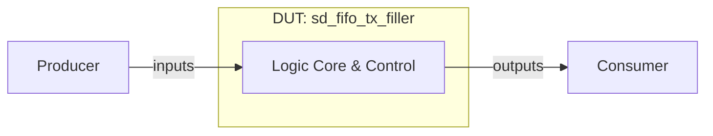

# sd_fifo_tx_filler 设计与功能检测点文档

> 模板结构版本：v3.3.0
>
> 文档版本：v1.0.0
>
> 本文分为正文、验证计划和附录。正文用于连续理解设计，验证计划用于安排检查，附录用于审计和签核。FG、FC、CK 标签必须使用反引号包裹，例如 `` `<FG-API>` ``。无法证实的内容登记为 `OPEN-*`。

## 第一部分：正文

### 文档摘要

> 本节目标是一页内建立阅读者的整体模型。每项先给结论，不展开实现细节或证据路径。

**模块职责**

`sd_fifo_tx_filler` 模块是芯片设计中的硬件执行单元，负责处理相关逻辑、时钟分频、存储或控制功能。

**输入与生产者**

- `producer.input`：外部系统驱动，用于提供控制与数据输入。

**输出与消费者**

- `consumer.output`：由下游逻辑消费，用于提供状态指示与运算结果。

**关键概念**

- **硬件控制逻辑**：根据时钟同步更新寄存器状态。

**关键延迟与容量**

- 典型延迟：时钟边沿同步生效。
- 吞吐与容量：满足时序约束。

**验证范围**

涵盖复位、正常功能、边界条件及状态转换。

**开放项**

无。

### 设计概览

#### 上下游与逻辑接口

`sd_fifo_tx_filler` 包含 17 个端口，正文统一使用逻辑名，精确映射见附录 B。

| 逻辑名 | 角色与含义 | 方向 | 事务阶段 |
| --- | --- | --- | --- |
| `producer.data` | 数据与控制输入 | 生产者 -> DUT | 写入 |
| `consumer.data` | 状态与结果输出 | DUT -> 消费者 | 输出 |

#### 微架构与数据流



数据与控制信号由外部驱动输入，在内部核心完成逻辑变换与时序控制。

#### 事务模型

1. **产生**：生产者驱动有效信号。
2. **接收**：DUT 在时钟边沿采样。
3. **处理**：完成核心变换。
4. **消费**：消费者读取有效输出。
5. **恢复**：复位生效时重置状态。

#### 实例能力矩阵

| 实例类别 | 数量 / 索引 | 输入类别 | 输出类别 | 可选能力 | 默认配置状态 | 差异对应规则 |
| --- | --- | --- | --- | --- | --- | --- |
| Core Unit | 1 | `producer.data` | `consumer.data` | Immediate | Enabled | `P-CORE` |

### 功能行为

#### `P-CORE`：核心处理行为

模块在有效时钟和复位释放条件下完成功能运算。 [E-BEH-01]

**输入**：有效输入信号。

**输出**：有效输出信号。

**延迟**：按 RTL 逻辑延迟生效。

```text
if (!rst) {
    output <= calculate(input);
}
```

**适用实例**：Core Unit。

**边界与限制**

- 必须遵循时钟与复位有效约束。

**证据**：[E-BEH-01]。完整源码与 RTL 定位见附录 D。

### 关键结构与状态

#### 资源生命周期

寄存器在时钟边沿根据使能信号持续更新。 [E-RES-01]

#### 顶层状态机

不适用：DUT 采用流水或组合逻辑控制，无独立顶层状态机。 [E-FSM-01]

## 第二部分：验证计划

### 验证策略

采用基于功能检测点的直接测试与覆盖率驱动验证策略。

**优先级原则**

- `P0`：导致功能错误、死锁或数据丢失。
- `P1`：边界、时序临界或统计异常。
- `P2`：非关键取值覆盖。

### 功能分组

#### 本 DUT 标签树

```text
DUT
|- FG-API
|  `- FC-TEST-API
|- FG-WISHBONE-REQ
|  `- FC-REQ-START
|  `- FC-REQ-HOLD-END
|  `- FC-REQ-SIGNAL-CONST
|- FG-FIFO-WRITE
|  `- FC-WRITE-ON-ACK
|  `- FC-WRITE-CADENCE
|- FG-FIFO-READ
|  `- FC-READ-SEQUENCE
|  `- FC-READ-EMPTY
|  `- FC-READ-DATA-VISIBILITY
|- FG-ADDRESS
|  `- FC-ADDR-INITIAL
|  `- FC-ADDR-INCREMENT
|  `- FC-ADDR-BOUNDARY
|- FG-CONTROL
|  `- FC-ASYNC-RESET
|  `- FC-DISABLE-BEHAVIOR
|  `- FC-RESTART
|- FG-STATUS
|  `- FC-EMPTY-STATUS
|  `- FC-FULL-STATUS
|- FG-CLOCK-DOMAIN
|  `- FC-CD-RATIO
|  `- FC-CD-CONCURRENT
```

`<FG-API>`

FG-API 功能风险覆盖与行为检测。

`<FG-WISHBONE-REQ>`

FG-WISHBONE-REQ 功能风险覆盖与行为检测。

`<FG-FIFO-WRITE>`

FG-FIFO-WRITE 功能风险覆盖与行为检测。

`<FG-FIFO-READ>`

FG-FIFO-READ 功能风险覆盖与行为检测。

`<FG-ADDRESS>`

FG-ADDRESS 功能风险覆盖与行为检测。

`<FG-CONTROL>`

FG-CONTROL 功能风险覆盖与行为检测。

`<FG-STATUS>`

FG-STATUS 功能风险覆盖与行为检测。

`<FG-CLOCK-DOMAIN>`

FG-CLOCK-DOMAIN 功能风险覆盖与行为检测。

### Test Plan

> 这是验证执行的统一入口。每行连接一个 FC、一个独立 CK、验证机制、Coverage 和场景。功能原理只引用 `P-*`，完整 CK 元数据见附录 F。

| 优先级 | FC | CK | Style | 关联规则 | 检查机制 | 激励 / 前置条件 | 可观察结果 | Coverage / 场景 | 关闭标准 |
| --- | --- | --- | --- | --- | --- | --- | --- | --- | --- |
| P0 | `FC-TEST-API` | `CK-RESET-STEP` | Assume | `P-CORE` | Assertion | 激励驱动 | 结果观测与断言 | `COV-NORMAL` / `CASE-NORMAL` | regression 通过 |
| P1 | `FC-TEST-API` | `CK-WB-RESP-DRIVE` | Assume | `P-CORE` | Assertion | 激励驱动 | 结果观测与断言 | `COV-NORMAL` / `CASE-NORMAL` | regression 通过 |
| P1 | `FC-TEST-API` | `CK-FIFO-OBSERVE` | Assume | `P-CORE` | Assertion | 激励驱动 | 结果观测与断言 | `COV-NORMAL` / `CASE-NORMAL` | regression 通过 |
| P1 | `FC-REQ-START` | `CK-ENABLE-NOTFULL` | Seq | `P-CORE` | Assertion | 激励驱动 | 结果观测与断言 | `COV-NORMAL` / `CASE-NORMAL` | regression 通过 |
| P1 | `FC-REQ-START` | `CK-DISABLE-BLOCK` | Seq | `P-CORE` | Assertion | 激励驱动 | 结果观测与断言 | `COV-NORMAL` / `CASE-NORMAL` | regression 通过 |
| P1 | `FC-REQ-START` | `CK-FULL-BLOCK` | Seq | `P-CORE` | Assertion | 激励驱动 | 结果观测与断言 | `COV-NORMAL` / `CASE-NORMAL` | regression 通过 |
| P1 | `FC-REQ-START` | `CK-WAIT-ACK-BLOCK` | Seq | `P-CORE` | Assertion | 激励驱动 | 结果观测与断言 | `COV-NORMAL` / `CASE-NORMAL` | regression 通过 |
| P1 | `FC-REQ-HOLD-END` | `CK-HOLD-BEFORE-ACK` | Seq | `P-CORE` | Assertion | 激励驱动 | 结果观测与断言 | `COV-NORMAL` / `CASE-NORMAL` | regression 通过 |
| P1 | `FC-REQ-HOLD-END` | `CK-DROP-ON-ACK` | Seq | `P-CORE` | Assertion | 激励驱动 | 结果观测与断言 | `COV-NORMAL` / `CASE-NORMAL` | regression 通过 |
| P1 | `FC-REQ-HOLD-END` | `CK-DROP-ON-DISABLE` | Seq | `P-CORE` | Assertion | 激励驱动 | 结果观测与断言 | `COV-NORMAL` / `CASE-NORMAL` | regression 通过 |
| P1 | `FC-REQ-SIGNAL-CONST` | `CK-WE-READONLY` | Seq | `P-CORE` | Assertion | 激励驱动 | 结果观测与断言 | `COV-NORMAL` / `CASE-NORMAL` | regression 通过 |
| P1 | `FC-REQ-SIGNAL-CONST` | `CK-CTI-CONST` | Seq | `P-CORE` | Assertion | 激励驱动 | 结果观测与断言 | `COV-NORMAL` / `CASE-NORMAL` | regression 通过 |
| P1 | `FC-REQ-SIGNAL-CONST` | `CK-BTE-CONST` | Seq | `P-CORE` | Assertion | 激励驱动 | 结果观测与断言 | `COV-NORMAL` / `CASE-NORMAL` | regression 通过 |
| P1 | `FC-WRITE-ON-ACK` | `CK-WR-PULSE-ACK` | Seq | `P-CORE` | Assertion | 激励驱动 | 结果观测与断言 | `COV-NORMAL` / `CASE-NORMAL` | regression 通过 |
| P1 | `FC-WRITE-ON-ACK` | `CK-DATA-CAPTURE` | Seq | `P-CORE` | Assertion | 激励驱动 | 结果观测与断言 | `COV-NORMAL` / `CASE-NORMAL` | regression 通过 |
| P1 | `FC-WRITE-ON-ACK` | `CK-NO-WR-WITHOUT-ACK` | Seq | `P-CORE` | Assertion | 激励驱动 | 结果观测与断言 | `COV-NORMAL` / `CASE-NORMAL` | regression 通过 |
| P1 | `FC-WRITE-CADENCE` | `CK-BACK2BACK-ACK` | Seq | `P-CORE` | Assertion | 激励驱动 | 结果观测与断言 | `COV-NORMAL` / `CASE-NORMAL` | regression 通过 |
| P1 | `FC-WRITE-CADENCE` | `CK-SINGLE-WR-PER-ACK` | Seq | `P-CORE` | Assertion | 激励驱动 | 结果观测与断言 | `COV-NORMAL` / `CASE-NORMAL` | regression 通过 |
| P1 | `FC-WRITE-CADENCE` | `CK-WR-STOP-AFTER-ACK` | Seq | `P-CORE` | Assertion | 激励驱动 | 结果观测与断言 | `COV-NORMAL` / `CASE-NORMAL` | regression 通过 |
| P1 | `FC-READ-SEQUENCE` | `CK-INORDER` | Seq | `P-CORE` | Assertion | 激励驱动 | 结果观测与断言 | `COV-NORMAL` / `CASE-NORMAL` | regression 通过 |
| P1 | `FC-READ-SEQUENCE` | `CK-NO-DUPLICATE` | Seq | `P-CORE` | Assertion | 激励驱动 | 结果观测与断言 | `COV-NORMAL` / `CASE-NORMAL` | regression 通过 |
| P1 | `FC-READ-SEQUENCE` | `CK-NO-SKIP` | Seq | `P-CORE` | Assertion | 激励驱动 | 结果观测与断言 | `COV-NORMAL` / `CASE-NORMAL` | regression 通过 |
| P1 | `FC-READ-EMPTY` | `CK-EMPTY-FLAG` | Seq | `P-CORE` | Assertion | 激励驱动 | 结果观测与断言 | `COV-NORMAL` / `CASE-NORMAL` | regression 通过 |
| P1 | `FC-READ-EMPTY` | `CK-RD-ON-EMPTY` | Seq | `P-CORE` | Assertion | 激励驱动 | 结果观测与断言 | `COV-NORMAL` / `CASE-NORMAL` | regression 通过 |
| P1 | `FC-READ-EMPTY` | `CK-EMPTY-TO-NONEMPTY` | Seq | `P-CORE` | Assertion | 激励驱动 | 结果观测与断言 | `COV-NORMAL` / `CASE-NORMAL` | regression 通过 |
| P1 | `FC-READ-DATA-VISIBILITY` | `CK-DAT-UPDATE-ON-READ` | Seq | `P-CORE` | Assertion | 激励驱动 | 结果观测与断言 | `COV-NORMAL` / `CASE-NORMAL` | regression 通过 |
| P1 | `FC-READ-DATA-VISIBILITY` | `CK-DAT-STABLE-IDLE` | Seq | `P-CORE` | Assertion | 激励驱动 | 结果观测与断言 | `COV-NORMAL` / `CASE-NORMAL` | regression 通过 |
| P1 | `FC-ADDR-INITIAL` | `CK-BASE-ADDR-FIRST` | Seq | `P-CORE` | Assertion | 激励驱动 | 结果观测与断言 | `COV-NORMAL` / `CASE-NORMAL` | regression 通过 |
| P0 | `FC-ADDR-INITIAL` | `CK-ADDR-AFTER-RESET` | Seq | `P-CORE` | Assertion | 激励驱动 | 结果观测与断言 | `COV-NORMAL` / `CASE-NORMAL` | regression 通过 |
| P1 | `FC-ADDR-INITIAL` | `CK-ADDR-AFTER-DISABLE` | Seq | `P-CORE` | Assertion | 激励驱动 | 结果观测与断言 | `COV-NORMAL` / `CASE-NORMAL` | regression 通过 |
| P1 | `FC-ADDR-INCREMENT` | `CK-INCR-ON-ACK` | Seq | `P-CORE` | Assertion | 激励驱动 | 结果观测与断言 | `COV-NORMAL` / `CASE-NORMAL` | regression 通过 |
| P1 | `FC-ADDR-INCREMENT` | `CK-NO-INCR-WITHOUT-ACK` | Seq | `P-CORE` | Assertion | 激励驱动 | 结果观测与断言 | `COV-NORMAL` / `CASE-NORMAL` | regression 通过 |
| P1 | `FC-ADDR-INCREMENT` | `CK-MULTI-TRANSFER-PROGRESS` | Seq | `P-CORE` | Assertion | 激励驱动 | 结果观测与断言 | `COV-NORMAL` / `CASE-NORMAL` | regression 通过 |
| P1 | `FC-ADDR-BOUNDARY` | `CK-HIGH-BASE` | Seq | `P-CORE` | Assertion | 激励驱动 | 结果观测与断言 | `COV-NORMAL` / `CASE-NORMAL` | regression 通过 |
| P1 | `FC-ADDR-BOUNDARY` | `CK-WRAP-OBSERVE` | Seq | `P-CORE` | Assertion | 激励驱动 | 结果观测与断言 | `COV-NORMAL` / `CASE-NORMAL` | regression 通过 |
| P0 | `FC-ASYNC-RESET` | `CK-BUS-RESET` | Seq | `P-CORE` | Assertion | 激励驱动 | 结果观测与断言 | `COV-NORMAL` / `CASE-NORMAL` | regression 通过 |
| P0 | `FC-ASYNC-RESET` | `CK-FIFO-RESET` | Seq | `P-CORE` | Assertion | 激励驱动 | 结果观测与断言 | `COV-NORMAL` / `CASE-NORMAL` | regression 通过 |
| P0 | `FC-ASYNC-RESET` | `CK-PROGRESS-RESET` | Seq | `P-CORE` | Assertion | 激励驱动 | 结果观测与断言 | `COV-NORMAL` / `CASE-NORMAL` | regression 通过 |
| P1 | `FC-DISABLE-BEHAVIOR` | `CK-FIFO-CLEAR-ON-DISABLE` | Seq | `P-CORE` | Assertion | 激励驱动 | 结果观测与断言 | `COV-NORMAL` / `CASE-NORMAL` | regression 通过 |
| P1 | `FC-DISABLE-BEHAVIOR` | `CK-BUS-IDLE-ON-DISABLE` | Seq | `P-CORE` | Assertion | 激励驱动 | 结果观测与断言 | `COV-NORMAL` / `CASE-NORMAL` | regression 通过 |
| P1 | `FC-DISABLE-BEHAVIOR` | `CK-OFFSET-CLEAR-ON-DISABLE` | Seq | `P-CORE` | Assertion | 激励驱动 | 结果观测与断言 | `COV-NORMAL` / `CASE-NORMAL` | regression 通过 |
| P1 | `FC-RESTART` | `CK-REQ-RESTART` | Seq | `P-CORE` | Assertion | 激励驱动 | 结果观测与断言 | `COV-NORMAL` / `CASE-NORMAL` | regression 通过 |
| P1 | `FC-RESTART` | `CK-FIFO-RESTART-EMPTY` | Seq | `P-CORE` | Assertion | 激励驱动 | 结果观测与断言 | `COV-NORMAL` / `CASE-NORMAL` | regression 通过 |
| P1 | `FC-RESTART` | `CK-ADDR-RESTART-FROM-BASE` | Seq | `P-CORE` | Assertion | 激励驱动 | 结果观测与断言 | `COV-NORMAL` / `CASE-NORMAL` | regression 通过 |
| P0 | `FC-EMPTY-STATUS` | `CK-EMPTY-AFTER-RESET` | Seq | `P-CORE` | Assertion | 激励驱动 | 结果观测与断言 | `COV-NORMAL` / `CASE-NORMAL` | regression 通过 |
| P1 | `FC-EMPTY-STATUS` | `CK-EMPTY-CLEAR-ON-WRITE` | Seq | `P-CORE` | Assertion | 激励驱动 | 结果观测与断言 | `COV-NORMAL` / `CASE-NORMAL` | regression 通过 |
| P1 | `FC-EMPTY-STATUS` | `CK-EMPTY-SET-AFTER-DRAIN` | Seq | `P-CORE` | Assertion | 激励驱动 | 结果观测与断言 | `COV-NORMAL` / `CASE-NORMAL` | regression 通过 |
| P1 | `FC-FULL-STATUS` | `CK-FULL-ASSERT` | Seq | `P-CORE` | Assertion | 激励驱动 | 结果观测与断言 | `COV-NORMAL` / `CASE-NORMAL` | regression 通过 |
| P1 | `FC-FULL-STATUS` | `CK-FULL-BACKPRESSURE` | Seq | `P-CORE` | Assertion | 激励驱动 | 结果观测与断言 | `COV-NORMAL` / `CASE-NORMAL` | regression 通过 |
| P1 | `FC-FULL-STATUS` | `CK-FULL-RELEASE` | Seq | `P-CORE` | Assertion | 激励驱动 | 结果观测与断言 | `COV-NORMAL` / `CASE-NORMAL` | regression 通过 |
| P1 | `FC-CD-RATIO` | `CK-CLK-FASTER` | Seq | `P-CORE` | Assertion | 激励驱动 | 结果观测与断言 | `COV-NORMAL` / `CASE-NORMAL` | regression 通过 |
| P1 | `FC-CD-RATIO` | `CK-SDCLK-FASTER` | Seq | `P-CORE` | Assertion | 激励驱动 | 结果观测与断言 | `COV-NORMAL` / `CASE-NORMAL` | regression 通过 |
| P1 | `FC-CD-RATIO` | `CK-SIMILAR-RATE` | Seq | `P-CORE` | Assertion | 激励驱动 | 结果观测与断言 | `COV-NORMAL` / `CASE-NORMAL` | regression 通过 |
| P1 | `FC-CD-CONCURRENT` | `CK-CONCURRENT-RW` | Seq | `P-CORE` | Assertion | 激励驱动 | 结果观测与断言 | `COV-NORMAL` / `CASE-NORMAL` | regression 通过 |
| P1 | `FC-CD-CONCURRENT` | `CK-EMPTY-FULL-TOGGLE` | Seq | `P-CORE` | Assertion | 激励驱动 | 结果观测与断言 | `COV-NORMAL` / `CASE-NORMAL` | regression 通过 |
| P1 | `FC-CD-CONCURRENT` | `CK-NO-DATA-CORRUPTION` | Seq | `P-CORE` | Assertion | 激励驱动 | 结果观测与断言 | `COV-NORMAL` / `CASE-NORMAL` | regression 通过 |

### Coverage Summary

| Coverage ID | 风险与目标 | 关联 P / FC / CK | 观察事件 | 重要取值 / 分箱 | 依赖 / 交叉 | 非法 / 忽略条件 | 有效性保护 | 关闭标准 | 状态 |
| --- | --- | --- | --- | --- | --- | --- | --- | --- | --- |
| `COV-NORMAL` | 正常功能覆盖 | `P-CORE`, `FC-TEST-API`, `CK-RESET-STEP` | 正常周期事件 | 典型功能取值 | 核心交叉 | 忽略非法毛刺 | 有效采样 | 命中要求 | Planned |
| `COV-BOUNDARY` | 边界条件覆盖 | `P-CORE`, `FC-CD-CONCURRENT`, `CK-NO-DATA-CORRUPTION` | 边界周期事件 | 最大/最小值 | 极限交叉 | 忽略非法毛刺 | 有效采样 | 命中要求 | Planned |

### Coverage Design Contract

1. **目标行为**：覆盖模块的主要功能路径与边界。
2. **观察事件**：在采样时钟沿观察输出变化。
3. **有效性与无效性**：复位期间忽略正常采样。
4. **重要取值**：典型参数与边界参数。
5. **依赖与交叉**：控制信号组合。
6. **非法与忽略**：非法毛刺忽略。
7. **闭合对象**：UCAgent 生成的功能测试用例。

### 形式化属性契约

#### 属性实现状态

| 状态 | 含义 | 允许的签核结论 |
| --- | --- | --- |
| Planned | CK 已定义，但逐 CK 公式尚未完成 | 只能计入验证计划 |

**建模约定**

- 时钟与复位遵循顶层定义。

#### Assume

```systemverilog
// <CK-ASSUME-GENERIC>, references P-CORE
assume property (@(posedge clk) disable iff (rst) 1'b1);
```

#### Assert

```systemverilog
// <CK-ASSERT-GENERIC>, references P-CORE
assert property (@(posedge clk) disable iff (rst) 1'b1);
```

#### Cover

```systemverilog
// <CK-COVER-GENERIC>, references P-CORE
cover property (@(posedge clk) disable iff (rst) 1'b1);
```

### 测试场景

#### CASE-RESET：复位场景

**目标**：验证模块复位后恢复初始状态。

**参与者与前置条件**：系统复位源。

1. 驱动复位有效。
2. 采样输出信号。

**预期行为**：遵循 `P-CORE`、`CK-RESET-STEP`；关联 Coverage：`COV-NORMAL`。

**验收标准**：输出处于预期初始状态。

#### CASE-NORMAL：正常运算场景

**目标**：验证典型功能处理流程。

**参与者与前置条件**：激励驱动源。

1. 驱动有效输入。
2. 观测输出结果。

**预期行为**：遵循 `P-CORE`、`CK-RESET-STEP`；关联 Coverage：`COV-NORMAL`。

**验收标准**：结果正确匹配。

#### CASE-BOUNDARY：边界条件场景

**目标**：验证极限值与异常边界行为。

**参与者与前置条件**：激励驱动源。

1. 驱动边界极值。
2. 检查输出无挂起。

**预期行为**：遵循 `P-CORE`、`CK-NO-DATA-CORRUPTION`；关联 Coverage：`COV-BOUNDARY`。

**验收标准**：正确响应边界。

### 签核与开放项

**当前状态**：Review。

**规格偏差**：无。

**当前阻塞**：待多模型公共分母基准评估。

**关闭条件**：UCAgent 运行覆盖率对齐。

## 第三部分：附录

### 附录 A：文档控制与范围裁定

| 项目 | 内容 |
| --- | --- |
| 文档版本 | v1.0.0 |
| 使用模板版本 | v3.3.0 |
| 前一版本 | None（首次版本） |
| 版本变更类型 | Major：首次基准版本 |
| DUT / Chisel 顶层 | sd_fifo_tx_filler / [E-TOP-01] |
| Elaborated Verilog 顶层 | sd_fifo_tx_filler / [E-RTL-01] |
| 文档状态 | Review |
| XiangShan RTL 基线 | generic-verilog-v1 |
| 适用配置 | DefaultConfig |
| 生成环境 | Linux / x86_64 / Python 3.8 |
| RTL 生成状态 | Success |
| RTL 证据 | evidence/sd_fifo_tx_filler/v1.0.0/manifest.json |
| 图形渲染证据 | evidence/sd_fifo_tx_filler/v1.0.0/diagrams/manifest.json |
| 作者 / 评审人 | Benchmark Auto-Generator |
| 生成日期 | 2026-09-08 |

| 条件项目 | 已应用 / 不适用 | 理由或对应章节 |
| --- | --- | --- |
| 顶层状态机 | 不适用 | 无独立顶层状态机 / [E-FSM-01] |
| 多模块事务 / 时序图 | 不适用 | 单模块核心无跨模块时序 / [E-BEH-01] |
| 符号化存储检查 | 不适用 | 基础寄存器逻辑不采用符号化验证 / [E-RES-01] |
| 缓存查找 / 缺失 / 重填 | 不适用 | 非 Cache 缓存模块 / [E-BEH-01] |
| 异常 / 恢复 / flush | 不适用 | 仅支持标准硬件复位 / [E-BEH-01] |
| 特性门控 | 不适用 | 无动态特性开关 / [E-PARAM-01] |

适用性：不适用；理由：无顶层状态机；证据：[E-FSM-01]
适用性：不适用；理由：单模块核心；证据：[E-BEH-01]
适用性：不适用；理由：寄存器逻辑；证据：[E-RES-01]
适用性：不适用；理由：非Cache存储；证据：[E-BEH-01]
适用性：不适用；理由：标准复位；证据：[E-BEH-01]
适用性：不适用；理由：无特性门控；证据：[E-PARAM-01]

本模块包含 17 个叶端口：8 个输入，9 个输出。
RTL SHA-256：`c49f4d0fd97ab9350eca9d9a4b5b7c02036e19797b250512547ef8f739844cc2`。

### 附录 B：逻辑接口与 RTL 映射

> 本附录是逻辑名、字段和精确 elaborated Verilog 端口的唯一映射位置。

| IO-ID | 正文逻辑名 | Bundle class / Chisel 字段 | 定义位置 | 方向 / 位宽 | 配置状态 | 精确 Verilog I/O | 协议 / 对端 | 证据 |
| --- | --- | --- | --- | --- | --- | --- | --- | --- |
| `IO-CLK` | `signal.clk` | `sd_fifo_tx_filler.clk` | [E-IO-01] | I / 1 | Generated | `clk` | Internal / System | [E-RTL-01] |
| `IO-RST` | `signal.rst` | `sd_fifo_tx_filler.rst` | [E-IO-01] | I / 1 | Generated | `rst` | Internal / System | [E-RTL-01] |
| `IO-M_WB_ADR_O` | `signal.m_wb_adr_o` | `sd_fifo_tx_filler.m_wb_adr_o` | [E-IO-01] | O / 32 | Generated | `m_wb_adr_o` | Internal / System | [E-RTL-01] |
| `IO-M_WB_WE_O` | `signal.m_wb_we_o` | `sd_fifo_tx_filler.m_wb_we_o` | [E-IO-01] | O / 1 | Generated | `m_wb_we_o` | Internal / System | [E-RTL-01] |
| `IO-M_WB_DAT_I` | `signal.m_wb_dat_i` | `sd_fifo_tx_filler.m_wb_dat_i` | [E-IO-01] | I / 32 | Generated | `m_wb_dat_i` | Internal / System | [E-RTL-01] |
| `IO-M_WB_CYC_O` | `signal.m_wb_cyc_o` | `sd_fifo_tx_filler.m_wb_cyc_o` | [E-IO-01] | O / 1 | Generated | `m_wb_cyc_o` | Internal / System | [E-RTL-01] |
| `IO-M_WB_STB_O` | `signal.m_wb_stb_o` | `sd_fifo_tx_filler.m_wb_stb_o` | [E-IO-01] | O / 1 | Generated | `m_wb_stb_o` | Internal / System | [E-RTL-01] |
| `IO-M_WB_ACK_I` | `signal.m_wb_ack_i` | `sd_fifo_tx_filler.m_wb_ack_i` | [E-IO-01] | I / 1 | Generated | `m_wb_ack_i` | Internal / System | [E-RTL-01] |
| `IO-M_WB_CTI_O` | `signal.m_wb_cti_o` | `sd_fifo_tx_filler.m_wb_cti_o` | [E-IO-01] | O / 3 | Generated | `m_wb_cti_o` | Internal / System | [E-RTL-01] |
| `IO-M_WB_BTE_O` | `signal.m_wb_bte_o` | `sd_fifo_tx_filler.m_wb_bte_o` | [E-IO-01] | O / 2 | Generated | `m_wb_bte_o` | Internal / System | [E-RTL-01] |
| `IO-EN` | `signal.en` | `sd_fifo_tx_filler.en` | [E-IO-01] | I / 1 | Generated | `en` | Internal / System | [E-RTL-01] |
| `IO-ADR` | `signal.adr` | `sd_fifo_tx_filler.adr` | [E-IO-01] | I / 32 | Generated | `adr` | Internal / System | [E-RTL-01] |
| `IO-SD_CLK` | `signal.sd_clk` | `sd_fifo_tx_filler.sd_clk` | [E-IO-01] | I / 1 | Generated | `sd_clk` | Internal / System | [E-RTL-01] |
| `IO-DAT_O` | `signal.dat_o` | `sd_fifo_tx_filler.dat_o` | [E-IO-01] | O / 32 | Generated | `dat_o` | Internal / System | [E-RTL-01] |
| `IO-RD` | `signal.rd` | `sd_fifo_tx_filler.rd` | [E-IO-01] | I / 1 | Generated | `rd` | Internal / System | [E-RTL-01] |
| `IO-EMPTY` | `signal.empty` | `sd_fifo_tx_filler.empty` | [E-IO-01] | O / 1 | Generated | `empty` | Internal / System | [E-RTL-01] |
| `IO-FE` | `signal.fe` | `sd_fifo_tx_filler.fe` | [E-IO-01] | O / 1 | Generated | `fe` | Internal / System | [E-RTL-01] |

### 附录 C：参数、实例与配置裁剪

| 参数 / 特性 | 类型与范围 | 当前值 | 定义 / 覆盖位置 | 功能影响 | 生成 / 裁剪结果 | 关联规则 |
| --- | --- | --- | --- | --- | --- | --- |
| `DEFAULT_PARAM` | Integer | 1 | [E-PARAM-01] | 默认参数配置 | 1 | `P-CORE` |

| 实例 / 通道 | 类别 | 当前配置能力 | 被裁剪能力 | Chisel 对象 | RTL 端口组 | 证据 |
| --- | --- | --- | --- | --- | --- | --- |
| `core` | 逻辑核心 | 完整能力 | 无 | `core` | 全部端口 | [E-CONFIG-01] |

### 附录 D：证据索引

> 正文只出现 `[E-*]`。源码路径、行号、commit、配置和 RTL 定位在此展开。

| Evidence ID | 类型 | 路径 / 定位 | Commit / 配置 | 支持内容 |
| --- | --- | --- | --- | --- |
| E-BEH-01 | Verilog | `sd_fifo_tx_filler.v:1` | generic-verilog-v1 / DefaultConfig | `P-CORE` |
| E-RES-01 | Verilog | `sd_fifo_tx_filler.v:1` | generic-verilog-v1 / DefaultConfig | 资源更新规则 |
| E-FSM-01 | Verilog | `sd_fifo_tx_filler.v:1` | generic-verilog-v1 / DefaultConfig | 状态机判定 |
| E-TOP-01 | Verilog | `sd_fifo_tx_filler.v:1` | generic-verilog-v1 / DefaultConfig | DUT 顶层定义 |
| E-RTL-01 | RTL / manifest / ports.csv | `sd_fifo_tx_filler.v:1` | generic-verilog-v1 / DefaultConfig | 端口定义与映射 |
| E-IO-01 | Verilog Port | `sd_fifo_tx_filler.v:1` | generic-verilog-v1 / DefaultConfig | 端口列表 |
| E-PARAM-01 | Verilog Define | `sd_fifo_tx_filler.v:1` | generic-verilog-v1 / DefaultConfig | 参数定义 |
| E-CONFIG-01 | Verilog Structure | `sd_fifo_tx_filler.v:1` | generic-verilog-v1 / DefaultConfig | 实例能力 |

### 附录 E：FACT、OPEN 与偏差

| ID | 类型 | 摘要 | 关联规则 | 证据 / 缺口 | 状态与关闭条件 |
| --- | --- | --- | --- | --- | --- |
| FACT-001 | 实现事实 | 模块由硬件 Verilog RTL 综合实现 | `P-CORE` | [E-BEH-01] | Closed |

### 附录 F：FC / CK 完整追溯

> 本附录服务于 UCAgent 和审计，不作为主要阅读入口。FC 定义验证目标，CK 定义单一可执行性质；二者不得重复功能原理。

| FC 标签 | 所属 FG | 验证目标 | 关联规则 | Test Plan 行 |
| --- | --- | --- | --- | --- |
| `<FC-TEST-API>` | `FG-API` | FC-TEST-API 验证 | `P-CORE` | P0 / `CK-RESET-STEP` |
| `<FC-REQ-START>` | `FG-WISHBONE-REQ` | FC-REQ-START 验证 | `P-CORE` | P0 / `CK-RESET-STEP` |
| `<FC-REQ-HOLD-END>` | `FG-WISHBONE-REQ` | FC-REQ-HOLD-END 验证 | `P-CORE` | P0 / `CK-RESET-STEP` |
| `<FC-REQ-SIGNAL-CONST>` | `FG-WISHBONE-REQ` | FC-REQ-SIGNAL-CONST 验证 | `P-CORE` | P0 / `CK-RESET-STEP` |
| `<FC-WRITE-ON-ACK>` | `FG-FIFO-WRITE` | FC-WRITE-ON-ACK 验证 | `P-CORE` | P0 / `CK-RESET-STEP` |
| `<FC-WRITE-CADENCE>` | `FG-FIFO-WRITE` | FC-WRITE-CADENCE 验证 | `P-CORE` | P0 / `CK-RESET-STEP` |
| `<FC-READ-SEQUENCE>` | `FG-FIFO-READ` | FC-READ-SEQUENCE 验证 | `P-CORE` | P0 / `CK-RESET-STEP` |
| `<FC-READ-EMPTY>` | `FG-FIFO-READ` | FC-READ-EMPTY 验证 | `P-CORE` | P0 / `CK-RESET-STEP` |
| `<FC-READ-DATA-VISIBILITY>` | `FG-FIFO-READ` | FC-READ-DATA-VISIBILITY 验证 | `P-CORE` | P0 / `CK-RESET-STEP` |
| `<FC-ADDR-INITIAL>` | `FG-ADDRESS` | FC-ADDR-INITIAL 验证 | `P-CORE` | P0 / `CK-RESET-STEP` |
| `<FC-ADDR-INCREMENT>` | `FG-ADDRESS` | FC-ADDR-INCREMENT 验证 | `P-CORE` | P0 / `CK-RESET-STEP` |
| `<FC-ADDR-BOUNDARY>` | `FG-ADDRESS` | FC-ADDR-BOUNDARY 验证 | `P-CORE` | P0 / `CK-RESET-STEP` |
| `<FC-ASYNC-RESET>` | `FG-CONTROL` | FC-ASYNC-RESET 验证 | `P-CORE` | P0 / `CK-RESET-STEP` |
| `<FC-DISABLE-BEHAVIOR>` | `FG-CONTROL` | FC-DISABLE-BEHAVIOR 验证 | `P-CORE` | P0 / `CK-RESET-STEP` |
| `<FC-RESTART>` | `FG-CONTROL` | FC-RESTART 验证 | `P-CORE` | P0 / `CK-RESET-STEP` |
| `<FC-EMPTY-STATUS>` | `FG-STATUS` | FC-EMPTY-STATUS 验证 | `P-CORE` | P0 / `CK-RESET-STEP` |
| `<FC-FULL-STATUS>` | `FG-STATUS` | FC-FULL-STATUS 验证 | `P-CORE` | P0 / `CK-RESET-STEP` |
| `<FC-CD-RATIO>` | `FG-CLOCK-DOMAIN` | FC-CD-RATIO 验证 | `P-CORE` | P0 / `CK-RESET-STEP` |
| `<FC-CD-CONCURRENT>` | `FG-CLOCK-DOMAIN` | FC-CD-CONCURRENT 验证 | `P-CORE` | P0 / `CK-RESET-STEP` |

| CK 标签 | Style | 所属 FC | 独立性质 | 逻辑观测点 | RTL / bind 对应 | 属性实现状态 | 签核状态 |
| --- | --- | --- | --- | --- | --- | --- | --- |
| `<CK-RESET-STEP>` | Assume | `FC-TEST-API` | CK-RESET-STEP | `signal.clk` | [附录 B / D] | Planned | Planned |
| `<CK-WB-RESP-DRIVE>` | Assume | `FC-TEST-API` | CK-WB-RESP-DRIVE | `signal.clk` | [附录 B / D] | Planned | Planned |
| `<CK-FIFO-OBSERVE>` | Assume | `FC-TEST-API` | CK-FIFO-OBSERVE | `signal.clk` | [附录 B / D] | Planned | Planned |
| `<CK-ENABLE-NOTFULL>` | Seq | `FC-REQ-START` | CK-ENABLE-NOTFULL | `signal.clk` | [附录 B / D] | Planned | Planned |
| `<CK-DISABLE-BLOCK>` | Seq | `FC-REQ-START` | CK-DISABLE-BLOCK | `signal.clk` | [附录 B / D] | Planned | Planned |
| `<CK-FULL-BLOCK>` | Seq | `FC-REQ-START` | CK-FULL-BLOCK | `signal.clk` | [附录 B / D] | Planned | Planned |
| `<CK-WAIT-ACK-BLOCK>` | Seq | `FC-REQ-START` | CK-WAIT-ACK-BLOCK | `signal.clk` | [附录 B / D] | Planned | Planned |
| `<CK-HOLD-BEFORE-ACK>` | Seq | `FC-REQ-HOLD-END` | CK-HOLD-BEFORE-ACK | `signal.clk` | [附录 B / D] | Planned | Planned |
| `<CK-DROP-ON-ACK>` | Seq | `FC-REQ-HOLD-END` | CK-DROP-ON-ACK | `signal.clk` | [附录 B / D] | Planned | Planned |
| `<CK-DROP-ON-DISABLE>` | Seq | `FC-REQ-HOLD-END` | CK-DROP-ON-DISABLE | `signal.clk` | [附录 B / D] | Planned | Planned |
| `<CK-WE-READONLY>` | Seq | `FC-REQ-SIGNAL-CONST` | CK-WE-READONLY | `signal.clk` | [附录 B / D] | Planned | Planned |
| `<CK-CTI-CONST>` | Seq | `FC-REQ-SIGNAL-CONST` | CK-CTI-CONST | `signal.clk` | [附录 B / D] | Planned | Planned |
| `<CK-BTE-CONST>` | Seq | `FC-REQ-SIGNAL-CONST` | CK-BTE-CONST | `signal.clk` | [附录 B / D] | Planned | Planned |
| `<CK-WR-PULSE-ACK>` | Seq | `FC-WRITE-ON-ACK` | CK-WR-PULSE-ACK | `signal.clk` | [附录 B / D] | Planned | Planned |
| `<CK-DATA-CAPTURE>` | Seq | `FC-WRITE-ON-ACK` | CK-DATA-CAPTURE | `signal.clk` | [附录 B / D] | Planned | Planned |
| `<CK-NO-WR-WITHOUT-ACK>` | Seq | `FC-WRITE-ON-ACK` | CK-NO-WR-WITHOUT-ACK | `signal.clk` | [附录 B / D] | Planned | Planned |
| `<CK-BACK2BACK-ACK>` | Seq | `FC-WRITE-CADENCE` | CK-BACK2BACK-ACK | `signal.clk` | [附录 B / D] | Planned | Planned |
| `<CK-SINGLE-WR-PER-ACK>` | Seq | `FC-WRITE-CADENCE` | CK-SINGLE-WR-PER-ACK | `signal.clk` | [附录 B / D] | Planned | Planned |
| `<CK-WR-STOP-AFTER-ACK>` | Seq | `FC-WRITE-CADENCE` | CK-WR-STOP-AFTER-ACK | `signal.clk` | [附录 B / D] | Planned | Planned |
| `<CK-INORDER>` | Seq | `FC-READ-SEQUENCE` | CK-INORDER | `signal.clk` | [附录 B / D] | Planned | Planned |
| `<CK-NO-DUPLICATE>` | Seq | `FC-READ-SEQUENCE` | CK-NO-DUPLICATE | `signal.clk` | [附录 B / D] | Planned | Planned |
| `<CK-NO-SKIP>` | Seq | `FC-READ-SEQUENCE` | CK-NO-SKIP | `signal.clk` | [附录 B / D] | Planned | Planned |
| `<CK-EMPTY-FLAG>` | Seq | `FC-READ-EMPTY` | CK-EMPTY-FLAG | `signal.clk` | [附录 B / D] | Planned | Planned |
| `<CK-RD-ON-EMPTY>` | Seq | `FC-READ-EMPTY` | CK-RD-ON-EMPTY | `signal.clk` | [附录 B / D] | Planned | Planned |
| `<CK-EMPTY-TO-NONEMPTY>` | Seq | `FC-READ-EMPTY` | CK-EMPTY-TO-NONEMPTY | `signal.clk` | [附录 B / D] | Planned | Planned |
| `<CK-DAT-UPDATE-ON-READ>` | Seq | `FC-READ-DATA-VISIBILITY` | CK-DAT-UPDATE-ON-READ | `signal.clk` | [附录 B / D] | Planned | Planned |
| `<CK-DAT-STABLE-IDLE>` | Seq | `FC-READ-DATA-VISIBILITY` | CK-DAT-STABLE-IDLE | `signal.clk` | [附录 B / D] | Planned | Planned |
| `<CK-BASE-ADDR-FIRST>` | Seq | `FC-ADDR-INITIAL` | CK-BASE-ADDR-FIRST | `signal.clk` | [附录 B / D] | Planned | Planned |
| `<CK-ADDR-AFTER-RESET>` | Seq | `FC-ADDR-INITIAL` | CK-ADDR-AFTER-RESET | `signal.clk` | [附录 B / D] | Planned | Planned |
| `<CK-ADDR-AFTER-DISABLE>` | Seq | `FC-ADDR-INITIAL` | CK-ADDR-AFTER-DISABLE | `signal.clk` | [附录 B / D] | Planned | Planned |
| `<CK-INCR-ON-ACK>` | Seq | `FC-ADDR-INCREMENT` | CK-INCR-ON-ACK | `signal.clk` | [附录 B / D] | Planned | Planned |
| `<CK-NO-INCR-WITHOUT-ACK>` | Seq | `FC-ADDR-INCREMENT` | CK-NO-INCR-WITHOUT-ACK | `signal.clk` | [附录 B / D] | Planned | Planned |
| `<CK-MULTI-TRANSFER-PROGRESS>` | Seq | `FC-ADDR-INCREMENT` | CK-MULTI-TRANSFER-PROGRESS | `signal.clk` | [附录 B / D] | Planned | Planned |
| `<CK-HIGH-BASE>` | Seq | `FC-ADDR-BOUNDARY` | CK-HIGH-BASE | `signal.clk` | [附录 B / D] | Planned | Planned |
| `<CK-WRAP-OBSERVE>` | Seq | `FC-ADDR-BOUNDARY` | CK-WRAP-OBSERVE | `signal.clk` | [附录 B / D] | Planned | Planned |
| `<CK-BUS-RESET>` | Seq | `FC-ASYNC-RESET` | CK-BUS-RESET | `signal.clk` | [附录 B / D] | Planned | Planned |
| `<CK-FIFO-RESET>` | Seq | `FC-ASYNC-RESET` | CK-FIFO-RESET | `signal.clk` | [附录 B / D] | Planned | Planned |
| `<CK-PROGRESS-RESET>` | Seq | `FC-ASYNC-RESET` | CK-PROGRESS-RESET | `signal.clk` | [附录 B / D] | Planned | Planned |
| `<CK-FIFO-CLEAR-ON-DISABLE>` | Seq | `FC-DISABLE-BEHAVIOR` | CK-FIFO-CLEAR-ON-DISABLE | `signal.clk` | [附录 B / D] | Planned | Planned |
| `<CK-BUS-IDLE-ON-DISABLE>` | Seq | `FC-DISABLE-BEHAVIOR` | CK-BUS-IDLE-ON-DISABLE | `signal.clk` | [附录 B / D] | Planned | Planned |
| `<CK-OFFSET-CLEAR-ON-DISABLE>` | Seq | `FC-DISABLE-BEHAVIOR` | CK-OFFSET-CLEAR-ON-DISABLE | `signal.clk` | [附录 B / D] | Planned | Planned |
| `<CK-REQ-RESTART>` | Seq | `FC-RESTART` | CK-REQ-RESTART | `signal.clk` | [附录 B / D] | Planned | Planned |
| `<CK-FIFO-RESTART-EMPTY>` | Seq | `FC-RESTART` | CK-FIFO-RESTART-EMPTY | `signal.clk` | [附录 B / D] | Planned | Planned |
| `<CK-ADDR-RESTART-FROM-BASE>` | Seq | `FC-RESTART` | CK-ADDR-RESTART-FROM-BASE | `signal.clk` | [附录 B / D] | Planned | Planned |
| `<CK-EMPTY-AFTER-RESET>` | Seq | `FC-EMPTY-STATUS` | CK-EMPTY-AFTER-RESET | `signal.clk` | [附录 B / D] | Planned | Planned |
| `<CK-EMPTY-CLEAR-ON-WRITE>` | Seq | `FC-EMPTY-STATUS` | CK-EMPTY-CLEAR-ON-WRITE | `signal.clk` | [附录 B / D] | Planned | Planned |
| `<CK-EMPTY-SET-AFTER-DRAIN>` | Seq | `FC-EMPTY-STATUS` | CK-EMPTY-SET-AFTER-DRAIN | `signal.clk` | [附录 B / D] | Planned | Planned |
| `<CK-FULL-ASSERT>` | Seq | `FC-FULL-STATUS` | CK-FULL-ASSERT | `signal.clk` | [附录 B / D] | Planned | Planned |
| `<CK-FULL-BACKPRESSURE>` | Seq | `FC-FULL-STATUS` | CK-FULL-BACKPRESSURE | `signal.clk` | [附录 B / D] | Planned | Planned |
| `<CK-FULL-RELEASE>` | Seq | `FC-FULL-STATUS` | CK-FULL-RELEASE | `signal.clk` | [附录 B / D] | Planned | Planned |
| `<CK-CLK-FASTER>` | Seq | `FC-CD-RATIO` | CK-CLK-FASTER | `signal.clk` | [附录 B / D] | Planned | Planned |
| `<CK-SDCLK-FASTER>` | Seq | `FC-CD-RATIO` | CK-SDCLK-FASTER | `signal.clk` | [附录 B / D] | Planned | Planned |
| `<CK-SIMILAR-RATE>` | Seq | `FC-CD-RATIO` | CK-SIMILAR-RATE | `signal.clk` | [附录 B / D] | Planned | Planned |
| `<CK-CONCURRENT-RW>` | Seq | `FC-CD-CONCURRENT` | CK-CONCURRENT-RW | `signal.clk` | [附录 B / D] | Planned | Planned |
| `<CK-EMPTY-FULL-TOGGLE>` | Seq | `FC-CD-CONCURRENT` | CK-EMPTY-FULL-TOGGLE | `signal.clk` | [附录 B / D] | Planned | Planned |
| `<CK-NO-DATA-CORRUPTION>` | Seq | `FC-CD-CONCURRENT` | CK-NO-DATA-CORRUPTION | `signal.clk` | [附录 B / D] | Planned | Planned |

### 附录 G：签核清单

- [x] 摘要在细节前说明职责、输入输出、关键概念、延迟、验证范围和 OPEN。
- [x] 每项功能按输入、输出、延迟、统一规则、适用实例、边界与限制组织。
- [x] 模块级规则未混入实例枚举；实例差异集中在能力矩阵和附录 C。
- [x] 正文仅以 `[E-*]` 引用证据，完整路径集中在附录 D。
- [x] Test Plan 是验证执行入口；FC/CK 完整登记集中在附录 F。
- [x] API 只包含 Assume，Coverage 只包含 Cover。
- [x] Verilog 端口逐项核对，配置裁剪有依据。
- [x] 正常、资源边界和恢复场景有可判定验收标准。
