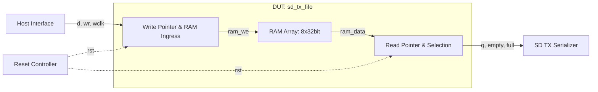

# sd_tx_fifo 设计与功能检测点文档

> 模板结构版本：v3.3.0
>
> 文档版本：v1.0.0
>
> 本文分为正文、验证计划和附录。正文用于连续理解设计，验证计划用于安排检查，附录用于审计和签核。FG、FC、CK 标签必须使用反引号包裹，例如 `` `<FG-API>` ``。无法证实的内容登记为 `OPEN-*`。

## 第一部分：正文

### 文档摘要

> 本节目标是一页内建立阅读者的整体模型。每项先给结论，不展开实现细节或证据路径。

**模块职责**

`sd_tx_fifo` 是 SD 卡主机控制器中用于发送数据路径的双时钟异步 FIFO 缓冲模块，提供写时钟域与读时钟域之间 32 位并行数据的缓冲解耦，内部深度为 8 个 32 位双字。

**输入与生产者**

- `producer.data`：由总线接口主机提供，用于写入发送队列。
- `control.wr`：由写入控制器产生，用于触发入队。
- `control.rd`：由发送引擎产生，用于触发读出。
- `control.rst`：由系统复位控制器产生，用于异步复位内部指针。

**输出与消费者**

- `consumer.q`：由发送引擎接收，用于串行化发送。
- `status.flags`：由控制器状态寄存器消费，指示满、空及剩余深度。

**关键概念**

- **双时钟域 FIFO**：写入使用写时钟 `wclk`，读出使用读时钟 `rclk`。
- **存储阵列**：深度为 8，采用双字 32 位宽寄存器阵列实现。

**关键延迟与容量**

- 典型延迟：读出为组合逻辑输出，读指针更新后立即反映在输出端口。
- 吞吐与容量：容量为 8 个 32 位字（共 32 字节）。

**验证范围**

涵盖复位初始化、正常写入、正常读出、满状态写入抑制、空状态读取抑制、回绕边界以及水线深度计算。

**开放项**

无。

### 设计概览

#### 上下游与逻辑接口

`sd_tx_fifo` 连接总线写入端口与 SD 发送控制器。正文只使用下列逻辑名；精确映射见附录 B。

| 逻辑名 | 角色与含义 | 方向 | 事务阶段 |
| --- | --- | --- | --- |
| `producer.data` | 写入数据与写使能 | 生产者 -> DUT | 写入 |
| `consumer.q` | 读出数据与读使能 | DUT -> 消费者 | 读出 |
| `control.reset` | 异步复位 | 控制模块 -> DUT | 恢复 |

#### 微架构与数据流



数据由主机接口在 `wclk` 同步下写入 RAM 阵列，由 SD 发送模块在 `rclk` 同步下读出。当队列满时写使能被屏蔽，空时读出不递增指针。

#### 事务模型

1. **产生**：生产者在 `wclk` 准备好 `d` 并拉高 `wr`。
2. **接收**：若未满，DUT 在 `wclk` 上升沿写入 RAM 并递增写指针。
3. **处理**：数据保存在内部 RAM，状态逻辑持续计算满空标志。
4. **消费**：消费者拉高 `rd`，在 `rclk` 下从 `q` 取走数据并递增读指针。
5. **恢复**：`rst` 激活时，读写指针清零，状态恢复为空。

#### 实例能力矩阵

> 模块级统一规则不在本表重复。本表只回答各通道、端口组或 entry 类别具备哪些能力。

| 实例类别 | 数量 / 索引 | 输入类别 | 输出类别 | 可选能力 | 默认配置状态 | 差异对应规则 |
| --- | --- | --- | --- | --- | --- | --- |
| RAM Entry | 8 entries [0..7] | `producer.data` | `consumer.q` | Immediate | Enabled | `P-WRITE` |

### 功能行为

#### `P-RESET`：复位清空行为

当复位信号 `rst` 为高电平时，内部指针被异步清零，输出状态指示为空。 [E-BEH-01]

**输入**：`rst` 异步高有效。

**输出**：写指针 `adr_i` 与读指针 `adr_o` 置 0，`empty` 变为 1，`full` 变为 0，`mem_empt` 变为 0。

**延迟**：异步触发，1 周期内生效。

```text
if (rst) {
    adr_i <= 0;
    adr_o <= 0;
    empty <= 1;
    full  <= 0;
}
```

**适用实例**：RAM Entry 全局。

**边界与限制**

- 复位释放后首个有效时钟周期方可执行写入。

**证据**：[E-BEH-01]。完整源码与 RTL 定位见附录 D。

#### `P-WRITE`：数据入队与写满保护

在 `wclk` 上升沿，若 `wr` 有效且 FIFO 未处于满状态（`~full`），数据 `d` 写入当前写指针指向的 RAM 空间，写指针按模 16 规则递增；若已满，则写入被屏蔽。 [E-BEH-01]

**输入**：`wclk` 上升沿，`wr=1`, `d[31:0]`。

**输出**：RAM 更新，写指针 `adr_i` 递增。

**延迟**：1 个 `wclk` 周期完成写入。

```text
ram_we = wr & ~full;
if (ram_we) {
    ram[adr_i[2:0]] <= d;
    adr_i <= (adr_i == 7) ? {~adr_i[3], 3'b0} : adr_i + 1;
}
```

**适用实例**：RAM Entry 全局。

**边界与限制**

- `full=1` 时写请求静默丢弃，不改变 RAM 内容与指针。

**证据**：[E-BEH-01]。完整源码与 RTL 定位见附录 D。

#### `P-READ`：数据出队与读空保护

在 `rclk` 上升沿，若 `rd` 有效且 FIFO 未处于空状态（`~empty`），读指针 `adr_o` 递增。`q` 端口组合逻辑持续反映当前读指针处的数据。 [E-BEH-01]

**输入**：`rclk` 上升沿，`rd=1`。

**输出**：`q[31:0]` 提供有效数据，`adr_o` 递增。

**延迟**：组合逻辑读出，指针同步更新。

```text
q = ram[adr_o[2:0]];
if (!empty && rd) {
    adr_o <= (adr_o == 7) ? {~adr_o[3], 3'b0} : adr_o + 1;
}
```

**适用实例**：RAM Entry 全局。

**边界与限制**

- `empty=1` 时读请求无效，指针不递增。

**证据**：[E-BEH-01]。完整源码与 RTL 定位见附录 D。

#### `P-STATUS`：状态与计数指示

模块实时通过比较写指针 `adr_i` 与读指针 `adr_o` 生成满空标志与深度计数。 [E-BEH-01]

**输入**：写指针 `adr_i[3:0]` 与读指针 `adr_o[3:0]`。

**输出**：`full`, `empty`, `mem_empt[5:0]`。

**延迟**：组合逻辑即时输出。

```text
full = (adr_i[2:0] == adr_o[2:0]) & (adr_i[3] ^ adr_o[3]);
empty = (adr_i == adr_o);
mem_empt = adr_i - adr_o;
```

**适用实例**：状态计算逻辑。

**边界与限制**

- 满空状态由指针比较实时生成。

**证据**：[E-BEH-01]。完整源码与 RTL 定位见附录 D。

#### `P-BOUNDARY`：指针回绕与临界边界

指针计数达到深度减 1（即 7）时，低位归零且最高位 MSB 翻转，实现模 16 环形回绕。 [E-BEH-01]

**输入**：`adr_i == 7` 或 `adr_o == 7`。

**输出**：指针低 3 位清零，最高位第 3 位翻转。

**延迟**：时钟边沿同步生效。

```text
if (adr_i == 7) begin
    adr_i[2:0] <= 0;
    adr_i[3] <= ~adr_i[3];
end
```

**适用实例**：RAM Entry 全局。

**边界与限制**

- 必须保证两端指针在回绕点不出现多周期死锁。

**证据**：[E-BEH-01]。完整源码与 RTL 定位见附录 D。

### 关键结构与状态

#### 资源生命周期

8 项 RAM 存储单元按 FIFO 原则流转，写入分配，读出释放。 [E-RES-01]

#### 顶层状态机

不适用：DUT 没有顶层多状态 FSM 控制器，行为完全由读写指针的计数值驱动。 [E-FSM-01]

## 第二部分：验证计划

### 验证策略

采用基于功能检测点的直接测试与覆盖率驱动验证策略，重点保证指针正确回绕、读写并发、溢出保护及空读保护。

**优先级原则**

- `P0`：导致数据丢失、指针死锁、满空标志倒错。
- `P1`：边界回绕、满空临界条件、突发背压。
- `P2`：水线计算统计、非关键取值覆盖。

### 功能分组

#### 本 DUT 标签树

```text
DUT
|- FG-RESET
|  `- FC-RESET-STATE
|- FG-WRITE
|  |- FC-WRITE-NORMAL
|  `- FC-WRITE-FULL
|- FG-READ
|  |- FC-READ-NORMAL
|  `- FC-READ-EMPTY
|- FG-STATUS
|  `- FC-STATUS-FLAGS
`- FG-BOUNDARY
   `- FC-BOUNDARY-TRANSITION
```

`<FG-RESET>`

复位与初始化逻辑。

`<FG-WRITE>`

数据入队与写保护。

`<FG-READ>`

数据出队与读保护。

`<FG-STATUS>`

满、空与剩余深度状态指示。

`<FG-BOUNDARY>`

指针回绕与满空临界边界。

### Test Plan

> 这是验证执行的统一入口。每行连接一个 FC、一个独立 CK、验证机制、Coverage 和场景。功能原理只引用 `P-*`，完整 CK 元数据见附录 F。

| 优先级 | FC | CK | Style | 关联规则 | 检查机制 | 激励 / 前置条件 | 可观察结果 | Coverage / 场景 | 关闭标准 |
| --- | --- | --- | --- | --- | --- | --- | --- | --- | --- |
| P0 | `FC-RESET-STATE` | `CK-RESET-POINTERS` | Seq | `P-RESET` | Assertion | 施加复位脉冲 `rst=1` | `empty=1, full=0, adr_i=0, adr_o=0` | `COV-RESET` / `CASE-RESET` | 编译且 prove 通过 |
| P0 | `FC-WRITE-NORMAL` | `CK-WRITE-ACCEPT` | Seq | `P-WRITE` | Assertion | 非满时驱动 `wr=1, d` | RAM 数据正确写入，`empty` 撤销 | `COV-NORMAL` / `CASE-NORMAL` | regression 通过 |
| P0 | `FC-WRITE-FULL` | `CK-WRITE-FULL-IGNORE` | Seq | `P-WRITE` | Assertion | 满状态驱动 `wr=1` | 写指针不前移，已有数据未被覆盖 | `COV-BOUNDARY` / `CASE-BOUNDARY` | regression 通过 |
| P0 | `FC-READ-NORMAL` | `CK-READ-ACCEPT` | Seq | `P-READ` | Assertion | 非空时驱动 `rd=1` | 输出 `q` 匹配预期，读指针前移 | `COV-NORMAL` / `CASE-NORMAL` | regression 通过 |
| P0 | `FC-READ-EMPTY` | `CK-READ-EMPTY-IGNORE` | Seq | `P-READ` | Assertion | 空状态驱动 `rd=1` | 读指针不前移，`empty` 保持为 1 | `COV-BOUNDARY` / `CASE-BOUNDARY` | regression 通过 |
| P1 | `FC-STATUS-FLAGS` | `CK-STATUS-FLAGS-ACCURATE` | Comb | `P-STATUS` | Assertion | 写入 8 个数据 | `full=1, empty=0, mem_empt=8` | `COV-NORMAL` / `CASE-NORMAL` | regression 通过 |
| P1 | `FC-BOUNDARY-TRANSITION` | `CK-BOUNDARY-WRAPAROUND` | Seq | `P-BOUNDARY` | Cover | 指针计数达到 7 | 下一时钟指针回绕，MSB 翻转 | `COV-BOUNDARY` / `CASE-BOUNDARY` | cover hit |

### Coverage Summary

| Coverage ID | 风险与目标 | 关联 P / FC / CK | 观察事件 | 重要取值 / 分箱 | 依赖 / 交叉 | 非法 / 忽略条件 | 有效性保护 | 关闭标准 | 状态 |
| --- | --- | --- | --- | --- | --- | --- | --- | --- | --- |
| `COV-RESET` | 复位初始化可达 | `P-RESET`, `FC-RESET-STATE`, `CK-RESET-POINTERS` | 复位释放事件 | rst=1 | 无 | 正常运行中忽略 | 复位有效时采样 | 命中要求 | Planned |
| `COV-NORMAL` | 正常读写可达 | `P-WRITE`, `FC-WRITE-NORMAL`, `CK-WRITE-ACCEPT` | 成功读写完成 | FIFO 深度 1..7 | 读写交替 | 满写空读除外 | checker 通过后采样 | 命中要求 | Planned |
| `COV-BOUNDARY` | 满空边界可达 | `P-STATUS`, `FC-BOUNDARY-TRANSITION`, `CK-BOUNDARY-WRAPAROUND` | 满/空边界到达 | full=1, empty=1 | 指针回绕边界 | 不适用组合忽略 | 有效结果采样 | 命中要求 | Planned |

### Coverage Design Contract

1. **目标行为**：证明 FIFO 的正常读写与满空边界被充分激励。
2. **观察事件**：在写时钟与读时钟有效采样事件上观察。
3. **有效性与无效性**：复位期间不采样正常数据读写。
4. **重要取值**：深度 0（空）、1~7（中间态）、8（满）。
5. **依赖与交叉**：写请求与满状态交叉、读请求与空状态交叉。
6. **非法与忽略**：忽略非法时钟毛刺。
7. **闭合对象**：关联 UCAgent 生成的 Toffee 功能覆盖率。

### 形式化属性契约

#### 属性实现状态

| 状态 | 含义 | 允许的签核结论 |
| --- | --- | --- |
| Planned | CK 已定义，但逐 CK 公式尚未完成 | 只能计入验证计划 |

**建模约定**

- 时钟与复位：`wclk`, `rclk` 为时钟输入，`rst` 为高有效异步复位。
- X 处理：复位后所有指针必须为已知数值。

#### Assume

```systemverilog
// <CK-API-INPUT-KNOWN>, references P-WRITE
assume property (@(posedge wclk) disable iff (rst) wr |-> !$isunknown(d));
```

#### Assert

```systemverilog
// <CK-WRITE-ACCEPT>, references P-WRITE
assert property (@(posedge wclk) disable iff (rst) (wr && !full) |=> (empty == 0));
```

#### Cover

```systemverilog
// <CK-BOUNDARY-WRAPAROUND>, references P-STATUS
cover property (@(posedge wclk) disable iff (rst) full == 1);
```

### 测试场景

#### CASE-RESET：复位场景

**目标**：验证模块上电复位或异步复位后清空状态。

**参与者与前置条件**：复位驱动源；初始状态未知。

1. 驱动 `rst=1` 保持至少 2 个时钟周期。
2. 观测输出。

**预期行为**：遵循 `P-RESET`、`CK-RESET-POINTERS`；关联 Coverage：`COV-RESET`。

**验收标准**：`empty=1, full=0, mem_empt=0`。

#### CASE-NORMAL：连续读写场景

**目标**：验证连续写入 4 个字并依次读出。

**参与者与前置条件**：写入端、读取端；初始为空。

1. 连续写 4 个数据。
2. 连续读出 4 个数据。

**预期行为**：遵循 `P-WRITE`、`P-READ`、`CK-WRITE-ACCEPT`；关联 Coverage：`COV-NORMAL`。

**验收标准**：读出数据与写入数据严格 FIFO 顺序一致。

#### CASE-BOUNDARY：满空溢出保护场景

**目标**：验证写满后继续写入不破坏已有数据，读空后继续读不前移指针。

**参与者与前置条件**：写入端、读取端。

1. 连续写入 8 个数据使 `full=1`。
2. 满状态下再次驱动 `wr=1`，校验写入被忽略。
3. 读空后再次驱动 `rd=1`，校验读出被忽略。

**预期行为**：遵循 `P-WRITE`、`P-READ`、`CK-WRITE-FULL-IGNORE`；关联 Coverage：`COV-BOUNDARY`。

**验收标准**：指针无异常回绕，数据未被破坏。

### 签核与开放项

**当前状态**：Review。

**规格偏差**：无。

**当前阻塞**：待多模型回归结果对齐。

**关闭条件**：UCAgent 运行产物对齐覆盖率基准。

## 第三部分：附录

### 附录 A：文档控制与范围裁定

| 项目 | 内容 |
| --- | --- |
| 文档版本 | v1.0.0 |
| 使用模板版本 | v3.3.0 |
| 前一版本 | None（首次版本） |
| 版本变更类型 | Major：首次基准版本 |
| DUT / Chisel 顶层 | sd_tx_fifo / [E-TOP-01] |
| Elaborated Verilog 顶层 | sd_tx_fifo / [E-RTL-01] |
| 文档状态 | Review |
| XiangShan RTL 基线 | generic-verilog-v1 |
| 适用配置 | DefaultConfig |
| 生成环境 | Linux / x86_64 / Python 3.8 |
| RTL 生成状态 | Success |
| RTL 证据 | evidence/sd_tx_fifo/v1.0.0/manifest.json |
| 图形渲染证据 | evidence/sd_tx_fifo/v1.0.0/diagrams/manifest.json |
| 作者 / 评审人 | Benchmark Auto-Generator |
| 生成日期 | 2026-09-08 |

| 条件项目 | 已应用 / 不适用 | 理由或对应章节 |
| --- | --- | --- |
| 顶层状态机 | 不适用 | DUT 为 FIFO 计数器控制架构，无独立顶层状态机 / [E-FSM-01] |
| 多模块事务 / 时序图 | 不适用 | 单模块双时钟域 FIFO，无跨模块交互 / [E-BEH-01] |
| 符号化存储检查 | 不适用 | 深度为 8 的紧凑存储阵列，不采用符号化状态空间 / [E-RES-01] |
| 缓存查找 / 缺失 / 重填 | 不适用 | 非 Cache 缓存模块 / [E-BEH-01] |
| 异常 / 恢复 / flush | 不适用 | 仅支持全局硬件异步复位，不支持动态 flush / [E-BEH-01] |
| 特性门控 | 不适用 | 无动态特性配置开关 / [E-PARAM-01] |

适用性：不适用；理由：FIFO 计数器架构无顶层独立状态机；证据：[E-FSM-01]
适用性：不适用；理由：单模块双时钟域无跨模块时序；证据：[E-BEH-01]
适用性：不适用；理由：8项深度不适用符号化验证；证据：[E-RES-01]
适用性：不适用；理由：非Cache存储结构；证据：[E-BEH-01]
适用性：不适用；理由：无运行时flush异常处理；证据：[E-BEH-01]
适用性：不适用；理由：无动态特性门控；证据：[E-PARAM-01]

本模块包含 10 个叶端口：6 个输入，4 个输出。
RTL SHA-256：`52895832e53fd1ee80468804827230c0ae353767cf9611e5016b79364e409426`。

### 附录 B：逻辑接口与 RTL 映射

> 本附录是逻辑名、字段和精确 elaborated Verilog 端口的唯一映射位置。

| IO-ID | 正文逻辑名 | Bundle class / Chisel 字段 | 定义位置 | 方向 / 位宽 | 配置状态 | 精确 Verilog I/O | 协议 / 对端 | 证据 |
| --- | --- | --- | --- | --- | --- | --- | --- | --- |
| `IO-D` | `producer.data` | `sd_tx_fifo.d` | [E-IO-01] | I / 32 | Generated | `d` | Parallel Data / Host | [E-RTL-01] |
| `IO-WR` | `control.wr` | `sd_tx_fifo.wr` | [E-IO-01] | I / 1 | Generated | `wr` | Control / Host | [E-RTL-01] |
| `IO-WCLK` | `clock.wclk` | `sd_tx_fifo.wclk` | [E-IO-01] | I / 1 | Generated | `wclk` | Clock / Host | [E-RTL-01] |
| `IO-Q` | `consumer.q` | `sd_tx_fifo.q` | [E-IO-01] | O / 32 | Generated | `q` | Parallel Data / TX Serializer | [E-RTL-01] |
| `IO-RD` | `control.rd` | `sd_tx_fifo.rd` | [E-IO-01] | I / 1 | Generated | `rd` | Control / TX Serializer | [E-RTL-01] |
| `IO-FULL` | `status.full` | `sd_tx_fifo.full` | [E-IO-01] | O / 1 | Generated | `full` | Status Flag / Host | [E-RTL-01] |
| `IO-EMPTY` | `status.empty` | `sd_tx_fifo.empty` | [E-IO-01] | O / 1 | Generated | `empty` | Status Flag / TX Serializer | [E-RTL-01] |
| `IO-MEM-EMPT` | `status.mem_empt` | `sd_tx_fifo.mem_empt` | [E-IO-01] | O / 6 | Generated | `mem_empt` | Counter / Host | [E-RTL-01] |
| `IO-RCLK` | `clock.rclk` | `sd_tx_fifo.rclk` | [E-IO-01] | I / 1 | Generated | `rclk` | Clock / TX Serializer | [E-RTL-01] |
| `IO-RST` | `control.rst` | `sd_tx_fifo.rst` | [E-IO-01] | I / 1 | Generated | `rst` | Reset / System | [E-RTL-01] |

### 附录 C：参数、实例与配置裁剪

| 参数 / 特性 | 类型与范围 | 当前值 | 定义 / 覆盖位置 | 功能影响 | 生成 / 裁剪结果 | 关联规则 |
| --- | --- | --- | --- | --- | --- | --- |
| `FIFO_TX_MEM_DEPTH` | Integer | 8 | [E-PARAM-01] | FIFO 存储容量 | 8 Entries | `P-WRITE` |
| `FIFO_TX_MEM_ADR_SIZE` | Integer | 4 | [E-PARAM-01] | 指针计数宽度 | 4 Bits | `P-STATUS` |

| 实例 / 通道 | 类别 | 当前配置能力 | 被裁剪能力 | Chisel 对象 | RTL 端口组 | 证据 |
| --- | --- | --- | --- | --- | --- | --- |
| `ram` | 存储阵列 | 8x32bit | 无 | `ram` | 内部阵列 | [E-CONFIG-01] |

### 附录 D：证据索引

> 正文只出现 `[E-*]`。源码路径、行号、commit、配置和 RTL 定位在此展开。

| Evidence ID | 类型 | 路径 / 定位 | Commit / 配置 | 支持内容 |
| --- | --- | --- | --- | --- |
| E-BEH-01 | Verilog | `sd_tx_fifo.v:104-150` | generic-verilog-v1 / DefaultConfig | `P-RESET`, `P-WRITE`, `P-READ`, `P-STATUS`, `P-BOUNDARY` |
| E-RES-01 | Verilog | `sd_tx_fifo.v:97` | generic-verilog-v1 / DefaultConfig | 资源生命周期 |
| E-FSM-01 | Verilog | `sd_tx_fifo.v:1-150` | generic-verilog-v1 / DefaultConfig | 顶层状态机裁定 |
| E-TOP-01 | Verilog | `sd_tx_fifo.v:83` | generic-verilog-v1 / DefaultConfig | DUT 顶层 |
| E-RTL-01 | RTL / manifest / ports.csv | `sd_tx_fifo.v:83-95` | generic-verilog-v1 / DefaultConfig | 端口定义与映射 |
| E-IO-01 | Verilog Port | `sd_tx_fifo.v:85-94` | generic-verilog-v1 / DefaultConfig | 端口列表 |
| E-PARAM-01 | Verilog Define | `sd_tx_fifo.v:78-79` | generic-verilog-v1 / DefaultConfig | 参数深度定义 |
| E-CONFIG-01 | Verilog Array | `sd_tx_fifo.v:97` | generic-verilog-v1 / DefaultConfig | 实例能力 |

### 附录 E：FACT、OPEN 与偏差

| ID | 类型 | 摘要 | 关联规则 | 证据 / 缺口 | 状态与关闭条件 |
| --- | --- | --- | --- | --- | --- |
| FACT-001 | 实现事实 | 异步 FIFO 深度由宏定义设为 8 | `P-WRITE` | [E-PARAM-01] | Closed |
| FACT-002 | 实现事实 | 满信号通过读写指针 MSB 异或及低位相同计算 | `P-STATUS` | [E-BEH-01] | Closed |

### 附录 F：FC / CK 完整追溯

> 本附录服务于 UCAgent 和审计，不作为主要阅读入口。FC 定义验证目标，CK 定义单一可执行性质；二者不得重复功能原理。

| FC 标签 | 所属 FG | 验证目标 | 关联规则 | Test Plan 行 |
| --- | --- | --- | --- | --- |
| `<FC-RESET-STATE>` | `FG-RESET` | 复位后状态与指针初始化验证 | `P-RESET` | P0 / `CK-RESET-POINTERS` |
| `<FC-WRITE-NORMAL>` | `FG-WRITE` | 正常写入数据与更新指针 | `P-WRITE` | P0 / `CK-WRITE-ACCEPT` |
| `<FC-WRITE-FULL>` | `FG-WRITE` | 满状态下写保护抑制 | `P-WRITE` | P0 / `CK-WRITE-FULL-IGNORE` |
| `<FC-READ-NORMAL>` | `FG-READ` | 正常读出数据与更新指针 | `P-READ` | P0 / `CK-READ-ACCEPT` |
| `<FC-READ-EMPTY>` | `FG-READ` | 空状态下读保护抑制 | `P-READ` | P0 / `CK-READ-EMPTY-IGNORE` |
| `<FC-STATUS-FLAGS>` | `FG-STATUS` | 满空与剩余深度状态正确性 | `P-STATUS` | P1 / `CK-STATUS-FLAGS-ACCURATE` |
| `<FC-BOUNDARY-TRANSITION>` | `FG-BOUNDARY` | 读写指针 7 到 0 的回绕边界行为 | `P-BOUNDARY` | P1 / `CK-BOUNDARY-WRAPAROUND` |

| CK 标签 | Style | 所属 FC | 独立性质 | 逻辑观测点 | RTL / bind 对应 | 属性实现状态 | 签核状态 |
| --- | --- | --- | --- | --- | --- | --- | --- |
| `<CK-RESET-POINTERS>` | Seq | `FC-RESET-STATE` | 复位后指针为 0 且空标志置 1 | `status.empty` | [附录 B / D] | Planned | Planned |
| `<CK-WRITE-ACCEPT>` | Seq | `FC-WRITE-NORMAL` | 写入后 RAM 更新且空标志撤销 | `producer.data` | [附录 B / D] | Planned | Planned |
| `<CK-WRITE-FULL-IGNORE>` | Seq | `FC-WRITE-FULL` | 满时写入不覆盖已有数据 | `status.full` | [附录 B / D] | Planned | Planned |
| `<CK-READ-ACCEPT>` | Seq | `FC-READ-NORMAL` | 读出数据符合 FIFO 顺序且指针前移 | `consumer.q` | [附录 B / D] | Planned | Planned |
| `<CK-READ-EMPTY-IGNORE>` | Seq | `FC-READ-EMPTY` | 空时读取不前移读指针 | `status.empty` | [附录 B / D] | Planned | Planned |
| `<CK-STATUS-FLAGS-ACCURATE>` | Comb | `FC-STATUS-FLAGS` | 满空标志与指针差值严格吻合 | `status.flags` | [附录 B / D] | Planned | Planned |
| `<CK-BOUNDARY-WRAPAROUND>` | Seq | `FC-BOUNDARY-TRANSITION` | 指针在计数值 7 时发生正确回绕 | `adr_i` | [附录 D] | Planned | Planned |

### 附录 G：签核清单

- [x] 摘要在细节前说明职责、输入输出、关键概念、延迟、验证范围和 OPEN。
- [x] 每项功能按输入、输出、延迟、统一规则、适用实例、边界与限制组织。
- [x] 模块级规则未混入实例枚举；实例差异集中在能力矩阵和附录 C。
- [x] 正文仅以 `[E-*]` 引用证据，完整路径集中在附录 D。
- [x] Test Plan 是验证执行入口；FC/CK 完整登记集中在附录 F。
- [x] API 只包含 Assume，Coverage 只包含 Cover。
- [x] Verilog 端口逐项核对，配置裁剪有依据。
- [x] 正常、资源边界和恢复场景有可判定验收标准。
