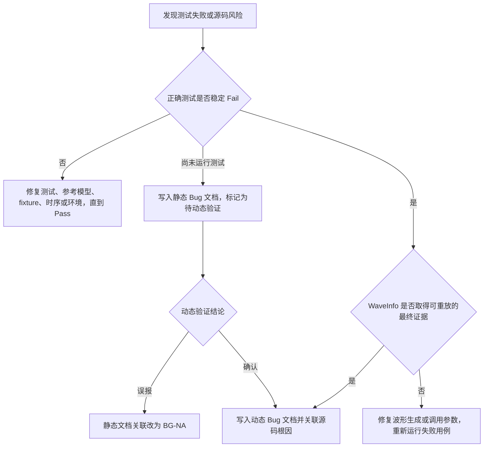

# DUT Bug 分析指南

本文是以下两个文档的统一格式规范：

- `{OUT}/{DUT}_bug_analysis.md`：记录被正确失败用例动态复现、经过源码分析并由真实波形确认的 DUT Bug。
- `{OUT}/{DUT}_static_bug_analysis.md`：记录仅通过 RTL/上层 HDL 源码审查发现的静态候选，以及它们后续与动态 Bug 的关联结论。

静态报告的三个机器分区依次使用独立行标记 `<STATIC-BUG-SUMMARY>`、`<STATIC-BUG-DETAILS>`、`<STATIC-BUG-PROGRESS>`。标记必须各出现一次且顺序固定；相邻标题只是展示文本，可以本地化。生成和关联脚本不解析中文标题，旧的仅标题格式不再兼容。

目标不是“尽可能多地记录问题”，而是建立可复查的证据链：正确测试稳定失败，失败对应明确 CK，波形证明动态现象，源码解释根本原因，修复建议能够被再次验证。

> 完成条件：除已确认 DUT Bug 的复现用例外，其他已实现用例都必须 Pass；每个保留的 Fail 都必须有非零置信度动态 Bug、准确 CK、真实 `WaveInfo` 收据、源码根因和复验计划。

## 1. 先判断问题应写在哪里



| 情况 | 测试结果 | 写入动态文档 | 写入静态文档 | 波形要求 |
|---|---:|---:|---:|---:|
| DUT 动态 Bug | Fail | 是 | 可选关联 | 必须 |
| 静态候选，尚未动态验证 | 未运行或未确认 | 否 | 是 | 不需要 |
| 静态候选被证实 | Fail | 是，使用独立动态 BG 标签 | 保留并链接动态 BG | 动态条目必须 |
| 静态候选被判定为误报 | Pass | 否 | 是，链接到 BG-NA | 不需要 |
| 测试、断言、模型、fixture、复位、时序或环境问题 | 修复前可能 Fail | 否 | 否 | 不适用 |
| 没有发现 Bug | Pass | 不创建占位 Bug | 使用 NULL 声明表示静态分析无发现 | 不需要 |

动态文档禁止出现 `<BG-STATIC-*>`。静态文档中的候选被测试证实后，必须创建新的 `<BG-NAME-XX>` 动态标签，再通过 `<LINK-BUG-[BG-NAME-XX]>` 建立关联。

## 2. Markdown 与 Checker 共用的解析规则

Checker 不是按 Markdown 缩进解析标签，而是按标签出现的先后顺序建立层级。因此，文档可视化结构必须同时满足以下规则。

1. 结构标签按固定顺序出现，每个标签单独一行：`FG -> FC -> CK -> BG -> TC`。
2. 同一个结构节点只在所属层级分支的定义位置使用一次尖括号。后续正文引用使用不带尖括号的路径，例如 `FG-ALU/FC-ADD/CK-OVERFLOW`。唯一例外是同一动态 BG 按规则关联多个 CK，此时可以在不同 CK 分支下重复相同 BG 名称和置信度。
3. 不要在摘要表、目录、普通正文、代码注释或“相关标签”列表中重复真实的 `<FG-*>`、`<FC-*>`、`<CK-*>`、`<BG-*>`、`<TC-*>`。Checker 会把它们当成新的结构节点。
4. 标签可以和简短标题写在同一行，但一行只能出现一次同类标签。推荐使用“标题 + 标签”的形式提高可读性。
5. 动态 Bug 详情位于 `<BG-*>` 之后。详情内部使用粗体小标题、五级或六级标题，不要使用一级到三级标题；Recorder 会把一级到三级标题视为 Bug 条目范围结束。
6. 每个 `<BG-*>` 至少有一个 `<TC-*>` 子标签。每个非零置信度 `<TC-*>` 必须对应真实 Fail 用例。
7. ` ```yaml` 必须是对应 `<TC-*>` 后的第一个非空内容。中间只允许空白行和 Markdown 缩进。
8. YAML 关闭围栏后的第一条非空内容必须是 `<WAVEFORM-VIEWER> [显示文字](/surfer/?wave=<token>)`。显示文字不参与解析，可以由 AI 改写或本地化；`<WAVEFORM-VIEWER>`、相对路由和 token 必须来自同一次最终 WaveInfo 调用，不得修改或手工构造。
9. 不再使用 `<WAVEFORM-ANALYSIS>` 自定义标签。旧标签、裸 YAML、` ```json`、` ```yml` 和额外顶层键都不接受。
10. 动态文档的 `<FILE-*>`、`<LINK-BUG-*>` 和 `<BG-STATIC-*>` 没有合法含义；这些标签只属于静态文档。
11. 标签区分大小写。动态和静态文档中的 FG、FC、CK 必须与 `{OUT}/{DUT}_functions_and_checks.md` 完全一致。

不要为每个 Bug 重新创建相同的 FG、FC 或 CK。应先按功能层级分组，再把多个 Bug 放在对应 CK 下；同一父节点下重复定义相同标签会触发 duplicate tag 错误。

推荐的可视化层级如下。Markdown 标题负责阅读体验，尖括号标签负责 Checker 解析：

```markdown
## 功能组名称 <FG-GROUP>

### 功能名称 <FC-FUNCTION>

#### 检查点名称 <CK-CHECKPOINT>

##### Bug 名称 <BG-BUG-NAME-95>

- 失败测试 <TC-test_file.py::test_case>
```

## 3. 完整标记字典

### 3.1 动态 Bug 文档结构标签

| 标记 | 含义 | Checker 要求 |
|---|---|---|
| `<DYNAMIC-BUGS>` | 动态 Bug 条目容器 | `recordbug.py` 依靠此标记定位写入区；后续中文标题不参与解析 |
| `<FG-NAME>` | 功能组 | 必须存在于 functions-and-checks 文档，区分大小写 |
| `<FC-NAME>` | 功能点 | 必须位于当前 FG 下，并与 functions-and-checks 文档一致 |
| `<CK-NAME>` | 检查点 | 必须位于当前 FC 下；Fail 报告中的 CK 必须能在动态 Bug 文档中找到非零 BG |
| `<BG-NAME-XX>` | 动态 Bug 名称和置信度 | `XX` 是 0 到 100 的整数；真正解释 Fail 的动态 Bug 必须为 1 到 100 |
| `<TC-test_file.py::test_name>` | 复现 Bug 的 pytest 用例 | 文件名和函数名必须匹配真实 Fail；类用例写成 `<TC-test_file.py::ClassName::test_name>` |
| `waveform_analysis` | 波形证据块的唯一 YAML 顶层键 | 不是尖括号标签；必须放在 fenced YAML 代码块中并直接跟随对应 TC |
| `<WAVEFORM-VIEWER>` | 在线波形深链接 | 必须是 YAML 围栏后的第一条非空内容；显示文字可本地化，URL 与签名 receipt 必须完全一致 |
| `<BUG-OVERVIEW>` 到 `<BUG-RETEST>` | 八个分析字段边界 | 使用 6.1.1 节列出的完整标记序列；唯一、有序、内容非空，展示标题不参与解析 |
| `<BUG-TODO>` | Skill 骨架尚未完成 | `recordbug.py` 生成；LLM 填写真实内容后必须全部删除，Checker 不解析自然语言占位词 |
| `<BUG-SOURCE-UNAVAILABLE>` | 无可访问源码 | 仅在 `<BUG-SOURCE-EVIDENCE>` 字段内使用一次，并以真实黑盒证据替代源码块 |
| `<BUG-SOURCE-FIRST-ERROR>` | 源码中的首个错误决策 | 有源码时在 HDL 代码块的语言原生注释中恰好出现一次 |
| `<BUG-SOURCE-PROPAGATION>` | 错误传播位置 | 有源码时在 HDL 代码块的语言原生注释中恰好出现一次 |
| `<BUG-SOURCE-OBSERVABLE>` | 接口可见后果位置 | 有源码时在 HDL 代码块的语言原生注释中恰好出现一次 |

`<BG-*-0>` 只会被忽略，不能解释任何 Fail，也不能用于保留测试或基础设施问题。已经实现的测试禁止用 `assert False` 人工制造 Fail；`assert False, "Not implemented"` 仅用于测试模板尚未实现的模板创建阶段。

### 3.2 `waveform_analysis` 公共字段

成功的最终取证返回会包含 `bug_document_fields`。它已经包含唯一顶层键 `waveform_analysis`，应完整复制到对应 TC 后，不要再次包一层。

同一次最终取证还会返回 `bug_document_viewer_link`。关闭 YAML 围栏后，必须把这条带 `<WAVEFORM-VIEWER>` 标签的 Markdown 链接放在第一条非空内容。`[...]` 内是纯展示文字，可以按语言和上下文修改；Checker 只验证稳定标签、`/surfer/?wave=` 相对路由、Base64URL 载荷及其与签名 receipt 的一致性。不要把链接放进 YAML 或代码块，不要手工拼接、解码后重编码或修改 token。

`waveform_analysis:` 必须是唯一顶层键；下面所有字段都属于这一次 BG/TC 关联的独立证据。

| 字段 | 来源 | 说明 |
|---|---|---|
| `status` | 固定结论 | 动态 Bug 必须为 `confirmed`；`unavailable` 不能完成阶段 |
| `receipt_id` | WaveInfo | 真实工具调用收据；Checker 会从当前实例或签名 checkpoint 恢复并核对 |
| `result_fingerprint` | WaveInfo | 工具结果指纹，必须与 receipt 完全一致 |
| `waveform_file` | WaveInfo | 取证当时被分析波形的相对路径，属于签名 receipt 的一部分；必须原样复制工具结果 |
| `freshness_identity` | WaveInfo | 必须等于 `waveform_file:size_bytes:modified_time_ns` |
| `size_bytes` | WaveInfo | 波形文件大小，正整数 |
| `session_started_at` | WaveInfo | 仿真 session 开始时间，带时区的 ISO-8601 时间 |
| `modified_at` | WaveInfo | 波形文件修改时间，带时区的 ISO-8601 时间 |
| `modified_time_ns` | WaveInfo | 纳秒级文件修改时间，正整数 |
| `observed_at` | WaveInfo | 工具观测时间，带时区的 ISO-8601 时间 |
| `analysis_mode` | WaveInfo | 只能为 `clock_aligned` 或 `explicit_window` |
| `pattern` | WaveInfo 调用参数 | 非空结构化事件列表，必须与 receipt 中的 pattern 完全一致 |
| `context_steps` | WaveInfo 调用参数 | 事件前后上下文 step 数，必须与 receipt 一致 |
| `max_points` | WaveInfo 调用参数 | 最大返回点数，必须与 receipt 一致 |
| `wave_step` | WaveInfo 结果 | 真正触发 pattern 的波形 step，不是直接复制测试日志 cycle |
| `timeline_truncated` | WaveInfo 结果 | 必须为 `false` |
| `alignment_evidence` | LLM 阅读规格、测试驱动代码、日志和 timeline 后填写 | 解释输入在哪个 Step/边沿驱动、事务按什么条件被接受、输出何时允许采样，以及该波形事务为何与失败日志唯一对应 |
| `observed_behavior` | LLM 阅读 timeline 后填写 | 只在协议规定的有效事务/响应窗口内写清实际信号行为、actual 和 expected 的差异；无效周期的单点数据不能作为结论 |
| `source_correlation` | LLM 阅读源码后填写 | 解释波形现象如何对应到具体源码逻辑和根因 |

最后三个字段不能照抄模板，也不能由工具虚构。它们必须是非空字符串，并形成“测试驱动与协议接受 -> 日志事务 -> 波形事件 -> RTL 逻辑”的闭环。Checker 只能验证结构、receipt 和波形重放，不能仅凭信号名称或某个时间点的数据值自动判断协议是否成立；事务语义必须由 LLM 结合规格、测试 API/回调和 RTL 审查。

### 3.3 时钟对齐模式字段

有测试日志 cycle 且存在明确时钟时，使用 `analysis_mode: clock_aligned`。

| 字段 | 要求 |
|---|---|
| `logged_cycle` | 测试日志打印的非负 cycle |
| `cycle_tolerance` | 允许候选偏差，0 到 100 的整数 |
| `clock_signal` | `signal_catalog` 中存在的精确时钟路径 |
| `clock_edge` | `rising` 或 `falling` |
| `cycle_origin` | 测试 cycle 的起点约定，必须与调用参数一致 |
| `clock_occurrence_index` | WaveInfo 选中的时钟边沿序号 |
| `cycle_delta` | 选中边沿与日志 cycle 的差异，可为负数 |
| `wave_step` | 选中候选对应的波形 step |

测试打印的 cycle 和 WaveInfo 的时钟边沿序号可能相差 0 到数个周期，原因包括复位期是否计数、采样边沿、日志打印位置、pipeline 延迟和 API 的 cycle 起点。禁止把 `logged_cycle` 直接写成 `wave_step`。最终 receipt 必须为唯一候选 `candidate_selected`，并保存真实的 `clock_occurrence_index`、`cycle_delta` 和 `wave_step`。

### 3.4 显式时间窗模式字段

组合逻辑、无可靠日志 cycle，或者已通过探索调用定位事件范围时，使用 `analysis_mode: explicit_window`。

| 字段 | 要求 |
|---|---|
| `start_step` | 最终调用真实传入的非负起始 step |
| `end_step` | 最终调用真实传入的非负结束 step |
| `wave_step` | receipt 的 `event_steps` 中真实触发 pattern 的 step |

`start_step` 和 `end_step` 必须同时提供。只带 pattern、但没有 `logged_cycle + clock_signal` 或完整 `start_step + end_step` 的调用属于全波形探索调用，通常返回 `status: evidence_window_required` 和 `evidence_usable: false`。此时必须逐字使用 `recommended_evidence_call` 再次调用；不能把 `effective_start_step/effective_end_step` 手工复制到文档中冒充最终调用参数。

### 3.5 静态 Bug 文档标签

| 标记 | 含义 | Checker 要求 |
|---|---|---|
| `<BG-STATIC-NNN-NAME>` | 静态源码审查发现的候选 | 位于 CK 下；一个 CK 可以有多个独立静态候选 |
| `<LINK-BUG-[BG-TBD]>` | 尚未完成动态验证 | static_bug_analysis 阶段每个真实静态候选必须恰好有一个 |
| `<LINK-BUG-[BG-NAME-XX]>` | 已被一个动态 Bug 证实 | 动态标签必须存在于动态 Bug 文档 |
| `<LINK-BUG-[BG-N1-XX][BG-N2-YY]>` | 一个静态候选对应多个动态 Bug | 每个动态标签都必须存在于动态 Bug 文档 |
| `<LINK-BUG-[BG-NA]>` | 动态验证判定为误报 | 只能表示静态候选不成立，不创建动态 Bug |
| `<FILE-path/to/file.v:L1-L2>` | 静态候选源码位置 | 路径相对 workspace；每个 LINK 至少一个 FILE |
| `<FILE-path/to/file.v:L1-L2,L3-L4>` | 同一文件多个不连续位置 | 每个区间均使用正整数物理行号 |
| `<FG-NULL>/<FC-NULL>/<CK-NULL>/<BG-STATIC-NULL>` | 全部源文件审查后没有发现任何静态 Bug | 四个标签必须按顺序出现；不得与真实静态候选共存；没有 LINK 或 FILE 子标签 |
| `<file>path/to/file.v</file>` | 静态分析批次进度 | 小写，仅用于进度表；路径必须与 Checker 任务文件路径一致 |

注意区分：大写 `<FILE-...:行号>` 是静态 Bug 的源码证据，小写 `<file>...</file>` 是批次完成标记，两者不能互换。

## 4. WaveInfo 取证工作流

### 4.1 先让失败日志可对齐

运行可能触发 Bug 的用例时，日志至少输出以下信息：

- `cycle_basis`：cycle 从哪里开始计数、按哪个边沿递增。
- `cycle`：失败发生附近的测试 cycle。
- transaction ID、序号或可唯一定位事务的输入组合。
- 相关输入输出 pin、握手信号、状态和操作码。
- `expected` 与 `actual`。

示例：

```python
assert actual == expected, (
    f"cycle_basis=post_reset_rising cycle={cycle} txn={txn_id} "
    f"valid={valid} ready={ready} op={op:#x} "
    f"a={a:#x} b={b:#x} expected={expected:#x} actual={actual:#x}"
)
```

日志只用于建立锚点，不能替代波形证据。

### 4.2 先确认事务有效，再判断数据是否错误

波形中的任意一个数据点都不自动代表有效事务。调用 `WaveInfo` 前，先阅读功能规格、测试用例、所调用的 API/driver、callback 和 `Step` 顺序，确定以下事实：

1. 输入在什么时间、哪个边沿之前或之后被驱动，`Step` 何时真正推进 DUT。
2. DUT 使用什么条件接受请求。可能是 `ready && valid`，也可能是 `req/ack`、`enable`、`start && !busy`、状态机条件、固定采样边沿或其他自定义协议，不能只按信号名字猜测。
3. 输出在什么条件下有效，以及延迟从哪个真实接受事件开始计算。固定 latency、可变 latency、pipeline、queue、backpressure、stall 和 bubble 都必须纳入对齐。
4. 如何用 transaction ID、tag、操作码、输入组合、状态或顺序，把输出归属到失败事务，而不是前一笔、后一笔或尚未完成的事务。

对于 ready/valid 接口，通常只有协议约定采样边沿上的 `valid && ready` 才表示该通道发生 transfer；`valid=1, ready=0` 一般表示 backpressure，并不表示请求已经被接受；`valid=0` 时的数据可能是旧值、预驱动值或 don't-care。对于输出通道，也必须等待其自身的有效/接受条件。复位、空闲、过渡状态、尚未达到响应 latency 或协议声明数据无效的周期中的 data mismatch，不能直接标记为 DUT Bug。若规格本身要求在未接受请求、busy 或非法输入期间保持/忽略某些行为，则应按该明确约束审查，而不是机械套用 ready/valid 规则。

特别注意：调用一次 `Step(1)` 只表示仿真时间推进了一步，不表示请求必然已被接受，也不表示结果必然有效。必须从规格以及 API/driver 的真实实现确认应该在何时读取结果，例如组合逻辑 settle 后、下一个指定采样边沿、固定 N 个周期后、`out_valid/response_valid/done` 成立时、req/ack 完成时，或 `busy` 清零时。还要检查 API 内部是否已经调用 `Step`、等待握手或采样结果，避免外层测试少等一个周期、重复推进或错过有效窗口。若无法从规格、API、测试代码和 RTL 确定结果有效条件，应继续调查或改进测试日志，不能在任意一次 Step 后读取 data 并判 Bug。

最终波形证据应覆盖事务接受前的驱动上下文、真实接受点、必要的内部传播/等待过程和协议允许的输出采样点。一次单点 data mismatch 只能作为继续调查的线索；只有 LLM 证明驱动方式正确、事务已成立、等待时间满足、输出属于同一事务且 expected 来自规格后，才能形成动态 Bug 结论。这项语义判断不能由 Checker 根据特定信号名自动完成。

### 4.3 调用顺序

1. 无参数调用只用于 inventory：列出当前波形文件、测试名、创建/修改时间、大小和 session 摘要，不生成最终 receipt。
2. 使用 inventory 返回的 `recommended_call.test_case_name` 做 metadata 调用，确认最新波形、step 范围和 `signal_catalog`。
3. 根据 4.2 节确认的真实协议，只使用 `signal_catalog` 中存在的信号构建结构化 pattern；除目标数据外，还应包含实际的请求有效/接受条件、响应有效条件、状态、事务标识或等价锚点。
4. 有日志 cycle 时调用时钟对齐模式；没有可靠 cycle 时先探索，再使用推荐的显式时间窗重调。
5. 只有 `evidence_usable: true` 且时间线未截断的最终调用才能写入动态 Bug 文档。
6. 复制完整 `bug_document_fields`，关闭围栏后复制同一结果的 `bug_document_viewer_link`，再基于规格、测试驱动代码、真实 timeline 和源码补写三个 LLM 分析字段。`evidence_usable: true` 只说明波形事件可重放，不表示工具已经判定 DUT Bug。

Metadata 调用示例：

```python
WaveInfo(
    test_case_name="test_{DUT}_xxx",
    pattern=[],
    logged_cycle=-1,
    clock_signal="",
    start_step=-1,
    end_step=-1,
)
```

时钟对齐最终调用示例：

```python
WaveInfo(
    test_case_name="test_{DUT}_overflow",
    pattern=[
        {"signal": "TOP.dut.valid", "event": "equals", "value": "0x1"},
        {"signal": "TOP.dut.ready", "event": "equals", "value": "0x1"},
        {"signal": "TOP.dut.op[2:0]", "event": "equals", "value": "0x3"},
        {"signal": "TOP.dut.result[31:0]", "event": "change", "value": ""},
    ],
    logged_cycle=120,
    cycle_tolerance=5,
    clock_signal="TOP.dut.clk",
    clock_edge="rising",
    cycle_origin=0,
    context_steps=1,
    max_points=200,
)
```

显式时间窗最终调用示例：

```python
WaveInfo(
    test_case_name="test_{DUT}_mux_select",
    pattern=[
        {"signal": "TOP.dut.sel[1:0]", "event": "equals", "value": "0x3"},
        {"signal": "TOP.dut.out[31:0]", "event": "change", "value": ""},
    ],
    logged_cycle=-1,
    clock_signal="",
    start_step=20,
    end_step=80,
    context_steps=1,
    max_points=200,
)
```

MCP 调用中未使用的可选参数使用工具 schema 规定的空字符串、空数组或 `-1` 哨兵，不要传 `null`。返回结果中的 canonical 表示可能把这些哨兵规范化为 `null`，不能把返回的 `null` 再作为下一次 MCP 参数。

### 4.4 找不到波形时

不能用 `status: unavailable` 创建动态 Bug。先执行 metadata 调用并根据返回诊断逐项检查：

1. `test_case_name` 是否为 pytest 报告中的精确函数名或 node ID。
2. 失败用例是否在最新 session 中实际运行。
3. 测试是否调用 `SetWaveform`，仿真结束时是否执行 `dut.Finish()` 并完成 flush。
4. 最新 session 是否存在 `.fst` 或配套 `.dat`，文件是否为空、损坏或仍在写入。
5. WaveInfo 的 `test_dir` 是否与 Checker 运行测试的目录一致。
6. 修复后单独重跑失败用例，利用返回时间戳确认确实生成了新波形，再重新取证。

中断或重启后，只要使用同一 workspace 和测试目录，Checker 可以恢复并验证已有 receipt；不要手工编辑工具证据。任务中途只运行部分用例时，也不要据此删除已有 TC/BG、改写有效 receipt 字段或重造 viewer 链接。

非最终阶段的 Check/Complete 只验证文档与签名 receipt，不会因为后续波形文件新增、删除或更新而重新重放已经通过的证据。不要把“本轮未运行某个历史 TC”误当成该 Bug 已消失。最终 `record_and_report_bugs` 阶段必须先运行完整 DUT 测试集合，并对全部动态 Bug TC 执行严格当前波形重放；只有该最终重放明确报告窗口、信号、事件或候选行为发生变化时，才重新调用 WaveInfo 并更新对应证据块。

## 5. 如何写清楚根因

根因分析不是重复“测试失败了”，而是解释错误如何从触发条件经过 RTL 传播到可观测输出。为了便于快速 review，先用一段话概述 Bug，再结合带分析注释的最小源码块说明首个错误决策和传播路径，最后给出因果链、修复与复验。

完整条目的推荐 review 顺序为：

```text
Bug 概述 -> 复现与波形 -> 根因概述 -> 源码证据与逐行分析 -> 动态因果链 -> 修复建议 -> 风险与复验
```

Bug 概述应在源码块之前，用二到四句话回答：什么条件触发、哪个设计决策错误、造成什么接口后果、影响哪个功能。概述不能只复述测试名、断言文本或“RTL 实现有误”。

| 问题 | 应写内容 | 常见无效写法 |
|---|---|---|
| 触发条件是什么 | 输入、状态、协议前置条件、边界值和时序窗口 | “某些情况下失败” |
| 第一个错误分歧在哪里 | 精确源码路径、行号、表达式、状态转移或位宽 | “RTL 有问题” |
| 为什么该逻辑错误 | 缺失条件、错误优先级、截断、符号扩展、时序采样等机制 | “实现不符合预期” |
| 错误如何传播 | 内部状态或组合结果如何影响最终输出和 CK | 只贴代码，不解释因果 |
| 如何最小化修复并复验 | 修改位置、兼容性风险、定向用例、回归范围和关键波形点 | “修复代码后重测” |

推荐使用一条因果链帮助阅读：

```text
触发条件
  -> 源码中的首个错误决策
  -> 内部信号或状态异常
  -> 接口可见的 actual/expected 差异
  -> 对应 CK 失败
```

源码片段应满足：

- 第一行注释写明相对工作区的文件路径和行号范围。
- 每行前写真实物理行号。
- 只截取解释根因所需的最小上下文。
- 有可访问源码时，根因分析必须包含源码代码块，不能只给文件路径后让读者自行查找。
- 在代码行末或相邻行使用语言原生注释写具体分析，并分别放置 `<BUG-SOURCE-FIRST-ERROR>`、`<BUG-SOURCE-PROPAGATION>`、`<BUG-SOURCE-OBSERVABLE>`。三个标签必须各出现一次，可以位于不同代码行；若同一行同时承担多个因果角色，也可以放在同一条注释中。标签后的自然语言解释可以使用任何语言，Checker 只读取标签，不解析解释文字。
- 保留足够上下文，让读者能看出条件、赋值和状态转移之间的关系；不要贴整文件或与根因无关的大段代码。
- 修复建议单独展示，说明为什么能修复以及可能影响哪些路径。

如果工作区没有可访问源码，必须在 `<BUG-SOURCE-EVIDENCE>` 字段中单独写一行 `<BUG-SOURCE-UNAVAILABLE>`，并以接口协议、失败日志、波形和设计约束完成黑盒因果分析；后续自然语言说明可以使用任何语言。不要创建空代码块、虚构路径、行号或伪源码。

根因结论必须同时被三类证据支持：

| 证据 | 证明什么 |
|---|---|
| 失败日志 | 正确测试确实观察到 expected/actual 差异 |
| WaveInfo timeline | DUT 在目标事务和事件点产生了错误动态行为 |
| 源码分析 | 错误行为可由具体 RTL/HDL 逻辑解释，并能提出可执行修复 |

如果三类证据无法闭环，不要创建低置信度动态 Bug 占位。继续调查；如果最终是测试或基础设施问题，修复到 Pass。

## 6. 动态 Bug 文档规范

### 6.1 一个 Bug 条目应包含什么

一个完整动态 Bug 条目按以下顺序集中记录：

1. FG、FC、CK、BG 结构标签。
2. Bug 概述：用一段话说明触发条件、错误设计决策、接口后果和功能影响。
3. 现象、严重度和置信度理由。
4. 所有复现该 Bug 的失败 TC；每个 TC 后立即放自己的 `waveform_analysis`。
5. 触发条件、expected/actual、受影响接口、状态和 CK。
6. 根因概述、源码位置和带三个 `<BUG-SOURCE-*>` 因果标签的最小错误片段；无源码时明确说明。
7. 从触发条件到 CK 失败的因果链。
8. 修复建议、兼容性风险和复验计划。
9. 如来源于静态候选，以不带尖括号的普通文本列出静态别名；正式关联仍以静态文档中的 LINK-BUG 为准。

不要在文档末尾再建立一个与 BG 标签分离的“根因分析汇总”。根因、修复和复验必须留在所属 BG 条目内。

### 6.1.1 Skill 模式的两阶段写入

Skill 模式下，动态 Bug 记录必须分成两步，脚本成功不代表分析完成：

1. 使用 `RunSkillScript` 调用 `recordbug.py -BG ... -TC ... -BD ...`。脚本只创建 FG/FC/CK/BG/TC 结构、每个 TC 的波形占位块以及本节列出的分析章节骨架。
2. 脚本返回后，LLM 继续读取失败断言、最终 confirmed WaveInfo timeline 和 RTL/HDL 源码，再用文本编辑工具在所属 BG 内替换所有 `<BUG-TODO>`。普通分析字段中的标签及其后方提示文字要替换成真实分析；YAML 中包含 `<BUG-TODO>` 的占位值要用完整真实 `bug_document_fields` 替换。旧 `-ROOT/-FILE/-FIX` 参数已经删除，不能把复杂分析压进命令行，也不能停在生成骨架这一步。

八个分析字段使用以下稳定标记作为唯一机器可读结构，必须各占一行、各出现一次并保持顺序：`<BUG-OVERVIEW>`、`<BUG-SYMPTOMS>`、`<BUG-TRIGGER>`、`<BUG-ROOT-CAUSE>`、`<BUG-SOURCE-EVIDENCE>`、`<BUG-CAUSAL-CHAIN>`、`<BUG-FIX>`、`<BUG-RETEST>`。标记后的中文粗体标题仅用于展示，可以改名或本地化；Checker 不读取标题文字。LLM 只能替换各标记之间的占位内容，不能删除、复制、改名或调换标记。

各标记对应的内容依次为：Bug 概述、现象与等级、触发条件与影响范围、根因分析、源码证据与逐行分析、动态因果链、修复建议、风险与复验计划。有源码时，源码证据必须含真实 `path:L1-L2`、完整 HDL fenced 代码块，而且 `<BUG-SOURCE-FIRST-ERROR>`、`<BUG-SOURCE-PROPAGATION>`、`<BUG-SOURCE-OBSERVABLE>` 必须各出现一次并位于该代码块内部；没有可访问源码时，在源码证据字段中加入独立行 `<BUG-SOURCE-UNAVAILABLE>`，并以接口协议、失败日志和波形完成黑盒因果分析。这两个分支互斥：出现 `<BUG-SOURCE-UNAVAILABLE>` 时不得再放 HDL 代码块或三个源码因果标签。

Checker 会逐个非零 BG 拒绝残留 `<BUG-TODO>`、缺失/重复/乱序标记、空字段以及缺少源码证据的条目。因此，在清除全部 `<BUG-TODO>` 和提示内容并复核证据闭环之前，不要调用 `Check`、`Complete` 或建立静态 Bug 的最终 LINK。旧的仅标题结构不再兼容。

### Bug条目示例：一个 Bug 的所有信息集中在同一处

以下值是格式示例。实际文档必须使用真实测试名、WaveInfo 返回值、源码路径、行号和分析结论。

````markdown
# {DUT} 动态 Bug 分析

## 未测试通过检测点分析
<DYNAMIC-BUGS>
<FG-ARITHMETIC>

#### <FC-ADD>

- <CK-CIN-OVERFLOW>

  - <BG-CIN-OVERFLOW-98> 最大值叠加进位时 overflow 未拉高

<BUG-OVERVIEW>
**Bug 概述**

加法数据通路分别用两条不同表达式计算 `sum` 和 `overflow`：`sum` 包含 `cin`，而 `overflow` 的来源不包含 `cin`。当最高位进位只由 `cin` 触发时，结果已经截断，但进位标志仍为 0，导致上层无法识别无符号溢出。

<BUG-SYMPTOMS>
**现象与等级**

- 严重度：High
- 置信度：98%，定向用例稳定复现，波形候选唯一，源码根因明确。
- Expected：`MAX + 0 + cin(1)` 产生截断结果并拉高 `overflow`。
- Actual：结果发生截断，但 `overflow` 保持为 0。

**复现用例与波形证据**

- <TC-tests/test_adder.py::test_add_with_cin_overflow_boundary>
  ```yaml
  waveform_analysis:
    status: confirmed
    receipt_id: "<真实WaveInfo receipt_id>"
    result_fingerprint: "<真实result_fingerprint>"
    waveform_file: unity_test/tests/data/toffee_tmp_.../master/test_add_with_cin_overflow_boundary.fst
    freshness_identity: unity_test/tests/data/toffee_tmp_.../master/test_add_with_cin_overflow_boundary.fst:12345:1786702064722832592
    size_bytes: 12345
    session_started_at: '2026-08-14T15:00:00.123+08:00'
    modified_at: '2026-08-14T15:00:02.456+08:00'
    modified_time_ns: 1786702064722832592
    observed_at: '2026-08-14T15:00:03.000+08:00'
    analysis_mode: clock_aligned
    pattern:
      - signal: TOP.dut.valid
        event: equals
        value: "0x1"
      - signal: TOP.dut.ready
        event: equals
        value: "0x1"
      - signal: TOP.dut.op[2:0]
        event: equals
        value: "0x3"
      - signal: TOP.dut.a
        event: equals
        value: "0xffffffff"
      - signal: TOP.dut.b
        event: equals
        value: "0x0"
      - signal: TOP.dut.cin
        event: equals
        value: "0x1"
      - signal: TOP.dut.overflow
        event: change
    logged_cycle: 120
    cycle_tolerance: 5
    clock_signal: TOP.dut.clk
    clock_edge: rising
    cycle_origin: 0
    context_steps: 1
    max_points: 200
    clock_occurrence_index: 121
    cycle_delta: 1
    wave_step: 2440
    timeline_truncated: false
    alignment_evidence: 测试driver在第121个上升沿前驱动txn=17；该边沿valid=1且ready=1，op=3、a=MAX、b=0和cin=1与失败日志唯一对应，协议规定在该接受边沿采样组合结果
    observed_behavior: 在txn=17的有效接受/采样点wave step 2440，sum已截断而overflow仍为0，规格expected overflow为1；未使用valid=0或ready=0周期的数据判错
    source_correlation: 波形中carry链已产生最高位进位，但overflow只读取a+b的中间carry，与Adder.sv第25-28行遗漏cin一致
  ```
  <WAVEFORM-VIEWER> [查看加法溢出波形](/surfer/?wave=eyJ2IjoyLCJ0ZXN0X2RpciI6InVuaXR5X3Rlc3QvdGVzdHMiLCJ0ZXN0X2Nhc2UiOiJ0ZXN0X2FkZF93aXRoX2Npbl9vdmVyZmxvd19ib3VuZGFyeSIsInN0YXJ0IjoiMjMwMCIsImVuZCI6IjI1MDAiLCJjdXJzb3IiOiIyNDQwIiwic2lnbmFscyI6WyJUT1AuZHV0LmNsayIsIlRPUC5kdXQudmFsaWQiLCJUT1AuZHV0LnJlYWR5IiwiVE9QLmR1dC5vcFsyOjBdIiwiVE9QLmR1dC5hIiwiVE9QLmR1dC5iIiwiVE9QLmR1dC5jaW4iLCJUT1AuZHV0Lm92ZXJmbG93Il19)

<BUG-TRIGGER>
**触发条件与影响范围**

- 触发条件：无符号加法，`a=MAX`、`b=0`、`cin=1`，最高位进位只由 `cin` 触发。
- 影响接口：`sum`、`overflow`。
- 影响检查点：`FG-ARITHMETIC/FC-ADD/CK-CIN-OVERFLOW`。
- 静态来源别名：`BG-STATIC-001-CIN-OVERFLOW`；正式链接位于静态 Bug 文档。

<BUG-ROOT-CAUSE>
**根因分析**

错误首先发生在 `rtl/Adder.sv:25-28`。实现用不包含 `cin` 的 `partial_sum` 计算 `overflow`，却用包含 `cin` 的另一条表达式计算 `sum`，两个输出不再来自同一个算术结果。因此当进位只由 `cin` 触发时，`sum` 已发生截断，而 `overflow` 看不到该进位。

<BUG-SOURCE-EVIDENCE>
**源码证据与逐行分析**

下面的 `<BUG-SOURCE-*>` 标签和解释是报告中的 review 注释，不是源文件原注释。

```systemverilog
// rtl/Adder.sv:25-28
25: logic [WIDTH:0] partial_sum;
26: assign partial_sum = a + b;             // <BUG-SOURCE-FIRST-ERROR> 扩展结果遗漏cin，不能代表完整加法事务
27: assign sum = a + b + cin;                // <BUG-SOURCE-PROPAGATION> sum使用另一条包含cin的表达式，两条结果语义分叉
28: assign overflow = partial_sum[WIDTH];     // <BUG-SOURCE-OBSERVABLE> overflow读取错误中间量，cin单独触发的进位被丢失
```

<BUG-CAUSAL-CHAIN>
**动态因果链**

| 因果步骤 | 证据 |
|---|---|
| `a=MAX, b=0, cin=1` 触发最高位进位 | 失败日志中的 txn=17 |
| `sum` 使用 `a+b+cin`，结果发生截断 | 波形 step 2440 的 sum |
| `overflow` 只使用 `a+b` 的 carry | Adder.sv 第25-28行及上方逐行注释 |
| 最高位进位没有传播到 overflow | 波形中 overflow=0 |
| CK-CIN-OVERFLOW 判定失败 | pytest expected=1, actual=0 |

<BUG-FIX>
**修复建议**

统一使用一个扩展位宽的完整结果驱动 `sum` 和 `overflow`，避免两条表达式产生不一致语义。

```systemverilog
// rtl/Adder.sv:25-28
25: logic [WIDTH:0] full_sum;
26: assign full_sum = {1'b0, a} + {1'b0, b} + cin; // 完整事务只计算一次
27: assign sum = full_sum[WIDTH-1:0];               // 截断结果与进位来自同一full_sum
28: assign overflow = full_sum[WIDTH];              // 保留包含cin的最高位进位
```

<BUG-RETEST>
**风险与复验计划**

- 风险：确认有符号溢出和无符号进位是否使用不同标志，避免把 carry 当成 signed overflow。
- 定向复验：`MAX+0+1`、`MAX+1+0`、`MAX+1+1`、普通不进位输入。
- 回归范围：全部 ADD、SUB 和标志位相关用例。
- 波形复验：确认修复后同一事务的 `full_sum[WIDTH]` 与 `overflow` 一致，原失败用例变为 Pass。
````

### 标签与字段书写要点

- 一个 BG 下可以有多个 TC，但每个 TC 都要有独立的 fenced YAML 波形块及紧随其后的 `<WAVEFORM-VIEWER>` 链接。
- 同一个 BG/TC 组合不能重复出现，否则 Checker 会判定波形块重复。
- 同一物理根因影响多个 CK 时，可以在各 CK 下使用相同 BG 名称和相同置信度；每个 BG 出现位置都必须有与该 CK 对应的失败 TC。Recorder 会按 BG 名称聚合 CK。
- 如果同一个测试同时失败多个 CK，不要复制同一 BG/TC 波形块到多个位置。优先拆分为每个 CK 都能明确归因的定向用例；若表现是不同缺陷，则使用不同 BG 名称。
- 多个测试共享同一根因时，根因、修复和风险只在该 BG 条目中写一次，不要在每个 TC 后重复。
- 动态 Bug 文档中的源码位置使用普通文本或代码块，例如 `rtl/Adder.sv:25-28`；不要使用静态文档专用的 `<FILE-*>` 标签。

### 6.2 没有动态 Bug 的场景

如果所有已实现测试都正确 Pass，可以只保留标题和结论，不创建任何 BG 或 TC 占位：

```markdown
# {DUT} 动态 Bug 分析

当前验证范围内没有被正确失败用例动态确认的 DUT Bug。
```

不要创建 `<BG-NONE-0>`、虚假 TC、`status: unavailable` 或伪造 receipt。

## 7. 静态 Bug 文档规范

### 7.1 每个静态候选也要集中记录

静态候选条目按以下顺序集中记录：

1. FG、FC、CK、BG-STATIC 标签。
2. 恰好一个 LINK-BUG 标签。
3. 一个或多个 FILE 标签。
4. 候选概述：错误设计决策、触发条件和可能的接口后果。
5. 带真实行号和三个 `<BUG-SOURCE-*>` 因果标签的源码片段。
6. 静态因果链、可能的动态表现和验证计划。
7. 验证完成后，在同一条目中更新结论和 LINK-BUG，不另建分散汇总。

静态分析阶段不要求波形，也不能直接把候选写入动态文档。

如果静态审查发现 functions-and-checks 文档缺少对应 CK，必须先在 `{OUT}/{DUT}_functions_and_checks.md` 补充 FG/FC/CK，再在静态文档引用；不能只在静态文档中临时创造标签。

### 7.2 static_bug_analysis 阶段示例

````markdown
# {DUT} RTL 静态 Bug 分析

<STATIC-BUG-SUMMARY>

## Static candidate summary

| 序号 | Bug标签 | 功能路径 | 描述摘要 | 置信度 | 涉及文件 | 动态Bug关联 |
|---|---|---|---|---|---|---|
| 001 | BG-STATIC-001-FSM-REENTRY | FG-CONTROL/FC-FSM/CK-FSM-BUSY-CONFLICT | 发送状态可能被新start打断 | 高 | rtl/UartTx.v | LINK-BUG-[BG-TBD] |

<STATIC-BUG-DETAILS>

## Static candidate details

<FG-CONTROL>

#### <FC-FSM>

##### <CK-FSM-BUSY-CONFLICT>

- <BG-STATIC-001-FSM-REENTRY> 发送状态可能被新 start 打断

- <LINK-BUG-[BG-TBD]>
  - <FILE-rtl/UartTx.v:50-63>

**候选概述**

发送控制逻辑把 `start` 放在状态机分支之前处理，却没有限制只能在 `IDLE` 接受请求。因此当 `tx_busy=1` 时再次拉高 `start`，当前帧的发送状态和 bit counter 可能被重新初始化，表现为当前帧被截断或覆盖。

**源码证据与逐行分析**

下面的 `<BUG-SOURCE-*>` 标签和解释是报告中的 review 注释，不是源文件原注释。

```verilog
// rtl/UartTx.v:50-63
50: always @(posedge clk) begin
51:   if (start) begin                    // <BUG-SOURCE-FIRST-ERROR> 未检查state==IDLE或tx_busy==0，任意状态都接受新请求
52:     state   <= SEND;
53:     bit_cnt <= 0;                     // <BUG-SOURCE-PROPAGATION> SEND期间再次start会清零当前帧进度
54:   end else begin
55:     case (state)
56:       IDLE: state <= IDLE;
57:       SEND: begin
58:         bit_cnt <= bit_cnt + 1;
59:         if (bit_cnt == 8) state <= IDLE; // <BUG-SOURCE-OBSERVABLE> 重置后的计数改变当前帧结束边界
60:       end
61:     endcase
62:   end
63: end
```

**静态因果链**

| 因果步骤 | 源码依据 | 待动态确认现象 |
|---|---|---|
| 发送期间第二次 `start=1` | 第51行没有空闲状态保护 | `tx_busy=1` 时仍进入请求初始化分支 |
| 当前发送进度被覆盖 | 第53行无条件清零 `bit_cnt` | bit counter 在帧中途回到 0 |
| 当前帧时序被破坏 | 第57-59行正常递增路径被跳过 | 输出帧被拉长、截断或内容错误 |

**动态验证计划**

- 在发送中间周期注入第二次 `start`。
- 日志打印 cycle_basis、transaction ID、state、tx_busy、start、bit counter 和输出。
- 若测试稳定 Fail，调用 WaveInfo 确认状态跳转，再创建独立动态 BG。

<STATIC-BUG-PROGRESS>

## Static analysis progress

| 源文件 | 发现疑似Bug数 | 状态 |
|---|---|---|
| <file>rtl/UartTx.v</file> | 1 | ✅ 完成 |
````

一个 CK 下发现多个独立候选时，为每个候选创建不同的 `BG-STATIC-NNN-NAME`，每个候选各有一个 LINK 和自己的 FILE 证据。

### 7.3 static_bug_validation 阶段如何更新 LINK

| 验证结果 | 静态 LINK 写法 | 动态文档操作 |
|---|---|---|
| 测试稳定 Fail，确认一个动态 Bug | `<LINK-BUG-[BG-FSM-REENTRY-92]>` | 创建完整动态条目和 confirmed 波形 |
| 一个静态候选对应多个动态 Bug | `<LINK-BUG-[BG-FSM-REENTRY-92][BG-FSM-LOCKUP-85]>` | 每个动态 BG 都有完整条目和失败 TC |
| 测试正确 Pass，源码风险不成立 | `<LINK-BUG-[BG-NA]>` | 不创建动态 BG，并在静态条目写误判原因 |
| 尚未完成验证 | `<LINK-BUG-[BG-TBD]>` | 不能完成 static_bug_validation 阶段 |

更新 LINK 时保留原 FILE 标签和源码分析，并在同一静态条目增加“验证结论”：

```markdown
**验证结论**

- 结论：已动态确认。
- 动态 Bug：`BG-FSM-REENTRY-92`。
- 复现测试：`tests/test_uart.py::test_fsm_reentrant`。
- 说明：静态候选与动态 Bug 的正式关联由 LINK-BUG 标签表达。
```

**阶段三：`{DUT}_bug_analysis.md` 中对应的动态Bug记录**

静态候选确认后，动态文档仍按完整动态格式记录，不能只写一个 BG/TC 链接：

````markdown
## 未测试通过检测点分析
<DYNAMIC-BUGS>
<FG-CONTROL>

#### <FC-FSM>

- <CK-FSM-BUSY-CONFLICT>

  - <BG-FSM-REENTRY-92> 发送中错误接受新 start

<BUG-OVERVIEW>
**Bug 概述**

发送状态机在处理当前帧期间仍会接受新的 `start`，并把 `bit_cnt` 重置为 0。第二个请求因此覆盖当前发送进度，使帧边界和输出数据发生破坏；该现象已由失败用例和波形中的计数器回跳共同确认。

<BUG-SYMPTOMS>
**现象与等级**

- 严重度：High。
- 置信度：92%，失败断言、波形计数器回跳和 RTL 分支优先级相互印证。
- Expected：发送期间保持当前帧进度；Actual：第二个 `start` 将 `bit_cnt` 重置为 0。

**复现用例与波形证据**

- <TC-tests/test_uart.py::test_fsm_reentrant>
  ```yaml
  waveform_analysis:
    status: confirmed
    receipt_id: "<真实WaveInfo receipt_id>"
    result_fingerprint: "<真实result_fingerprint>"
    waveform_file: unity_test/tests/data/toffee_tmp_.../master/test_fsm_reentrant.fst
    freshness_identity: unity_test/tests/data/toffee_tmp_.../master/test_fsm_reentrant.fst:12345:1786702064722832592
    size_bytes: 12345
    session_started_at: '2026-08-14T15:00:00.123+08:00'
    modified_at: '2026-08-14T15:00:02.456+08:00'
    modified_time_ns: 1786702064722832592
    observed_at: '2026-08-14T15:00:03.000+08:00'
    analysis_mode: explicit_window
    pattern:
      - signal: TOP.dut.tx_busy
        event: equals
        value: "0x1"
      - signal: TOP.dut.start
        event: rising
      - signal: TOP.dut.state[1:0]
        event: change
      - signal: TOP.dut.bit_cnt[3:0]
        event: change
    start_step: 80
    end_step: 120
    context_steps: 1
    max_points: 200
    wave_step: 100
    timeline_truncated: false
    alignment_evidence: 测试driver在wave step 100对应上升沿前驱动txn=9的第二次start，此时tx_busy=1；接口契约规定busy期间start不得被接受，因此该脉冲应被忽略而当前发送事务继续
    observed_behavior: 在该驱动边沿之后，state/bit_cnt响应了本应被拒绝的start并把当前帧计数重置；expected为保持SEND进度，结论来自明确的busy接受规则而不是任意时点的输出值
    source_correlation: 该状态跳转与rtl/UartTx.v第50-63行在状态机之前无条件接受start并清零bit_cnt一致
  ```
  <WAVEFORM-VIEWER> [查看状态机重入波形](/surfer/?wave=eyJ2IjoyLCJ0ZXN0X2RpciI6InVuaXR5X3Rlc3QvdGVzdHMiLCJ0ZXN0X2Nhc2UiOiJ0ZXN0X2ZzbV9yZWVudHJhbnQiLCJzdGFydCI6IjgwIiwiZW5kIjoiMTIwIiwiY3Vyc29yIjoiMTAwIiwic2lnbmFscyI6WyJUT1AuZHV0LnR4X2J1c3kiLCJUT1AuZHV0LnN0YXJ0IiwiVE9QLmR1dC5zdGF0ZVsxOjBdIiwiVE9QLmR1dC5iaXRfY250WzM6MF0iXX0)

<BUG-TRIGGER>
**触发条件与影响范围**

- 触发条件：`tx_busy=1` 的当前帧发送期间再次拉高 `start`。
- 影响范围：状态机、bit counter、帧边界和串行输出。
- 影响检查点：`FG-CONTROL/FC-FSM/CK-FSM-BUSY-CONFLICT`。

<BUG-ROOT-CAUSE>
**根因分析**

错误首先发生在 `rtl/UartTx.v:51`：`start` 分支的优先级高于状态机，但没有 `state==IDLE` 或 `tx_busy==0` 保护。发送期间第二次 `start` 会跳过正常的 `SEND` 递增路径，并在第53行清零 `bit_cnt`，所以波形中会看到当前帧中途回到起始计数。

<BUG-SOURCE-EVIDENCE>
**源码证据与逐行分析**

```verilog
// rtl/UartTx.v:50-63
50: always @(posedge clk) begin
51:   if (start) begin                    // <BUG-SOURCE-FIRST-ERROR> SEND状态也能进入该高优先级分支
52:     state   <= SEND;                   // <BUG-SOURCE-PROPAGATION> 状态被重新写回SEND，掩盖了事务重启
53:     bit_cnt <= 0;                      // <BUG-SOURCE-OBSERVABLE> 当前帧计数器回跳到0，与波形step 100一致
54:   end else begin
55:     case (state)
56:       IDLE: state <= IDLE;
57:       SEND: begin
58:         bit_cnt <= bit_cnt + 1;        // 第二次start出现时，这条正常递增路径不会执行
59:         if (bit_cnt == 8) state <= IDLE;
60:       end
61:     endcase
62:   end
63: end
```

<BUG-CAUSAL-CHAIN>
**动态因果链**

| 因果步骤 | 证据 |
|---|---|
| `tx_busy=1` 时第二次 `start` 上升 | 失败日志 txn=9 与 wave step 100 |
| 高优先级 `if (start)` 抢占 SEND 分支 | UartTx.v 第51行 |
| `bit_cnt` 在帧中途被清零 | UartTx.v 第53行和波形中的计数器回跳 |
| 当前帧边界与发送数据被破坏 | 波形输出与 expected frame 不一致 |
| CK-FSM-BUSY-CONFLICT 失败 | pytest 保留的严格断言 |

<BUG-FIX>
**修复建议**

只允许空闲状态接受新请求；发送期间保持当前状态和计数器，不让第二次 `start` 重启事务。

```verilog
// rtl/UartTx.v:50-63
50: always @(posedge clk) begin
51:   if ((state == IDLE) && start) begin // 只在空闲状态接受新事务
52:     state   <= SEND;
53:     bit_cnt <= 0;
54:   end else begin
55:     case (state)
56:       IDLE: state <= IDLE;
57:       SEND: begin
58:         bit_cnt <= bit_cnt + 1;
59:         if (bit_cnt == 8) state <= IDLE;
60:       end
61:     endcase
62:   end
63: end
```

<BUG-RETEST>
**风险与复验**

- 风险：确认接口规范对 `start` 脉冲的处理要求；如果需要排队，不能简单丢弃发送期间请求，应增加显式 pending 机制。
- 复验正常发送、发送中重入、连续两帧和复位中断场景。
- 波形复验 `start`、`state`、`bit_cnt`、`tx_busy` 和串行输出，确认第二次请求不会改变当前帧进度。
- 修复后该严格用例应从 Fail 变为 Pass。
````

### 7.4 全部文件都没有发现静态 Bug

只有在所有目标源码文件都完成审查、且没有任何真实静态候选时，使用唯一 NULL 声明：

```markdown
## 无静态 Bug <FG-NULL>

### 无功能点 <FC-NULL>

#### 无检查点 <CK-NULL>

##### 全部源码审查未发现静态 Bug <BG-STATIC-NULL>

已完成所有目标源码文件审查，当前未发现需要动态验证的静态候选。
```

`BG-STATIC-NULL` 下不能出现 LINK-BUG 或 FILE，也不能与任何真实 `BG-STATIC-*` 共存。它表示“所有文件都没有发现 Bug”，不能表示“当前某一个文件没有发现 Bug”。

### 7.5 批次分析进度

进度表放在静态文档末尾，保留历史行，不删除已经完成的文件：

```markdown
## 批次分析进度

| 源文件 | 发现疑似 Bug 数 | 状态 |
|---|---:|---|
| <file>rtl/UartTx.v</file> | 1 | 完成 |
| <file>rtl/UartRx.v</file> | 0 | 完成 |
```

`<file>` 中使用相对 workspace 的精确路径。未知路径、重复路径或路径拼写变化会导致 Checker 无法恢复批次进度。

### 7.6 黑盒验证：没有可访问源码

当 `file_list` 没有匹配到任何 RTL/HDL 源文件时，静态分析批次 Checker 要求静态文档至少包含一段非空说明。为了同时兼容后续 static_bug_validation 门禁，推荐使用 NULL 链并明确它表示“无可访问源码，静态分析不适用”，而不是声称完成了源码审查：

```markdown
# {DUT} RTL 静态分析说明

当前工作区没有可访问的 RTL/HDL 源文件，验证以黑盒方式进行，无法执行源码静态 Bug 分析。

## 黑盒静态结论 <FG-NULL>

### 无功能点 <FC-NULL>

#### 无检查点 <CK-NULL>

##### 静态分析不适用 <BG-STATIC-NULL>

该 NULL 声明仅表示当前没有可记录的静态候选；动态测试发现的 DUT Bug 仍必须写入动态 Bug 文档并完成波形取证。
```

## 8. 常见 Checker 失败如何处理

| 错误 | 实际含义 | 处理方式 |
|---|---|---|
| `Incomplete label` | 某个 FG/FC/CK/BG 缺少要求的子标签 | 按固定层级补齐，动态 BG 至少有一个 TC |
| `Unresolved Failed Cases` | Fail 用例没有非零动态 Bug 记录 | 先排除测试问题；确认 DUT Bug 后补 CK/BG/TC/波形/根因 |
| `Unanalyzed Failed Checkpoints` | 报告中的失败 CK 没有非零 BG | 在正确 CK 下记录动态 Bug，或修复错误检查使 CK Pass |
| `Test Case Format Error` | TC 不是 pytest 文件和函数格式 | 使用 `test_file.py::test_name` 或包含类名的完整格式 |
| `Waveform Analysis Missing` | 某个 BG/TC 后没有规范 YAML 块 | 调用 WaveInfo，并把 `bug_document_fields` 直接放到 TC 后 |
| `WaveInfo Receipt Not Found` | receipt 不存在、作用域变化或被伪造 | 使用相同 workspace/test_dir 恢复，失败时重新调用 WaveInfo |
| `Explicit Window Required` | 使用了探索 receipt 而非最终证据 | 必须逐字使用 `recommended_evidence_call` 重调 |
| `Waveform Evidence Invalid` | 文档字段与 receipt 不一致或结论字段为空 | 复制新的 `bug_document_fields`，再真实补写三个分析字段 |
| `Waveform No Longer Reproduces` | Check 新生成波形无法重放旧 pattern | 重新运行失败用例、重新取证并更新该 TC 的块；测试仍 Fail 时不得删除 TC/BG 规避错误 |
| `Static Bug Label In Dynamic Document` | 动态文档出现 BG-STATIC | 移回静态文档，动态确认使用独立 BG-NAME-XX |
| `LINK-BUG still has BG-TBD` | 静态候选尚未得到最终验证结论 | 动态确认后链接 BG-NAME-XX，误报则链接 BG-NA |
| `FILE tag invalid` | 路径、行号或文件存在性错误 | 使用相对 workspace 的真实文件和物理行号范围 |

Check/Complete 返回失败时，优先读取 `failure_summary` 中的 `failed_checker_name`、`error_code`、`error` 和 `next_action`。`count_fail` 是历史调用次数，不是当前失败测试数；只有顶层 `check_pass: true` 或 `complete: true` 才表示本次门禁通过。

波形收据陈旧、缺失、作用域不符或无法重放时，修复动作是重新运行对应失败用例并重新调用 `WaveInfo`，再替换该 TC 的证据块。只要正确测试仍然 Fail，就禁止通过删除 `<TC-*>`、`<BG-*>` 或整个 FG/FC/CK 分支来消除 Checker 错误；测试 Checker 会先核对当前 Fail 是否仍有非零动态 Bug 解释。只有正确测试已经 Pass，或复查证明原记录属于测试/基础设施问题而不是 DUT Bug 时，才可同步重新分类或删除动态记录。

## 9. 完成前检查清单

### 动态 Bug 文档

- [ ] 所有保留 Fail 都由正确测试稳定复现 DUT 设计缺陷。
- [ ] 所有非 DUT 问题已经修复到 Pass。
- [ ] FG、FC、CK 与 functions-and-checks 文档完全一致。
- [ ] 每个失败 CK 至少关联一个非零置信度 BG。
- [ ] 每个非零 BG 至少有一个真实失败 TC。
- [ ] 每个 TC 后的第一个非空内容都是独立 ` ```yaml` 波形块。
- [ ] `waveform_analysis:` 是唯一顶层键，receipt 字段与真实 WaveInfo 调用完全一致。
- [ ] 每个 YAML 关闭围栏后的第一条非空内容都是同一最终 WaveInfo 返回的 `<WAVEFORM-VIEWER>` Markdown 链接；URL/token 未被修改，链接不在代码块内。
- [ ] `status` 为 `confirmed`，pattern 非空，timeline 未截断，当前波形可以重放。
- [ ] 增量运行未因缺少历史 TC 波形而删除或改写有效 receipt；最终记录阶段已经运行完整测试集合，并让所有动态 Bug TC 通过严格 current replay。
- [ ] 已阅读规格、测试 API/driver、callback 和 `Step` 顺序，明确真实的驱动边沿、请求接受条件、响应有效条件和 latency 起点。
- [ ] 没有把一次 `Step(1)` 当成“事务已完成”；已确认 API 内部是否推进/等待，并按规定边沿、周期数、valid/done/ack 或 busy 条件采样。
- [ ] pattern/timeline 包含 ready/valid 或 DUT 实际使用的等价握手、enable、busy、状态、事务 ID 等必要锚点，而不只包含目标 data。
- [ ] 没有把 `valid=0`、`ready/accept=0`、复位/空闲/过渡周期、尚未到响应 latency 或其他协议无效窗口中的单点 data mismatch 当作 Bug；若验证的是拒绝/保持语义，已引用对应规格约束。
- [ ] `alignment_evidence`、`observed_behavior`、`source_correlation` 都基于真实驱动方式、日志、timeline 和源码，并证明输出属于同一有效事务。
- [ ] 每个 BG 在源码证据之前都有可独立阅读的 Bug 概述。
- [ ] 有可访问源码时，根因分析包含带真实路径、行号和三个 `<BUG-SOURCE-*>` 因果标签的最小源码块；无源码时明确说明且没有伪造内容。
- [ ] 根因、源码位置、修复、风险和复验计划都集中在所属 BG 条目内。
- [ ] 文档正文没有重复尖括号标签，没有旧 WAVEFORM-ANALYSIS、裸 YAML、JSON 或 YML 围栏。

### 静态 Bug 文档

- [ ] 每个真实 BG-STATIC 都位于合法 CK 下。
- [ ] static_bug_analysis 阶段每个候选恰好有一个 BG-TBD LINK。
- [ ] static_bug_validation 完成时没有 BG-TBD 残留。
- [ ] 每个 LINK 至少有一个真实 FILE 标签，路径和行号有效。
- [ ] 每个静态候选先概述风险，再给出带三个 `<BUG-SOURCE-*>` 因果标签的最小源码块和静态因果链。
- [ ] 已确认动态标签在动态 Bug 文档中存在完整 BG/TC/波形/根因记录。
- [ ] 误报使用 BG-NA，并在原静态条目内说明误判原因。
- [ ] NULL 声明只在所有文件都无静态 Bug 时使用，且不与真实候选共存。
- [ ] 每个完成文件都在批次进度表中有唯一、准确的小写 `<file>` 标记。

满足这些条件后，Bug 文档既能通过 Checker，也能让设计、验证和修复人员在一个条目中看懂“发生了什么、为什么发生、证据在哪里、应该怎么修、如何确认修复有效”。
